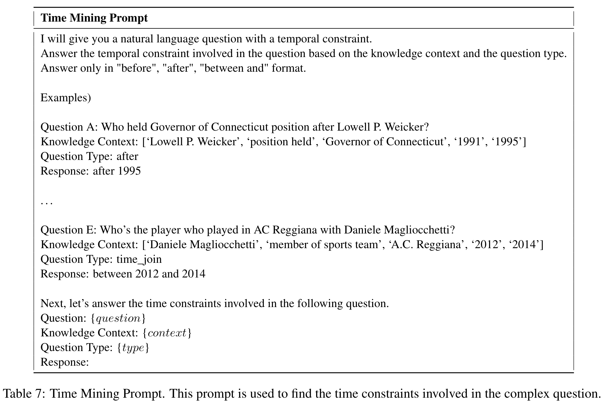

# Two-stage Generative Question Answering on Temporal Knowledge Graph Using Large Language Models

> Key Points：
>
> **GenTKGQA**: generative temporal knowledge graph question answering framework
>
> - Subgraph Retrieval: utilize LLM’s intrinsic knowledge
> - Answer Generation: 
>   - virtual knowledge indicators: fuse gnn+textual representataion

> 思考：
>
> - 在这个文章里GNN真的有用吗？
>   - subgraph是比较小的
>   - 消融实验中，甚至只保留的时间信息都效果不错啊
> - 确实可以看到LLM对于implicit temporal information的处理能力是不足的，尤其是相对的那些信息

## Research Questions

1. Questionrelevant Subgraph Retrieval.
   - accurately retrieve relevant facts from a two-dimensional space
2. Complex-type Question Reasoning
   - How subgraph information can be integrated into LLM representations

## Methods

- 对于问题1，将subgraph搜索的任务分解为 *<u>relation ranking</u>* and <u>time mining</u>，然后用LLM直接进行处理

  - relation ranking

    

  - time mining

    - 挖掘隐含的时间
      - 比如：
        - "Who held the position of president after Obama?"
        - (after 2016)，因为temporal validity (2009, 2016) of the fact (Obama, hold_position, President)

    

- 对于问题2，fine-tune the open-source LLM with instruction tuning to incorporate structural and temporal information of the subgraph

  - GNN表示结构——Temporal GNN
    - 
    - link prediction task to pre-train the graph neural network representations.
  - three novel **virtual knowledge indicators**
    - bridge the links between pre-trained GNN signals of the temporal subgraph and text representations of the LLMs
    - **[SUB]**, **[REL]** and **[OBJ]**， virtual tokens of the head entities, relations and tail entities
    - structural and timporal imfo in the subgraph:
      - structure:
        - e[SUB] represents pre-trained T-GNN embeddings of all subject entities in the subgraph, Local indicates the max or mean pooling operator.
      - time:
        - tmin and tmax denote the embeddings for the minimu and maximum values of time in the subgraph, respectively.
    - <u>*simple linear layer Wp*</u> to project them into the textual representation space of the LLM.
      - The final input prompt sequence S = V : I : Q : A, V represent virtual indicator tokens.
        - 

## Experiments & Results

#### dataset:

CronQuestions:QA dataset based on the Wikidata TKG

#### Questions

1. performance

   - 
     - 大模型 have difficulty answering temporal questions *<u>without</u>* any relevant context.
     - 当提供GenTKGQA在第一阶段检索到的事实时，ChatGPT w/tkg在复杂问题类型的推理方面仍然表现较弱
       - 表明结合了GNN的有效

2. two stages' contribution

   - 
     - w/o SR：不提供相关的子图
     - w/o SR inference：只在inference阶段不提供子图
     - w/ SR random：随机选择涉及问题中实体的相关事实（证明第一阶段的有效性）
     - w/o T-GNN：directly use temporal embeddings to represent entities and relations of subgraphs（只有时间信息没有gnn的结构信息）
     - w/o VKI：remove the virtual knowledge indicators from the input promp——indicators can *<u>bridge the gap</u>* between distinct representations

3. hyper-parameters

   - 
     - training data size
     - the model performs poorly with a small number of relevant facts (n=3), and there is a slight drop in performance at n=8. Fewer facts do not provide sufficient context knowledge, while more facts may introduce noise.

4. outperform ChatGPT in complex t questions

   - 

     - difficulty answering complex types of questions.

       - relevant facts 比如 "Before/After" and "First/Last"

       - >  =>说明那个implicit temporal mining 是有效的

## Conclusions

- exploit the LLM’s intrinsic knowledge to mine the temporal constraints and structural links in the temporal questions to reduce the search space of the subgraphs in both time-space dimensions.
- 

## Limitations & Future Works
