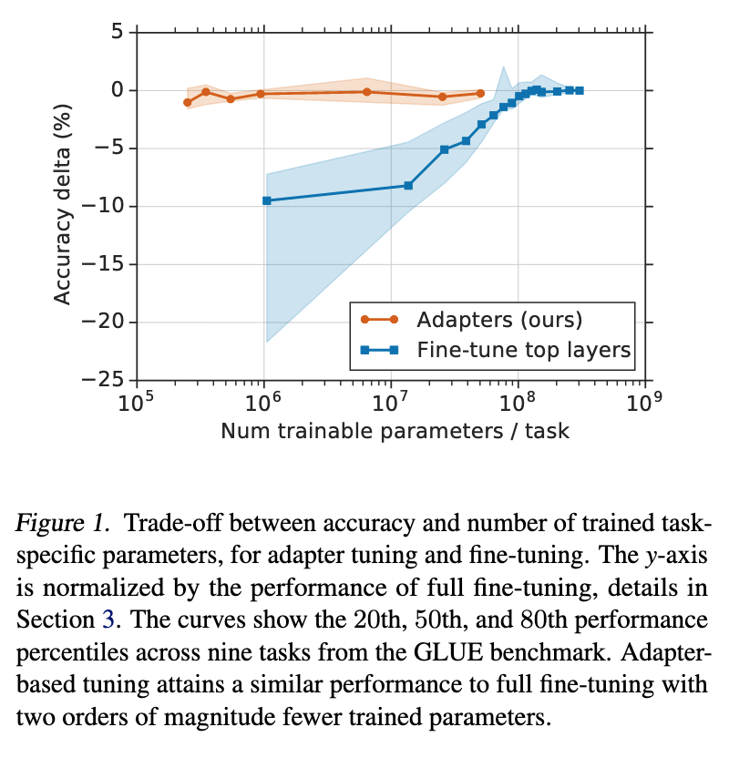
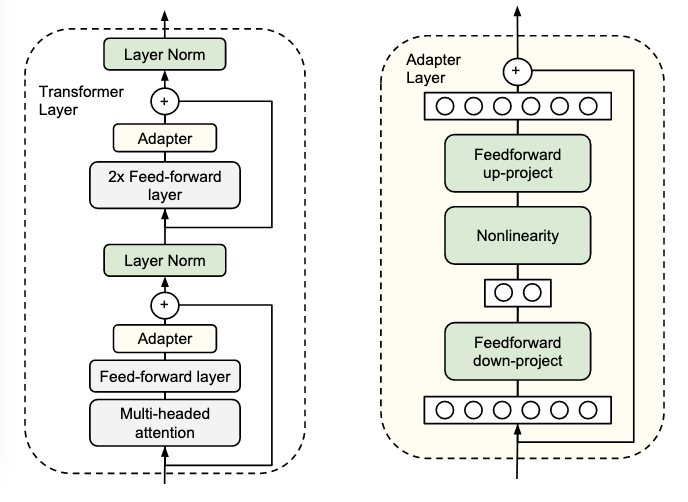

# <a href="zotero://open-pdf/library/items/RHWLFPNP?page=1">“Parameter-Efficient Transfer Learning for NLP”</a> (<a href="zotero://select/library/items/TJPTYP6Z">Houlsby et al., 2019, p. 1</a>)

Referred in <a rel="noopener noreferrer nofollow" href="zotero://note/u/LJSU8E3B/?ignore=1&#x26;line=31" zhref="zotero://note/u/LJSU8E3B/?ignore=1&#x26;line=31" ztype="znotelink" class="internal-link">LLM</a>

## <a href="zotero://open-pdf/library/items/RHWLFPNP?page=1">“Abstract”</a> (<a href="zotero://select/library/items/TJPTYP6Z">Houlsby et al., 2019, p. 1</a>)

在自然语言处理中，对大型预训练模型进行微调是一种有效的迁移机制。

然而，在存在许多下游任务的情况下，微调会导致参数效率低下：每个任务都需要一个全新的模型。

适配器模块adapter model 产生了一个紧凑且可扩展的模型；他们只为每个任务添加少量可训练的参数，并且可以添加新任务，而不需要重新访问以前的任务。

原始网络的参数保持不变，实现了高度的参数共享。

为了演示Adapter的有效性，我们将最近提出的Bert Transformer模型转移到26个不同的文本分类任务中，包括GLUE基准测试。

适配器在保持接近最先进性能的同时，每个任务只添加了少量参数。

在GLUE上，我们的性能接近完全微调的0.4%，每个任务只增加了3.6%的参数。

相比之下，微调训练每个任务100%的参数。

pretrain+finetune之后的Adapter范式的经典开山之作。

## <a href="zotero://open-pdf/library/items/RHWLFPNP?page=1">“1. Introduction”</a> (<a href="zotero://select/library/items/TJPTYP6Z">Houlsby et al., 2019, p. 1</a>)

目标是构建一个在所有任务上表现良好的系统，但不需要为每个新任务训练一个全新模型。

为此，我们提出了一种迁移学习策略，可以产生紧凑且可扩展的下游模型。使用每个任务的少量附加参数来解决多个任务的模型。

可扩展的模型可以逐步训练以解决新任务，并且不会忘记之前的任务。同时不牺牲性能。

NLP中最常见的两种迁移学习技术是基于特征的迁移和微调

本文提出了一种基于适配器模块的替代迁移方法

*   基于特征的迁移：基于特征的转移涉及预训练实值嵌入向量。这些嵌入可以是单词、句子或段落级别的。然后将这些嵌入输入到自定义下游模型中。
*   微调涉及从预训练网络复制权重，并在下游任务上进行调整。 微调通常比基于特征的迁移方法效果好

无论是基于特征的迁移学习还是微调，都需要为每个任务准备一组新的权重。

*   x轴显示每个任务训练的参数数量；这对应于解决每个额外任务所需模型大小的边际增加。适配器调优只需要训练两个数量级更少的参数进行微调，同时达到类似的性能。
*   准确性和训练任务特定参数数量之间的权衡，用于adapter tuning和fine tuning。y轴通过完全微调的性能进行了归一化处理，详见第3节。曲线显示了来自GLUE基准测试中九个任务的第20、50和80百分位点的性能。基于适配器的调整在训练参数数量少两个数量级的情况下达到与完全微调相似的性能水平。

适配器adapter是在预训练网络的各层之间添加的新模块。

在adapter tuning中，定义了一个新的函数$\psi_{\omega,v}(x)$，其中参数w从预训练中复制过来。设置初始参数v0为使新函数类似于原始函数$\psi_{\omega,v}(x) \approx \phi_{\omega}(x)$.在训练期间，只有 v 被调整。如果$ |v| \ll |w|$ 那么新的模型的参数量近似于w

适配器调整与多任务和持续学习相关。

*   多任务学习也会产生紧凑模型。然而，

    多任务学习需要同时访问所有任务，而适配器调整不需要这样做

    。

*   连续学习系统旨在从无尽的任务流中学习。这种范式具有挑战性，因为网络在重新训练后会忘记先前的任务。

    适配器的不同之处在于任务之间没有互动，共享参数被冻结

    。这意味着该模型使用少量特定任务参数具有对先前任务的完美记忆。

关键创新是设计一个有效的适配器模块，并将其与基础模型集成。

## <a href="zotero://open-pdf/library/items/RHWLFPNP?page=2">“2. Adapter tuning for NLP”</a> (<a href="zotero://select/library/items/TJPTYP6Z">Houlsby et al., 2019, p. 2</a>)

我们提出了一种在多个下游任务上调整大型文本模型的策略。我们的策略具有三个关键特点：

1.  它达到了良好的性能，
2.  它允许按顺序对任务进行训练，也就是说，它不需要同时访问所有数据集。
3.  每个任务只添加了少量的额外参数。

这些属性在云服务的背景下尤其有用，因为许多模型需要在一系列下游任务上进行训练，所以高度共享是可取的。

使用适配器模块进行调整涉及向模型添加少量新参数，这些参数在下游任务上进行训练。

适配器模块对预训练网络进行更一般的架构修改，以重新用于下游任务。

*   具体而言，adapter tuning 策略涉及向原始网络注入新的层。
*   原始网络的权重保持不变，而新的适配器层则随机初始化。

在标准微调中，新的顶层和原始权重是同时训练的。

相比之下，在适配器微调中，原始网络的参数被冻结，因此可以被多个任务共享。

适配器模块具有两个主要特点：

1.  参数数量较少：与原始网络相比，adapter moduls 更小，这意味着当添加更多任务时，总模型大小增长相对较慢。
2.  初始化近乎相同：对于适应模型的稳定训练，需要进行近似相等的初始化；通过将适配器初始化为接近恒等函数，原始网络在训练开始时不受影响。

在训练期间，然后可以激活适配器以改变激活在整个网络中的分布。如果不需要，也可以忽略适配器模块

如果初始化与恒等函数偏离太远，模型可能无法训练。

### <a href="zotero://open-pdf/library/items/RHWLFPNP?page=2">“2.1. Instantiation for Transformer Networks”</a> (<a href="zotero://select/library/items/TJPTYP6Z">Houlsby et al., 2019, p. 2</a>) 在transformer实例化

适配器模块提供了许多架构选择。我们提供了一个简单的设计，可以实现良好的性能。

图2. adapter模块的架构及其与Transformer的集成。

*   **LEFT**：我们在每个Transformer层中两次添加适配器模块：在多头注意力之后的投影之后，以及在两个前馈层之后。
*   **RIGHT**：适配器由一个瓶颈组成，该瓶颈相对于原始模型中的注意力和前馈层包含较少的参数。适配器还包含一个残差连接skip connection。

在适配器调整期间，绿色层使用下游数据进行训练，包括适配器、层标准化参数和最终分类层（图中未显示）。

每个Transformer的层包含两个主要子层：一个注意力层和一个前馈层。两个层之后紧接着是一个投影，将特征的大小映射回到该层输入的大小。在每个子层之间应用了一个残差连接skip connection。每个子层的输出被输入到层标准化中。在这些子层之后，我们插入两个串行adapter。适配器始终直接应用于子层的输出上，经过投影返回到输入大小之后，但在添加残差连接回来之前。然后将适配器的输出直接传入以下的层归一化处理。

为了限制参数数量，我们提出了一个瓶颈架构。适配器首先将原始的d维特征投影到较小的维度m上，应用非线性函数，然后再投影回d维。每层添加的参数总数，包括偏置项，为2md + d + m。通过设置$m\ll d$，我们限制了每个任务添加的参数数量；实际应用上，我们使用原始模型的约0.5-8%的参数。瓶颈维度m提供了一种简单的方法，可以在性能和参数效率之间进行权衡。适配器模块本身具有内部的残差连接。通过残差连接，如果投影层的参数被初始化为接近零，该模块将被初始化为一个近似的恒等函数。

一个下采样的FC（全连接）层，一个上采样的FC层，从d维的向量投影到m维，然后在投影回d维，中间夹一个非线性激活层（函数）

也需要有一个残差链接，初始化的时候，输入和输入近似

在attention后面加了一个adapter，在MLP后面又加了一个 adapter，一个transformer block里面加了两层adapter。

为什么叫parameter efficient fine tuning？加adapter的作用

*   原来的大模型（已经训练好的transformer）是不动的，图中灰色的（feed forward layer MLP层和Multi-head attention都是锁住的。在模型微调的过程中是完全没有进行梯度更新，只有这些新添加的adapter层在不停地学习，因为adapter层里面就是两层FC，也有下采样的过程，所以说参数量很少

在适配器模块中的层之外，我们还会针对每个任务训练新的层标准化参数。每层仅需2d个参数。然而，仅训练层标准化参数是不足以获得良好性能的，

*   只去掉一层adapter影响很小（最大2%）
*   去掉较低层的adapter比去掉高层的adapter影响要小

 
