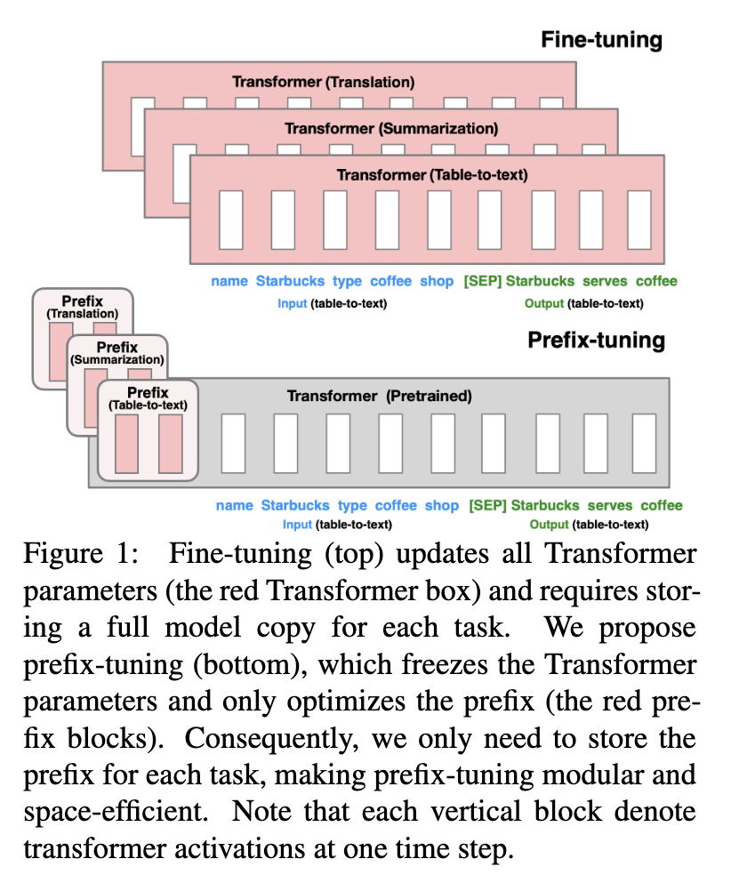
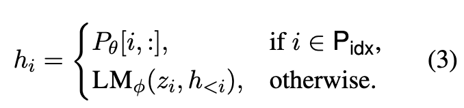
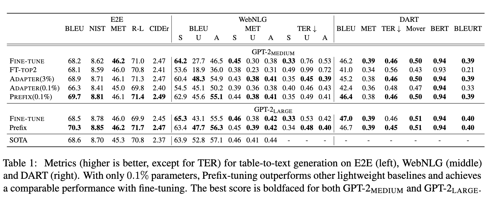
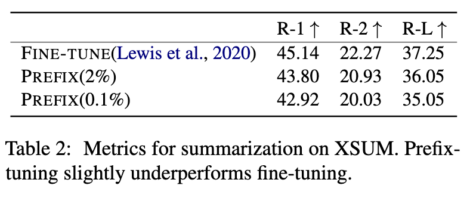
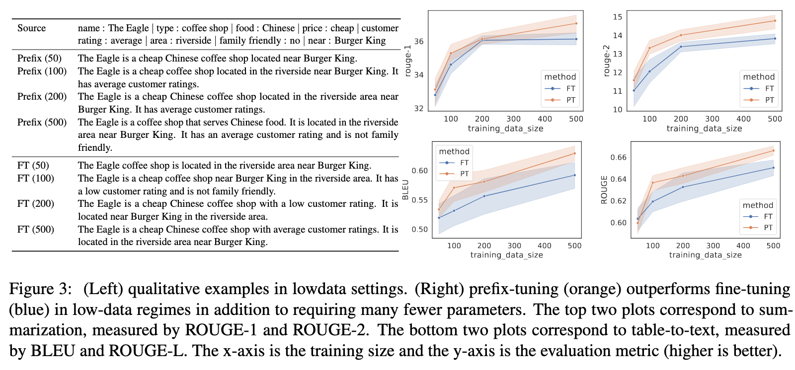
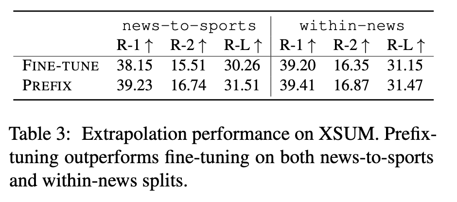
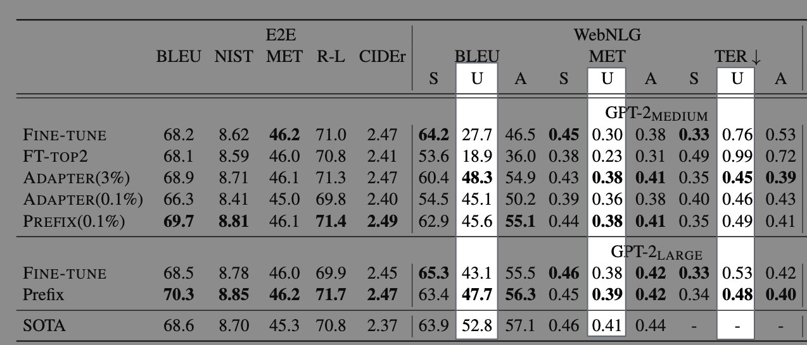
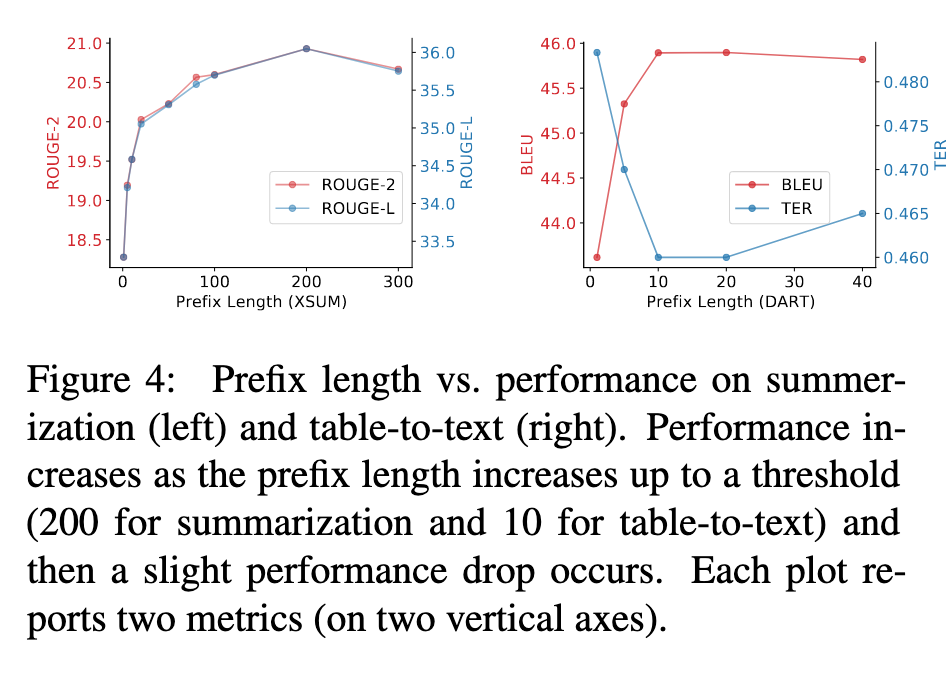
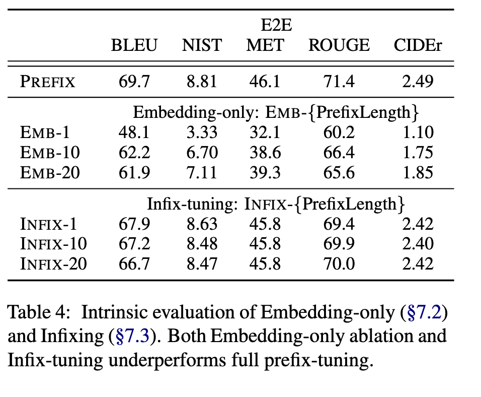
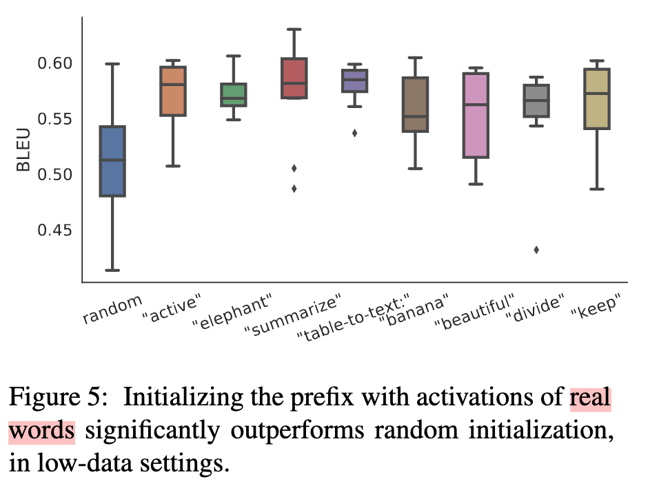

# <a href="zotero://open-pdf/library/items/2GKACXI3?page=1">“Prefix-Tuning: Optimizing Continuous Prompts for Generation”</a> (<a href="zotero://select/library/items/5MGDBZSU">Li and Liang, 2021, p. 1</a>)

Referred in <a href="zotero://note/u/LJSU8E3B/?ignore=1&#x26;line=34" rel="noopener noreferrer nofollow" zhref="zotero://note/u/LJSU8E3B/?ignore=1&#x26;line=34" ztype="znotelink" class="internal-link">LLM</a>

## <a href="zotero://open-pdf/library/items/2GKACXI3?page=1">“Abstract”</a> (<a href="zotero://select/library/items/5MGDBZSU">Li and Liang, 2021, p. 1</a>)

保持语言模型参数冻结，但优化一个小的连续任务特定向量（称为前缀）

前缀调整”从提示中汲取灵感，使后续的token可以像“virtual token”一样关注这个前缀。

## <a href="zotero://open-pdf/library/items/2GKACXI3?page=1">“1 Introduction”</a> (<a href="zotero://select/library/items/5MGDBZSU">Li and Liang, 2021, p. 1</a>)

在极端情况下，GPT-3（Brown等人，2020）可以在没有任何特定任务调整的情况下部署。相反，用户会在任务输入中添加一个自然语言任务指令（例如，用于摘要的TL;DR）和一些示例；然后从语言模型生成输出。这种方法被称为上下文学习in-context learning或prompting。

prefix-tuning：自然语言生成(NLG)任务微调的轻量级替代方案，灵感来自提示。

考虑生成数据表的文本描述任务，如图1所示。任务输入是一个线性化的表格（例如，“名称：星巴克 | 类型：咖啡店”），输出是一个文本描述（例如，“星巴克提供咖啡。”）。prefix tuning将一系列连续的任务特定向量添加到输入之前，即prefix，在图1（底部）中用红色块表示。对于后续的标记，Transformer可以将注意力集中在prefix上，就好像它是一系列“virtual tokens”，但与prompting不同，prefix完全由自由参数组成，这些参数不对应实际的token。与图1（顶部）中的微调相比，后者更新所有Transformer参数，因此需要为每个任务存储一个经过调整的模型副本，而prefix  tuning仅优化prefix部分。我们只需要存储一个大型Transformer的副本和一个学习到的任务特定前缀，对于每个额外任务来说，开销非常小。

1.  就存储而言，prefix tuning比微调少存储1000倍的参数。
2.  就完整数据集训练时的性能而言，对于表格到文本（§6.1）的任务，prefix tuning和fine tuning具有可比性，而prefix turning在摘要生成方面略有下降。
3.  在低数据设置中，prefix tuning平均优于对两个任务上的fine tuning。
4.  前缀调整还可以更好地推广到具有未知主题的表格（用于表格转文本）和文章（用于摘要）

## <a href="zotero://open-pdf/library/items/2GKACXI3?page=2">“2 Related Work”</a> (<a href="zotero://select/library/items/5MGDBZSU">Li and Liang, 2021, p. 2</a>)

**Lightweight fine-tuning**

关键挑战是识别模块的高性能架构和需要调整的预训练参数子集。

1.  一项研究方向考虑去除参数：通过在模型参数上训练二进制掩码，一些模型权重被剥离。

2.  另一条研究线路考虑插入参数：

    1.  训练一个“边缘”网络，通过求和与预训练模型融合

    2.  adapter tuning在预训练语言模型的每一层之间插入任务特定的层（adapter）

        1.  该方法调整了LM参数的约3.6%，而我们的方法在保持可比性能的同时，进一步减少了30倍任务特定参数的调整，仅调整了0.1%。

**Prompting**

提示意味着在任务输入中添加说明和一些示例，并从语言模型生成输出。

GPT-3（Brown等，2020）使用手动设计的提示来适应不同任务的生成，这个框架被称为上下文学习。

然而，由于Transformer只能在有限长度的上下文（例如GPT3的2048个标记）上进行条件训练，因此在上下文学习中无法充分利用超过上下文窗口长度的训练集。

在自然语言理解任务中，先导工程已经在类似BERT和RoBERTa的模型中进行了探索。

例如，AutoPrompt（Shin等人，2020）搜索一系列离散的触发词，并将其与每个输入连接起来，以从masked language model中引出情感或事实知识。

与AutoPrompt相比，我们的方法优化连续prefix，这些prefix更具表达力（§7.2）；此外，我们专注于语言生成任务。

相比之下，前缀调整优化了一个特定任务的前缀，该前缀适用于该任务的所有实例。

## <a href="zotero://open-pdf/library/items/2GKACXI3?page=3">“3 Problem Statement”</a> (<a href="zotero://select/library/items/5MGDBZSU">Li and Liang, 2021, p. 3</a>)

### <a href="zotero://open-pdf/library/items/2GKACXI3?page=3">“3.1 Autoregressive LM”</a> (<a href="zotero://select/library/items/5MGDBZSU">Li and Liang, 2021, p. 3</a>)自回归语言模型

### <a href="zotero://open-pdf/library/items/2GKACXI3?page=3">“3.2 Encoder-Decoder Architecture”</a> (<a href="zotero://select/library/items/5MGDBZSU">Li and Liang, 2021, p. 3</a>)

### <a href="zotero://open-pdf/library/items/2GKACXI3?page=3">“3.3 Method: Fine-tuning”</a> (<a href="zotero://select/library/items/5MGDBZSU">Li and Liang, 2021, p. 3</a>)

## <a href="zotero://open-pdf/library/items/2GKACXI3?page=3">“4 Prefix-Tuning”</a> (<a href="zotero://select/library/items/5MGDBZSU">Li and Liang, 2021, p. 3</a>)

### <a href="zotero://open-pdf/library/items/2GKACXI3?page=4">“4.1 Intuition”</a> (<a href="zotero://select/library/items/5MGDBZSU">Li and Liang, 2021, p. 4</a>)

拥有适当的上下文可以引导语言模型，而无需更改其参数。

直观地说，上下文可以通过指导从x中提取什么来影响对x的编码；并且可以通过引导下一个标记分布来影响对y的生成。然而，目前尚不清楚是否存在这样的背景

自然语言任务指令(e.g., “summarize the following table in one sentence”)可能会引导解决任务，但对于大多数预训练语言模型而言不可行。基于数据驱动的离散指令优化可能会有所帮助，但离散优化在计算上具有挑战性。

我们可以将指令优化为连续的词嵌入，而不是针对离散标记进行优化，其效果将向上传播到所有Transformer激活层，并向右传播到后续的标记。

### <a href="zotero://open-pdf/library/items/2GKACXI3?page=4">“4.2 Method”</a> (<a href="zotero://select/library/items/5MGDBZSU">Li and Liang, 2021, p. 4</a>)

前缀调整将一个前缀添加到自回归语言模型中，以获得 z = \[PREFIX; x; y]，或者在编码器和解码器两者之前都添加前缀以获得 z = \[PREFIX; x; PREFIX′; y]，如图2所示。

Pidx表示前缀索引的序列（the sequence of prefix indices）

Prefix-tuning初始化一个可训练的矩阵Pθ（由θ参数化），其维度为|Pidx| × dim(hi)，用于存储前缀参数。

语言模型的参数φ是固定的，前缀参数θ是唯一可训练的参数。

hi（对于所有的i）是可训练参数Pθ的一个函数。当i ∈ Pidx时，这一点很明显，因为hi直接从Pθ复制过来。当i不属于Pidx时，hi仍然依赖于Pθ，因为前缀激活总是在左上下文中，并且会影响其右边的任何激活。

### <a href="zotero://open-pdf/library/items/2GKACXI3?page=4">“4.3 Parametrization of Pθ”</a> (<a href="zotero://select/library/items/5MGDBZSU">Li and Liang, 2021, p. 4</a>)

从经验上来看，直接更新Pθ参数会导致优化不稳定，并且性能略微下降。所以我们通过一个较小的矩阵$P _θ'$与一个大型前馈神经网络$MLP_θ$组合，对矩阵$P_θ[i, :]$进行重新参数化，即 $P_θ[i, :] = MLP_θ(P_θ'[i, :])$。

$P_θ$和$P_θ'$ 在行维度上一样（也就是prefix的长度）但是在列维度上不同一旦训练完成，这些重参数化参数可以被丢弃，只需要保存前缀（Pθ）。

## <a href="zotero://open-pdf/library/items/2GKACXI3?page=5">“5 Experimental Setup”</a> (<a href="zotero://select/library/items/5MGDBZSU">Li and Liang, 2021, p. 5</a>)

### <a href="zotero://open-pdf/library/items/2GKACXI3?page=5">“5.1 Datasets and Metrics”</a> (<a href="zotero://select/library/items/5MGDBZSU">Li and Liang, 2021, p. 5</a>)

### <a href="zotero://open-pdf/library/items/2GKACXI3?page=5">“5.2 Methods”</a> (<a href="zotero://select/library/items/5MGDBZSU">Li and Liang, 2021, p. 5</a>)

### <a href="zotero://open-pdf/library/items/2GKACXI3?page=5">“5.3 Architectures and Hyperparameters”</a> (<a href="zotero://select/library/items/5MGDBZSU">Li and Liang, 2021, p. 5</a>)

## <a href="zotero://open-pdf/library/items/2GKACXI3?page=6">“6 Main Results”</a> (<a href="zotero://select/library/items/5MGDBZSU">Li and Liang, 2021, p. 6</a>)

### <a href="zotero://open-pdf/library/items/2GKACXI3?page=6">“6.1 Table-to-text Generation”</a> (<a href="zotero://select/library/items/5MGDBZSU">Li and Liang, 2021, p. 6</a>)

### <a href="zotero://open-pdf/library/items/2GKACXI3?page=6">“6.2 Summarization”</a> (<a href="zotero://select/library/items/5MGDBZSU">Li and Liang, 2021, p. 6</a>)

为啥效果不如Fine tuning，但是前面的表格到文本的生成的效果可以媲美：

1.  数据集大小
2.  上下文输入大小
3.  摘要任务更加复杂，需要阅读理解能力以及需要识别文章中的关键信息

### <a href="zotero://open-pdf/library/items/2GKACXI3?page=6">“6.3 Low-data Setting”</a> (<a href="zotero://select/library/items/5MGDBZSU">Li and Liang, 2021, p. 6</a>)

结合前面两个实验，发现prefix tuning在训练样本比较小的时候效果会更好

图三右：(正确) 前缀调整 (橙色) 在低数据情况下表现优于微调 (蓝色)，而且需要更少的参数

左：错误的例子，可以看到在数据集的大小提升到500的时候，fine tuning才发现这个评分是average

### <a href="zotero://open-pdf/library/items/2GKACXI3?page=6">“6.4 Extrapolation”</a> (<a href="zotero://select/library/items/5MGDBZSU">Li and Liang, 2021, p. 6</a>)外推

分割数据集，训练集和测试集，包含不同的主题

**摘要：**

**表格2文本：**

*   adapter tuning实现了良好的外推性能，与prefix tuning相当

    *   这种共同的趋势表明，保留语言模型参数确实对外推有积极影响。

## <a href="zotero://open-pdf/library/items/2GKACXI3?page=8">“7 Intrinsic Evaluation”</a> (<a href="zotero://select/library/items/5MGDBZSU">Li and Liang, 2021, p. 8</a>)内在评估

*   prefix 的长度

    *   
    *   更长的prefix就意味着更多的参数，对于不同的任务，最佳的prefix长度也不同
    *   从经验上看，较长的前缀对推理速度几乎没有影响，因为在GPU上对整个前缀进行的注意力计算是并行化的。

*   只在 embedding层进行微调，类似于微调离散的prompt

    *   

*   比较prefix和infix（在x和y之间插入可训练的激活函数）

    *   \[x; INFIX; y]
    *   我们认为这是因为prefix tuning可以影响x和y的激活，而infix tuning只能影响y的激活。

*   不同的prefix初始化策略

    *   随机初始化：性能低、方差高

    *   使用真实单词的激活来初始化前缀显著提高了生成效果

        *   
        *   使用无关的词也比随机好

## <a href="zotero://open-pdf/library/items/2GKACXI3?page=9">“8 Discussion”</a> (<a href="zotero://select/library/items/5MGDBZSU">Li and Liang, 2021, p. 9</a>)

### <a href="zotero://open-pdf/library/items/2GKACXI3?page=9">“8.1 Personalization”</a> (<a href="zotero://select/library/items/5MGDBZSU">Li and Liang, 2021, p. 9</a>)

为了保护用户隐私，每个用户的数据都需要分开，并且需要独立地为每个用户训练个性化模型。因此，每个用户可以被视为一个独立的任务。如果有数百万名用户，则prefix tuning可以适应这种设置并保持模块化，通过添加或删除其prefix而不会发生交叉污染来灵活地增加或删除用户。

### <a href="zotero://open-pdf/library/items/2GKACXI3?page=9">“8.2 Batching Across Users”</a> (<a href="zotero://select/library/items/5MGDBZSU">Li and Liang, 2021, p. 9</a>)

prefix tuning允许批处理不同用户的查询，即使它们由不同的prefix支持。批处理需要在用户输入前添加个性化前缀的简单步骤，其余计算保持不变。

在adapter tuning中就不可以批处理

### <a href="zotero://open-pdf/library/items/2GKACXI3?page=9">“8.3 Inductive Bias of Prefix-tuning”</a> (<a href="zotero://select/library/items/5MGDBZSU">Li and Liang, 2021, p. 9</a>)

由于语言模型是在通用语料库上进行预训练的，保留LM参数可能有助于泛化到训练期间未见过的领域。

虽然prefix tuning和adapter tuning都会冻结预训练参数，但它们会调整不同的参数集以影响Transformer的激活层。

*   prefix tuning保持语言模型的完整性，并使用prefix和预训练的注意力块来影响后续激活；

*   adapter tuning在语言模型层之间插入可训练的模块，直接将残差向量添加到激活中。

*   此外，我们观察到与adapter tuning相比，prefix tuning所需的参数要少得多，同时保持可比较的性能。

    *   我们认为参数效率的提高是因为prefix tuning尽可能地保持预训练语言模型的完整性，从而比adapter tuning更充分地利用了语言模型。

## <a href="zotero://open-pdf/library/items/2GKACXI3?page=9">“9 Conclusion”</a> (<a href="zotero://select/library/items/5MGDBZSU">Li and Liang, 2021, p. 9</a>)

我们提出了前缀调整（prefix-tuning），这是一种轻量级的替代微调方法，它为自然语言生成任务添加了一个可训练的连续前缀。我们发现，尽管学习的参数比微调少1000倍，但在完整数据设置中，前缀调整可以保持与微调相当的性能，并且在低数据和外推设置中优于微调。
