# <a href="zotero://open-pdf/library/items/LGKD3W6H?page=1">“TOWARDS A UNIFIED VIEW OF PARAMETER-EFFICIENT TRANSFER LEARNING”</a> (<a href="zotero://select/library/items/FWCBHHVK">He et al., 2022, p. 1</a>)

Comment: ICLR 2022 (spotlight presentation). Code is available at https\://github.com/jxhe/unify-parameter-efficient-tuning

Referred in <a href="zotero://note/u/LJSU8E3B/?ignore=1&#x26;line=32" rel="noopener noreferrer nofollow" zhref="zotero://note/u/LJSU8E3B/?ignore=1&#x26;line=32" ztype="znotelink" class="internal-link">LLM</a>

## <a href="zotero://open-pdf/library/items/LGKD3W6H?page=1">“ABSTRACT”</a> (<a href="zotero://select/library/items/FWCBHHVK">He et al., 2022, p. 1</a>)

近期研究者们提出了各种各样的参数高效迁移学习方法（Parameter-efficient Transfer Learning），即固定住Pretrain Language model的大部分参数，仅调整模型的一小部分参数来达到与Full fine-tuning接近的效果（调整的可以是模型自有的参数，也可以是额外加入的一些参数）。

本文将剖析最先进的参数高效迁移学习方法设计，并提出一个统一框架来建立它们之间的联系。具体来说，我们将它们重新定义为预训练模型中特定隐藏状态的修改，并确定了一组设计维度，这些方法在不同的维度上有所不同，例如计算修改的函数和应用修改的位置。

此外，我们的统一框架使得可以在不同方法之间转移设计元素，并因此能够实现比先前方法更少地微调参数且更有效果

## <a href="zotero://open-pdf/library/items/LGKD3W6H?page=1">“1 INTRODUCTION”</a> (<a href="zotero://select/library/items/FWCBHHVK">He et al., 2022, p. 1</a>)

将通用的PLM适应到下游任务最常见的方法是对所有模型参数进行微调（全面微调）。但是完全微调太昂贵了。

为了缓解这个问题，已经提出了一些轻量级的替代方案，只更新少量额外参数，同时保持大部分预训练参数冻结。

*   adapter tuning：在预训练网络的每一层中插入称为适配器的小型神经模块，并且只有在微调时训练这些适配器
*   prefix tuning和prompt tuning 在输入或隐藏层中添加了额外的l个可调节前缀标记，并且只在下游任务微调时训练这些软提示。
*   LoRA low-rank matrices学习低秩矩阵来近似参数更新。

与完全微调相当的性能，通常只更新原始模型参数的不到1%

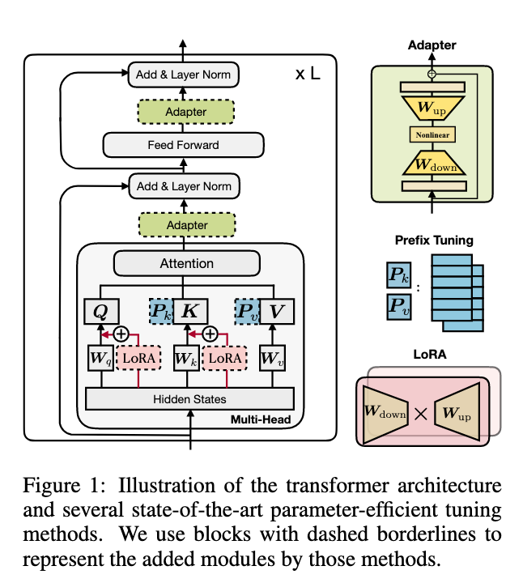

parameter-efficient tuning：节省参数、快速适应新任务、不会引发灾难性遗忘（因为冻结了原来的参数）

然而，我们认为这些参数高效调优方法成功的重要因素尚未被充分理解，并且它们之间的联系仍然不清楚。在本文中，我们旨在回答三个问题：

1.  这些方法的联系
2.  这些方法是否共享对其有效性至关重要的设计元素，它们是什么？
3.  每种方法的有效成分能否转移到其他方法中，产生更有效的变体？

*   3.1节：首先推导出一种替代形式的prefix tuning方法，揭示了prefix tuning与adapter之间的密切联系。
*   3.2节: 制定了一个统一的框架，将上述方法作为不同的修改冻结PLMs的隐藏表示的方式
*   3.3节：我们的统一框架将以共享的设计维度分解先前的方法，例如用于执行修改的功能、施加修改的位置以及如何集成修改。这个框架允许我们在各种方法之间转移设计选择，以提出新的变体，比如具有多头的适配器

## <a href="zotero://open-pdf/library/items/LGKD3W6H?page=2">“2 PRELIMINARIES”</a> (<a href="zotero://select/library/items/FWCBHHVK">He et al., 2022, p. 2</a>) 2 预备工作

### <a href="zotero://open-pdf/library/items/LGKD3W6H?page=2">“2.1 RECAP OF THE TRANSFORMER ARCHITECTURE”</a> (<a href="zotero://select/library/items/FWCBHHVK">He et al., 2022, p. 2</a>) 2.1 transformer架构回顾

### <a href="zotero://open-pdf/library/items/LGKD3W6H?page=3">“2.2 OVERVIEW OF PREVIOUS PARAMETER-EFFICIENT TUNING METHODS”</a> (<a href="zotero://select/library/items/FWCBHHVK">He et al., 2022, p. 3</a>)2.2以前的参数高效调整方法概述

*   <a href="zotero://open-pdf/library/items/LGKD3W6H?page=3">“Adapters”</a> ：在transformer层之间插入adapter module。适配器模块通过FC层将输入h向下投影到r维度的低维空间，然后是一个非线性激活层以及FC蹭蹭上投影回h层，并且在这个模块中还有一个残差链接

    *   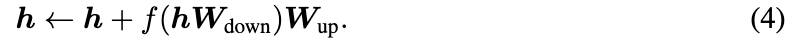
    *   在transformer的一个层中依次放置了两个适配器，一个在多头注意力之后，另一个在FFN子层之后。
    *   Pfeiffer等人（2021）提出了一种更高效的适配器变体，仅插入在FFN“add & layer norm”子层之后。

*   <a href="zotero://open-pdf/library/items/LGKD3W6H?page=3">“Prefix Tuning”</a>

    ：收到prompt tuning的启发，prefix tuning

*   在每一层多头注意力机制中，在key 和valyue之前加了l个tunable prefix vector可调节的前缀向量。具体来说，两组前缀向量 Pk 和 Pv ∈ Rl×d 与原始键 K 和值 V 进行连接。然后，在新的前缀键和值上执行多头注意力的计算

    *   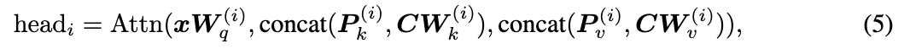
    *   Pk和Pv分别被拆分为Nh（multi head的数量）个头向量
    *   Prompt-tuning（Lester et al., 2021）通过仅在第一层中将前缀添加到输入词嵌入中来简化前缀调整；
    *   类似的工作还包括P-tuning（Liu et al., 2021b）。

*   <a href="zotero://open-pdf/library/items/LGKD3W6H?page=3">“LoRA”</a> ：LoRA将可训练的低秩矩阵注入到transformer层中，以近似权重更新。

    *   W +∆W = W +WdownWup。
    *   LoRA将此更新应用于多头注意力子层中的查询和值投影矩阵（Wq，Wv），
    *   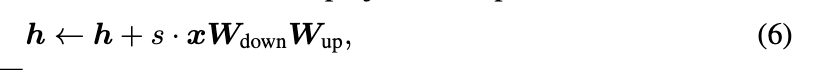
    *   s ≥ 1 是一个可调整的标量超参数

*   <a href="zotero://open-pdf/library/items/LGKD3W6H?page=4">“Others”</a>

    ：其他参数高效调整方法包括BitFit（Ben Zaken等，2021），它仅微调预训练模型中的偏置向量，并且diff-pruning（Guo等，2021）学习了一个稀疏的参数更新向量。

## <a href="zotero://open-pdf/library/items/LGKD3W6H?page=4">“3 BRIDGING THE GAP – A UNIFIED VIEW”</a> (<a href="zotero://select/library/items/FWCBHHVK">He et al., 2022, p. 4</a>) 3 弥合鸿沟——一个统一的视角

我们首先推导出prefix tuning的等效形式，以建立它与adapter的联系。然后，我们提出了一个统一的参数高效调整框架，其中包括几种最先进的方法作为实例化。

### <a href="zotero://open-pdf/library/items/LGKD3W6H?page=4">“3.1 A CLOSER LOOK AT PREFIX TUNING”</a> (<a href="zotero://select/library/items/FWCBHHVK">He et al., 2022, p. 4</a>)

前缀调整prefix tuning的机制，通过在原始注意力键和值之前添加l个可学习向量来改变注意力模块。

公式推导

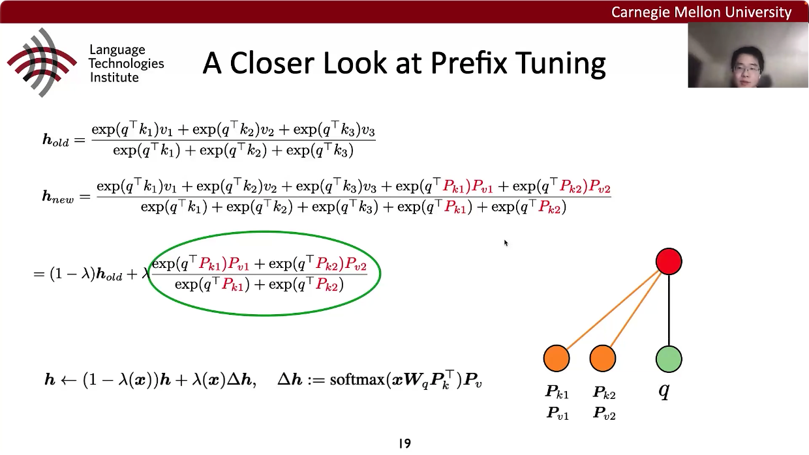

写成矩阵的形式：

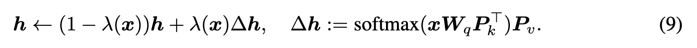

意味着在做prefix tuning的时候，加了prefix之后其实是对hidden states做了一个线性插值，因为这个公式是线性插值的公式

相当于加了prefix之后，在原来的hidden states之上乘了一个系数，把他down scale了一下，然后加上一个新的vector。这个新的vecor是一个低秩的，因为可以看到Pv的秩就是prefix的数量，所以∆h的秩被prefix的数量bound住了，就是他的rank一定是小于等于prefix的数量。

low rank的意义：做prefix tuning是在原来的hidden states上面加了一个low rank的东西，比如rank是2，那么就意味着所有的∆h都可以用两个基向量表示出来，那么不管input是什么，对hidden states的改动都是这两个基向量的线性组合，这是一个很大的限制，因为相当于没有办法按照任意地方向去改动h，比如说h是1000维的，如果是满秩的改动应该要有1000个rank，但是现在的rank只有2，也就是这个h的维度里面有很多方向是我永远无法达到的，所以这就是所谓的bottle neck。所以就是说这个秩的大小限制了tuning的表达能力有多强，prefix越多表达能力就越强。

但是这里都是假装是single head，一耳光头，但实际上transformer是多个头，加入是1000维度，那么十个头的话，每个头的维度就是100维，这样的话prefix只需要100个就可以满秩，所以说multi head可以使parameter effectient tuning表达能力变强。

low-rank prifix vector的数量 l 限制了∆h的秩，所以也就相当于adapter中的bottleneck dimension。rank limitation 秩限制也就意味着对于任何x，∆h都是相同的l个（或者小于等于l）基向量的线性组合

<a href="zotero://open-pdf/library/items/LGKD3W6H?page=5"><strong>“The Difference from Adapters:”</strong></a>

prefix tuning的公式看起来就与adapter非常的类似，因为都是后面加了一个东西，adapter不是线性插值，而是简单的假期来，而perfix tuning 就是线性插值，但是形式非常类似。

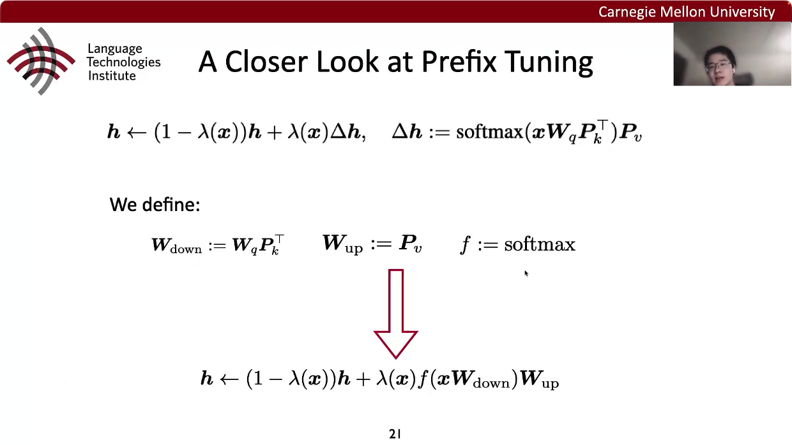

Wdown 和Wup其实也是两个low rank的矩阵，他们的rank都是prefix的数量，所以可以说是跟adapter一模一样。

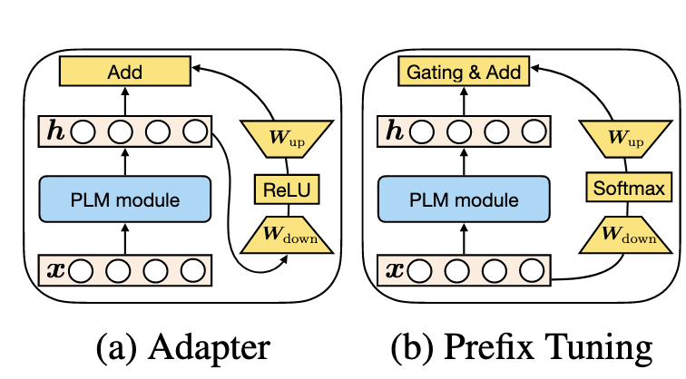

画成计算流图，可以看出来prefix tuning可以说是adapter的一种形式

“PLM模块”表示被冻结的PLM的某个子层(例如，注意或FFN)。

除了引入了一个变量lambda之外，prefix tuning 和adapter 还有区别：

1.  prefix tuning是并行，使用的是x，也就是PLM的输入，adapter是串行，使用的是h，也技术iPLM的输出
2.  adaper插入位置更加灵活，可以在attention之后或者ffn之后；prefix tuning只能修改attention的输出
3.  prefix tuning可以适配多头attention ，但是adapter只能单头（插入在attention或者ffn之后）。如果l（prefix vector的个数大于d/Nh，就可以做到满秩的更新。

### <a href="zotero://open-pdf/library/items/LGKD3W6H?page=5">“3.2 THE UNIFIED FRAMEWORK”</a> (<a href="zotero://select/library/items/FWCBHHVK">He et al., 2022, p. 5</a>)

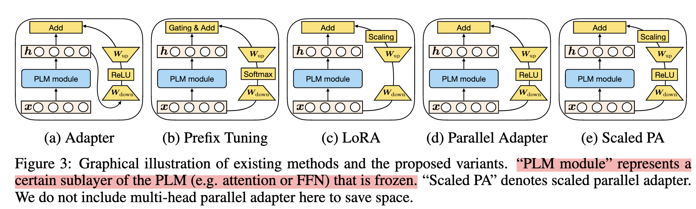

图3：现有方法和提出的变体的图形说明。 "PLM模块"表示PLM的某个子层（例如注意力或FFN）被冻结。 "Scaled PA"表示缩放并行adapter。我们在这里不包括多头并行adapter以节省空间。

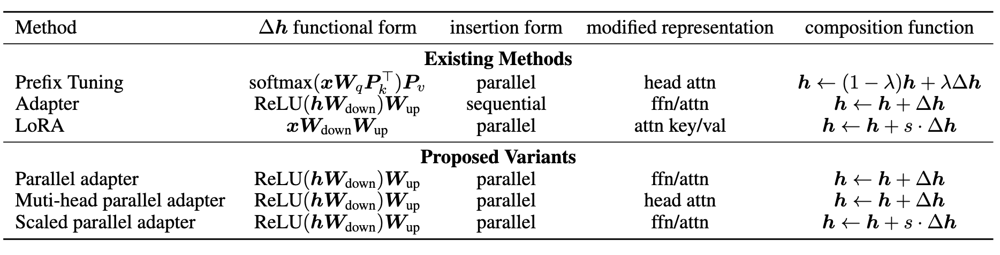

多个维度来看prefixtuning、adapter 和lora的关系：

1.  <a href="zotero://open-pdf/library/items/LGKD3W6H?page=5">“Functional Form”</a> ∆h是怎么算的（功能形式是计算∆h的具体函数）

    1.  adapter是RELU 激活函数
    2.  Prefix tuning是softmax
    3.  lora没用nonlinear建模

2.  <a href="zotero://open-pdf/library/items/LGKD3W6H?page=5">“Modified Representation”</a> 在什么东西去用这个模块

    1.  adapter 在feed forward 和attention后面都用
    2.  prefix tuning只能用在某一个特定的头的attention后面
    3.  lora最原始的版本是用在attention里的key 和value上面

3.  <a href="zotero://open-pdf/library/items/LGKD3W6H?page=5">“Insertion Form”</a> 插入形式是将添加的模块插入网络的方式。

    1.  adapter是串联在某个模块后面，
    2.  另外两个是并联的

4.  <a href="zotero://open-pdf/library/items/LGKD3W6H?page=6">“Composition Function”</a> 将修改后的向量∆h与原始隐藏表示h组合的方式

    1.  adapter直接加
    2.  prefix tuning是线性插值
    3.  lora是scaled addition，不是直接加的，前面乘了一个系数

可以看到三种方法在某一个不同的维度上取了不同的值，就变成了不同的方法，那么可不可以在这些维度上面取不同的值，就可以形成新的方法

1.  串联改成并联，就是一个并联的adapter
2.  并联的adater用于每一个head attention上面，就变成了一个multi head 的并联的adapter
3.  加一个常数变成scaled 并联adapter

提出了一个通用的学习框架，将parameter-efficient tuning method 转化为学习一个modification vector ∆h

*   h：PLM模块的输出
*   x：PLM模块的输入

例如，h和x可以分别表示注意力模块的输入和输出

## <a href="zotero://open-pdf/library/items/LGKD3W6H?page=6">“4 EXPERIMENTS”</a> (<a href="zotero://select/library/items/FWCBHHVK">He et al., 2022, p. 6</a>)

### <a href="zotero://open-pdf/library/items/LGKD3W6H?page=6">“4.1 GENERAL SETUP”</a> (<a href="zotero://select/library/items/FWCBHHVK">He et al., 2022, p. 6</a>)

数据集：

1.  summarization：XSum
2.  机器翻译：en-ro
3.  推理：MNLI
4.  分类：SST2

实验结果分析：

**串联还是并联？**

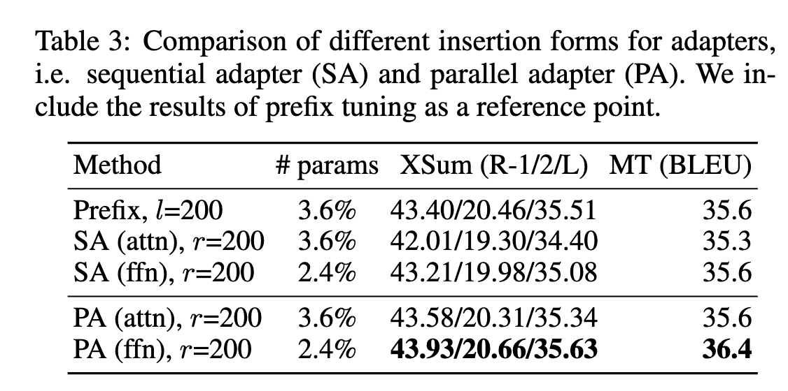

用的相对参数都比较少，在attention那里的话是3.6%，在feed forward那里是2.4%，基本上就是2%3%左右。

adapter attn就是adapter只放在attention那里，ffn就是只放在feed forward那里；S是串联，P是并联。

可以看到并联的效果是好于串联的，无论是并联放在 attn或者是ffn的还是prefix（天然就是并联），效果都要好于串联

**parameter efficient module放在attn还是ffn？**

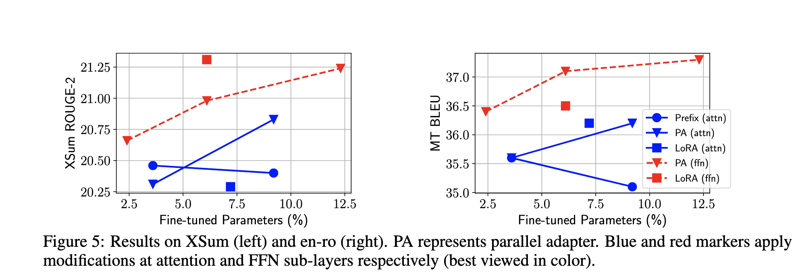

prefix tuning是作用于attention的，adapter可以在attention 也可以在ffn，lora原始是作用于attention，但是也可以在试验中把他放在ffn。

图中蓝色表示这些方法是放在了attention中，红色就是放在ffn，可以看到在相同的参数的情况下，放在ffn的效果显然好于attn，就是任何一个方法，加载ffn都比加载attn要好。

意味着prefix tuning的方法是天然的弊端的，因为只能prefix tuning或者prompt tuning只能用在attn，没有办法拿去作用于ffn，但是在试验中可以看到作用于ffn是很重要的，只作用于attn是不够的。

并且可以看到，prefix tuning 作用在attn，继续增加prefix的数量，他的效果没有变好，反而在变差，因为优化有困难，就算放很多的prefix，也没有办法效果真的达到和原来的full fine tuning一样

**是不是参数更少，在attn的效果就会更好（0.1%的参数）**

ffn比attn要好，但是考虑好attn的multi head，这个优势并没有体现出来，因为prefix tuning是多头的，但是在之前的试验中，实验效果反而没有adapter好，并且adapter是单头的（直接并行在了attn模块）

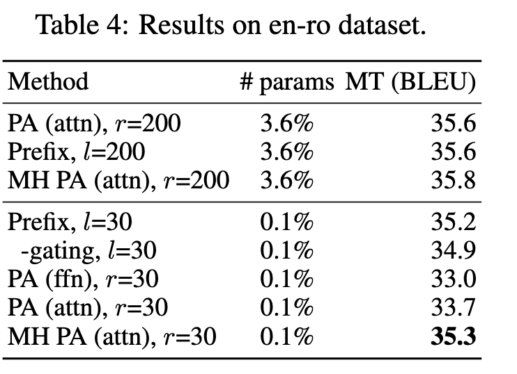

可以看到在每种方法中ongoing，在参数从3.6%减少到0.1%的时候，在multi-head attn的实验效果减少的不是很多（prefix tuning 和multi-head adapter），但是在aingle head 和ffn的实验就减少的比较多。

可以看出在参数比较少的时候，多头的attn就可以比较好的发挥出优势，但是给更多的参数的时候，多头attn并没有很好的利用这些参数

**所以最终的结论**

1.  更改 head attn（多头attn的每一个头），当parameter很少的时候，效果是比较好的
2.  但是ffn是可以利用更多的参数的，比如说，如果提供10%的参数，没有办法把这些参数利用好，这时候可以把这些参数用在ffn

<!---->

1.  并行好于串联

2.  总体上ffn是好于attn的，但是multi-head attn在很少的参数的情况下是更好的

3.  conposition，使用lora的方式是比较好的trade off，因为简单有效。线性插值的效果也挺好的，但是更加复杂

    <a href="zotero://open-pdf/library/items/LGKD3W6H?page=8">“4.5 WHICH COMPOSITION FUNCTION?”</a>

    (<a href="zotero://select/library/items/FWCBHHVK">He et al., 2022, p. 8</a>)

Mix-And-Match MAM Adapter

连接方式是并联，放在attn 和ffn，但是参数不是均匀分配（原始的adapter两边的参数是均匀分配的，但是在multi-head attn的试验中可以看到，attn这边参数量比较少的时候效果好。所以只分配0.1%参数在head attn，其余的所有参数都分配在ffn

（其实transformer的大部分参数也是集中在ffn并不是在attn，所以说transformer天然就是指望ffn学习到更多的东西

conposition使用LoRA的scaled addition

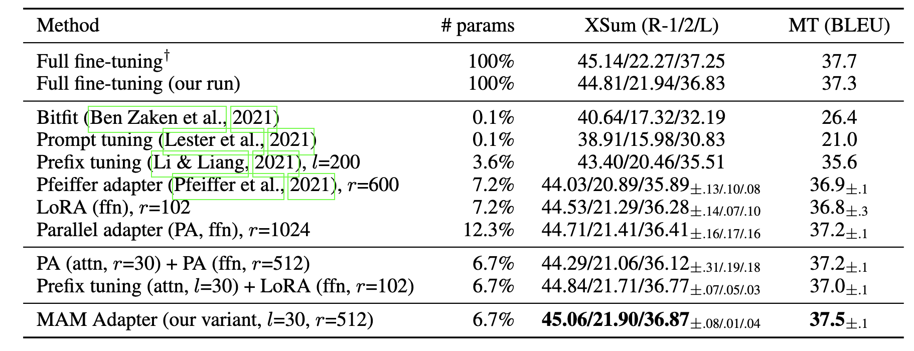

实验效果基本上匹配了full fine tuning的效果
