# <a href="zotero://open-pdf/library/items/W6D9PYW7?page=1">“AUTOMATIC CHAIN OF THOUGHT PROMPTING IN LARGE LANGUAGE MODELS”</a> (<a href="zotero://select/library/items/JCVAAJP5">Zhang et al., 2022, p. 1</a>)

Referred in <a href="zotero://note/u/LJSU8E3B/?ignore=1&#x26;line=11" rel="noopener noreferrer nofollow" zhref="zotero://note/u/LJSU8E3B/?ignore=1&#x26;line=11" ztype="znotelink" class="internal-link">LLM</a>

## <a href="zotero://open-pdf/library/items/W6D9PYW7?page=1">“ABSTRACT”</a> (<a href="zotero://select/library/items/JCVAAJP5">Zhang et al., 2022, p. 1</a>)

<a href="zotero://open-pdf/library/items/W6D9PYW7?page=NaN">“CoT prompting has two major paradigms.”</a> (<a href="zotero://select/library/items/JCVAAJP5">Zhang et al., 2022, p. 1</a>) CoT 提示有两个主要范例。

*   <a href="zotero://open-pdf/library/items/W6D9PYW7?page=NaN">“One leverages a simple prompt like “Let’s think step by step” to facilitate step-by-step thinking before answering a question”</a>

    (<a href="zotero://select/library/items/JCVAAJP5">Zhang et al., 2022, p. 1</a>)

    人们利用“Let’s think step by step”这样的简单提示来促进在回答问题之前逐步思考

*   <a href="zotero://open-pdf/library/items/W6D9PYW7?page=NaN">“The other uses a few manual demonstrations one by one, each composed of a question and a reasoning chain that leads to an answer.”</a> (<a href="zotero://select/library/items/JCVAAJP5">Zhang et al., 2022, p. 1</a>) 另一种则使用一些手动演示，每个演示都由一个问题和一个导致答案的推理链组成。

<a href="zotero://open-pdf/library/items/W6D9PYW7?page=NaN">“The superior performance of the second paradigm hinges on the hand-crafting of task-specific demonstrations one by one.”</a> (<a href="zotero://select/library/items/JCVAAJP5">Zhang et al., 2022, p. 1</a>) 第二个范式的卓越性能取决于逐一手工制作特定任务的演示。

<a href="zotero://open-pdf/library/items/W6D9PYW7?page=NaN">“We show that such manual efforts may be eliminated by leveraging LLMs with the “Let’s think step by step” prompt to generate reasoning chains for demonstrations one by one, i.e., let’s think not just step by step, but also one by one.”</a> (<a href="zotero://select/library/items/JCVAAJP5">Zhang et al., 2022, p. 1</a>) 我们表明，通过利用LLM的“Let’s think step by step”提示来生成用于演示的推理链，可以消除这种手动工作，即，let’s think not just step by step, but also one by one.

<a href="zotero://open-pdf/library/items/W6D9PYW7?page=NaN">“However, these generated chains often come with mistakes.”</a> (<a href="zotero://select/library/items/JCVAAJP5">Zhang et al., 2022, p. 1</a>) 然而，这些生成的链经常会出现错误。

<a href="zotero://open-pdf/library/items/W6D9PYW7?page=NaN">“To mitigate the effect of such mistakes, we find that diversity matters for automatically constructing demonstrations.”</a> (<a href="zotero://select/library/items/JCVAAJP5">Zhang et al., 2022, p. 1</a>) 为了减轻此类错误的影响，我们发现多样性对于自动构建演示很重要。

<a href="zotero://open-pdf/library/items/W6D9PYW7?page=1"><strong>“We propose an automatic CoT prompting method:”</strong></a>** (<a href="zotero://select/library/items/JCVAAJP5">Zhang et al., 2022, p. 1</a>)**

<a href="zotero://open-pdf/library/items/W6D9PYW7?page=NaN">“It samples questions with diversity and generates reasoning chains to construct demonstrations.”</a> (<a href="zotero://select/library/items/JCVAAJP5">Zhang et al., 2022, p. 1</a>) 它对多样性的问题进行采样，并生成推理链来构建演示。

<a href="zotero://open-pdf/library/items/W6D9PYW7?page=NaN">“On ten public benchmark reasoning tasks with GPT-3, Auto-CoT consistently matches or exceeds the performance of the CoT paradigm that requires manual designs of demonstrations.”</a> (<a href="zotero://select/library/items/JCVAAJP5">Zhang et al., 2022, p. 1</a>) 在使用 GPT-3 的十个公共基准推理任务中，Auto-CoT 始终匹配或超过需要手动设计演示的 CoT 范例的性能。

## <a href="zotero://open-pdf/library/items/W6D9PYW7?page=1">“1 Introduction”</a> (<a href="zotero://select/library/items/JCVAAJP5">Zhang et al., 2022, p. 1</a>)

<a href="zotero://open-pdf/library/items/W6D9PYW7?page=1">“Zero-Shot-CoT (left of Figure 1).”</a> (<a href="zotero://select/library/items/JCVAAJP5">Zhang et al., 2022, p. 1</a>)

<a href="zotero://open-pdf/library/items/W6D9PYW7?page=1">“Manual-CoT (right of Figure 1).”</a> (<a href="zotero://select/library/items/JCVAAJP5">Zhang et al., 2022, p. 1</a>)

<a href="zotero://open-pdf/library/items/W6D9PYW7?page=2"><strong>“Figure 1”</strong></a> (<a href="zotero://select/library/items/JCVAAJP5">Zhang et al., 2022, p. 2</a>)

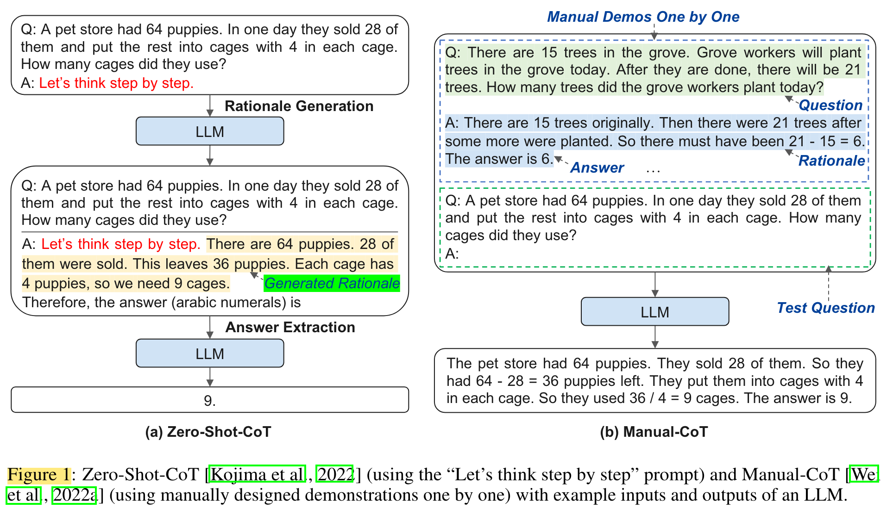

<a href="zotero://open-pdf/library/items/W6D9PYW7?page=NaN">“In practice, Manual-CoT has obtained stronger performance than Zero-Shot-CoT [Wei et al., 2022a, Kojima et al., 2022].”</a> (<a href="zotero://select/library/items/JCVAAJP5">Zhang et al., 2022, p. 1</a>) 在实践中，Manual-CoT 获得了比 Zero-Shot-CoT 更强的性能 \[Wei et al., 2022a, Kojima et al., 2022]。

*   <a href="zotero://open-pdf/library/items/W6D9PYW7?page=NaN">“hinges on the hand-drafting of effective demonstrations.”</a>

    (<a href="zotero://select/library/items/JCVAAJP5">Zhang et al., 2022, p. 1</a>)

    取决于手工起草有效的演示。

*   <a href="zotero://open-pdf/library/items/W6D9PYW7?page=NaN">“Specifically, the hand-drafting involves nontrivial efforts in designs of both questions and their reasoning chains for demonstrations.”</a> (<a href="zotero://select/library/items/JCVAAJP5">Zhang et al., 2022, p. 1</a>) 具体来说，手工绘制涉及到在设计问题和推理链的过程中进行非常重要的努力以进行演示。

    <a href="zotero://open-pdf/library/items/W6D9PYW7?page=NaN">“human efforts for designing task-specific demonstrations are even more:”</a> (<a href="zotero://select/library/items/JCVAAJP5">Zhang et al., 2022, p. 1</a>) 人类设计特定任务演示的努力甚至更多

<a href="zotero://open-pdf/library/items/W6D9PYW7?page=NaN">“To eliminate such manual designs”</a> (<a href="zotero://select/library/items/JCVAAJP5">Zhang et al., 2022, p. 1</a>) 消除此类手动设计

*   <a href="zotero://open-pdf/library/items/W6D9PYW7?page=1">“Auto-CoT”</a>

    (<a href="zotero://select/library/items/JCVAAJP5">Zhang et al., 2022, p. 1</a>)

*   <a href="zotero://open-pdf/library/items/W6D9PYW7?page=NaN">“Specifically, Auto-CoT leverages LLMs with the “Let’s think step by step” prompt to generate reasoning chains for demonstrations one by one, i.e., let’s think not just step by step, but also one by one.”</a>

    (<a href="zotero://select/library/items/JCVAAJP5">Zhang et al., 2022, p. 1</a>)

    具体来说，Auto-CoT利用LLM的“让我们一步一步思考”的提示来生成用于演示的推理链，即

    let’s think not just step by step, but also one by one.

<a href="zotero://open-pdf/library/items/W6D9PYW7?page=NaN">“Although LLMs are decent zero-shot reasoners, they are not perfect: Zero-Shot-CoT can still make mistakes in reasoning chains.”</a> (<a href="zotero://select/library/items/JCVAAJP5">Zhang et al., 2022, p. 2</a>) 尽管 LLM 是不错的零样本推理机，但它们并不完美：零样本 CoT 仍然可能在推理链中犯错误。

<a href="zotero://open-pdf/library/items/W6D9PYW7?page=NaN">“To mitigate the effect of reasoning chain mistakes from Zero-Shot-CoT, our analysis shows that diversity of demonstration questions is the key. Based on this insight, we propose an Auto-CoT method to automatically construct demonstrations.”</a> (<a href="zotero://select/library/items/JCVAAJP5">Zhang et al., 2022, p. 2</a>) 为了减轻零样本 CoT 推理链错误的影响，我们的分析表明演示问题的多样性是关键。基于这一见解，我们提出了一种 Auto-CoT 方法来自动构建演示。

<a href="zotero://open-pdf/library/items/W6D9PYW7?page=2">“Auto-CoT consists of two main steps”</a> (<a href="zotero://select/library/items/JCVAAJP5">Zhang et al., 2022, p. 2</a>)

*   <a href="zotero://open-pdf/library/items/W6D9PYW7?page=NaN">“First, partition questions of a given dataset into a few clusters.”</a>

    (<a href="zotero://select/library/items/JCVAAJP5">Zhang et al., 2022, p. 2</a>)

    首先，将给定数据集的问题划分为几个集群。

*   <a href="zotero://open-pdf/library/items/W6D9PYW7?page=NaN">“Second, select a representative question from each cluster and generate its reasoning chain using Zero-Shot-CoT with simple heuristics.”</a>

    (<a href="zotero://select/library/items/JCVAAJP5">Zhang et al., 2022, p. 2</a>)

    其次，从每个聚类中选择一个代表性问题，并使用简单的启发式方法生成其推理链。

<a href="zotero://open-pdf/library/items/W6D9PYW7?page=NaN">“This indicates that LLMs can perform CoT reasoning by automatically constructing demonstrations.”</a> (<a href="zotero://select/library/items/JCVAAJP5">Zhang et al., 2022, p. 2</a>) 这表明LLM可以通过自动构建演示来执行 CoT 推理。

## <a href="zotero://open-pdf/library/items/W6D9PYW7?page=2">“2 Related Work”</a> (<a href="zotero://select/library/items/JCVAAJP5">Zhang et al., 2022, p. 2</a>)

### <a href="zotero://open-pdf/library/items/W6D9PYW7?page=2">“2.1 Chain-of-thought Prompting”</a> (<a href="zotero://select/library/items/JCVAAJP5">Zhang et al., 2022, p. 2</a>)

<a href="zotero://open-pdf/library/items/W6D9PYW7?page=2">“Zero-Shot-CoT.”</a> (<a href="zotero://select/library/items/JCVAAJP5">Zhang et al., 2022, p. 2</a>)

<a href="zotero://open-pdf/library/items/W6D9PYW7?page=3">“Manual-CoT.”</a> (<a href="zotero://select/library/items/JCVAAJP5">Zhang et al., 2022, p. 3</a>)

### <a href="zotero://open-pdf/library/items/W6D9PYW7?page=3">“2.2 In-Context Learning”</a> (<a href="zotero://select/library/items/JCVAAJP5">Zhang et al., 2022, p. 3</a>)

<a href="zotero://open-pdf/library/items/W6D9PYW7?page=NaN">“CoT prompting is closely related to in-context learning (ICL)”</a> (<a href="zotero://select/library/items/JCVAAJP5">Zhang et al., 2022, p. 3</a>) CoT 提示与上下文 (ICL) 密切相关

<a href="zotero://open-pdf/library/items/W6D9PYW7?page=NaN">“ICL enables LLMs to perform a target task by feeding a few prompted examples as part of the input. Without gradient update, ICL allows a single model to perform various tasks universally.”</a> (<a href="zotero://select/library/items/JCVAAJP5">Zhang et al., 2022, p. 3</a>) ICL 使LLM能够通过提供一些提示示例作为输入的一部分来执行目标任务。无需梯度更新，ICL 允许单个模型通用地执行各种任务。

<a href="zotero://open-pdf/library/items/W6D9PYW7?page=NaN">“There are various research lines to improve the performance of ICL”</a> (<a href="zotero://select/library/items/JCVAAJP5">Zhang et al., 2022, p. 3</a>) 有多种研究方向可以提高ICL的性能

*   <a href="zotero://open-pdf/library/items/W6D9PYW7?page=NaN">“retrieving related demonstrations to the test instance where the popular practice is dynamically retrieving related training examples for a given test input”</a>

    (<a href="zotero://select/library/items/JCVAAJP5">Zhang et al., 2022, p. 3</a>)

    检索测试实例的相关演示，其中流行的做法是动态检索给定测试输入的相关训练示例

*   <a href="zotero://open-pdf/library/items/W6D9PYW7?page=NaN">“augmenting with fine-grained information, such as incorporating task instruction”</a>

    (<a href="zotero://select/library/items/JCVAAJP5">Zhang et al., 2022, p. 3</a>)

    增加细粒度信息，例如合并任务指令

*   <a href="zotero://open-pdf/library/items/W6D9PYW7?page=NaN">“manipulating output probabilities of LLMs instead of directly computing the likelihood of target labels”</a>

    (<a href="zotero://select/library/items/JCVAAJP5">Zhang et al., 2022, p. 3</a>)

    操纵 LLM 的输出概率，而不是直接计算目标标签的可能性

<a href="zotero://open-pdf/library/items/W6D9PYW7?page=NaN">“Despite the success of ICL, studies [Liu et al., 2022a, Lu et al., 2022] have shown that the strength of ICL may vary widely depending on the choice of in-context demonstrations”</a> (<a href="zotero://select/library/items/JCVAAJP5">Zhang et al., 2022, p. 3</a>) 尽管 ICL 取得了成功，但研究 \[Liu et al., 2022a, Lu et al., 2022] 表明，根据上下文演示的选择，ICL 的强度可能会有很大差异

*   <a href="zotero://open-pdf/library/items/W6D9PYW7?page=NaN">“In detail, the formatting of the prompt, such as wording or order of demonstrations, may lead to performance fluctuations”</a>

    (<a href="zotero://select/library/items/JCVAAJP5">Zhang et al., 2022, p. 3</a>)

    具体来说，提示的格式，例如演示的措辞或顺序，可能会导致性能波动

<a href="zotero://open-pdf/library/items/W6D9PYW7?page=NaN">“A recent work [Min et al., 2022b] even questioned the necessity of ground-truth inputoutput mapping: using incorrect labels in the examples only marginally lowers the performance.”</a> (<a href="zotero://select/library/items/JCVAAJP5">Zhang et al., 2022, p. 3</a>) 最近的一项工作 \[Min et al., 2022b] 甚至质疑真实输入输出映射的必要性：在示例中使用不正确的标签只会略微降低性能。

<a href="zotero://open-pdf/library/items/W6D9PYW7?page=NaN">“However, the existing analysis of ICL is mainly based on standard classification and multi-choice datasets that only have simple &#x3C;input→output> mappings.”</a> (<a href="zotero://select/library/items/JCVAAJP5">Zhang et al., 2022, p. 3</a>) 然而，现有的 ICL 分析主要基于标准分类和多选数据集，仅具有简单的<输入→输出>映射。

<a href="zotero://open-pdf/library/items/W6D9PYW7?page=NaN">“We discover that those findings may not be applicable to the CoT prompting scenario with more complex &#x3C;input→rationale→output> mappings.”</a> (<a href="zotero://select/library/items/JCVAAJP5">Zhang et al., 2022, p. 3</a>) 我们发现这些发现可能不适用于具有更复杂的 \<input→rationale→output> 映射的 CoT 提示场景。

<a href="zotero://open-pdf/library/items/W6D9PYW7?page=NaN">“For example, mistakes in either the &#x3C;input→rationale> mapping or the &#x3C;rationale→output> mapping will lead to a dramatic performance drop (Appendix A.1)”</a> (<a href="zotero://select/library/items/JCVAAJP5">Zhang et al., 2022, p. 3</a>) 例如，\<input→rationale>映射或\<rationale→output>映射中的错误将导致性能急剧下降（附录A.1）

## <a href="zotero://open-pdf/library/items/W6D9PYW7?page=3">“3 Challenge of Auto-CoT”</a> (<a href="zotero://select/library/items/JCVAAJP5">Zhang et al., 2022, p. 3</a>)

<a href="zotero://open-pdf/library/items/W6D9PYW7?page=NaN">“As just discussed, the performance of ICL hinges on hand-crafted demonstrations”</a> (<a href="zotero://select/library/items/JCVAAJP5">Zhang et al., 2022, p. 3</a>) 正如刚才所讨论的，ICL 的性能取决于手工制作的演示

<a href="zotero://open-pdf/library/items/W6D9PYW7?page=NaN">“As reported in Manual-CoT [Wei et al., 2022a], using demonstrations written by different annotators brings up to 28.2% accuracy disparity in a symbolic reasoning task, while changing the order of demonstrations results in less than 2% changes in most tasks.”</a> (<a href="zotero://select/library/items/JCVAAJP5">Zhang et al., 2022, p. 3</a>) 正如 Manual-CoT \[Wei et al., 2022a] 中所报道的，使用不同注释者编写的演示会在符号推理任务中带来高达 28.2% 的准确度差异，而改变演示的顺序会导致大多数任务的变化不到 2% 。

--<a href="zotero://open-pdf/library/items/5CKXFVKL?page=6">“Figure 6”</a> <zcitation>(<a href="zotero://select/library/items/YMW5IN97">Wei et al., 2023, p. 6</a>)</zcitation>

<a href="zotero://open-pdf/library/items/W6D9PYW7?page=NaN">“This suggests that the key challenge of Auto-CoT lies in automatically constructing demonstrations with good questions and their reasoning chains.”</a> (<a href="zotero://select/library/items/JCVAAJP5">Zhang et al., 2022, p. 3</a>) 这表明 Auto-CoT 的关键挑战在于自动构建具有好问题及其推理链的演示。

<a href="zotero://open-pdf/library/items/W6D9PYW7?page=NaN">“Recall that Manual-CoT hand-crafts a few (e.g., 8) questions in demonstrations.”</a> (<a href="zotero://select/library/items/JCVAAJP5">Zhang et al., 2022, p. 3</a>) 回想一下，Manual-CoT 在演示中手工制作了一些（例如 8 个）问题。

<a href="zotero://open-pdf/library/items/W6D9PYW7?page=NaN">“a promising candidate solution is to sample demonstration questions using similarity-based retrieval.”</a> (<a href="zotero://select/library/items/JCVAAJP5">Zhang et al., 2022, p. 3</a>) 一个有前途的候选解决方案是使用基于相似性的检索对演示问题进行采样。

<a href="zotero://open-pdf/library/items/W6D9PYW7?page=NaN">“We follow the more challenging assumption in CoT studies [Wei et al., 2022a, Kojima et al., 2022] that only a set of test questions are given (without a training dataset).”</a> (<a href="zotero://select/library/items/JCVAAJP5">Zhang et al., 2022, p. 3</a>) 我们遵循 CoT 研究中更具挑战性的假设 \[Wei et al., 2022a, Kojima et al., 2022]，即仅给出一组测试问题（没有训练数据集）。

<a href="zotero://open-pdf/library/items/W6D9PYW7?page=NaN">“Following Liu et al. [2022a], we use Sentence-BERT [Reimers and Gurevych, 2019] to encode questions. For each question qtest in a test dataset, we sample demonstration questions qdemo i (i = 1, . . . , k) from the rest of the questions.”</a> (<a href="zotero://select/library/items/JCVAAJP5">Zhang et al., 2022, p. 3</a>) 继刘等人之后。 \[2022a]，我们使用 Sentence-BERT \[Reimers 和 Gurevych，2019] 对问题进行编码。对于测试数据集中的每个问题 qtest，我们从其余问题中抽取演示问题 qdemo i (i = 1, ..., k)。

<a href="zotero://open-pdf/library/items/W6D9PYW7?page=NaN">“We design a Retrieval-Q-CoT method to retrieve the top-k (e.g., k = 8) similar questions based on cosine similarity.”</a> (<a href="zotero://select/library/items/JCVAAJP5">Zhang et al., 2022, p. 3</a>) 我们设计了一种 Retrieval-Q-CoT 方法来基于余弦相似度检索前 k 个（例如，k = 8）相似问题。

<a href="zotero://open-pdf/library/items/W6D9PYW7?page=NaN">“To compare with this similarity-based method, we also test a relatively more diversity-based method: Random-Q-CoT, which randomly samples k other test questions for each test question.”</a> (<a href="zotero://select/library/items/JCVAAJP5">Zhang et al., 2022, p. 3</a>) 为了与这种基于相似性的方法进行比较，我们还测试了一种相对更加基于多样性的方法：Random-Q-CoT，它为每个测试问题随机抽取 k 个其他测试问题。

<a href="zotero://open-pdf/library/items/W6D9PYW7?page=NaN">“Both Retrieval-Q-CoT and Random-Q-CoT invoke Zero-Shot-CoT [Kojima et al., 2022] to generate the reasoning chain cdemo i (rationale and answer) for each sampled question qdemo i , as LLMs are decent zero-shot reasoners [Kojima et al., 2022].”</a> (<a href="zotero://select/library/items/JCVAAJP5">Zhang et al., 2022, p. 3</a>) Retrieval-Q-CoT 和 Random-Q-CoT 都调用 Zero-Shot-CoT [Kojima et al., 2022] 为每个采样问题 qdemo i 生成推理链 cdemo i （基本原理和答案），因为 LLM 是zero-shot 推理机 \[Kojima et al., 2022]。

<a href="zotero://open-pdf/library/items/W6D9PYW7?page=NaN">“On a high level, both Retrieval-Q-CoT and Random-Q-CoT take the concatenation of qdemo i , cdemo i pairs (i = 1, . . . , k) and qtest as input to predict the reasoning chain for qtest, which contains the answer in the end (like right of Figure 1).”</a> (<a href="zotero://select/library/items/JCVAAJP5">Zhang et al., 2022, p. 3</a>) 在较高层次上，Retrieval-Q-CoT 和 Random-Q-CoT 都将 qdemo i 、 cdemo i 对 (i = 1, ..., k) 和 qtest 的串联作为输入来预测 qtest 的推理链，其中最终包含答案（如图 1 右侧所示）。

<a href="zotero://open-pdf/library/items/W6D9PYW7?page=NaN">“To our surprise, Retrieval-Q-CoT underperforms Random-Q-CoT on the arithmetic dataset MultiArith [Roy and Roth, 2015] (Table 1).”</a> (<a href="zotero://select/library/items/JCVAAJP5">Zhang et al., 2022, p. 3</a>) 令我们惊讶的是，Retrieval-Q-CoT 在算术数据集 MultiArith 上的表现不如 Random-Q-CoT \[Roy 和 Roth，2015]（表 1）。

<a href="zotero://open-pdf/library/items/W6D9PYW7?page=4">“Table 1”</a> (<a href="zotero://select/library/items/JCVAAJP5">Zhang et al., 2022, p. 4</a>)

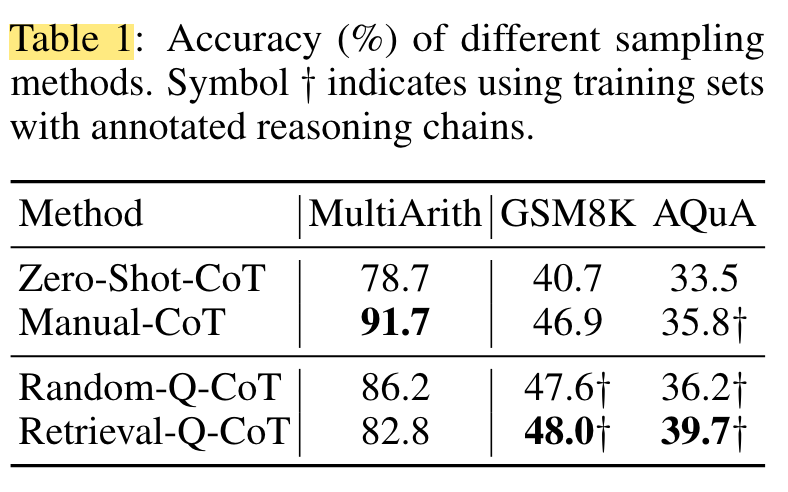

<a href="zotero://open-pdf/library/items/W6D9PYW7?page=NaN">“Note that the retrieval methods were originally proposed in tasks with annotated labels”</a> (<a href="zotero://select/library/items/JCVAAJP5">Zhang et al., 2022, p. 3</a>) 请注意，检索方法最初是在带有注释标签的任务中提出的

<a href="zotero://open-pdf/library/items/W6D9PYW7?page=NaN">“however, invoking Zero-Shot-CoT does not guarantee entirely correct reasoning chains.”</a> (<a href="zotero://select/library/items/JCVAAJP5">Zhang et al., 2022, p. 3</a>) 然而，调用 Zero-Shot-CoT 并不能保证推理链完全正确。

<a href="zotero://open-pdf/library/items/W6D9PYW7?page=NaN">“Thus, we hypothesize that the inferior performance of Retrieval-Q-CoT is caused by incorrect reasoning chains by ZeroShot-CoT.”</a> (<a href="zotero://select/library/items/JCVAAJP5">Zhang et al., 2022, p. 3</a>) 因此，我们假设 Retrieval-Q-CoT 的性能较差是由 ZeroShot-CoT 的错误推理链引起的。

<a href="zotero://open-pdf/library/items/W6D9PYW7?page=NaN">“The result indicates that Retrieval-Q-CoT is effective when human annotations are available”</a> (<a href="zotero://select/library/items/JCVAAJP5">Zhang et al., 2022, p. 3</a>) 结果表明，当人工注释可用时，Retrieval-Q-CoT 是有效的

<a href="zotero://open-pdf/library/items/W6D9PYW7?page=NaN">“Although human annotations are useful, such manual efforts are nontrivial. However, automatically generating reasoning chains via Zero-Shot-CoT underperforms Manual-CoT, especially when the challenge of question sampling is not addressed. To design more effective Auto-CoT, we need to understand its challenge better.”</a> (<a href="zotero://select/library/items/JCVAAJP5">Zhang et al., 2022, p. 3</a>) 尽管人工注释很有用，但这种手动工作并非易事。然而，通过 Zero-Shot-CoT 自动生成推理链的性能不如手动 CoT，尤其是在未解决问题采样挑战的情况下。为了设计更有效的 Auto-CoT，我们需要更好地理解它的挑战。

### <a href="zotero://open-pdf/library/items/W6D9PYW7?page=4">“3.1 Retrieval-Q-CoT Fails due to Misleading by Similarity”</a> (<a href="zotero://select/library/items/JCVAAJP5">Zhang et al., 2022, p. 4</a>)

ç

<a href="zotero://open-pdf/library/items/W6D9PYW7?page=NaN">“Since Retrieval-Q-CoT uses a few prompting demonstrations like in Manual-CoT, Retrieval-Q-CoT is expected to perform competitively as well.”</a> (<a href="zotero://select/library/items/JCVAAJP5">Zhang et al., 2022, p. 4</a>) 由于 Retrieval-Q-CoT 使用了一些类似于 Manual-CoT 的提示演示，因此 Retrieval-Q-CoT 预计也将具有竞争力。

<a href="zotero://open-pdf/library/items/W6D9PYW7?page=NaN">“However, reasoning chains (both rationales and answers) in Retrieval-Q-CoT are generated by Zero-Shot-CoT: they may have mistakes that lead to wrong answers.”</a> (<a href="zotero://select/library/items/JCVAAJP5">Zhang et al., 2022, p. 4</a>) 然而，Retrieval-Q-CoT 中的推理链（包括基本原理和答案）是由 Zero-Shot-CoT 生成的：它们可能存在导致错误答案的错误。

<a href="zotero://open-pdf/library/items/W6D9PYW7?page=NaN">“after similar questions to a test question are retrieved, wrong demonstrations caused by Zero-Shot-CoT may mislead the same LLM to reason similarly with a wrong answer (e.g., replicating mistakes) for the test question.”</a> (<a href="zotero://select/library/items/JCVAAJP5">Zhang et al., 2022, p. 4</a>) 在检索到与测试问题类似的问题后，零射击 CoT 引起的错误演示可能会误导同一 LLM 对测试问题做出类似的错误答案（例如，重复错误）。

<a href="zotero://open-pdf/library/items/W6D9PYW7?page=NaN">“We refer to this phenomenon as misleading by similarity. We will investigate whether misleading by similarity contributes to the inferior performance of Retrieval-Q-CoT.”</a> (<a href="zotero://select/library/items/JCVAAJP5">Zhang et al., 2022, p. 4</a>) 我们将这种现象称为相似性误导。我们将研究相似性误导是否会导致 Retrieval-Q-CoT 的性能较差。

<a href="zotero://open-pdf/library/items/W6D9PYW7?page=4">“Figure 2: Unresolving Rate.”</a> (<a href="zotero://select/library/items/JCVAAJP5">Zhang et al., 2022, p. 4</a>)

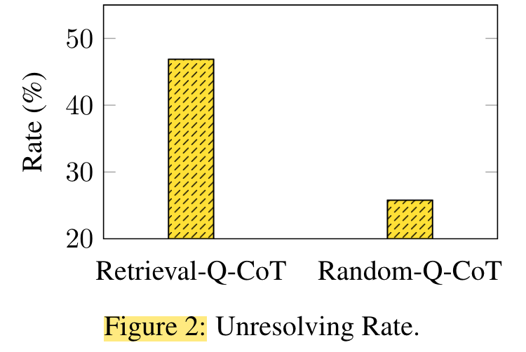

<a href="zotero://open-pdf/library/items/W6D9PYW7?page=NaN">“Figure 2 shows that the unresolving rate of Retrieval-Q-CoT (46.9%) is much higher than Random-Q-CoT (25.8%). It indicates that with similar questions being sampled for test questions, Retrieval-Q-CoT is negatively affected by misleading by similarity.”</a> (<a href="zotero://select/library/items/JCVAAJP5">Zhang et al., 2022, p. 4</a>) 图2显示Retrieval-Q-CoT的未解析率（46.9%）远高于Random-Q-CoT（25.8%）。这表明，在测试问题中抽取相似的问题时，Retrieval-Q-CoT 会受到相似性误导的负面影响。

<a href="zotero://open-pdf/library/items/W6D9PYW7?page=NaN">“To show that unresolved questions of Retrieval-Q-CoT tend to be similar, we present a case study in Table 2”</a> (<a href="zotero://select/library/items/JCVAAJP5">Zhang et al., 2022, p. 4</a>) 为了表明 Retrieval-Q-CoT 未解决的问题往往是相似的，我们在表 2 中提供了一个案例研究

<a href="zotero://open-pdf/library/items/W6D9PYW7?page=5">“Table 2:”</a> (<a href="zotero://select/library/items/JCVAAJP5">Zhang et al., 2022, p. 5</a>)

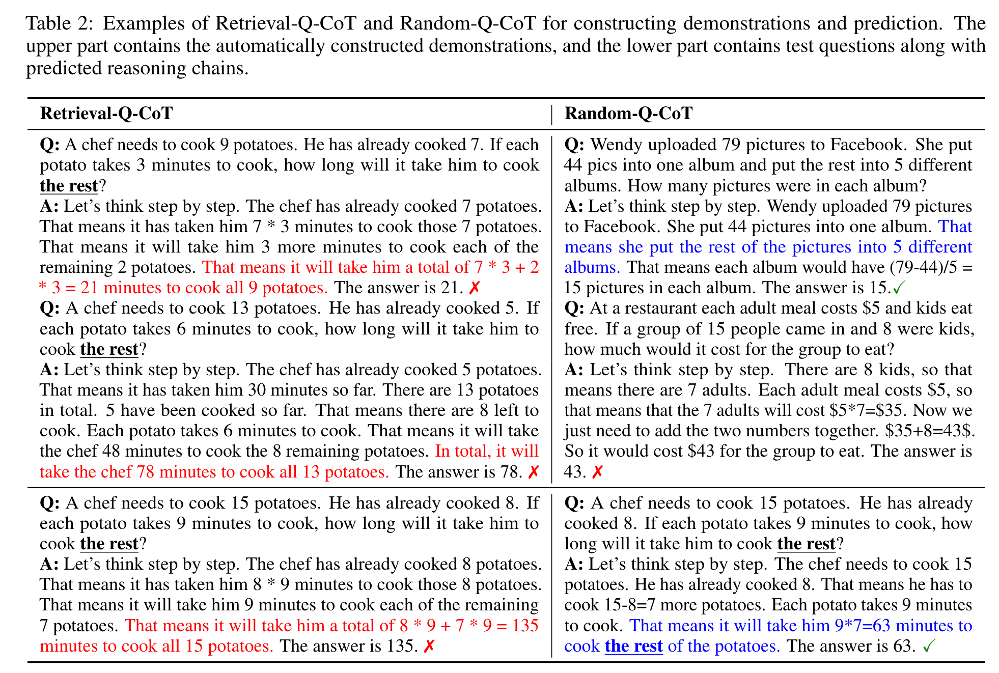

### <a href="zotero://open-pdf/library/items/W6D9PYW7?page=4">“3.2 Errors Frequently Fall into the Same Cluster”</a> (<a href="zotero://select/library/items/JCVAAJP5">Zhang et al., 2022, p. 4</a>)

错误经常归入同一簇

<a href="zotero://open-pdf/library/items/W6D9PYW7?page=NaN">“Motivated by the observations in Table 2, we use k-means to partition all the 600 test questions into k = 8 clusters, where each cluster contains similar questions.2”</a> (<a href="zotero://select/library/items/JCVAAJP5">Zhang et al., 2022, p. 4</a>) 受表 2 中观察结果的启发，我们使用 k 均值将所有 600 个测试问题划分为 k = 8 个簇，其中每个簇包含相似的问题。2

<a href="zotero://open-pdf/library/items/W6D9PYW7?page=NaN">“Thus, we calculate the error rate (questions with wrong Zero-Shot-CoT answers / total questions) for each cluster.”</a> (<a href="zotero://select/library/items/JCVAAJP5">Zhang et al., 2022, p. 5</a>) 因此，我们计算每个集群的错误率（带有错误 Zero-Shot-CoT 答案的问题/总问题）。

<a href="zotero://open-pdf/library/items/W6D9PYW7?page=5">“Figure 3: Clusters of similar questions.”</a> (<a href="zotero://select/library/items/JCVAAJP5">Zhang et al., 2022, p. 5</a>)

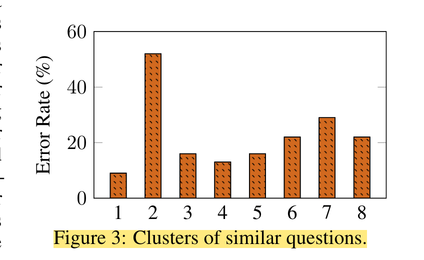

<a href="zotero://open-pdf/library/items/W6D9PYW7?page=NaN">“The phenomenon could be generic as Zero-Shot-CoT may lack some skills to solve some common problems in target tasks.”</a> (<a href="zotero://select/library/items/JCVAAJP5">Zhang et al., 2022, p. 5</a>) 这种现象可能是普遍存在的，因为 Zero-Shot-CoT 可能缺乏解决目标任务中一些常见问题的技能。

<a href="zotero://open-pdf/library/items/W6D9PYW7?page=NaN">“herefore, the imperfect nature of generated reasoning chains in a zero-shot fashion poses risks of retrieving multiple similar questions inside a frequent-error cluster by using similarity-based methods.”</a> (<a href="zotero://select/library/items/JCVAAJP5">Zhang et al., 2022, p. 5</a>) 因此，以零样本方式生成的推理链的不完美本质带来了使用基于相似性的方法在频繁错误簇内检索多个相似问题的风险。

<a href="zotero://open-pdf/library/items/W6D9PYW7?page=NaN">“For the test question in the frequent-error cluster, RetrievalQ-CoT more easily constructs demonstrations with multiple similar mistakes. As a result, Retrieval-Q-CoT often makes similar mistakes like Zero-Shot-CoT, reiterated by its higher unresolving rate in Figure 2”</a> (<a href="zotero://select/library/items/JCVAAJP5">Zhang et al., 2022, p. 5</a>) 对于频繁错误簇中的测试问题，RetrievalQ-CoT 更容易构建具有多个相似错误的演示。因此，Retrieval-Q-CoT 经常会犯与 Zero-Shot-CoT 类似的错误，图 2 中其较高的未解决率再次证明了这一点

### <a href="zotero://open-pdf/library/items/W6D9PYW7?page=5">“3.3 Diversity May Mitigate Misleading by Similarity”</a> (<a href="zotero://select/library/items/JCVAAJP5">Zhang et al., 2022, p. 5</a>)

<a href="zotero://open-pdf/library/items/W6D9PYW7?page=NaN">“The analysis so far compellingly shows that LLMs are still not perfect zero-shot reasoners; thus, we aim to mitigate the effect of their Zero-Shot-CoT errors, especially to mitigate misleading by similarity in the design of Auto-CoT.”</a> (<a href="zotero://select/library/items/JCVAAJP5">Zhang et al., 2022, p. 5</a>) 到目前为止的分析令人信服地表明，LLM仍然不是完美的零样本推理者；因此，我们的目标是减轻其 Zero-Shot-CoT 错误的影响，特别是减少 Auto-CoT 设计相似性带来的误导。

<a href="zotero://open-pdf/library/items/W6D9PYW7?page=NaN">“As we will show later (Section 5.5), presenting a small portion of mistakes (e.g., 1 or 2 wrong demonstrations out of 8) would not harm the overall reasoning performance for test questions.”</a> (<a href="zotero://select/library/items/JCVAAJP5">Zhang et al., 2022, p. 5</a>) 正如我们稍后将展示的（第 5.5 节），呈现一小部分错误（例如，8 个错误演示中的 1 到 2 个）不会损害测试问题的整体推理性能。

<a href="zotero://open-pdf/library/items/W6D9PYW7?page=NaN">“Since different clusters reflect diverse semantics of the questions, this clustering-based sampling method can be considered as diversity-based, which is in sharp contrast to similarity-based Retrieval-Q-CoT.”</a> (<a href="zotero://select/library/items/JCVAAJP5">Zhang et al., 2022, p. 5</a>) 由于不同的聚类反映了问题的不同语义，因此这种基于聚类的采样方法可以被认为是基于多样性的，这与基于相似性的 Retrieval-Q-CoT 形成鲜明对比。

<a href="zotero://open-pdf/library/items/W6D9PYW7?page=NaN">“sampling questions with diversity may mitigate the effect of misleading by similarity (Section 3.1).”</a> (<a href="zotero://select/library/items/JCVAAJP5">Zhang et al., 2022, p. 5</a>)多样化的抽样问题可能会减轻 相似性误导的影响（第 3.1 节）。

<a href="zotero://open-pdf/library/items/W6D9PYW7?page=NaN">“even though there still exists a small portion (e.g., 1/8) of mistakes in the demonstrations, the performance will not be negatively affected (to be shown in Figure 6).”</a> (<a href="zotero://select/library/items/JCVAAJP5">Zhang et al., 2022, p. 5</a>) 即使演示中仍然存在一小部分（例如1/8）错误，但性能不会受到负面影响（如图6所示）。

## <a href="zotero://open-pdf/library/items/W6D9PYW7?page=6">“4 Auto-CoT: Automatic Chain-of-Thought Prompting”</a> (<a href="zotero://select/library/items/JCVAAJP5">Zhang et al., 2022, p. 6</a>)

<a href="zotero://open-pdf/library/items/W6D9PYW7?page=NaN">“Based on the observations and considerations in Section 3, we propose an Auto-CoT method to construct demonstrations with questions and reasoning chains automatically.”</a> (<a href="zotero://select/library/items/JCVAAJP5">Zhang et al., 2022, p. 5</a>) 基于第 3 节中的观察和考虑，我们提出了一种 Auto-CoT 方法来自动构建带有问题和推理链的演示。

<a href="zotero://open-pdf/library/items/W6D9PYW7?page=6">“Auto-CoT consists of two main stages:”</a> (<a href="zotero://select/library/items/JCVAAJP5">Zhang et al., 2022, p. 6</a>)

*   <a href="zotero://open-pdf/library/items/W6D9PYW7?page=NaN">“(i) question clustering: partition questions of a given dataset into a few clusters”</a>

    (<a href="zotero://select/library/items/JCVAAJP5">Zhang et al., 2022, p. 5</a>)

    (i) 问题聚类：将给定数据集的问题划分为几个簇

*   <a href="zotero://open-pdf/library/items/W6D9PYW7?page=NaN">“(ii) demonstration sampling: select a representative question from each cluster and generate its reasoning chain using Zero-Shot-CoT with simple heuristics.”</a>

    (<a href="zotero://select/library/items/JCVAAJP5">Zhang et al., 2022, p. 5</a>)

    (ii) 演示采样：从每个集群中选择一个代表性问题，并使用带有简单启发式的 Zero-Shot-CoT 生成其推理链。

<a href="zotero://open-pdf/library/items/W6D9PYW7?page=6">“Figure 4: Overview of the Auto-CoT method.”</a> (<a href="zotero://select/library/items/JCVAAJP5">Zhang et al., 2022, p. 6</a>)

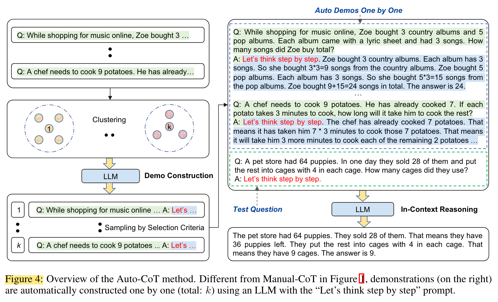

## <a href="zotero://open-pdf/library/items/W6D9PYW7?page=6">“4.1 Question Clustering”</a> (<a href="zotero://select/library/items/JCVAAJP5">Zhang et al., 2022, p. 6</a>) 问题的聚类

<a href="zotero://open-pdf/library/items/W6D9PYW7?page=NaN">“Since diversity-based clustering may mitigate misleading by similarity (Section 3.3), we perform cluster analysis for a given set of questions Q.”</a> (<a href="zotero://select/library/items/JCVAAJP5">Zhang et al., 2022, p. 6</a>) 由于基于多样性的聚类可以减轻相似性带来的误导（第 3.3 节），因此我们对给定的一组问题 Q 进行聚类分析。

<a href="zotero://open-pdf/library/items/W6D9PYW7?page=NaN">“We first compute a vector representation for each question in Q by Sentence-BERT [Reimers and Gurevych, 2019]”</a> (<a href="zotero://select/library/items/JCVAAJP5">Zhang et al., 2022, p. 6</a>) 我们首先通过 Sentence-BERT 计算 Q 中每个问题的向量表示 \[Reimers 和 Gurevych，2019]

<a href="zotero://open-pdf/library/items/W6D9PYW7?page=NaN">“The contextualized vectors are averaged to form a fix-sized question representation.”</a> (<a href="zotero://select/library/items/JCVAAJP5">Zhang et al., 2022, p. 6</a>) 对上下文向量进行平均以形成固定大小的问题表示。

<a href="zotero://open-pdf/library/items/W6D9PYW7?page=NaN">“Then, the question representations are processed by the k-means clustering algorithm to produce k clusters of questions”</a> (<a href="zotero://select/library/items/JCVAAJP5">Zhang et al., 2022, p. 6</a>) 然后，通过 k-means 聚类算法处理问题表示以生成 k 个问题簇

<a href="zotero://open-pdf/library/items/W6D9PYW7?page=NaN">“For questions in each cluster i, sort them into a list q(i) = [q(i) 1 , q(i) 2 , . . .] in the ascending order of the distance to the center of cluster i.”</a> (<a href="zotero://select/library/items/JCVAAJP5">Zhang et al., 2022, p. 6</a>) 对于每个簇 i 中的问题，将它们排序到列表 q(i) = \[q(i) 1 , q(i) 2 , ... 中。 。 .] 按照到簇 i 中心的距离的升序排列。

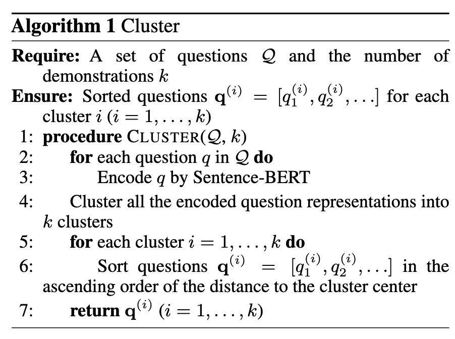

### <a href="zotero://open-pdf/library/items/W6D9PYW7?page=6">“4.2 Demonstration Sampling”</a> (<a href="zotero://select/library/items/JCVAAJP5">Zhang et al., 2022, p. 6</a>) 范例抽样

<a href="zotero://open-pdf/library/items/W6D9PYW7?page=NaN">“In the second stage, we need to generate reasoning chains for those sampled questions and then sample demonstrations that satisfy our selection criteria.”</a> (<a href="zotero://select/library/items/JCVAAJP5">Zhang et al., 2022, p. 6</a>) 在第二阶段，我们需要为这些样本问题生成推理链，然后进行满足我们选择标准的样本演示。

<a href="zotero://open-pdf/library/items/W6D9PYW7?page=NaN">“More concretely, we construct a demonstration d(i) (concatenation of a question, a rationale, and an answer) for each cluster i (i = 1, . . . , k).”</a> (<a href="zotero://select/library/items/JCVAAJP5">Zhang et al., 2022, p. 6</a>) 更具体地说，我们为每个簇 i (i = 1, ..., k) 构建一个演示 d(i)（问题、基本原理和答案的串联）。

<a href="zotero://open-pdf/library/items/W6D9PYW7?page=NaN">“A prompted input is formulated as: [Q: q(i) j . A: [P]], where [P] is a single prompt “Let’s think step to step”. This formed input is fed into an LLM using Zero-Shot-CoT [Kojima et al., 2022] to output the reasoning chain consisting of the rationale r(i) j and the extracted answer a(i) j .”</a> (<a href="zotero://select/library/items/JCVAAJP5">Zhang et al., 2022, p. 6</a>) 提示输入的公式为：\[Q: q(i) j 。答：\[P]]，其中 \[P] 是单个提示“让我们一步一步思考”。使用 Zero-Shot-CoT \[Kojima et al., 2022] 将形成的输入输入 LLM，以输出由基本原理 r(i) j 和提取的答案 a(i) j 组成的推理链。

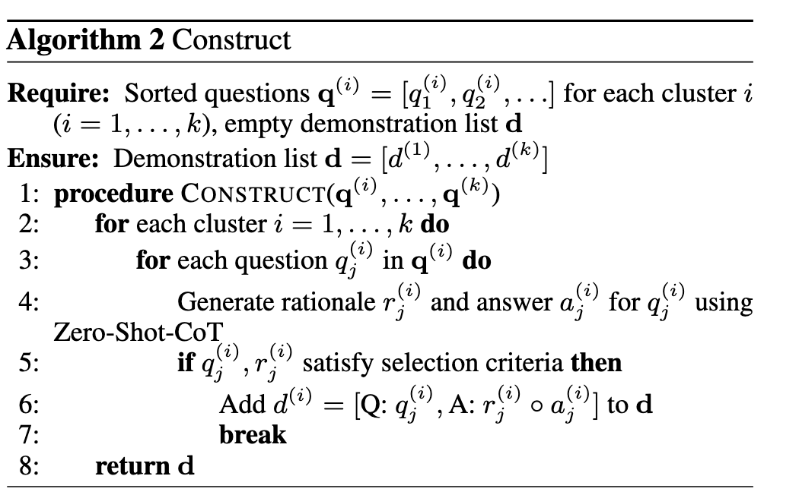

<a href="zotero://open-pdf/library/items/W6D9PYW7?page=NaN">“after demonstration sampling for all the k clusters, there will be k constructed demonstrations [d(1), . . . , d(k)].”</a> (<a href="zotero://select/library/items/JCVAAJP5">Zhang et al., 2022, p. 7</a>) 对所有 k 个聚类进行演示采样后，将有 k 个构建的演示 \[d(1),... 。 。 ，d(k)]。

<a href="zotero://open-pdf/library/items/W6D9PYW7?page=NaN">“The constructed demonstrations are used to augment a test question qtest for in-context learning.”</a> (<a href="zotero://select/library/items/JCVAAJP5">Zhang et al., 2022, p. 7</a>) 构建的演示用于增强上下文学习的测试问题 qtest。

<a href="zotero://open-pdf/library/items/W6D9PYW7?page=NaN">“Specifically, the input is the concatenation of all the demonstrations [d(1), . . . , d(k)] followed by [Q: qtest. A: [P]]. This input is fed to LLMs to obtain the reasoning chain with the answer in the end for qtest (right of Figure 4).”</a> (<a href="zotero://select/library/items/JCVAAJP5">Zhang et al., 2022, p. 7</a>) 具体来说，输入是所有演示 \[d(1), . 。 。 , d(k)] 后跟 \[Q: qtest.答：\[P]]。该输入被馈送到LLM以获得推理链，最后为 qtest 提供答案（图 4 右侧）。

## <a href="zotero://open-pdf/library/items/W6D9PYW7?page=7">“5 Experiments”</a> (<a href="zotero://select/library/items/JCVAAJP5">Zhang et al., 2022, p. 7</a>)

### <a href="zotero://open-pdf/library/items/W6D9PYW7?page=7">“5.1 Experimental setup”</a> (<a href="zotero://select/library/items/JCVAAJP5">Zhang et al., 2022, p. 7</a>)

<a href="zotero://open-pdf/library/items/W6D9PYW7?page=7">“Tasks and Datasets.”</a> (<a href="zotero://select/library/items/JCVAAJP5">Zhang et al., 2022, p. 7</a>)

<a href="zotero://open-pdf/library/items/W6D9PYW7?page=7">“Implementation.”</a> (<a href="zotero://select/library/items/JCVAAJP5">Zhang et al., 2022, p. 7</a>)

<a href="zotero://open-pdf/library/items/W6D9PYW7?page=8">“Baselines.”</a> (<a href="zotero://select/library/items/JCVAAJP5">Zhang et al., 2022, p. 8</a>)

### <a href="zotero://open-pdf/library/items/W6D9PYW7?page=8">“5.2 Competitive Performance of Auto-CoT on Ten Datasets”</a> (<a href="zotero://select/library/items/JCVAAJP5">Zhang et al., 2022, p. 8</a>)

<a href="zotero://open-pdf/library/items/W6D9PYW7?page=8">“Table 3: Accuracy on ten datasets from three categories of reasoning tasks.”</a> (<a href="zotero://select/library/items/JCVAAJP5">Zhang et al., 2022, p. 8</a>)

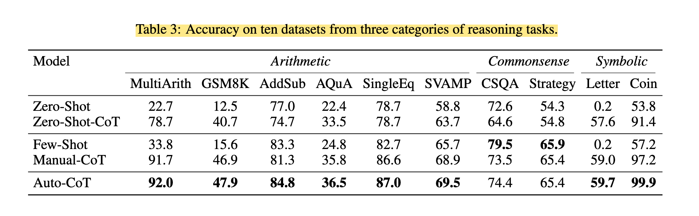

<a href="zotero://open-pdf/library/items/W6D9PYW7?page=NaN">“Overall, Auto-CoT consistently matches or exceeds the performance of the CoT paradigm that requires manual designs of demonstrations.”</a> (<a href="zotero://select/library/items/JCVAAJP5">Zhang et al., 2022, p. 8</a>) 总体而言，Auto-CoT 始终匹配或超过需要手动设计演示的 CoT 范例的性能。

<a href="zotero://open-pdf/library/items/W6D9PYW7?page=NaN">“In contrast, Auto-CoT is more flexible and task-adaptive: every single dataset gets its own demonstrations that are automatically constructed.”</a> (<a href="zotero://select/library/items/JCVAAJP5">Zhang et al., 2022, p. 8</a>) 相比之下，Auto-CoT 更加灵活且具有任务适应性：每个数据集都有自己自动构建的演示。

### <a href="zotero://open-pdf/library/items/W6D9PYW7?page=8">“5.3 Visualization of Question Clustering”</a> (<a href="zotero://select/library/items/JCVAAJP5">Zhang et al., 2022, p. 8</a>)

<a href="zotero://open-pdf/library/items/W6D9PYW7?page=NaN">“Figure 5 visualizes question clustering (with PCA projection) in ten datasets. The illustration indicates that there exist generic patterns, where different patterns may be characterized by questions from different clusters.”</a> (<a href="zotero://select/library/items/JCVAAJP5">Zhang et al., 2022, p. 8</a>) 图 5 可视化了 10 个数据集中的问题聚类（使用 PCA 投影）。该图表明存在通用模式，其中不同的模式可能由来自不同集群的问题来表征。

<a href="zotero://open-pdf/library/items/W6D9PYW7?page=NaN">“Figure 5: Question clustering on ten datasets of reasoning tasks. Stars denote cluster centers.”</a> (<a href="zotero://select/library/items/JCVAAJP5">Zhang et al., 2022, p. 8</a>) 图 5：十个推理任务数据集的问题聚类。星星表示簇中心。

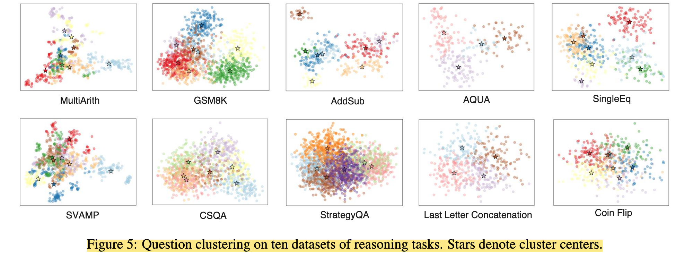

### <a href="zotero://open-pdf/library/items/W6D9PYW7?page=9">“5.4 General Effectiveness Using the Codex LLM”</a> (<a href="zotero://select/library/items/JCVAAJP5">Zhang et al., 2022, p. 9</a>)

<a href="zotero://open-pdf/library/items/W6D9PYW7?page=8">“Table 4: Accuracy using the Codex LLM.”</a> (<a href="zotero://select/library/items/JCVAAJP5">Zhang et al., 2022, p. 8</a>)

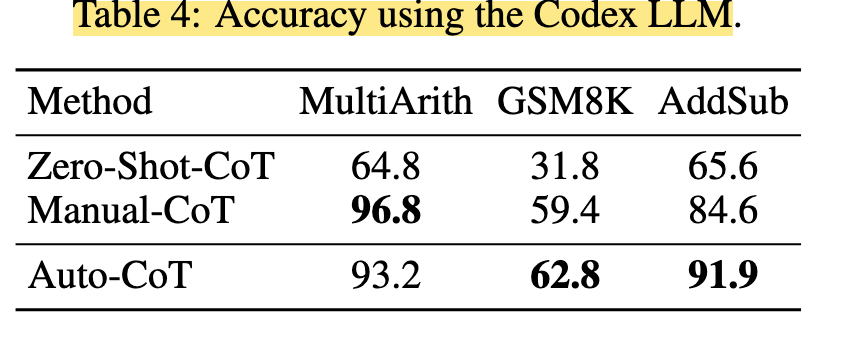

<a href="zotero://open-pdf/library/items/W6D9PYW7?page=NaN">“To evaluate the general effectiveness of Auto-CoT using different LLMs, here we change the LLM to the Codex model [Chen et al., 2021].”</a> (<a href="zotero://select/library/items/JCVAAJP5">Zhang et al., 2022, p. 8</a>) 为了评估使用不同 LLM 的 Auto-CoT 的总体有效性，这里我们将 LLM 更改为 Codex 模型 \[Chen et al., 2021]。

### <a href="zotero://open-pdf/library/items/W6D9PYW7?page=9">“5.5 Effect of Wrong Demonstrations”</a> (<a href="zotero://select/library/items/JCVAAJP5">Zhang et al., 2022, p. 9</a>)

<a href="zotero://open-pdf/library/items/W6D9PYW7?page=NaN">“Figure 6 compares accuracy with varying amounts of wrong demonstrations on MultiArith.”</a> (<a href="zotero://select/library/items/JCVAAJP5">Zhang et al., 2022, p. 9</a>) 图 6 比较了 MultiArith 上不同数量的错误演示的准确性。

<a href="zotero://open-pdf/library/items/W6D9PYW7?page=9">“Figure 6: Effect of wrong demonstrations.”</a> (<a href="zotero://select/library/items/JCVAAJP5">Zhang et al., 2022, p. 9</a>)

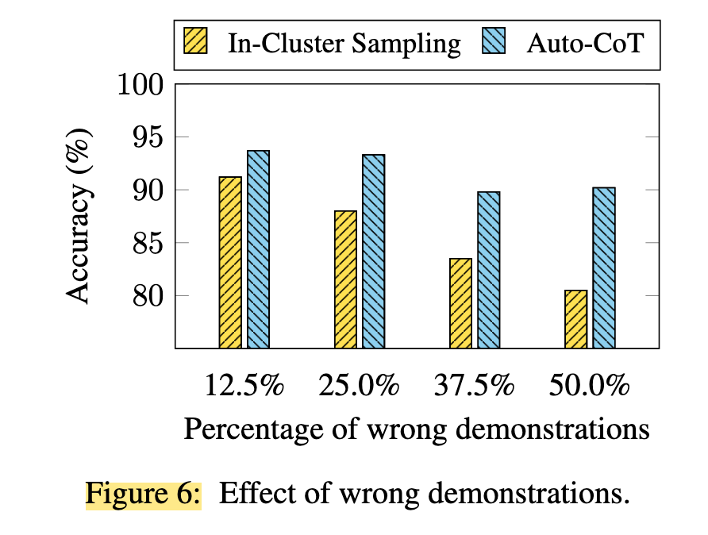

<a href="zotero://open-pdf/library/items/W6D9PYW7?page=NaN">“its performance still does not degrade significantly even when presented with 50% wrong demonstrations.”</a> (<a href="zotero://select/library/items/JCVAAJP5">Zhang et al., 2022, p. 9</a>) 即使出现 50% 错误的演示，其性能仍然不会显着下降。

### <a href="zotero://open-pdf/library/items/W6D9PYW7?page=9">“5.6 More Challenging Streaming Setting”</a> (<a href="zotero://select/library/items/JCVAAJP5">Zhang et al., 2022, p. 9</a>)

## <a href="zotero://open-pdf/library/items/W6D9PYW7?page=9">“6 Conclusion”</a> (<a href="zotero://select/library/items/JCVAAJP5">Zhang et al., 2022, p. 9</a>)

<a href="zotero://open-pdf/library/items/W6D9PYW7?page=NaN">“LLMs have shown reasoning capabilities with CoT prompting. The superior performance of Manual-CoT hinges on the hand-crafting of demonstrations. To eliminate such manual designs, we proposed Auto-CoT to automatically construct demonstrations. It samples questions with diversity and generates reasoning chains to construct demonstrations. Experimental results on ten public benchmark reasoning datasets showed that with GPT-3, Auto-CoT consistently matches or exceeds the performance of the CoT paradigm that requires manual designs of demonstrations.”</a> (<a href="zotero://select/library/items/JCVAAJP5">Zhang et al., 2022, p. 9</a>) LLM在 CoT 提示下表现出了推理能力。 Manual-CoT 的卓越性能取决于演示的手工制作。为了消除这种手动设计，我们提出了 Auto-CoT 来自动构建演示。它对多样性的问题进行采样，并生成推理链来构建演示。在十个公共基准推理数据集上的实验结果表明，使用 GPT-3，Auto-CoT 始终匹配或超过需要手动设计演示的 CoT 范式的性能。
