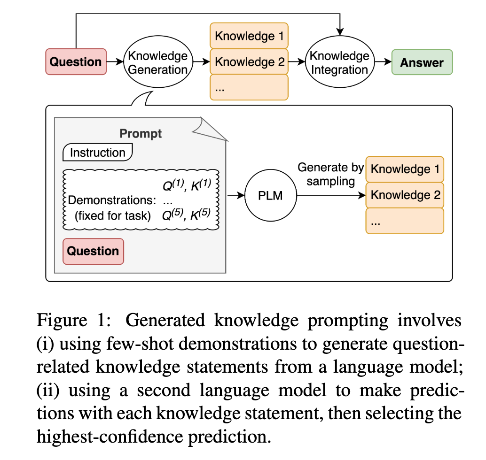

# <a href="zotero://open-pdf/library/items/YDLKSFWK?page=1">“Generated Knowledge Prompting for Commonsense Reasoning”</a> (<a href="zotero://select/library/items/DI4WENXJ">Liu et al., 2022, p. 1</a>)

Comment: ACL 2022 main conference

Referred in <a href="zotero://note/u/LJSU8E3B/?ignore=1&#x26;line=14" rel="noopener noreferrer nofollow" zhref="zotero://note/u/LJSU8E3B/?ignore=1&#x26;line=14" ztype="znotelink" class="internal-link">LLM</a>

## <a href="zotero://open-pdf/library/items/YDLKSFWK?page=1">“Abstract”</a> (<a href="zotero://select/library/items/DI4WENXJ">Liu et al., 2022, p. 1</a>)

<a href="zotero://open-pdf/library/items/YDLKSFWK?page=NaN">“It remains an open question whether incorporating external knowledge benefits commonsense reasoning while maintaining the flexibility of pretrained sequence models.”</a> (<a href="zotero://select/library/items/DI4WENXJ">Liu et al., 2022, p. 1</a>) 结合外部知识是否有利于常识推理，同时保持预训练序列模型的灵活性，这仍然是一个悬而未决的问题。

<a href="zotero://open-pdf/library/items/YDLKSFWK?page=1">“generated knowledge prompting,”</a> (<a href="zotero://select/library/items/DI4WENXJ">Liu et al., 2022, p. 1</a>)

*   <a href="zotero://open-pdf/library/items/YDLKSFWK?page=1">“consists of generating knowledge from a language model, then providing the knowledge as additional input when answering a question.”</a>

    (<a href="zotero://select/library/items/DI4WENXJ">Liu et al., 2022, p. 1</a>)

    包括从语言模型生成知识，然后在回答问题时提供知识作为附加输入。

<a href="zotero://open-pdf/library/items/YDLKSFWK?page=NaN">“Our method does not require task-specific supervision for knowledge integration, or access to a structured knowledge base, yet it improves performance of large-scale, state-of-the-art models on four commonsense reasoning tasks, achieving state-of-the-art results on numerical commonsense (NumerSense), general commonsense (CommonsenseQA 2.0), and scientific commonsense (QASC) benchmarks.”</a> (<a href="zotero://select/library/items/DI4WENXJ">Liu et al., 2022, p. 1</a>) 我们的方法不需要针对特定​​任务的知识整合监督，也不需要访问结构化知识库，但它提高了大规模、最先进模型在四个常识推理任务上的性能，实现了最先进的- 数值常识 (NumerSense)、一般常识 (CommonsenseQA 2.0) 和科学常识 (QASC) 基准的艺术结果。

<a href="zotero://open-pdf/library/items/YDLKSFWK?page=1">“Generated knowledge prompting highlights largescale language models as flexible sources of external knowledge for improving commonsense reasoning.”</a> (<a href="zotero://select/library/items/DI4WENXJ">Liu et al., 2022, p. 1</a>) 生成的知识提示强调大规模语言模型作为外部知识的灵活来源，以改善常识推理。

## <a href="zotero://open-pdf/library/items/YDLKSFWK?page=1">“1 Introduction”</a> (<a href="zotero://select/library/items/DI4WENXJ">Liu et al., 2022, p. 1</a>)

<a href="zotero://open-pdf/library/items/YDLKSFWK?page=NaN">“On one hand, a substantial body of prior work has reported that integrating external knowledge can help improve task performance (Mitra et al., 2019; Bian et al., 2021, inter alia), especially if the knowledge is high quality (e.g. hand-crafted by experts).”</a> (<a href="zotero://select/library/items/DI4WENXJ">Liu et al., 2022, p. 1</a>) 一方面，大量先前的工作表明，整合外部知识有助于提高任务绩效（Mitra 等人，2019 年；Bian 等人，2021 年等），特别是如果知识质量很高（例如手工操作） - 由专家精心制作）。

<a href="zotero://open-pdf/library/items/YDLKSFWK?page=NaN">“On the other hand, recent leaderboards are often dominated by large-scale pretrained models that are fine-tuned on a target benchmark (Khashabi et al., 2020; Lourie et al., 2021), suggesting that the benefits of external knowledge may wash away as the underlying models increase in size and are pretrained on ever larger amounts of raw text.”</a> (<a href="zotero://select/library/items/DI4WENXJ">Liu et al., 2022, p. 1</a>) 另一方面，最近的排行榜通常由大规模预训练模型主导，这些模型在目标基准上进行微调（Khashabi 等人，2020 年；Lourie 等人，2021 年），这表明外部知识的好处可能会消失随着底层模型尺寸的增加并且对越来越多的原始文本进行预训练，这种情况就会消失。

<a href="zotero://open-pdf/library/items/YDLKSFWK?page=NaN">“many benchmarks currently lack appropriate knowledge bases with sufficient coverage.”</a> (<a href="zotero://select/library/items/DI4WENXJ">Liu et al., 2022, p. 1</a>) 许多基准目前缺乏足够覆盖范围的适当知识库。

<a href="zotero://open-pdf/library/items/YDLKSFWK?page=NaN">“To facilitate easier adaptation with any zero-shot or finetuned models, we propose an approach that does not require access to a structured knowledge base or joint finetuning for knowledge integration.”</a> (<a href="zotero://select/library/items/DI4WENXJ">Liu et al., 2022, p. 1</a>) 为了更容易地适应任何零样本或微调模型，我们提出了一种不需要访问结构化知识库或进行知识集成联合微调的方法。

