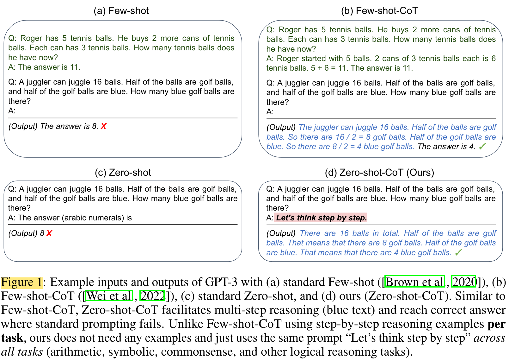
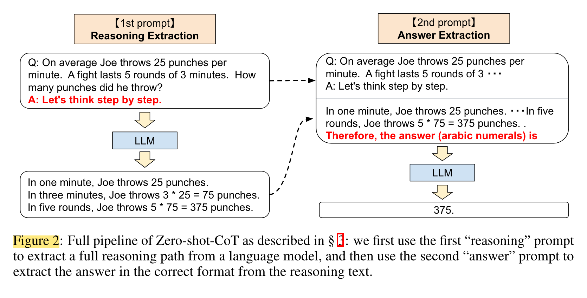
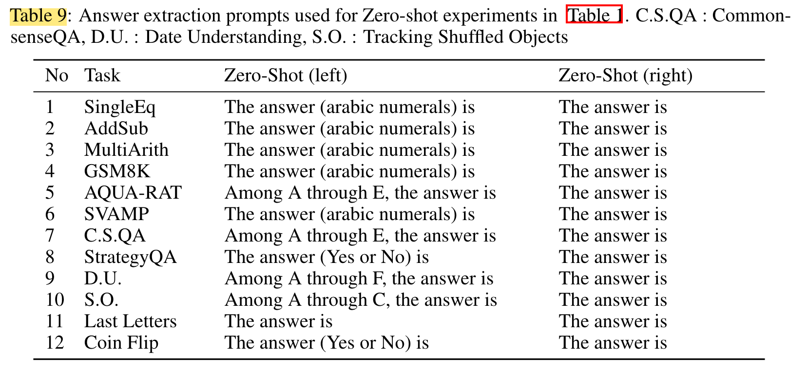
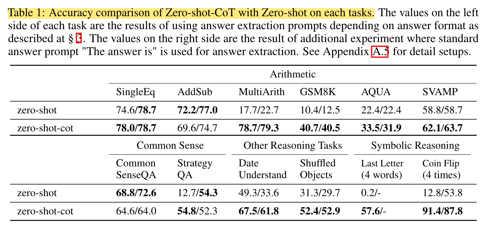
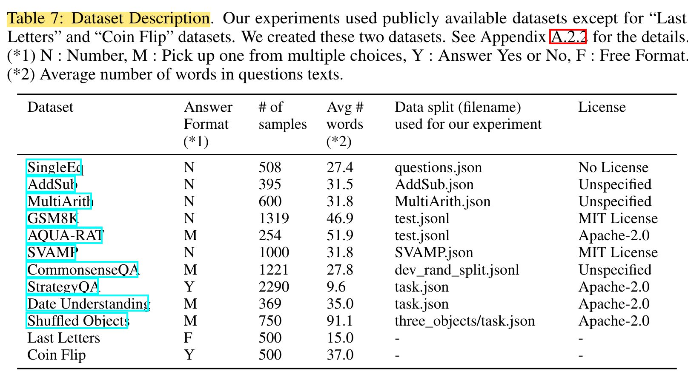
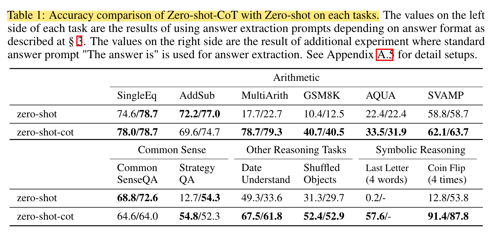
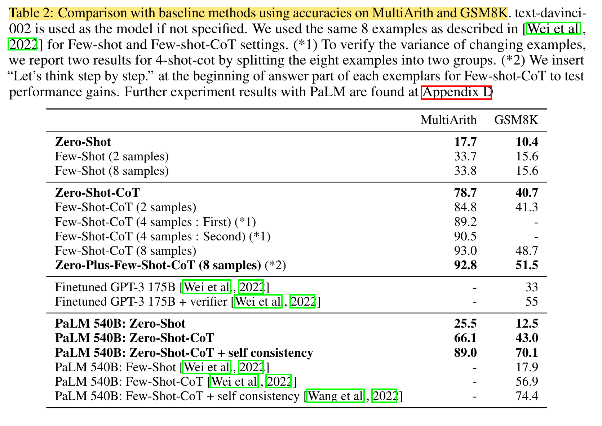
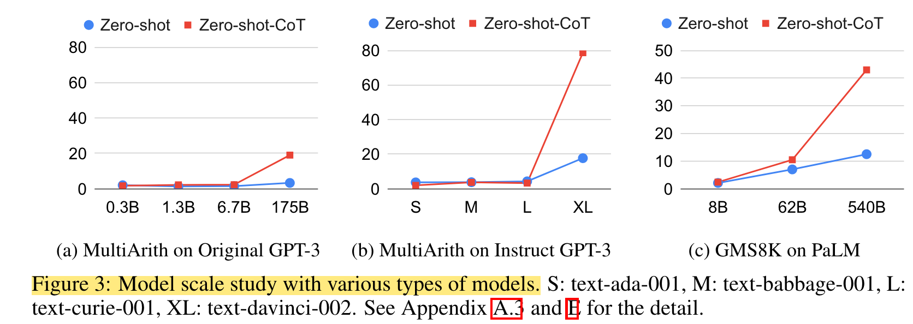
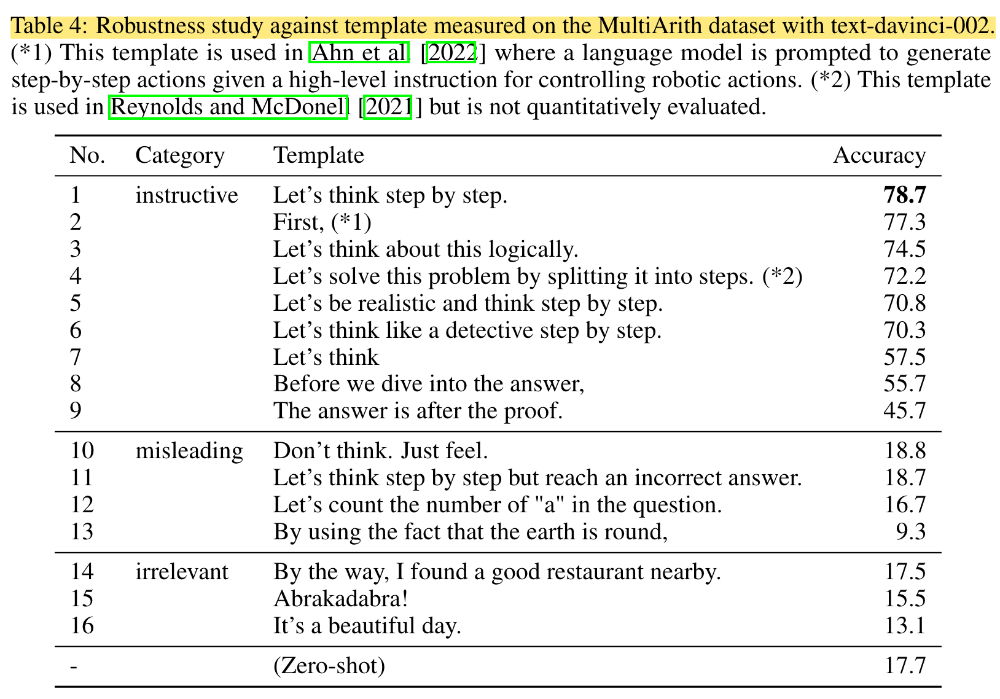
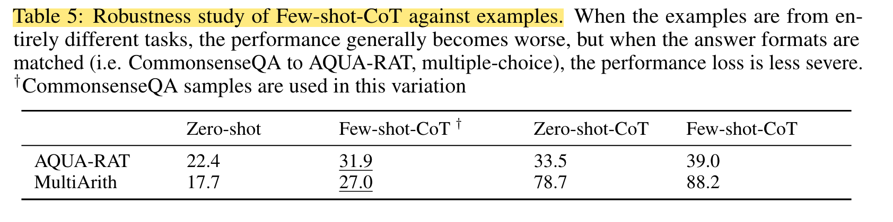

# <a href="zotero://open-pdf/library/items/5VTFEYFG?page=1">“Large Language Models are Zero-Shot Reasoners”</a> (<a href="zotero://select/library/items/DM8EIESR">Kojima et al., 2023, p. 1</a>)

Comment: Accepted to NeurIPS2022. Our code is available at https\://github.com/kojima-takeshi188/zero\_shot\_cot

Referred in <a href="zotero://note/u/LJSU8E3B/?ignore=1&#x26;line=7" rel="noopener noreferrer nofollow" zhref="zotero://note/u/LJSU8E3B/?ignore=1&#x26;line=7" ztype="znotelink" class="internal-link">LLM</a>

## <a href="zotero://open-pdf/library/items/5VTFEYFG?page=1">“Abstract”</a> (<a href="zotero://select/library/items/DM8EIESR">Kojima et al., 2023, p. 1</a>)

<a href="zotero://open-pdf/library/items/5VTFEYFG?page=NaN">“Pretrained large language models (LLMs) are widely used in many sub-fields of natural language processing (NLP) and generally known as excellent few-shot learners with task-specific exemplars.”</a> (<a href="zotero://select/library/items/DM8EIESR">Kojima et al., 2023, p. 1</a>) 预训练的大语言模型（LLM）广泛应用于自然语言处理（NLP）的许多子领域，通常被称为具有特定任务样本的优秀小样本学习器。

<a href="zotero://open-pdf/library/items/5VTFEYFG?page=NaN">“we show that LLMs are decent zero-shot reasoners by simply adding “Let’s think step by step” before each answer.”</a> (<a href="zotero://select/library/items/DM8EIESR">Kojima et al., 2023, p. 1</a>) 我们通过在每个答案前简单地添加“让我们一步一步思考”来证明法学硕士是不错的零样本推理者。

## <a href="zotero://open-pdf/library/items/5VTFEYFG?page=1">“1 Introduction”</a> (<a href="zotero://select/library/items/DM8EIESR">Kojima et al., 2023, p. 1</a>)

<a href="zotero://open-pdf/library/items/5VTFEYFG?page=NaN">“The success of large language models (LLMs) is often attributed to (in-context) few-shot or zero-shot learning.”</a> (<a href="zotero://select/library/items/DM8EIESR">Kojima et al., 2023, p. 1</a>) 大型语言模型 (LLM) 的成功通常归因于（在上下文中）小样本或零样本学习。

<a href="zotero://open-pdf/library/items/5VTFEYFG?page=1">“It can solve various tasks by simply conditioning the models on a few examples (few-shot) or instructions describing the task (zero-shot).”</a> (<a href="zotero://select/library/items/DM8EIESR">Kojima et al., 2023, p. 1</a>) 它可以通过仅仅根据少量示例（few-shot）或描述任务的指令（zero-shot），来解决各种任务。

<a href="zotero://open-pdf/library/items/5VTFEYFG?page=NaN">“The method of conditioning the language model is called “prompting” [Liu et al., 2021b], and designing prompts either manually [Schick and Schütze, 2021, Reynolds and McDonell, 2021] or automatically [Gao et al., 2021, Shin et al., 2020] has become a hot topic in NLP.”</a> (<a href="zotero://select/library/items/DM8EIESR">Kojima et al., 2023, p. 1</a>) 调节语言模型的方法称为“提示”\[Liu et al., 2021b]，并且可以手动设计提示\[Schick and Schütze, 2021, Reynolds and McDonell, 2021]或自动设计提示\[Gao et al., 2021, Shin et al., 2020]已成为NLP领域的热门话题。

<a href="zotero://open-pdf/library/items/5VTFEYFG?page=NaN">“In contrast to the excellent performance of LLMs in intuitive and single-step system-1 [Stanovich and West, 2000] tasks with task-specific few-shot or zero-shot prompting [Liu et al., 2021b], even language models at the scale of 100B or more parameters had struggled on system-2 tasks requiring slow and multi-step reasoning [Rae et al., 2021].”</a> (<a href="zotero://select/library/items/DM8EIESR">Kojima et al., 2023, p. 2</a>) 与LLM在直观和单步系统 1 \[Stanovich 和 West, 2000] 任务中的出色表现相比，具有特定任务的少样本或零样本提示 \[Liu et al., 2021b]，甚至语言模型100B 或更多参数的规模在需要缓慢且多步骤推理的 system-2 任务上遇到了困难 \[Rae et al., 2021]。

<a href="zotero://open-pdf/library/items/5VTFEYFG?page=2">“chain of thought prompting (CoT)”</a> (<a href="zotero://select/library/items/DM8EIESR">Kojima et al., 2023, p. 2</a>)

<a href="zotero://open-pdf/library/items/5VTFEYFG?page=NaN">“Such chain of thought demonstrations facilitate models to generate a reasoning path that decomposes the complex reasoning into multiple easier steps.”</a> (<a href="zotero://select/library/items/DM8EIESR">Kojima et al., 2023, p. 2</a>) 这种思想链演示有助于模型生成推理路径，将复杂的推理分解为多个更简单的步骤。

<a href="zotero://open-pdf/library/items/5VTFEYFG?page=NaN">“Notably with CoT, the reasoning performance then satisfies the scaling laws better and jumps up with the size of the language models”</a> (<a href="zotero://select/library/items/DM8EIESR">Kojima et al., 2023, p. 2</a>) 值得注意的是，使用 CoT，推理性能可以更好地满足缩放定律，并随着语言模型的大小而跳跃

<a href="zotero://open-pdf/library/items/5VTFEYFG?page=NaN">“we show that LLMs are decent zero-shot reasoners by adding a simple prompt, Let’s think step by step, to facilitate step-by-step thinking before answering each question (see Figure 1).”</a> (<a href="zotero://select/library/items/DM8EIESR">Kojima et al., 2023, p. 2</a>) 我们通过添加一个简单的提示“让我们一步一步思考”来证明LLM是不错的零样本推理机，以促进在回答每个问题之前逐步思考（见图 1）。

<a href="zotero://open-pdf/library/items/5VTFEYFG?page=2">“Figure 1”</a> (<a href="zotero://select/library/items/DM8EIESR">Kojima et al., 2023, p. 2</a>)

<a href="zotero://open-pdf/library/items/5VTFEYFG?page=NaN">“Despite the simplicity, our Zero-shot-CoT successfully generates a plausible reasoning path in a zero-shot manner and reaches the correct answer in a problem where the standard zero-shot approach fails.”</a> (<a href="zotero://select/library/items/DM8EIESR">Kojima et al., 2023, p. 2</a>) 尽管很简单，但我们的零样本 CoT 成功地以零样本方式生成了一条合理的推理路径，并在标准零样本方法失败的问题中得出了正确答案。

<a href="zotero://open-pdf/library/items/5VTFEYFG?page=NaN">“Importantly, our Zero-shot-CoT is versatile and task-agnostic, unlike most prior task-specific prompt engineering in the forms of examples (few-shot) or templates (zero-shot)”</a> (<a href="zotero://select/library/items/DM8EIESR">Kojima et al., 2023, p. 2</a>) 重要的是，我们的零样本 CoT 是多功能且与任务无关的，与大多数先前以示例（少样本）或模板（零样本）形式呈现的特定于任务的提示工程不同

<a href="zotero://open-pdf/library/items/5VTFEYFG?page=NaN">“it can facilitate step-by-step answers across various reasoning tasks”</a> (<a href="zotero://select/library/items/DM8EIESR">Kojima et al., 2023, p. 2</a>) 它可以促进各种推理任务的逐步答案，包括：

*   <a href="zotero://open-pdf/library/items/5VTFEYFG?page=NaN">“arithmetic”</a>

    (<a href="zotero://select/library/items/DM8EIESR">Kojima et al., 2023, p. 2</a>)

    算术

*   <a href="zotero://open-pdf/library/items/5VTFEYFG?page=NaN">“symbolic reasoning”</a>

    (<a href="zotero://select/library/items/DM8EIESR">Kojima et al., 2023, p. 2</a>)

    符号推理

*   <a href="zotero://open-pdf/library/items/5VTFEYFG?page=NaN">“commonsense reasoning”</a>

    (<a href="zotero://select/library/items/DM8EIESR">Kojima et al., 2023, p. 2</a>)

    常识推理

*   <a href="zotero://open-pdf/library/items/5VTFEYFG?page=NaN">“other logical reasoning tasks”</a>

    (<a href="zotero://select/library/items/DM8EIESR">Kojima et al., 2023, p. 2</a>)

    其他逻辑推理任务

<a href="zotero://open-pdf/library/items/5VTFEYFG?page=NaN">“without modifying the prompt per task”</a> (<a href="zotero://select/library/items/DM8EIESR">Kojima et al., 2023, p. 2</a>) 无需修改每个任务的提示

<a href="zotero://open-pdf/library/items/5VTFEYFG?page=NaN">“We empirically evaluate Zero-shot-CoT against other prompting baselines in Table 2.”</a> (<a href="zotero://select/library/items/DM8EIESR">Kojima et al., 2023, p. 2</a>) 我们根据表 2 中的其他提示基线对 Zero-shot-CoT 进行实证评估。

<a href="zotero://open-pdf/library/items/5VTFEYFG?page=NaN">“While our Zero-shot-CoT underperforms Few-shot-CoT with carefully-crafted and task-specific step-by-step examples, Zero-shot-CoT achieves enormous score gains compared to the zero-shot baseline, e.g. from 17.7% to 78.7% on MultiArith and from 10.4% to 40.7% on GSM8K with large-scale InstructGPT model (text-davinci-002)”</a> (<a href="zotero://select/library/items/DM8EIESR">Kojima et al., 2023, p. 2</a>) 虽然我们的 Zero-shot-CoT 在精心设计和特定于任务的分步示例中表现不佳于 Few-shot-CoT，但与零样本基线相比，Zero-shot-CoT 实现了巨大的分数增益，例如使用大规模 InstructGPT 模型 (text-davinci-002)，MultiArith 上的性能从 17.7% 提高到 78.7%，GSM8K 上的性能从 10.4% 提高到 40.7%

<a href="zotero://open-pdf/library/items/5VTFEYFG?page=NaN">“We also evaluate Zero-shot-CoT with another off-the-shelf large model, 540B parameter PaLM, showing similar magnitudes of improvements on MultiArith and GSM8K.”</a> (<a href="zotero://select/library/items/DM8EIESR">Kojima et al., 2023, p. 2</a>) 我们还使用另一个现成的大型模型 540B 参数 PaLM 来评估 Zero-shot-CoT，在 MultiArith 和 GSM8K 上显示出类似的改进幅度。

<a href="zotero://open-pdf/library/items/5VTFEYFG?page=NaN">“Importantly, with our single fixed prompt, zero-shot LLMs have a significantly better scaling curve comparable to that of the few-shot CoT baseline.”</a> (<a href="zotero://select/library/items/DM8EIESR">Kojima et al., 2023, p. 2</a>) 重要的是，通过我们的单一固定提示，零样本 LLM 具有与少样本 CoT 基线相比明显更好的缩放曲线。

<a href="zotero://open-pdf/library/items/5VTFEYFG?page=NaN">“We also show that besides Few-shot-CoT requiring human engineering of multi-step reasoning prompts, their performance deteriorates if prompt example question types and task question type are unmatched, suggesting high sensitivity to per-task prompt designs.”</a> (<a href="zotero://select/library/items/DM8EIESR">Kojima et al., 2023, p. 2</a>) 我们还表明，除了 Few-shot-CoT 需要多步骤推理提示的人工设计之外，如果提示示例问题类型和任务问题类型不匹配，它们的性能也会下降，这表明对每个任务提示设计的高度敏感。

<a href="zotero://open-pdf/library/items/5VTFEYFG?page=NaN">“n contrast, the versatility of this single prompt across diverse reasoning tasks hints at untapped and understudied zero-shot fundamental capabilities of LLMs, such as higher-level broad cognitive capabilities like generic logical reasoning [Chollet, 2019].”</a> (<a href="zotero://select/library/items/DM8EIESR">Kojima et al., 2023, p. 2</a>) 相比之下，这种单一提示在不同推理任务中的多功能性暗示了LLM尚未开发和研究的零样本基本能力，例如通用逻辑推理等更高级别的广泛认知能力\[Chollet，2019]。

<a href="zotero://open-pdf/library/items/5VTFEYFG?page=NaN">“While the vibrant field of LLMs started out from the premise of excellent few-shot learners [Brown et al., 2020], we hope our work encourages more research into uncovering high-level and multi-task zero-shot capabilities hidden inside those models.”</a> (<a href="zotero://select/library/items/DM8EIESR">Kojima et al., 2023, p. 2</a>) 虽然LLM领域最初是基于出色的少样本学习者的前提开始的\[布朗等人，2020]，但我们希望我们的工作能够鼓励更多研究来揭示这些模型中隐藏的高级和多任务零样本能力。

## <a href="zotero://open-pdf/library/items/5VTFEYFG?page=3">“2 Background”</a> (<a href="zotero://select/library/items/DM8EIESR">Kojima et al., 2023, p. 3</a>)

<a href="zotero://open-pdf/library/items/5VTFEYFG?page=NaN">“We briefly review the two core preliminary concepts that form the basis of this work: the advent of large language models (LLMs) and prompting, and chain of thought (CoT) prompting for multi-step reasoning.”</a> (<a href="zotero://select/library/items/DM8EIESR">Kojima et al., 2023, p. 2</a>) 我们简要回顾了构成这项工作基础的两个核心初步概念：大型语言模型（LLM）和提示的出现，以及多步骤推理的思想链（CoT）提示。

## <a href="zotero://open-pdf/library/items/5VTFEYFG?page=3">“3 Zero-shot Chain of Thought”</a> (<a href="zotero://select/library/items/DM8EIESR">Kojima et al., 2023, p. 3</a>)

<a href="zotero://open-pdf/library/items/5VTFEYFG?page=NaN">“does not require step-by-step few-shot examples”</a> (<a href="zotero://select/library/items/DM8EIESR">Kojima et al., 2023, p. 3</a>) 不需要逐步的少量示例

<a href="zotero://open-pdf/library/items/5VTFEYFG?page=NaN">“it is inherently task-agnostic and elicits multi-hop reasoning across a wide range of tasks with a single template”</a> (<a href="zotero://select/library/items/DM8EIESR">Kojima et al., 2023, p. 3</a>) 它本质上是与任务无关的，并且可以使用单个模板在各种任务中引发多跳推理

### <a href="zotero://open-pdf/library/items/5VTFEYFG?page=3">“3.1 Two-stage prompting”</a> (<a href="zotero://select/library/items/DM8EIESR">Kojima et al., 2023, p. 3</a>)

<a href="zotero://open-pdf/library/items/5VTFEYFG?page=NaN">“While Zero-shot-CoT is conceptually simple, it uses prompting twice to extract both reasoning and answer, as explained in Figure 2.”</a> (<a href="zotero://select/library/items/DM8EIESR">Kojima et al., 2023, p. 3</a>) 虽然 Zero-shot-CoT 在概念上很简单，但它使用两次提示来提取推理和答案，如图 2 所示。

<a href="zotero://open-pdf/library/items/5VTFEYFG?page=4">“Figure 2”</a> (<a href="zotero://select/library/items/DM8EIESR">Kojima et al., 2023, p. 4</a>)

<a href="zotero://open-pdf/library/items/5VTFEYFG?page=3">“zero-shot baseline”</a> (<a href="zotero://select/library/items/DM8EIESR">Kojima et al., 2023, p. 3</a>)

<a href="zotero://open-pdf/library/items/5VTFEYFG?page=NaN">“uses prompting in the form of “The answer is”, to extract the answers in correct formats.”</a> (<a href="zotero://select/library/items/DM8EIESR">Kojima et al., 2023, p. 3</a>) 使用“答案是”形式的提示，以正确的格式提取答案。

<a href="zotero://open-pdf/library/items/5VTFEYFG?page=3">“Few-shot prompting, standard or CoT”</a> (<a href="zotero://select/library/items/DM8EIESR">Kojima et al., 2023, p. 3</a>)

<a href="zotero://open-pdf/library/items/5VTFEYFG?page=NaN">“avoids needing such answer-extraction prompting by explicitly designing the few-shot example answers to end in such formats”</a> (<a href="zotero://select/library/items/DM8EIESR">Kojima et al., 2023, p. 3</a>) 通过明确设计以此类格式结尾的少数示例答案，避免需要此类答案提取提示

<a href="zotero://open-pdf/library/items/5VTFEYFG?page=4">“In summary, Few-shot-CoT [Wei et al., 2022] requires careful human engineering of a few prompt examples with specific answer formats per task, while Zero-shot-CoT requires less engineering but requires prompting LLMs twice.”</a> (<a href="zotero://select/library/items/DM8EIESR">Kojima et al., 2023, p. 4</a>) 总结一下，Few-shot-CoT \[Wei et al., 2022] 需要对每个任务进行仔细的人工设计，提供几个具有特定答案格式的提示示例；而Zero-shot-CoT则需要较少的设计工作，但需要两次提示语言模型。

<a href="zotero://open-pdf/library/items/5VTFEYFG?page=4">“<strong>1st prompt: reasoning extraction</strong>”</a> (<a href="zotero://select/library/items/DM8EIESR">Kojima et al., 2023, p. 4</a>)

<a href="zotero://open-pdf/library/items/5VTFEYFG?page=NaN">“In this step we first modify the input question x into a prompt x′ using a simple template “Q: [X]. A: [T]”, where [X] is an input slot for x and [T] is an slot for hand-crafted trigger sentence t that would extract chain of though to answer the question x.”</a> (<a href="zotero://select/library/items/DM8EIESR">Kojima et al., 2023, p. 4</a>) 在这一步中，我们首先使用简单的模板“Q：\[X].  A: \[T]”，其中 \[X] 是 x 的输入槽，\[T] 是手工制作的触发句子 t 的槽，它将提取“chain of though” (Kojima et al., 2023, p. 4)来回答问题 x

<a href="zotero://open-pdf/library/items/5VTFEYFG?page=NaN">“Prompted text x′ is then fed into a language model and generate subsequent sentence z. We can use any decoding strategy, but we used greedy decoding throughout the paper for the simplicity.”</a> (<a href="zotero://select/library/items/DM8EIESR">Kojima et al., 2023, p. 4</a>) 然后将提示文本 x′ 输入到语言模型中并生成后续句子 z。我们可以使用任何解码策略，但为了简单起见，我们在整篇论文中使用了贪婪解码。

<a href="zotero://open-pdf/library/items/5VTFEYFG?page=4">“<strong>2nd prompt: answer extraction</strong>”</a> (<a href="zotero://select/library/items/DM8EIESR">Kojima et al., 2023, p. 4</a>)

<a href="zotero://open-pdf/library/items/5VTFEYFG?page=NaN">“n the second step, we use generated sentence z along with prompted sentence x′ to extract the final answer from the language model.”</a> (<a href="zotero://select/library/items/DM8EIESR">Kojima et al., 2023, p. 4</a>) 在第二步中，我们使用生成的句子 z 和提示句子 x′ 从语言模型中提取最终答案。

<a href="zotero://open-pdf/library/items/5VTFEYFG?page=NaN">“To be concrete, we simply concatenate three elements as with “[X′] [Z] [A]”: [X′] for 1st prompt x′, [Z] for sentence z generated at the first step, and [A] for a trigger sentence to extract answer.”</a> (<a href="zotero://select/library/items/DM8EIESR">Kojima et al., 2023, p. 4</a>) 具体来说，我们简单地连接三个元素，如“\[X′] \[Z] \[A]”：\[X′]代表第一个提示x′，\[Z]代表第一步生成的句子z，\[A]用于提取答案的触发句子。

<a href="zotero://open-pdf/library/items/5VTFEYFG?page=NaN">“The prompt for this step is self-augmented, since the prompt contains the sentence z generated by the same language model.”</a> (<a href="zotero://select/library/items/DM8EIESR">Kojima et al., 2023, p. 4</a>) 此步骤的提示是自我增强的，因为提示包含由同一语言模型生成的句子 z。

<a href="zotero://open-pdf/library/items/5VTFEYFG?page=NaN">“In experiment, we use slightly different answer trigger depending on the answer format. For example, we use “Therefore, among A through E, the answer is” for multi-choice QA, and “Therefore, the answer (arabic numerals) is” for math problem requiring numerical answer.”</a> (<a href="zotero://select/library/items/DM8EIESR">Kojima et al., 2023, p. 4</a>) 在实验中，我们根据答案格式使用略有不同的答案触发器。例如，对于多选问答，我们使用“因此，在 A 到 E 中，答案是”，对于需要数字答案的数学问题，我们使用“因此，答案（阿拉伯数字）是”。

<a href="zotero://open-pdf/library/items/5VTFEYFG?page=NaN">“Table 9: Answer extraction prompts used for Zero-shot experiments in Table 1.”</a> (<a href="zotero://select/library/items/DM8EIESR">Kojima et al., 2023, p. 17</a>) 表 9：表 1 中用于零样本实验的答案提取提示。

<a href="zotero://open-pdf/library/items/5VTFEYFG?page=NaN">“Table 1: Accuracy comparison of Zero-shot-CoT with Zero-shot on each tasks.”</a> (<a href="zotero://select/library/items/DM8EIESR">Kojima et al., 2023</a>) 表 1：零样本 CoT 与零样本在每个任务上的准确度比较。

## <a href="zotero://open-pdf/library/items/5VTFEYFG?page=4">“4 Experiment”</a> (<a href="zotero://select/library/items/DM8EIESR">Kojima et al., 2023, p. 4</a>)

<a href="zotero://open-pdf/library/items/5VTFEYFG?page=4">“<strong>Tasks and datasets</strong>”</a> (<a href="zotero://select/library/items/DM8EIESR">Kojima et al., 2023, p. 4</a>)

<a href="zotero://open-pdf/library/items/5VTFEYFG?page=NaN">“Table 7 summarizes the description of each dataset used in our experiment.”</a> (<a href="zotero://select/library/items/DM8EIESR">Kojima et al., 2023</a>) 表 7 总结了我们实验中使用的每个数据集的描述。

<a href="zotero://open-pdf/library/items/5VTFEYFG?page=NaN">“Table 7: Dataset Description”</a> (<a href="zotero://select/library/items/DM8EIESR">Kojima et al., 2023, p. 16</a>) 表 7：数据集描述

\--前六个是<a href="zotero://open-pdf/library/items/5VTFEYFG?page=NaN">“arithmetic reasoning”</a> (<a href="zotero://select/library/items/DM8EIESR">Kojima et al., 2023, p. 4</a>) 算术推理

\--第七八个是commonsense reasoning” (<a href="zotero://select/library/items/DM8EIESR">Kojima et al., 2023, p. 4</a>) 常识推理

\--最后两个是<a href="zotero://open-pdf/library/items/5VTFEYFG?page=NaN">“symbolic reasoning”</a> (<a href="zotero://select/library/items/DM8EIESR">Kojima et al., 2023, p. 4</a>) 符号推理

\--代数三四个是<a href="zotero://open-pdf/library/items/5VTFEYFG?page=NaN">“other logical reasoning tasks”</a> (<a href="zotero://select/library/items/DM8EIESR">Kojima et al., 2023, p. 4</a>) 其他逻辑推理任务

<a href="zotero://open-pdf/library/items/5VTFEYFG?page=5">“<strong>Models</strong>”</a> (<a href="zotero://select/library/items/DM8EIESR">Kojima et al., 2023, p. 5</a>)

<a href="zotero://open-pdf/library/items/5VTFEYFG?page=5"><strong>“Baselines”</strong></a> (<a href="zotero://select/library/items/DM8EIESR">Kojima et al., 2023, p. 5</a>)

<a href="zotero://open-pdf/library/items/5VTFEYFG?page=NaN">“We compare our Zero-shot-CoT mainly to standard Zero-shot prompting to verify the effectiveness of its chain of thought reasoning.”</a> (<a href="zotero://select/library/items/DM8EIESR">Kojima et al., 2023, p. 5</a>) 我们主要将零样本CoT与标准零样本提示进行比较，以验证其思维链推理的有效性。

<a href="zotero://open-pdf/library/items/5VTFEYFG?page=NaN">“For Zero-shot experiments, similar answer prompts as Zero-shot-CoT are used as default.”</a> (<a href="zotero://select/library/items/DM8EIESR">Kojima et al., 2023, p. 5</a>) 对于零样本实验，默认使用与零样本 CoT 类似的答案提示。

<a href="zotero://open-pdf/library/items/5VTFEYFG?page=NaN">“we also compare our method to Few-shot and Few-shot-CoT baselines from [Wei et al., 2022], using the same in-context examples”</a> (<a href="zotero://select/library/items/DM8EIESR">Kojima et al., 2023, p. 5</a>) 我们还使用相同的上下文示例将我们的方法与 \[Wei et al., 2022] 中的 Few-shot 和 Few-shot-CoT 基线进行比较

<a href="zotero://open-pdf/library/items/5VTFEYFG?page=5"><strong>“Answer cleansing”</strong></a> (<a href="zotero://select/library/items/DM8EIESR">Kojima et al., 2023, p. 5</a>)

<a href="zotero://open-pdf/library/items/5VTFEYFG?page=NaN">“After the model outputs a text by answer extraction (see § 3 and Figure 2), our method picks up only the part of the answer text that first satisfies the answer format.”</a> (<a href="zotero://select/library/items/DM8EIESR">Kojima et al., 2023, p. 5</a>) 模型通过答案提取输出文本后（参见第 3 节和图 2），我们的方法仅选取答案文本中首先满足答案格式的部分。

### <a href="zotero://open-pdf/library/items/5VTFEYFG?page=5">“4.1 Results”</a> (<a href="zotero://select/library/items/DM8EIESR">Kojima et al., 2023, p. 5</a>)

<a href="zotero://open-pdf/library/items/5VTFEYFG?page=5"><strong>“Zero-shot-CoT vs. Zero-shot</strong>”</a> (<a href="zotero://select/library/items/DM8EIESR">Kojima et al., 2023, p. 5</a>)

<a href="zotero://open-pdf/library/items/5VTFEYFG?page=6">“Table 1: Accuracy comparison of Zero-shot-CoT with Zero-shot on each tasks.”</a> (<a href="zotero://select/library/items/DM8EIESR">Kojima et al., 2023, p. 6</a>)

<a href="zotero://open-pdf/library/items/5VTFEYFG?page=NaN">“Our method gives on-par performances for the remaining two arithmetic reasoning tasks (SingleEq and AddSub), which is expected since they do not require multi-step reasoning.”</a> (<a href="zotero://select/library/items/DM8EIESR">Kojima et al., 2023, p. 6</a>) 我们的方法为其余两个算术推理任务（SingleEq 和 AddSub）提供了同等的性能，这是预期的，因为它们不需要多步推理。

<a href="zotero://open-pdf/library/items/5VTFEYFG?page=NaN">“In commonsense reasoning tasks, Zero-shot-CoT does not provide performance gains. It is expected as Wei et al. [2022] also reports that even Few-shot-CoT does not provide performance gains on Lambda (135B), but does improve StrategyQA when combined with substantially larger PaLM (540B) model, which may also apply for ours.”</a> (<a href="zotero://select/library/items/DM8EIESR">Kojima et al., 2023, p. 6</a>) 在常识推理任务中，零样本 CoT 无法提供性能提升。这是魏等人所期望的。 \[2022] 还报告说，即使 Few-shot-CoT 也无法在 Lambda (135B) 上提供性能提升，但在与更大的 PaLM (540B) 模型结合时确实改进了 StrategyQA，这也可能适用于我们的模型。

<a href="zotero://open-pdf/library/items/5VTFEYFG?page=NaN">“More importantly, we observe that many generated chain of thought themselves are surprisingly logically correct or only contains human-understandable mistakes (See Table 3), suggesting that Zero-shot-CoT does elicit for better commonsense reasoning even when the task metrics do not directly reflect it. We provide samples generated by Zero-shot-CoT for each dataset in Appendix B.”</a> (<a href="zotero://select/library/items/DM8EIESR">Kojima et al., 2023, p. 6</a>) 更重要的是，我们观察到许多生成的思想链本身在逻辑上令人惊讶地正确，或者只包含人类可以理解的错误（参见表 3），这表明零样本 CoT 确实能引发更好的常识推理，即使任务指标不直接反映它。我们在附录 B 中提供了由 Zero-shot-CoT 为每个数据集生成的样本。

<a href="zotero://open-pdf/library/items/5VTFEYFG?page=7">“<strong>Comparison with other baselines</strong>”</a> (<a href="zotero://select/library/items/DM8EIESR">Kojima et al., 2023, p. 7</a>)

<a href="zotero://open-pdf/library/items/5VTFEYFG?page=6">“Table 2: Comparison with baseline methods using accuracies on MultiArith and GSM8K.”</a> (<a href="zotero://select/library/items/DM8EIESR">Kojima et al., 2023, p. 6</a>)

<a href="zotero://open-pdf/library/items/5VTFEYFG?page=NaN">“Table 2 compares the performances on two arithmetic reasoning benchmarks (MultiArith and GSM8K) across Zero-shot-CoT and baselines.”</a> (<a href="zotero://select/library/items/DM8EIESR">Kojima et al., 2023, p. 7</a>) 表 2 比较了两个算术推理基准（MultiArith 和 GSM8K）在 Zero-shot-CoT 和基线上的性能。

<a href="zotero://open-pdf/library/items/5VTFEYFG?page=NaN">“The large gap between standard prompting (1st block) and chain of thought prompting (2nd block) suggests that these tasks are difficult without eliciting multi-step reasoning”</a> (<a href="zotero://select/library/items/DM8EIESR">Kojima et al., 2023, p. 7</a>) 标准提示（第一个块）和思维链提示（第二个块）之间的巨大差距表明，如果不引发多步骤推理，这些任务就会很困难

<a href="zotero://open-pdf/library/items/5VTFEYFG?page=NaN">“Major improvements are confirmed on both Instruct GPT-3 (text-davinci-002) and PaLM (540B) models (4th block).”</a> (<a href="zotero://select/library/items/DM8EIESR">Kojima et al., 2023, p. 7</a>) Instruct GPT-3 (text-davinci-002) 和 PaLM (540B) 模型（第 4 块）均得到了重大改进。

<a href="zotero://open-pdf/library/items/5VTFEYFG?page=NaN">“While Zero-shot-CoT naturally underperforms Few-shot-CoT, it substantially outperforms standard Few-shot prompting with even 8 examples per task.”</a> (<a href="zotero://select/library/items/DM8EIESR">Kojima et al., 2023, p. 7</a>) 虽然 Zero-shot-CoT 的性能自然不如 Few-shot-CoT，但它的性能远远优于标准的 Few-shot 提示，甚至每个任务有 8 个示例。

<a href="zotero://open-pdf/library/items/5VTFEYFG?page=NaN">“For GSM8K, Zero-shot-CoT with Instruct GPT-3 (text-davinci-002) also outperforms finetuned GPT-3 and standard few-shot prompting with large models (PaLM, 540B), reported in Wei et al. [2022] (3rd and 4th block)”</a> (<a href="zotero://select/library/items/DM8EIESR">Kojima et al., 2023, p. 7</a>) Wei 等人报道，对于 GSM8K，带有 Instruct GPT-3 (text-davinci-002) 的零样本 CoT 也优于微调的 GPT-3 和标准的少样本提示（PaLM、540B）。 \[2022]（第三和第四块）

<a href="zotero://open-pdf/library/items/5VTFEYFG?page=7">“<strong>Does model size matter for zero-shot reasoning</strong>?”</a> (<a href="zotero://select/library/items/DM8EIESR">Kojima et al., 2023, p. 7</a>)

<a href="zotero://open-pdf/library/items/5VTFEYFG?page=7">“Figure 3: Model scale study with various types of models.”</a> (<a href="zotero://select/library/items/DM8EIESR">Kojima et al., 2023, p. 7</a>)

<a href="zotero://open-pdf/library/items/5VTFEYFG?page=NaN">“We also manually investigated the quality of generated chain of thought, and large-scale models clearly demonstrate better reasoning”</a> (<a href="zotero://select/library/items/DM8EIESR">Kojima et al., 2023, p. 7</a>) 我们还手动调查了生成的思维链的质量，大规模模型清楚地展示了更好的推理

<a href="zotero://open-pdf/library/items/5VTFEYFG?page=7">“<strong>Error Analysis</strong>”</a> (<a href="zotero://select/library/items/DM8EIESR">Kojima et al., 2023, p. 7</a>)

<a href="zotero://open-pdf/library/items/5VTFEYFG?page=NaN">“To better understand the behavior of Zero-shot-CoT, we manually investigated randomly selected examples generated by Instruct-GPT3 with Zero-shot-CoT prompting. See Appendix C for examples, where some of the observations include:”</a> (<a href="zotero://select/library/items/DM8EIESR">Kojima et al., 2023, p. 7</a>) 为了更好地理解 Zero-shot-CoT 的行为，我们手动研究了由 Instruct-GPT3 在 Zero-shot-CoT 提示下生成的随机选择的示例。请参阅附录 C 的示例，其中一些观察结果包括：

<a href="zotero://open-pdf/library/items/5VTFEYFG?page=NaN">“(1) In commonsense reasoning (CommonsenseQA), Zero-shot-CoT often produces flexible and reasonable chain of thought even when the final prediction is not correct. Zero-shot-CoT often output multiple answer choices when the model find it is difficult to narrow it down to one (see Table 3 for examples).”</a> (<a href="zotero://select/library/items/DM8EIESR">Kojima et al., 2023, p. 7</a>) （1）在常识推理（CommonsenseQA）中，即使最终预测不正确，Zero-shot-CoT也常常产生灵活合理的思路链。当模型发现很难将其范围缩小到一个时，零样本 CoT 通常会输出多个答案选择（示例请参见表 3）。

“(2) In arithmetic reasoning (MultiArith), Zero-shot-CoT and Few-shot-CoT show substantial differences regarding the error patterns” (<a href="zotero://select/library/items/DM8EIESR">Kojima et al., 2023, p. 8</a>) 在算术推理（MultiArith）中,零样本 CoT 和少样本 CoT 在错误模式方面显示出显着差异

<a href="zotero://open-pdf/library/items/5VTFEYFG?page=NaN">“First, Zero-shot-CoT tends to output unnecessary steps of reasoning after getting the correct prediction, which results in changing the prediction to incorrect one.”</a> (<a href="zotero://select/library/items/DM8EIESR">Kojima et al., 2023, p. 8</a>) 首先，Zero-shot-CoT 在获得正确的预测后往往会输出不必要的推理步骤，从而导致将预测更改为错误的预测。

<a href="zotero://open-pdf/library/items/5VTFEYFG?page=NaN">“Zero-shot-CoT also sometimes does not start reasoning, just rephrasing the input question.”</a> (<a href="zotero://select/library/items/DM8EIESR">Kojima et al., 2023, p. 8</a>) 零样本 CoT 有时也不会开始推理，只是重新表述输入问题。

<a href="zotero://open-pdf/library/items/5VTFEYFG?page=NaN">“In contrast, Few-shot-CoT tend to fail when generated chain of thought include ternary operation, e.g. (3 + 2) ∗ 4.”</a> (<a href="zotero://select/library/items/DM8EIESR">Kojima et al., 2023, p. 8</a>) 相反，当生成的思想链包含三元运算时，Few-shot-CoT 往往会失败。例如， (3 + 2) \* 4。

<a href="zotero://open-pdf/library/items/5VTFEYFG?page=8">“<strong>How does prompt selection affect Zero-shot-CoT?”</strong></a> (<a href="zotero://select/library/items/DM8EIESR">Kojima et al., 2023, p. 8</a>)

<a href="zotero://open-pdf/library/items/5VTFEYFG?page=NaN">“We validate the robustness of Zero-shot-CoT against input prompts”</a> (<a href="zotero://select/library/items/DM8EIESR">Kojima et al., 2023, p. 8</a>) 我们根据输入提示验证 Zero-shot-CoT 的稳健性

<a href="zotero://open-pdf/library/items/5VTFEYFG?page=NaN">“Table 4: Robustness study against template measured on the MultiArith dataset with text-davinci-002.”</a> (<a href="zotero://select/library/items/DM8EIESR">Kojima et al., 2023, p. 7</a>) 表 4：针对使用 text-davinci-002 在 MultiArith 数据集上测量的模板进行的稳健性研究。

<a href="zotero://open-pdf/library/items/5VTFEYFG?page=NaN">“Table 4 summarizes performance using 16 different templates with three categories.”</a> (<a href="zotero://select/library/items/DM8EIESR">Kojima et al., 2023, p. 8</a>) 表 4 总结了使用 16 个不同模板（分为三个类别）的性能。

<a href="zotero://open-pdf/library/items/5VTFEYFG?page=NaN">“the categories include instructive (encourage reasoning), misleading (discourage reasoning or encouraging reasoning but in a wrong way), and irrelevant (nothing to do with reasoning).”</a> (<a href="zotero://select/library/items/DM8EIESR">Kojima et al., 2023, p. 8</a>) 这些类别包括指导性（鼓励推理）、误导性（阻止推理或以错误的方式鼓励推理）和不相关（与推理无关）。

<a href="zotero://open-pdf/library/items/5VTFEYFG?page=NaN">“The results indicate that the performance is improved if the text is written in a way that encourages chain of thought reasoning, i.e., the templates are within "instructive" category.”</a> (<a href="zotero://select/library/items/DM8EIESR">Kojima et al., 2023, p. 8</a>) 结果表明，如果文本以鼓励思维推理链的方式编写，即模板属于“指导性”类别，则性能会得到提高。

<a href="zotero://open-pdf/library/items/5VTFEYFG?page=NaN">“However, the difference in accuracy is significant depending on the sentence”</a> (<a href="zotero://select/library/items/DM8EIESR">Kojima et al., 2023, p. 8</a>) 然而，根据句子的不同，准确度差异很大

<a href="zotero://open-pdf/library/items/5VTFEYFG?page=NaN">“"Let’s think step by step." achieves the best results”</a> (<a href="zotero://select/library/items/DM8EIESR">Kojima et al., 2023, p. 8</a>) “Let’s think step by step."达到最好的结果

<a href="zotero://open-pdf/library/items/5VTFEYFG?page=NaN">“Interestingly, it is found that different templates encourage the model to express reasoning quite differently (see Appendix B for sample outputs by each template).”</a> (<a href="zotero://select/library/items/DM8EIESR">Kojima et al., 2023, p. 8</a>) 有趣的是，我们发现不同的模板鼓励模型以完全不同的方式表达推理（有关每个模板的示例输出，请参阅附录 B）。

<a href="zotero://open-pdf/library/items/5VTFEYFG?page=NaN">“n contrast, when we use misleading or irrelevant templates, the performance does not improve. It remains an open question how to automatically create better templates for Zero-shot-CoT.”</a> (<a href="zotero://select/library/items/DM8EIESR">Kojima et al., 2023, p. 8</a>) 相反，当我们使用误导性或不相关的模板时，性能并没有提高。如何为 Zero-shot-CoT 自动创建更好的模板仍然是一个悬而未决的问题。

<a href="zotero://open-pdf/library/items/5VTFEYFG?page=8"><strong>“How does prompt selection affect Few-shot-CoT?”</strong></a>** (<a href="zotero://select/library/items/DM8EIESR">Kojima et al., 2023, p. 8</a>)**

<a href="zotero://open-pdf/library/items/5VTFEYFG?page=NaN">“Table 5: Robustness study of Few-shot-CoT against examples.”</a> (<a href="zotero://select/library/items/DM8EIESR">Kojima et al., 2023, p. 8</a>) 表 5：Few-shot-CoT 对比示例的稳健性研究。

<a href="zotero://open-pdf/library/items/5VTFEYFG?page=NaN">“Table 5 shows the performance of Fewshot-CoT when using examples from different datasets: CommonsenseQA to AQUA-RAT and CommonsenseQA to MultiArith.”</a> (<a href="zotero://select/library/items/DM8EIESR">Kojima et al., 2023, p. 8</a>) 表 5 显示了使用不同数据集的示例时 Fewshot-CoT 的性能：CommonsenseQA 到 AQUA-RAT 以及 CommonsenseQA 到 MultiArith。

<a href="zotero://open-pdf/library/items/5VTFEYFG?page=NaN">“The domains are different in both cases, but the answer format is the same in the former.”</a> (<a href="zotero://select/library/items/DM8EIESR">Kojima et al., 2023, p. 8</a>) 两种情况下的域不同，但前者的答案格式相同。

<a href="zotero://open-pdf/library/items/5VTFEYFG?page=NaN">“Surprisingly, the chain of thought examples from different domains (common sense to arithmetic) but with the same answer (multiple-choice) format provide substantial performance gain over Zero-shot (to AQUA-RAT), measured relative to the possible improvements from Zero-shot-CoT or Few-shot-CoT.”</a> (<a href="zotero://select/library/items/DM8EIESR">Kojima et al., 2023, p. 8</a>) 令人惊讶的是，来自不同领域（常识到算术）但具有相同答案（多项选择）格式的CoT示例比“Zero-shot” (Kojima et al., 2023, p. 9)（ AQUA-RAT）提供了显着的性能增益，相对于到“Zero-shot-CoT or Few-shot-CoT”

<a href="zotero://open-pdf/library/items/5VTFEYFG?page=NaN">“In contrast, the performance gain becomes much less when using examples with different answer types (to MultiArith), confirming prior work [Min et al., 2022] that suggests LLMs mostly leverage the few-shot examples to infer the repeated format rather than the task itself in-context.”</a> (<a href="zotero://select/library/items/DM8EIESR">Kojima et al., 2023, p. 8</a>) 相比之下，当使用具有不同答案类型的示例（对于 MultiArith）时，性能增益变得要小得多，这证实了之前的工作 \[Min et al., 2022]，该工作表明 LLM 主要利用少数样本示例来推断重复格式，而不是任务本身在上下文中。

<a href="zotero://open-pdf/library/items/5VTFEYFG?page=NaN">“Nevertheless, for both cases the results are worse than Zero-shot-CoT, affirming the importance of task-specific sample engineering in Few-shot-CoT.”</a> (<a href="zotero://select/library/items/DM8EIESR">Kojima et al., 2023, p. 8</a>) 然而，对于这两种情况，结果都比 Zero-shot-CoT 更差，这证实了 Few-shot-CoT 中特定任务样本工程的重要性。

## <a href="zotero://open-pdf/library/items/5VTFEYFG?page=9">“5 Discussion and Related W”</a> (<a href="zotero://select/library/items/DM8EIESR">Kojima et al., 2023, p. 9</a>)

<a href="zotero://open-pdf/library/items/5VTFEYFG?page=9"><strong>“Reasoning Ability of LLMs”</strong></a>** (<a href="zotero://select/library/items/DM8EIESR">Kojima et al., 2023, p. 9</a>)**

<a href="zotero://open-pdf/library/items/5VTFEYFG?page=NaN">“Several studies have shown that pre-trained models usually are not good at reasoning [Brown et al., 2020, Smith et al., 2022, Rae et al., 2021], but its ability can be substantially increased by making them produce step-by-step reasoning, either by fine-tuning [Rajani et al., 2019, Cobbe et al., 2021, Zelikman et al., 2022, Nye et al., 2022] or few-shot prompting [Wei et al., 2022, Wang et al., 2022, Chowdhery et al., 2022] (See Table 6 for summary of related work).”</a> (<a href="zotero://select/library/items/DM8EIESR">Kojima et al., 2023, p. 9</a>) 多项研究表明，预训练模型通常不擅长推理 \[Brown et al., 2020, Smith et al., 2022, Rae et al., 2021]，但可以通过使它们产生步骤来大幅提高其能力逐步推理，可以通过微调 \[Rajani et al., 2019, Cobbe et al., 2021, Zelikman et al., 2022, Nye et al., 2022] 或少样本提示 \[Wei et al., 2022] ，2022，Wang et al.，2022，Chowdhery et al.，2022]（相关工作总结见表6）。

<a href="zotero://open-pdf/library/items/5VTFEYFG?page=NaN">“Unlike most prior work, we focus on zero-shot prompting and show that a single fixed trigger prompt substantially increases the zero-shot reasoning ability of LLMs across a variety of tasks requiring complex multi-hop thinking (Table 1), especially when the model is scaled up (Figure 3).”</a> (<a href="zotero://select/library/items/DM8EIESR">Kojima et al., 2023, p. 9</a>) 与大多数先前的工作不同，我们专注于零样本提示，并表明单个固定触发提示大大提高了LLM在需要复杂多跳思维的各种任务中的零样本推理能力（表1），特别是随着模型规模变大（图3）。

<a href="zotero://open-pdf/library/items/5VTFEYFG?page=NaN">“It also generates reasonable and understandable chain of thought across diverse tasks (Appendix B), even when the final prediction is wrong (Appendix C).”</a> (<a href="zotero://select/library/items/DM8EIESR">Kojima et al., 2023, p. 9</a>) 即使最终的预测是错误的（附录 C），它也会在不同的任务中生成合理且可理解的思想链（附录 B）。

<a href="zotero://open-pdf/library/items/5VTFEYFG?page=NaN">“Our results strongly suggest that LLMs are decent zero-shot reasoners, while prior work [Wei et al., 2022] often emphasize only few-shot learning and task-specific in-context learning, e.g. no zero-shot baselines were reported.”</a> (<a href="zotero://select/library/items/DM8EIESR">Kojima et al., 2023, p. 9</a>) 我们的结果强烈表明，LLM 是不错的零样本推理机，而之前的工作 \[Wei et al., 2022] 通常只强调少数样本学习和特定于任务的上下文学习，例如没有报告零样本基线。

<a href="zotero://open-pdf/library/items/5VTFEYFG?page=NaN">“Our method does not require time-consuming fine-tuning or expensive sample engineering, and can be combined with any pre-trained LLM, serving as the strongest zero-shot baseline for all reasoning tasks.”</a> (<a href="zotero://select/library/items/DM8EIESR">Kojima et al., 2023, p. 9</a>) 我们的方法不需要耗时的微调或昂贵的样本工程，并且可以与任何预先训练的 LLM 相结合，作为所有推理任务的最强零样本基线。

<a href="zotero://open-pdf/library/items/5VTFEYFG?page=9"><strong>“Zero-shot Abilities of LLMs”</strong></a>** (<a href="zotero://select/library/items/DM8EIESR">Kojima et al., 2023, p. 9</a>)**

<a href="zotero://open-pdf/library/items/5VTFEYFG?page=NaN">“Radford et al. [2019] show that LLMs have excellent zero-shot abilities in many system-1 tasks, including reading comprehension, translation, and summarization.”</a> (<a href="zotero://select/library/items/DM8EIESR">Kojima et al., 2023, p. 9</a>) 雷德福等人。 \[2019]表明LLM在许多系统1任务中具有出色的零样本能力，包括阅读理解、翻译和摘要。

<a href="zotero://open-pdf/library/items/5VTFEYFG?page=NaN">“Although these work focus on the zero-shot performances of LLMs, we focus on many system-2 tasks beyond system-1 tasks, considered a grand challenge for LLMs given flat scaling curves.”</a> (<a href="zotero://select/library/items/DM8EIESR">Kojima et al., 2023, p. 9</a>) 尽管这些工作侧重于LLM的零样本性能，但我们关注系统 1 任务之外的许多系统 2 任务，考虑到flat scaling curves，这对LLM来说是一个巨大的挑战。

<a href="zotero://open-pdf/library/items/5VTFEYFG?page=NaN">“In addition, Zero-shot-CoT is orthogonal to instruction tuning; it increases zero-shot performance for Instruct GPT3, vanilla GPT3, and PaLM (See Figure 3).”</a> (<a href="zotero://select/library/items/DM8EIESR">Kojima et al., 2023, p. 9</a>) 此外，Zero-shot-CoT 与指令调优是正交的；它提高了 Instruct GPT3、vanilla GPT3 和 PaLM 的零样本性能（见图 3）。

<a href="zotero://open-pdf/library/items/5VTFEYFG?page=NaN">“Sanh et al. [2022], Ouyang et al. [2022] show that such zero-shot abilities of LLMs can be increased by explicitly fine-tuning models to follow instructions.”</a> (<a href="zotero://select/library/items/DM8EIESR">Kojima et al., 2023, p. 9</a>) 桑等人。 \[2022]，欧阳等人。 \[2022]表明，LLM的这种零样本能力可以通过明确地微调模型以遵循指令来提高。

<a href="zotero://open-pdf/library/items/5VTFEYFG?page=10"><strong>“From Narrow (task-specific) to Broad (multi-task) Prompting”</strong></a>** (<a href="zotero://select/library/items/DM8EIESR">Kojima et al., 2023, p. 10</a>)**

<a href="zotero://open-pdf/library/items/5VTFEYFG?page=10"><strong>“Training Dataset Details”</strong></a>** (<a href="zotero://select/library/items/DM8EIESR">Kojima et al., 2023, p. 10</a>)**

\-- 模型的训练数据的细节问题

<a href="zotero://open-pdf/library/items/5VTFEYFG?page=10"><strong>“Limitation and Social Impact”</strong></a>** (<a href="zotero://select/library/items/DM8EIESR">Kojima et al., 2023, p. 10</a>)**

<a href="zotero://open-pdf/library/items/5VTFEYFG?page=NaN">“Our work is based on prompting methods for large language models. LLMs have been trained on large corpora from various sources on the web (also see “Training Dataset Details”), and have shown to capture and amplify biases found in the training data.”</a> (<a href="zotero://select/library/items/DM8EIESR">Kojima et al., 2023, p. 10</a>) 我们的工作基于大型语言模型的提示方法。LLM已经接受过来自网络上各种来源的大型语料库的培训（另请参阅“培训数据集详细信息”），并且已证明能够捕获和放大培训数据中发现的偏差。

<a href="zotero://open-pdf/library/items/5VTFEYFG?page=NaN">“Prompting is a method that looks to take advantage of the patterns captured by language models conducive to various tasks, and therefore it has the same shortcomings.”</a> (<a href="zotero://select/library/items/DM8EIESR">Kojima et al., 2023, p. 10</a>) 提示是一种利用语言模型捕获的模式来完成各种任务的方法，因此它也有同样的缺点。

<a href="zotero://open-pdf/library/items/5VTFEYFG?page=NaN">“This being said, our approach is a more direct way to probe complex reasoning inside pre-trained LLMs, removing the confounding factor of in-context learning in prior few-shot approaches, and can lead to more unbiased study of biases in LLMs.”</a> (<a href="zotero://select/library/items/DM8EIESR">Kojima et al., 2023, p. 10</a>) 话虽这么说，我们的方法是一种更直接的方法来探索预训练LLM内部的复杂推理，消除了之前几次方法中上下文学习的混杂因素，并且可以导致对LLM中的偏见进行更公正的研究。

<a href="zotero://open-pdf/library/items/5VTFEYFG?page=10"><strong>“6 Conclusion”</strong></a> (<a href="zotero://select/library/items/DM8EIESR">Kojima et al., 2023, p. 10</a>)

<a href="zotero://open-pdf/library/items/5VTFEYFG?page=NaN">“We have proposed Zero-shot-CoT, a single zero-shot prompt that elicits chain of thought from large language models across a variety of reasoning tasks, in contrast to the few-shot (in-context) approach in previous work that requires hand-crafting few-shot examples per task.”</a> (<a href="zotero://select/library/items/DM8EIESR">Kojima et al., 2023, p. 10</a>) 我们提出了 Zero-shot-CoT，这是一种单一的零样本提示，可以从跨各种推理任务的大型语言模型中引发思维链，这与之前工作中需要手动进行的少样本（上下文中）方法形成鲜明对比。 -为每个任务制作少量示例。

<a href="zotero://open-pdf/library/items/5VTFEYFG?page=NaN">“Our simple method not only is the minimalist and strongest zero-shot baseline for difficult multi-step system-2 reasoning tasks that long evaded the scaling laws of LLMs, but also encourages the community to further discover similar multi-task prompts that elicit broad cognitive abilities instead of narrow task-specific skills.”</a> (<a href="zotero://select/library/items/DM8EIESR">Kojima et al., 2023, p. 10</a>) 我们简单的方法不仅是最简约和最强大的零样本基线，用于长期规避LLMs扩展定律的困难多步系统-2推理任务，而且还鼓励社区进一步发现类似的多任务提示，以激发广泛认知能力而非狭窄的特定任务技能。
