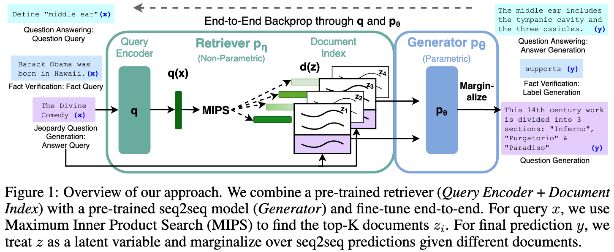
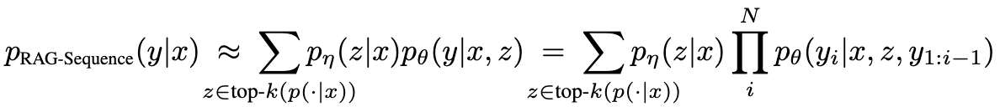
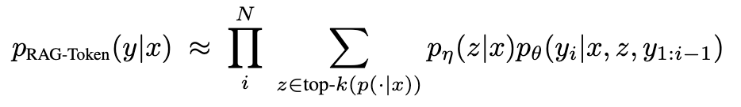
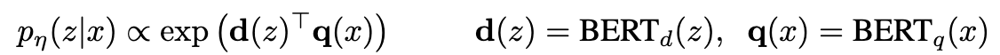
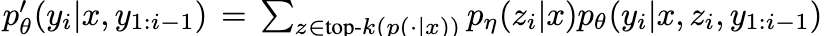
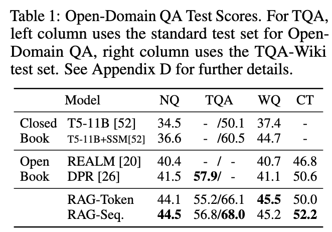
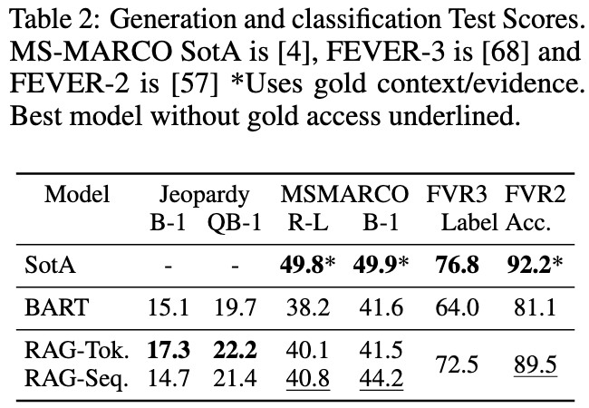
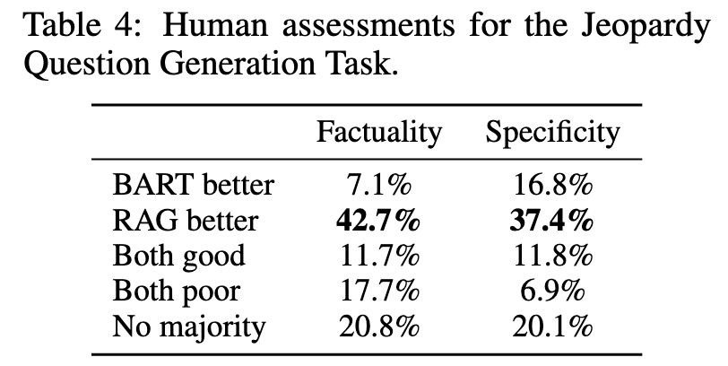
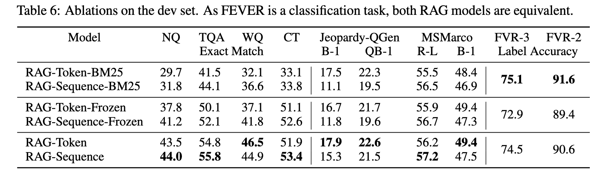
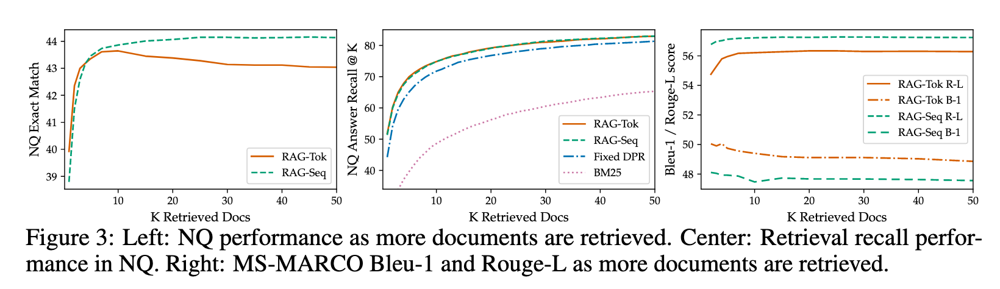

# <a href="zotero://open-pdf/library/items/JNZXJ54M?page=1">“Retrieval-Augmented Generation for Knowledge-Intensive NLP Tasks”</a> (<a href="zotero://select/library/items/V23XBR6X">Lewis et al., 2021, p. 1</a>)

NeurIPS 2020

Comment: Accepted at NeurIPS 2020

Referred in <a href="zotero://note/u/LJSU8E3B/?ignore=1&#x26;line=19" rel="noopener noreferrer nofollow" zhref="zotero://note/u/LJSU8E3B/?ignore=1&#x26;line=19" ztype="znotelink" class="internal-link">LLM</a>

<https://zhuanlan.zhihu.com/p/339942960>

## <a href="zotero://open-pdf/library/items/JNZXJ54M?page=1">“Abstract”</a> (<a href="zotero://select/library/items/V23XBR6X">Lewis et al., 2021, p. 1</a>)

大模型访问和精确操作知识的能力仍然有限，因此在知识密集型任务上，它们的性能落后于特定于任务的架构。

探索一种用于检索增强生成（RAG）的通用微调方法，结合预训练参数化和非参数化记忆的语言生成模型

我们引入了RAG模型，其中参数化记忆是一个预训练的seq2seq模型，非参数化记忆是通过预训练的神经检索器访问维基百科的密集向量索引。

比较了两种RAG的方式：

1.  在整个生成的序列中对相同的检索段落进行条件处理
2.  每一个token使用不同的检索段落

## <a href="zotero://open-pdf/library/items/JNZXJ54M?page=1">“1 Introduction”</a> (<a href="zotero://select/library/items/V23XBR6X">Lewis et al., 2021, p. 1</a>)

预训练的大模型已经被证明可以从数据中学习到大量深入的知识，并且不需要访问外部数据，但是

*   这些模型

    存在缺点

    ：它们

    不能轻松扩展或修订其记忆

    ，

    无法直接提供对其预测的洞察力

    ，并且

    可能产生“幻觉”

将参数化记忆的模型与非参数化（基于检索的）模型相结合可以减少这种缺点，因为知识可以直接修订和扩展，并且可以检查和解释已访问的知识。

**retrieval-augmented generation (RAG)：**为预训练的参数化记忆生成模型赋予了非参数化记忆

*   参数化记忆是一个预训练的seq2seq transformer
*   非参数化记忆是通过预训练的神经检索器访问wikipedia的密集向量索引

*   检索器（DPR）根据输入提供潜在文档，然后seq2seq模型与这些文档和输入一起生成输出。

> **<a href="https://zhuanlan.zhihu.com/p/559720649" rel="noopener noreferrer nofollow">一文梳理DPR(Dense Passage Retrieval)的发展</a>**

*   通过一种基于前K个近似值的方法对潜在文档进行边缘化处理，可以按照每个输出来处理（假设同一个文档负责所有标记），也可以按照每个标记来处理（不同的标记由不同的文档负责）。
*   RAG可以在任何seq2seq任务上进行微调，通过联合学习生成器和检索器

有大量的先前工作提出了用于丰富系统的非参数化记忆结构，这些结构是从头开始针对特定任务进行训练的，例如记忆网络\[64, 55]、堆叠增强网络\[25]和记忆层\[30]。

相比之下，在这个设置中，参数化和非参数化的记忆组件都是预先训练并加载了大量知识。关键是，通过使用预先训练的访问机制，可以在不需要额外训练的情况下获得访问知识的能力。

非参数记忆可以随着世界的变化来更新模型的知识。

## <a href="zotero://open-pdf/library/items/JNZXJ54M?page=2">“2 Methods”</a> (<a href="zotero://select/library/items/V23XBR6X">Lewis et al., 2021, p. 2</a>)

根据输入序列x检索文档z作为额外的上下文来生成目标序列y

模型如图1，包含两部分：

1.  检索器

    $p_η(z|x)$

    ：给定一个查询x，它返回（前K个截断的）文本段落的分布

2.  生成器

    $p_θ(y_i|x,z,y_{1:i−1})$

    ：根据上下文（前i - 1个tokeny1:i−1，原始输入x，检索的段落z）生成当前的token

提出了两种模型，以不同的方式对潜在文档进行边缘化处理，从而生成一种关于生成文本的分布：

1.  RAG-Sequence：使用相同的文档来预测每一个目标序列
2.  RAG-Token：基于不同的文档预测每一个目标序列

### <a href="zotero://open-pdf/library/items/JNZXJ54M?page=3">“2.1 Models”</a> (<a href="zotero://select/library/items/V23XBR6X">Lewis et al., 2021, p. 3</a>)

**RAG-Sequence Model**

使用相同的检索文档来生成完整的序列：将检索到的文档视为一个被边缘化的潜在变量，通过top-K近似方法得到seq2seq概率p(y|x)。

具体来说，使用检索器检索出前K个文档，生成器为每个文档产生输出序列的概率，然后进行边缘化处理。

**RAG-Token Model**

为每个目标令牌绘制一个不同的潜在文档，并相应地进行边缘化处理。

生成器在生成答案时可以从多个文档中选择内容。

具体来说，使用检索器检索top-k个文档，然后生成器对每一个文档生成下一个输出token的分布，然后进行边缘化处理对每一个输出序列重复该步骤。

RAG可以通过将目标类别视为长度为一的目标序列来用于序列分类任务，在这种情况下，RAG-Sequence和RAG-Token是等价的

### <a href="zotero://open-pdf/library/items/JNZXJ54M?page=3">“2.2 Retriever: DPR”</a> (<a href="zotero://select/library/items/V23XBR6X">Lewis et al., 2021, p. 3</a>)

DPR 采用双编码器架构：

dz：bert 文档编码器产生的文档的表征

qx：bert查询编码器编码产生的查询的表征

计算 top-k(pη(·|x))，也就是具有最高先验概率pη(z|x) 的 k 个文档 z，，即具有最高先验概率pη(z|x)的k个文档的列表z，是一个最大内积搜索问题，可以在次线性时间内近似求解

使用DPR的预训练双编码器来初始化我们的检索器并构建文档索引。检索器受过检索包含TriviaQA和Natural Questions的答案的文档的训练

**文档索引——非参数记忆**

### <a href="zotero://open-pdf/library/items/JNZXJ54M?page=3">“2.3 Generator: BART”</a> (<a href="zotero://select/library/items/V23XBR6X">Lewis et al., 2021, p. 3</a>)

生成器pθ(yi|x, z, y1:i−1)可以使用任何编码器-解码器架构进行建模，文中使用了bret-large

**bert的参数theta为参数化记忆**

### <a href="zotero://open-pdf/library/items/JNZXJ54M?page=3">“2.4 Training”</a> (<a href="zotero://select/library/items/V23XBR6X">Lewis et al., 2021, p. 3</a>)

联合训练检索器和生成器，没有直接监督来确定要检索的文档

给定输入/输出对(xj，yj)的微调训练语料库，使用ADAM的随机梯度下降来最小化每个目标的负边缘对数似然∑j−logp(yj|xj)

在与训练中更新文档编码器时很昂贵的，因为需要定期更新文档的索引，但是病咩有必要，因此只更新查询编码器BERTq和bert生成器，保持文档编码器和索引固定

### <a href="zotero://open-pdf/library/items/JNZXJ54M?page=4">“2.5 Decoding”</a> (<a href="zotero://select/library/items/V23XBR6X">Lewis et al., 2021, p. 4</a>)

**RAG-Token ：**可以被看作是标准的自回归的seq2seq生成器，按常规的beam search方式就可以解码

**RAG-Sequence Model：**因为每个文档都生成一个序列，不能正常的beam search方式来解码。文中是对每个文档按beam search解码出一个序列，得到解码序列集合，针对每个生成序列，用其生成概率与 pη(z|x)点乘得到一个概率score，取最大值对应的序列为最终输出。

## <a href="zotero://open-pdf/library/items/JNZXJ54M?page=4">“3 Experiments”</a> (<a href="zotero://select/library/items/V23XBR6X">Lewis et al., 2021, p. 4</a>)

论文在四类Knowledge-Intensive 任务上进行实验，具体包括开放问答（Open-domain Question Answering ）、摘要式问答（Abstractive Question Answering） 、开放问题生成（Jeopardy Question Generation）、事实判断（Fact Verification ），并使用维基百科（包含2100万个文档）作为检索库。

## <a href="zotero://open-pdf/library/items/JNZXJ54M?page=5">“4 Results”</a> (<a href="zotero://select/library/items/V23XBR6X">Lewis et al., 2021, p. 5</a>)

### <a href="zotero://open-pdf/library/items/JNZXJ54M?page=5">“4.1 Open-domain Question Answering”</a> (<a href="zotero://select/library/items/V23XBR6X">Lewis et al., 2021, p. 5</a>)

Closed book：不利用检索，而完全依赖参数化知识

open book：基于检索

**结果：**论文提出的两个方法在4个数据集都取得新的最佳结果。

***

### <a href="zotero://open-pdf/library/items/JNZXJ54M?page=6">“4.2 Abstractive Question Answering”</a> (<a href="zotero://select/library/items/V23XBR6X">Lewis et al., 2021, p. 6</a>)摘要式问答

测试NLG能力

**MSMARCO**

这项任务包括问题，每个问题从搜索引擎检索到的十个黄金段落，以及从检索到的段落中注释的完整句子答案。

**结果：**在Abstractive Question Answering任务（MSMARCO数据集）上，RAG模型都优于BART模型，但接近已有的最佳模型，其原因是论文在实验中没有利用数据集中包含文档 gold access信息，sota模型：

1.  这些模型通过访问包含所需特定信息的黄金段落来生成参考答案
2.  许多问题没有gole access就无法回答
3.  仅凭维基百科无法回答所有问题。

评估标准：

*   B-1:Bleu分数
*   R-L：Rouge-L

### <a href="zotero://open-pdf/library/items/JNZXJ54M?page=6">“4.3 Jeopardy Question Generation”</a> (<a href="zotero://select/library/items/V23XBR6X">Lewis et al., 2021, p. 6</a>)开放领域问题生成

研究非QA环境下的生成能力，我们研究了开放领域问题生成

**Jeopardy** 由尝试从关于实体的事实中猜测该实体组成

例如：“世界杯”是对问题“在1986年，墨西哥作为第一个两次主办这项国际体育比赛的国家得分。” 的答案。

人工评估：

*   factually真实性：是否可以通过可信的外部来源证实
*   specificity特异性：输入和输出之间高度相互依赖

**结果：**

*   在Jeopardy Question Generation任务（Jeopardy数据集）上，RAG-Tok取得最优结果，且RAG都超过BART的表现

*   Jeopardy 

    问题通常包含两条独立的信息，RAG-TOKEN可能执行得最好，因为它可以生成组合了多个文档内容的响应。

评估标准：

*   blue-1

*   q-blue-1：

    比起BLEU，Q-BLEU为实体赋予了更高的权重，因此在该任务上与人类评价的相关性更高

### <a href="zotero://open-pdf/library/items/JNZXJ54M?page=6">“4.4 Fact Verification”</a> (<a href="zotero://select/library/items/V23XBR6X">Lewis et al., 2021, p. 6</a>)事实判断

**FEVER：**FEVER 需要对自然语言的主张进行分类，判断其是否被维基百科支持或反驳，或者是否没有足够的信息来做出决定。这项任务需要从维基百科检索与声明相关的证据，然后对这些证据进行推理，以区分声明是真的、假的，还是仅从维基百科就无法核实的

*   3-way：supports/refutes/not enough info
*   2-way：supports/refutes

结果：在Fact Verification任务上（FVR3,FVR2数据集） 上，对于3-way分类（FVR3），RAG比最优模型差4.3%，然而这类最优模型都是基于复杂的pipeline方法，需要大量的中间特征工程，而RAG不需要这些特征工程就可以达到接近的效果

### **主要结论：**

*   总体来说，Open Book范式比Closed Book范式的表现好不少，因此引入外部知识库对开放域问答任务来说还是很重要的，而

    **「RAG很好地将seq2seq模型的灵活性和检索模型的高效性结合了起来」**

    ，并且不像REALM，RAG的训练成本更小，另外RAG的检索器虽然是用DPR的检索器初始化的，但原始的DPR模型后续采用了BERT来对文档做重排和答案抽取，而RAG表明这两者是不必要的。

*   虽然可以直接从文档中抽取答案片段，但直接生成答案有一些额外的好处，比如有些文档并不直接包含整个答案，但包含答案的线索，

    **「这些线索就能帮助模型生成更正确的答案」**

    ，而这对抽取式模型来说是做不到的。在一些极端情况下，比如被检索到的文档全都不包含正确答案，RAG也能生成相对合理的答案，此时RAG借助的就是生成器中存储的参数知识，而REALM这类抽取式QA模型就无法回答这些问题。在NQ数据集中，RAG对于这类问题的正确率是11.8%，而抽取式模型的正确率是0%。

*   作者对BART和RAG模型在问题生成任务上的表现进行了人工评估，如左图所示，评估结果表明RAG生成的问题更符合事实(factual)，也更具体(specific)，而右图计算了不同的tri-grams与所有tri-grams的比值，该比值能够反映生成的多样性，计算结果和样本观察均表明RAG的生成结果是更多样化的。

*   在问题生成任务中RAG-Token的表现比RAG-Sequence更好，这实际上得益于前者在生成时可以关注到多个文档，从而生成信息更丰富的问题，下面的一个例子就表明了RAG-Token在生成不同的单词时，不同文档的后验概率是不同的。有趣的是，在生成某个实体的第一个词之后，该实体对应的文档的后验概率就回归正常了，这表明

    **「生成器依靠参数知识完全有能力补全后续部分，文档信息仅仅起到了提示和引导的作用」**

    ，因此整个RAG模型主要依靠的还是参数知识，而在生成实体时非参数知识才会起到作用。

### **Ablation**

**检索机制：**

为了评估文档检索机制的有效性，作者对比了基于BM25的检索器和冻结了检索器的模型。实验结果表明训练检索器对所有生成任务都是有帮助的，但在事实验证任务上BM25表现却是最好的，这可能是因为该任务主要以实体为中心，因此非常适合基于单词重叠的BM25检索器，所以数据集的特征对于模型的选择还是很重要的。

**检索更多的文档:**

检索文档的数量K会对模型表现产生一定影响，如下图所示，对于RAG-Token来说，K值过大会带来一些负面影响，同时会导致Rouge-L分数提升，但BLEU-1分数降低，而RAG-Sequence就不存在这些问题

## 5 Related Work

### <a href="zotero://open-pdf/library/items/JNZXJ54M?page=8">“Single-Task Retrieval”</a> (<a href="zotero://select/library/items/V23XBR6X">Lewis et al., 2021, p. 8</a>)

检索可以提高各种自然语言处理任务的性能。这些任务包括开放领域问答\[5, 29]、事实核查\[56]、事实补全\[48]、长篇问答\[12]、维基百科文章生成\[36]、对话系统\[41, 65, 9, 13]、翻译\[17]和语言建模\[19, 27]。我们的工作将之前在个别任务中整合检索所取得的成功进行了统一，并展示出一个基于检索的架构能够在多个任务上取得强大性能。

### <a href="zotero://open-pdf/library/items/JNZXJ54M?page=9">“General-Purpose Architectures for NLP”</a> (<a href="zotero://select/library/items/V23XBR6X">Lewis et al., 2021, p. 9</a>)NLP的通用架构

我们的工作旨在通过学习一个检索模块来扩展可能任务空间，并以此增强预训练生成式语言模型。

### Learned Retrieval

我们则展示了一个单一的基于检索的架构可以通过微调在多种任务上获得出色性能。

### Memory-based Architectures 基于记忆的架构

我们的文档索引可以被视为神经网络所关注的一个大型外部内存，类似于记忆网络

我们记忆的一个关键特点是它由原始文本组成而非分布式表示，这使得该记忆既可读（即具有一种解释模型）又可写（即允许通过编辑文档索引动态更新模型）。这种方法也在知识密集型对话中使用过，在那里生成器直接依赖于检索到的文本条件，尽管获取方式是通过TF-IDF而非端到端学习检索

### <a href="zotero://open-pdf/library/items/JNZXJ54M?page=9">“Retrieve-and-Edit approaches”</a> (<a href="zotero://select/library/items/V23XBR6X">Lewis et al., 2021, p. 9</a>)

1我们的方法与检索和编辑风格的方法有一些相似之处，其中对于给定的输入会检索到一个类似的训练输入-输出对，然后进行编辑以提供最终输出。这些方法在包括机器翻译\[18, 22]和语义解析\[21]在内的许多领域中已经证明是成功的。我们的方法确实有几个不同之处，包括更少地强调轻微编辑检索到的项目，而是聚合来自多个被检索内容片段，并学习潜在检索，并且获取证据文档而不是相关训练对。话虽如此，在这些情境下RAG技术可能效果良好，并且可能代表有前途的未来工作。

## 6 Discussion

除了RAG的检索式增强范式，引入外部知识来增强模型的方式还有很多，比如在预训练模型还没有流行起来的2017年，风靡一时的记忆网络(Memory Networks)就在QA任务上得到了不少运用。

但这些网络都需要在特定任务上进行额外的训练才能使用，这个过程可以类比于对外部知识做一个"小抄"，如果训练不当，质量也许还不如"先检索再理解"的方式好，而RAG模型也正表明了**「靠预训练和预加载就可以以很小的代价获取知识的高质量表示」**。

同时，**「这样的方式也更具有可读性和可解释性，因为知识是以纯文本而不是分布式表示的形式存放的，因此可以随时更新文档内容而不需要重新训练任何模块」**，这样的能力在时事问答场景下(比如美国现任总统是谁？)是很有价值的。
