# <a href="zotero://open-pdf/library/items/PHI2BBHP?page=1">“SELF-REFINE: Iterative Refinement with Self-Feedback”</a> (<a href="zotero://select/library/items/FSH77WHR">Madaan et al., 2023, p. 1</a>)

Comment: Code, data, and demo at https\://selfrefine.info/

Referred in <a href="zotero://note/u/LJSU8E3B/?ignore=1&#x26;line=-1" rel="noopener noreferrer nofollow" zhref="zotero://note/u/LJSU8E3B/?ignore=1&#x26;line=-1" ztype="znotelink" class="internal-link">LLM</a>

## <a href="zotero://open-pdf/library/items/PHI2BBHP?page=1">“Abstract”</a> (<a href="zotero://select/library/items/FSH77WHR">Madaan et al., 2023, p. 1</a>)

LLM第一次不一定生成最好的结果

<a href="zotero://open-pdf/library/items/PHI2BBHP?page=NaN">“uses a single LLM as the generator, refiner and the feedback provider”</a> (<a href="zotero://select/library/items/FSH77WHR">Madaan et al., 2023, p. 1</a>) 使用一个LLM作为生成器、改善器和反馈提供者。

<a href="zotero://open-pdf/library/items/PHI2BBHP?page=1">“improving by ∼20%”</a> (<a href="zotero://select/library/items/FSH77WHR">Madaan et al., 2023, p. 1</a>)

## <a href="zotero://open-pdf/library/items/PHI2BBHP?page=1">“Introduction”</a> (<a href="zotero://select/library/items/FSH77WHR">Madaan et al., 2023, p. 1</a>)

### <a href="zotero://open-pdf/library/items/PHI2BBHP?page=NaN">“fall short in addressing intricate requirements.”</a> (<a href="zotero://select/library/items/FSH77WHR">Madaan et al., 2023, p. 1</a>) 未能满足复杂的要求。

*   <a href="zotero://open-pdf/library/items/PHI2BBHP?page=NaN">“intelligible initial output”</a>

    (<a href="zotero://select/library/items/FSH77WHR">Madaan et al., 2023, p. 1</a>)

    可理解的初始输出

*   <a href="zotero://open-pdf/library/items/PHI2BBHP?page=NaN">“further iterative refinement—”</a> (<a href="zotero://select/library/items/FSH77WHR">Madaan et al., 2023, p. 1</a>) 进一步的迭代改进

    *   <a href="zotero://open-pdf/library/items/PHI2BBHP?page=NaN">“iteratively mapping a candidate output to an improved one—to ensure that the desired quality is achieved.”</a>

        (<a href="zotero://select/library/items/FSH77WHR">Madaan et al., 2023, p. 1</a>)

        迭代地将候选输出映射到改进的输出，以确保达到所需的质量。

    *   <a href="zotero://open-pdf/library/items/PHI2BBHP?page=NaN">“Iterative refinement typically involves training a refinement model that relies on domain-specific data”</a>

        (<a href="zotero://select/library/items/FSH77WHR">Madaan et al., 2023, p. 1</a>)

        迭代细化通常涉及训练依赖于特定领域数据的细化模型

    *   <a href="zotero://open-pdf/library/items/PHI2BBHP?page=NaN">“Other approaches that rely on external supervision or reward models require large training sets or expensive human annotations”</a>

        (<a href="zotero://select/library/items/FSH77WHR">Madaan et al., 2023, p. 1</a>)

        其他依赖外部监督或奖励模型的方法需要大量训练集或昂贵的人工注释

*   <a href="zotero://open-pdf/library/items/PHI2BBHP?page=NaN">“These limitations underscore the need for an effective refinement approach that can be applied to various tasks without requiring extensive supervision”</a>

    (<a href="zotero://select/library/items/FSH77WHR">Madaan et al., 2023, p. 1</a>)

    这些限制强调需要一种有效的细化方法，该方法可以应用于各种任务，而不需要广泛的监督

<a href="zotero://open-pdf/library/items/PHI2BBHP?page=NaN"><strong>“Iterative self -refinement is a fundamental characteristic of human problem-solving”</strong></a> (<a href="zotero://select/library/items/FSH77WHR">Madaan et al., 2023, p. 1</a>)** 迭代式自我完善是人类解决问题的基本特征**

*   <a href="zotero://open-pdf/library/items/PHI2BBHP?page=NaN">“Iterative self-refinement is a process that involves creating an initial draft and subsequently refining it based on self-provided feedback.”</a>

    (<a href="zotero://select/library/items/FSH77WHR">Madaan et al., 2023, p. 1</a>)

    迭代自我完善是一个涉及创建初始草案并随后根据自我提供的反馈对其进行完善的过程。

*   举个🌰：

    <a href="zotero://open-pdf/library/items/PHI2BBHP?page=NaN">“When writing code, a programmer may implement an initial “quick and dirty” implementation, and then, upon reflection, refactor their code to a solution that is more efficient and readable”</a>

    (<a href="zotero://select/library/items/FSH77WHR">Madaan et al., 2023, p. 2</a>)

    在编写代码时，程序员可能会实现一个初始的“快速而肮脏”的实现，然后经过反思，将其代码重构为更高效和可读的解决方案

<a href="zotero://open-pdf/library/items/PHI2BBHP?page=NaN">“In this paper, we demonstrate that LLMs can provide iterative self-refinement without additional training, leading to higher-quality outputs on a wide range of tasks.”</a> (<a href="zotero://select/library/items/FSH77WHR">Madaan et al., 2023, p. 2</a>) 在本文中，我们证明LLM可以在无需额外培训的情况下提供迭代式自我完善，从而在各种任务上产生更高质量的输出。

### 方法：

<a href="zotero://open-pdf/library/items/PHI2BBHP?page=2">“SELF-REFINE”</a> (<a href="zotero://select/library/items/FSH77WHR">Madaan et al., 2023, p. 2</a>)

*   在

    <a href="zotero://open-pdf/library/items/PHI2BBHP?page=2">“FEEDBACK”</a>

    (<a href="zotero://select/library/items/FSH77WHR">Madaan et al., 2023, p. 2</a>)

    和

    “REFINE”

    (Madaan et al., 2023, p. 2)

    之间交替

*   步骤：

    *   <a href="zotero://open-pdf/library/items/PHI2BBHP?page=NaN">“Given an initial output generated by a model M, we pass it back to the same model M to get <strong><em>feedback</em></strong>”</a>

        (<a href="zotero://select/library/items/FSH77WHR">Madaan et al., 2023, p. 2</a>)

        给定模型 M 生成的初始输出，我们将其传递回同一模型 M 以获得反馈

    *   <a href="zotero://open-pdf/library/items/PHI2BBHP?page=NaN">“Then, the feedback is passed back to the same model to <strong><em>refine</em></strong> the previously-generated draft”</a>

        (<a href="zotero://select/library/items/FSH77WHR">Madaan et al., 2023, p. 2</a>)

        然后，反馈被传递回同一模型以完善先前生成的草稿

    *   <a href="zotero://open-pdf/library/items/PHI2BBHP?page=NaN">“This process is repeated either for a specified number of iterations or until M determines that no further refinement is necessary”</a>

        (<a href="zotero://select/library/items/FSH77WHR">Madaan et al., 2023, p. 2</a>)

        重复此过程指定的迭代次数或直到 M 确定不需要进一步细化

    *   <a href="zotero://open-pdf/library/items/PHI2BBHP?page=NaN">“We use few-shot prompting (Brown et al., 2020) to guide M to both generate feedback and incorporate the feedback into an improved draft”</a>

        (<a href="zotero://select/library/items/FSH77WHR">Madaan et al., 2023, p. 2</a>)

        我们使用少样本提示（Brown et al., 2020）来指导 M 生成反馈并将反馈纳入改进的草稿中

<a href="zotero://open-pdf/library/items/PHI2BBHP?page=2">“Figure 1”</a> (<a href="zotero://select/library/items/FSH77WHR">Madaan et al., 2023, p. 2</a>)

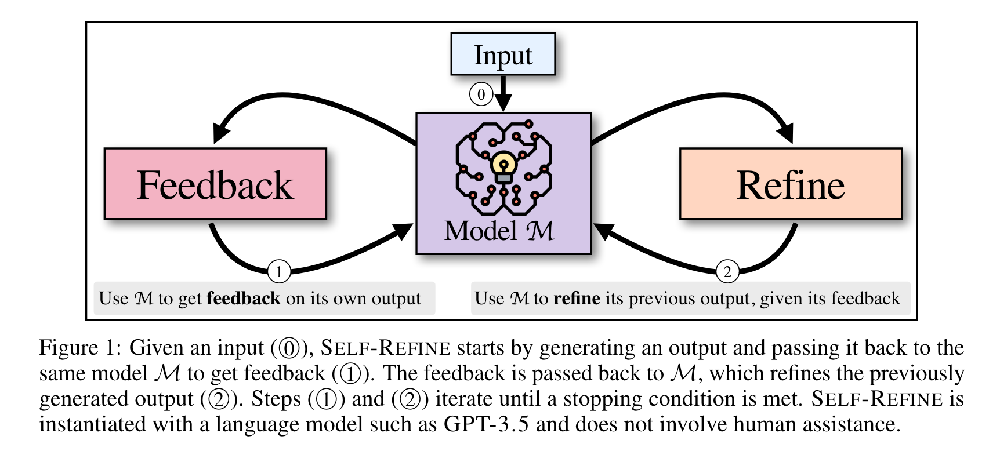

### 文章中的实验：

<a href="zotero://open-pdf/library/items/PHI2BBHP?page=NaN">“7 generation tasks that span diverse domains, including natural language and source-code generation.”</a> (<a href="zotero://select/library/items/FSH77WHR">Madaan et al., 2023, p. 2</a>) 7 跨越不同领域的生成任务，包括自然语言和源代码生成。

<a href="zotero://open-pdf/library/items/PHI2BBHP?page=NaN">“strong LLMs like GPT-3.5 (text-davinci-003 and gpt-3.5-turbo; OpenAI; Ouyang et al., 2022) and GPT-4 (OpenAI, 2023) by 5-40% absolute improvement.”</a> (<a href="zotero://select/library/items/FSH77WHR">Madaan et al., 2023, p. 2</a>) 像 GPT-3.5（text-davinci-003 和 gpt-3.5-turbo；OpenAI；Ouyang et al.，2022）和 GPT-4（OpenAI，2023）这样强大的LLM绝对提高了 5-40%。

<a href="zotero://open-pdf/library/items/PHI2BBHP?page=NaN">“In code-generation tasks, SELF-REFINE improves the initial generation by up to absolute 13% when applied to strong code models such as Codex (code-davinci-002; Chen et al., 2021).”</a> (<a href="zotero://select/library/items/FSH77WHR">Madaan et al., 2023, p. 2</a>) 在代码生成任务中，当应用于 Codex（code-davinci-002；Chen 等人，2021）等强代码模型时，SELF-REFINE 将初始生成提高了 13%。

### 结论：

<a href="zotero://open-pdf/library/items/PHI2BBHP?page=NaN">“In essence, our results show that even when an LLM cannot generate an optimal output on its first try, the LLM can often provide useful feedback and improve its own output accordingly.”</a> (<a href="zotero://select/library/items/FSH77WHR">Madaan et al., 2023, p. 2</a>) 从本质上讲，我们的结果表明，即使LLM在第一次尝试时无法产生最佳输出，LLM通常也可以提供有用的反馈并相应地改进其自身的输出。

<a href="zotero://open-pdf/library/items/PHI2BBHP?page=NaN">“In turn, SELF-REFINE provides an effective way to obtain better outputs from a single model without any additional training, via iterative (self-)feedback and refinement.”</a> (<a href="zotero://select/library/items/FSH77WHR">Madaan et al., 2023, p. 2</a>) 反过来，SELF-REFINE 提供了一种有效的方法，通过迭代（自）反馈和细化，无需任何额外的训练即可从单个模型获得更好的输出

## <a href="zotero://open-pdf/library/items/PHI2BBHP?page=2">“2 Iterative Refinement with SELF-REFINE”</a> (<a href="zotero://select/library/items/FSH77WHR">Madaan et al., 2023, p. 2</a>)

<a href="zotero://open-pdf/library/items/PHI2BBHP?page=NaN">“Given an input sequence, SELF-REFINE generates an initial output, provides feedback on the output, and refines the output according to the feedback.”</a> (<a href="zotero://select/library/items/FSH77WHR">Madaan et al., 2023, p. 2</a>) 给定输入序列，SELF-REFINE 生成初始输出，提供输出反馈，并根据反馈细化输出。

<a href="zotero://open-pdf/library/items/PHI2BBHP?page=NaN">“SELF-REFINE iterates between feedback and refinement until a desired condition is met”</a> (<a href="zotero://select/library/items/FSH77WHR">Madaan et al., 2023, p. 2</a>) SELF-REFINE 在反馈和细化之间迭代，直到满足所需条件

<a href="zotero://open-pdf/library/items/PHI2BBHP?page=2">“relies on”</a> (<a href="zotero://select/library/items/FSH77WHR">Madaan et al., 2023, p. 2</a>)：

*   <a href="zotero://open-pdf/library/items/PHI2BBHP?page=2">“a suitable language model”</a>

    (<a href="zotero://select/library/items/FSH77WHR">Madaan et al., 2023, p. 2</a>)

*   <a href="zotero://open-pdf/library/items/PHI2BBHP?page=2">“three prompts (for initial generation, feedback, and refinement)”</a>

    (<a href="zotero://select/library/items/FSH77WHR">Madaan et al., 2023, p. 2</a>)

<a href="zotero://open-pdf/library/items/PHI2BBHP?page=3">“Algorithm 1 SELF-REFINE algorithm”</a> (<a href="zotero://select/library/items/FSH77WHR">Madaan et al., 2023, p. 3</a>)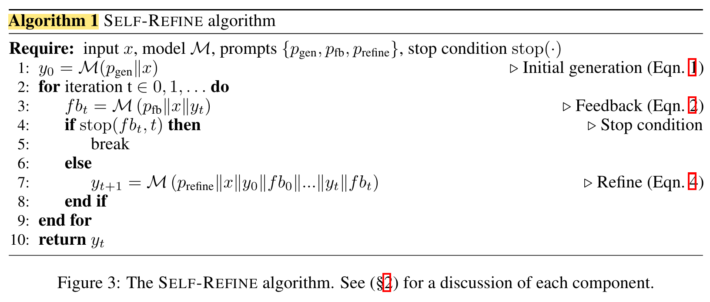

<a href="zotero://open-pdf/library/items/PHI2BBHP?page=3">“Figure 2: Examples of SELF-REFINE:”</a> (<a href="zotero://select/library/items/FSH77WHR">Madaan et al., 2023, p. 3</a>)

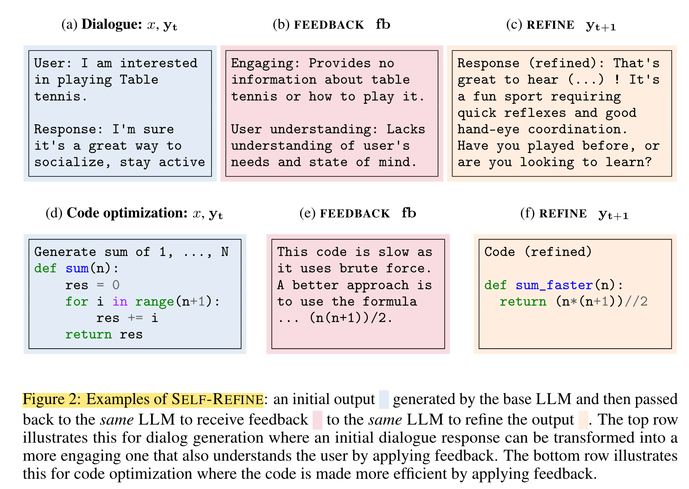

### <a href="zotero://open-pdf/library/items/PHI2BBHP?page=2">“Initial generation”</a> (<a href="zotero://select/library/items/FSH77WHR">Madaan et al., 2023, p. 2</a>)

<a href="zotero://open-pdf/library/items/PHI2BBHP?page=2">“Given an input x, prompt pgen, and model M,S ELF-REFINE generates an initial output y0”</a> (<a href="zotero://select/library/items/FSH77WHR">Madaan et al., 2023, p. 2</a>)

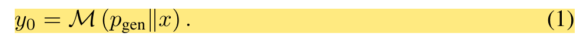

<a href="zotero://open-pdf/library/items/PHI2BBHP?page=NaN">“p_gen is a task-specific few-shot prompt (or instruction) for an initial generation”</a> (<a href="zotero://select/library/items/FSH77WHR">Madaan et al., 2023, p. 3</a>) p\_gen 是初始生成的特定于任务的几次提示（或指令）

### <a href="zotero://open-pdf/library/items/PHI2BBHP?page=3">“FEEDBACK”</a> (<a href="zotero://select/library/items/FSH77WHR">Madaan et al., 2023, p. 3</a>)

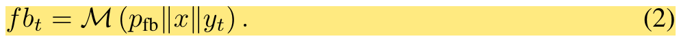

<a href="zotero://open-pdf/library/items/PHI2BBHP?page=NaN">“Intuitively, the feedback may address multiple aspects of the output.”</a> (<a href="zotero://select/library/items/FSH77WHR">Madaan et al., 2023, p. 3</a>) 直观上，反馈可以解决输出的多个方面的问题。例如：

*   code -

    <a href="zotero://open-pdf/library/items/PHI2BBHP?page=3">“efficiency, readability, and overall quality”</a>

    (<a href="zotero://select/library/items/FSH77WHR">Madaan et al., 2023, p. 3</a>)

<a href="zotero://open-pdf/library/items/PHI2BBHP?page=NaN">“prompt pfb provides examples of feedback”</a> (<a href="zotero://select/library/items/FSH77WHR">Madaan et al., 2023, p. 3</a>) promote  p\_fb 提供反馈示例

**做法：**

1.  <a href="zotero://open-pdf/library/items/PHI2BBHP?page=NaN">“We prompt the model to write feedback that is actionable and specific via f b(k)”</a> (<a href="zotero://select/library/items/FSH77WHR">Madaan et al., 2023, p. 3</a>) 我们用promote让模型编写可操作且具体的反馈 fb(k)

    *   <a href="zotero://open-pdf/library/items/PHI2BBHP?page=4">“actionable”</a>

        (<a href="zotero://select/library/items/FSH77WHR">Madaan et al., 2023, p. 4</a>)

        feedback 包含具体的可以优化输出的action

    *   <a href="zotero://open-pdf/library/items/PHI2BBHP?page=4">“specific”</a>

        (<a href="zotero://select/library/items/FSH77WHR">Madaan et al., 2023, p. 4</a>)

        feedback 确定输出中需要更改的具体短语

    *   这一点很重要，因为在我的尝试中，如果我给出了输入、问题以及结果，然后没有指明具体要修改的内容和修改的依据或者说方法，那么LLM很有可能没有任何反应（察觉不到问题所在）

         

         

### <a href="zotero://open-pdf/library/items/PHI2BBHP?page=4">“REFINE”</a> (<a href="zotero://select/library/items/FSH77WHR">Madaan et al., 2023, p. 4</a>)

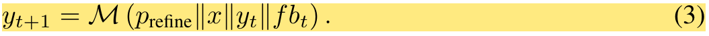

### <a href="zotero://open-pdf/library/items/PHI2BBHP?page=4">“Iterating SELF-REFINE”</a> (<a href="zotero://select/library/items/FSH77WHR">Madaan et al., 2023, p. 4</a>)

<a href="zotero://open-pdf/library/items/PHI2BBHP?page=NaN">“stopping condition”</a> (<a href="zotero://select/library/items/FSH77WHR">Madaan et al., 2023, p. 4</a>) 停止条件

*   <a href="zotero://open-pdf/library/items/PHI2BBHP?page=NaN">“stops at a specified timestep t”</a>

    (<a href="zotero://select/library/items/FSH77WHR">Madaan et al., 2023, p. 4</a>)

    在指定时间步 t 处停止

*   <a href="zotero://open-pdf/library/items/PHI2BBHP?page=NaN">“extracts a stopping indicator (e.g. a scalar stop score) from the feedback”</a>

    (<a href="zotero://select/library/items/FSH77WHR">Madaan et al., 2023, p. 4</a>)

    从反馈中提取停止指标（例如停止分数）

<a href="zotero://open-pdf/library/items/PHI2BBHP?page=NaN">“To inform the model about the previous iterations, we retain the history of previous feedback and outputs by appending them to the prompt.”</a> (<a href="zotero://select/library/items/FSH77WHR">Madaan et al., 2023, p. 4</a>) 为了告知模型有关先前迭代的信息，我们通过将先前反馈和输出的历史记录附加到提示中来保留它们。这使模型能够从过去的错误中吸取教训，避免重蹈覆辙。

所以准确地说，公式(3)其实是这样子的：

## <a href="zotero://open-pdf/library/items/PHI2BBHP?page=4">“3 Evaluation”</a> (<a href="zotero://select/library/items/FSH77WHR">Madaan et al., 2023, p. 4</a>)

### <a href="zotero://open-pdf/library/items/PHI2BBHP?page=4">“3.1 Instantiating SELF-REFINE”</a> (<a href="zotero://select/library/items/FSH77WHR">Madaan et al., 2023, p. 4</a>)

### <a href="zotero://open-pdf/library/items/PHI2BBHP?page=5">“3.2 Metrics”</a> (<a href="zotero://select/library/items/FSH77WHR">Madaan et al., 2023, p. 5</a>)

### <a href="zotero://open-pdf/library/items/PHI2BBHP?page=5">“3.3 Results”</a> (<a href="zotero://select/library/items/FSH77WHR">Madaan et al., 2023, p. 5</a>)

<a href="zotero://open-pdf/library/items/PHI2BBHP?page=5">“Table 1”</a> (<a href="zotero://select/library/items/FSH77WHR">Madaan et al., 2023, p. 5</a>)

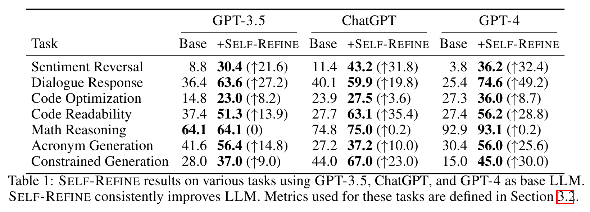

<a href="zotero://open-pdf/library/items/PHI2BBHP?page=NaN">“SELF-REFINE consistently improves over base models”</a> (<a href="zotero://select/library/items/FSH77WHR">Madaan et al., 2023, p. 5</a>) SELF-REFINE 不断基与基础方法改进

<a href="zotero://open-pdf/library/items/PHI2BBHP?page=NaN">“The modest performance gains in Math Reasoning can be traced back to the inability to accurately identify whether there is any error”</a> (<a href="zotero://select/library/items/FSH77WHR">Madaan et al., 2023, p. 5</a>) 数学推理中的性能提升几乎没有，因为无法准确识别是否存在错误

## <a href="zotero://open-pdf/library/items/PHI2BBHP?page=6">“4 Analysis”</a> (<a href="zotero://select/library/items/FSH77WHR">Madaan et al., 2023, p. 6</a>)

<a href="zotero://open-pdf/library/items/PHI2BBHP?page=6">“Table 2”</a> (<a href="zotero://select/library/items/FSH77WHR">Madaan et al., 2023, p. 6</a>)

### <a href="zotero://open-pdf/library/items/PHI2BBHP?page=6">“The impact of the feedback quality”</a> (<a href="zotero://select/library/items/FSH77WHR">Madaan et al., 2023, p. 6</a>)

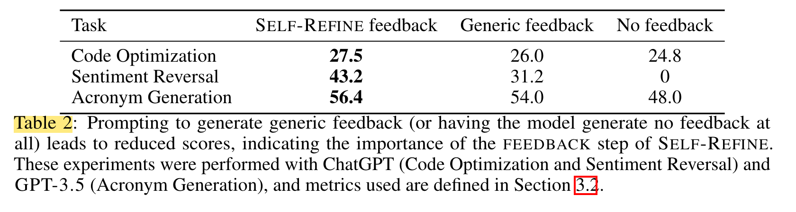

*   <a href="zotero://open-pdf/library/items/PHI2BBHP?page=NaN">“generic feedback”</a>

    (<a href="zotero://select/library/items/FSH77WHR">Madaan et al., 2023, p. 6</a>)

    一般反馈 没有指明应该具体怎样做

*   <a href="zotero://open-pdf/library/items/PHI2BBHP?page=NaN">“without feedback”</a>

    (<a href="zotero://select/library/items/FSH77WHR">Madaan et al., 2023, p. 6</a>)

    没有反馈（模型可能仍然通过迭代来改进其生成结果，但并没有明确提供反馈

**结果：**

<a href="zotero://open-pdf/library/items/PHI2BBHP?page=NaN">“Code Optimization”</a> (<a href="zotero://select/library/items/FSH77WHR">Madaan et al., 2023, p. 6</a>) 代码优化

<a href="zotero://open-pdf/library/items/PHI2BBHP?page=NaN">“This suggests that while generic feedback offers some guidance – specific, actionable feedback yields superior results.”</a> (<a href="zotero://select/library/items/FSH77WHR">Madaan et al., 2023, p. 6</a>) 这表明，虽然一般反馈提供了一些指导，但具体的、可操作的反馈会产生更好的结果。

<a href="zotero://open-pdf/library/items/PHI2BBHP?page=NaN">“Sentiment Transfer,”</a> (<a href="zotero://select/library/items/FSH77WHR">Madaan et al., 2023, p. 6</a>) 情感转换

效果更加明显

<a href="zotero://open-pdf/library/items/PHI2BBHP?page=NaN">“the task fails without feedback”</a> (<a href="zotero://select/library/items/FSH77WHR">Madaan et al., 2023, p. 6</a>) 任务失败且没有反馈

<a href="zotero://open-pdf/library/items/PHI2BBHP?page=NaN">“Acronym Generation”</a> (<a href="zotero://select/library/items/FSH77WHR">Madaan et al., 2023, p. 6</a>) 首字母缩略词生成

<a href="zotero://open-pdf/library/items/PHI2BBHP?page=NaN">“These results highlight the importance of specific, actionable feedback in our approach. Even generic feedback provides some benefit, but the best results are achieved with targeted, constructive feedback.”</a> (<a href="zotero://select/library/items/FSH77WHR">Madaan et al., 2023, p. 6</a>) 这些结果凸显了我们方法中具体、可操作的反馈的重要性。即使一般的反馈也能带​​来一些好处，但最好的结果是通过有针对性的、建设性的反馈来实现的。

### <a href="zotero://open-pdf/library/items/PHI2BBHP?page=6">“How important are the multiple iterations of FEEDBACK-REFINE”</a> (<a href="zotero://select/library/items/FSH77WHR">Madaan et al., 2023, p. 6</a>)

<a href="zotero://open-pdf/library/items/PHI2BBHP?page=NaN">“Figure 4”</a> (<a href="zotero://select/library/items/FSH77WHR">Madaan et al., 2023, p. 6</a>)

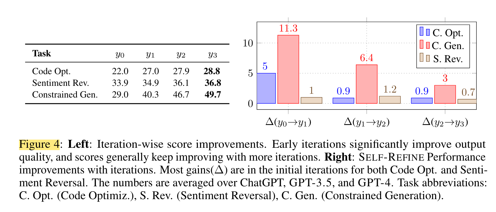

**结果：**

<a href="zotero://open-pdf/library/items/PHI2BBHP?page=NaN">“on average, the quality of the output improves as the number of iterations increases”</a> (<a href="zotero://select/library/items/FSH77WHR">Madaan et al., 2023, p. 6</a>) 平均而言，输出的质量随着迭代次数的增加而提高

<a href="zotero://open-pdf/library/items/PHI2BBHP?page=NaN">“Figure 4 highlights the diminishing returns in the improvement as the number of iterations increases.”</a> (<a href="zotero://select/library/items/FSH77WHR">Madaan et al., 2023, p. 6</a>) 图 4 突出显示了随着迭代次数的增加，改进带来的收益递减。

<a href="zotero://open-pdf/library/items/PHI2BBHP?page=NaN">“Overall, having multiple FEEDBACK-REFINE iterations significantly enhances the quality of the output, although the marginal improvement naturally decreases with more iterations.”</a> (<a href="zotero://select/library/items/FSH77WHR">Madaan et al., 2023, p. 6</a>) 总体而言，多次反馈优化迭代可以显着提高输出质量，尽管改进自然会随着迭代次数的增加而降低。

<a href="zotero://open-pdf/library/items/PHI2BBHP?page=NaN">“The performance may not always monotonically increase with iterations”</a> (<a href="zotero://select/library/items/FSH77WHR">Madaan et al., 2023, p. 6</a>) 性能可能并不总是随着迭代而单调增加

为了应对这一问题，SELF-REFINE 生成不同质量方面的数值评分，从而实现平衡评估和适当的输出选择。

### <a href="zotero://open-pdf/library/items/PHI2BBHP?page=NaN">“Can we just generate multiple outputs instead of refining?”</a> (<a href="zotero://select/library/items/FSH77WHR">Madaan et al., 2023, p. 7</a>) 我们可以只生成多个输出而不进行精炼吗？

<a href="zotero://open-pdf/library/items/PHI2BBHP?page=NaN">“Does SELF-REFINE improve because of the iterative refinement, or just because it generates more outputs”</a> (<a href="zotero://select/library/items/FSH77WHR">Madaan et al., 2023, p. 7</a>) SELF-REFINE 的改进是因为迭代细化，还是仅仅因为它产生了更多输出？

**实验：**

<a href="zotero://open-pdf/library/items/PHI2BBHP?page=NaN">“We compare SELF-REFINE with ChatGPT, when ChatGPT generates k = 4 samples”</a> (<a href="zotero://select/library/items/FSH77WHR">Madaan et al., 2023, p. 7</a>) 我们将 SELF-REFINE 与 ChatGPT 进行比较，当 ChatGPT 生成 k = 4 个样本时

**结果：**

<a href="zotero://open-pdf/library/items/PHI2BBHP?page=NaN">“SELF-REFINE can outperform all k initial outputs”</a> (<a href="zotero://select/library/items/FSH77WHR">Madaan et al., 2023, p. 7</a>) SELF-REFINE 可以优于所有 k 个初始输出

<a href="zotero://open-pdf/library/items/PHI2BBHP?page=NaN">“Figure 6”</a> (<a href="zotero://select/library/items/FSH77WHR">Madaan et al., 2023</a>)

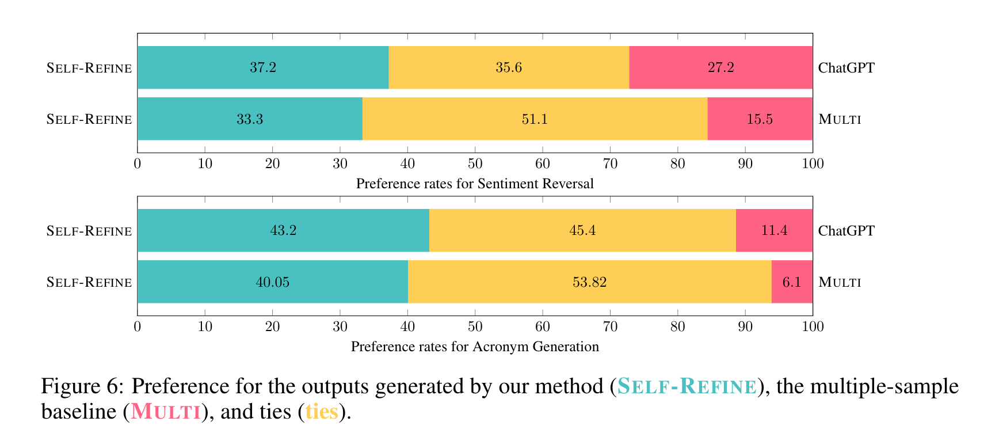

### <a href="zotero://open-pdf/library/items/PHI2BBHP?page=NaN">“Does SELF-REFINE work with weaker models?”</a> (<a href="zotero://select/library/items/FSH77WHR">Madaan et al., 2023, p. 7</a>) SELF-REFINE 是否适用于较弱的模型？

### <a href="zotero://open-pdf/library/items/PHI2BBHP?page=8">“Qualitative Analysis”</a> (<a href="zotero://select/library/items/FSH77WHR">Madaan et al., 2023, p. 8</a>)定性分析

<a href="zotero://open-pdf/library/items/PHI2BBHP?page=NaN">“For both Math Reasoning and Code Optimization, we found that the feedback was predominantly actionable, with the majority identifying problematic aspects of the original generation and suggesting ways to rectify them”</a> (<a href="zotero://select/library/items/FSH77WHR">Madaan et al., 2023, p. 8</a>) 对于数学推理和代码优化，我们发现反馈主要是可操作的，大多数都确定了原始生成的问题方面并提出了纠正方法

<a href="zotero://open-pdf/library/items/PHI2BBHP?page=NaN">“When SELF-REFINE failed to improve the original generation, the majority of issues were due to erroneous feedback rather than faulty refinements.”</a> (<a href="zotero://select/library/items/FSH77WHR">Madaan et al., 2023, p. 8</a>) 当SELF-REFINE未能改进原始的输出时，大多数问题是由于错误的反馈而不是错误的改进造成的。

<a href="zotero://open-pdf/library/items/PHI2BBHP?page=NaN">“33% of unsuccessful cases were due to feedback inaccurately pinpointing the error’s location, while 61% were a result of feedback suggesting an inappropriate fix. Only 6% of failures were due to the refiner incorrectly implementing good feedback.”</a> (<a href="zotero://select/library/items/FSH77WHR">Madaan et al., 2023, p. 8</a>) 33% 的不成功案例是由于反馈未能准确定位错误位置，而 61% 是由于反馈建议修复不当造成的。只有 6% 的失败是由于精炼厂错误地实施了良好的反馈。

<a href="zotero://open-pdf/library/items/PHI2BBHP?page=NaN">“In successful cases, the refiner was guided by accurate and useful feedback to make precise fixes to the original generation in 61% of the cases.”</a> (<a href="zotero://select/library/items/FSH77WHR">Madaan et al., 2023, p. 8</a>) 在成功的案例中，61% 的案例中，refine在准确且有用的反馈的指导下对原始一代进行了精确修复。

<a href="zotero://open-pdf/library/items/PHI2BBHP?page=NaN">“Interestingly, the refiner was capable of rectifying issues even when the feedback was partially incorrect, which was the situation in 33% of successful cases”</a> (<a href="zotero://select/library/items/FSH77WHR">Madaan et al., 2023, p. 8</a>) 有趣的是，即使反馈部分不正确，refine也能够纠正问题，这是 33% 成功案例的情况

<a href="zotero://open-pdf/library/items/PHI2BBHP?page=NaN">“This suggests resilience to sub-optimal feedback”</a> (<a href="zotero://select/library/items/FSH77WHR">Madaan et al., 2023, p. 8</a>) 这表明对次优反馈的适应能力

<a href="zotero://open-pdf/library/items/PHI2BBHP?page=NaN">“Future research could focus on examining the refiner’s robustness to various types of feedback errors and exploring ways to enhance this resilience.”</a> (<a href="zotero://select/library/items/FSH77WHR">Madaan et al., 2023, p. 8</a>) 未来的研究可以集中于检查refine对各种类型反馈错误的鲁棒性，并探索增强这种适应能力的方法。

### <a href="zotero://open-pdf/library/items/PHI2BBHP?page=8">“Going Beyond Benchmarks”</a> (<a href="zotero://select/library/items/FSH77WHR">Madaan et al., 2023, p. 8</a>) 超越基准

虽然我们的评估侧重于基准任务，但自我完善的设计考虑到了更广泛的适用性。我们在一个真实的网站生成用例中探索这一点，在这个用例中，用户提供一个高级目标，并自我完善以帮助迭代地开发网站。从一个基本的初始设计开始，Self-Reine改进了HTML、CSS和JS，使网站在可用性和美观性方面都得到了发展。这证明了在现实世界、复杂和创造性的任务中自我完善的潜力。

## <a href="zotero://open-pdf/library/items/PHI2BBHP?page=8">“5 Related work”</a> (<a href="zotero://select/library/items/FSH77WHR">Madaan et al., 2023, p. 8</a>)

<a href="zotero://open-pdf/library/items/PHI2BBHP?page=9">“Table 3: A comparison of SELF-REFINE to closely related prior refinement approaches”</a> (<a href="zotero://select/library/items/FSH77WHR">Madaan et al., 2023, p. 9</a>) 表3：SELF-REFINE与密切相关的先前细化方法的比较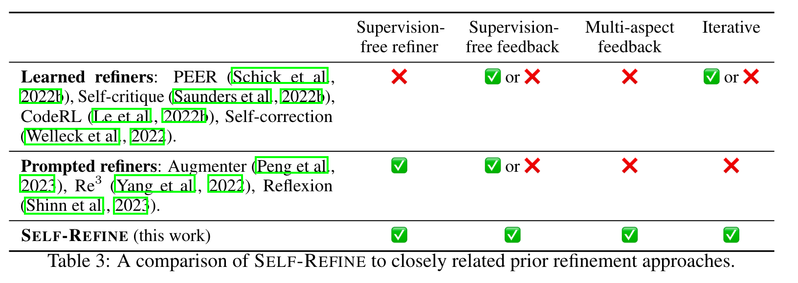

<a href="zotero://open-pdf/library/items/PHI2BBHP?page=15">“Table 5: Summary of related approaches.”</a> (<a href="zotero://select/library/items/FSH77WHR">Madaan et al., 2023, p. 15</a>)

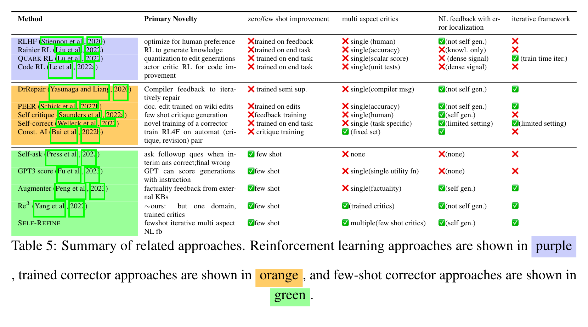

### <a href="zotero://open-pdf/library/items/PHI2BBHP?page=8">“Source of feedback.”</a> (<a href="zotero://select/library/items/FSH77WHR">Madaan et al., 2023, p. 8</a>)

<a href="zotero://open-pdf/library/items/PHI2BBHP?page=NaN">“Humans have been an effective source of feedback”</a> (<a href="zotero://select/library/items/FSH77WHR">Madaan et al., 2023, p. 8</a>) 人类一直是反馈的有效来源

<a href="zotero://open-pdf/library/items/PHI2BBHP?page=NaN">“Since human feedback is costly, several approaches use a scalar reward function as a surrogate of (or alternative to) human feedback”</a> (<a href="zotero://select/library/items/FSH77WHR">Madaan et al., 2023, p. 8</a>) 由于人类反馈的成本很高，因此有几种方法使用标量奖励函数作为人类反馈的替代（或替代）

<a href="zotero://open-pdf/library/items/PHI2BBHP?page=NaN">“Alternative sources such as compilers (Yasunaga and Liang, 2020) or Wikipedia edits (Schick et al., 2022b) can provide domain-specific feedback”</a> (<a href="zotero://select/library/items/FSH77WHR">Madaan et al., 2023, p. 8</a>) 编译器（Yasunaga 和 Liang，2020）或维基百科编辑（Schick 等人，2022b）等替代来源可以提供特定领域的反馈

<a href="zotero://open-pdf/library/items/PHI2BBHP?page=NaN">“Recently, LLMs have been used to generate feedback for general domains (Fu et al., 2023; Peng et al., 2023; Yang et al., 2022)”</a> (<a href="zotero://select/library/items/FSH77WHR">Madaan et al., 2023, p. 8</a>) 最近，LLM已被用来生成一般领域的反馈（Fu et al., 2023; Peng et al., 2023; Yang et al., 2022）

<a href="zotero://open-pdf/library/items/PHI2BBHP?page=NaN">“However, ours is the only method that generates feedback using an LLM on its own output, for the purpose of refining with the same LLM.”</a> (<a href="zotero://select/library/items/FSH77WHR">Madaan et al., 2023, p. 8</a>) 然而，我们的方法是使用 LLM 对其输出生成反馈的唯一方法，以便使用相同的 LLM 进行改进。

### <a href="zotero://open-pdf/library/items/PHI2BBHP?page=8">“Representation of feedback.”</a> (<a href="zotero://select/library/items/FSH77WHR">Madaan et al., 2023, p. 8</a>)

<a href="zotero://open-pdf/library/items/PHI2BBHP?page=NaN">“The form of feedback can be generally divided into natural language (NL) and non-NL feedback. Non-NL feedback can come in human-provided example pairs”</a> (<a href="zotero://select/library/items/FSH77WHR">Madaan et al., 2023, p. 8</a>) 反馈的形式一般可分为自然语言（NL）反馈和非NL反馈。非 NL 反馈可以出现在人类提供的示例对或评分中

<a href="zotero://open-pdf/library/items/PHI2BBHP?page=NaN">“In this work, we use NL feedback, since this allows the model to easily provide self -feedback using the same LM that generated the output, while leveraging existing pretrained LLMs such as GPT-4.”</a> (<a href="zotero://select/library/items/FSH77WHR">Madaan et al., 2023, p. 8</a>) 在这项工作中，我们使用 NL 反馈，因为这允许模型使用生成输出的相同 LM 轻松提供自反馈，同时利用现有的预训练 LLM（例如 GPT-4）。

### <a href="zotero://open-pdf/library/items/PHI2BBHP?page=9">“Types of refiners.”</a> (<a href="zotero://select/library/items/FSH77WHR">Madaan et al., 2023, p. 9</a>)

<a href="zotero://open-pdf/library/items/PHI2BBHP?page=NaN">“Since gathering supervised data is costly, some methods learn refiners using model generations”</a> (<a href="zotero://select/library/items/FSH77WHR">Madaan et al., 2023, p. 9</a>) 由于收集监督数据的成本很高，因此一些方法使用模型生成来学习refiner

<a href="zotero://open-pdf/library/items/PHI2BBHP?page=NaN">“However, the refiners are trained for each new domain”</a> (<a href="zotero://select/library/items/FSH77WHR">Madaan et al., 2023, p. 9</a>) 然而，refiner都是针对特定领域来性训练的

<a href="zotero://open-pdf/library/items/PHI2BBHP?page=NaN">“Finally, (Yang et al., 2022) use prompted feedback and refinement specifically tailored for story generation. In this work, we avoid training a separate refiner, and show that the same model can be used as both the refiner and the source of feedback across multiple domains.”</a> (<a href="zotero://select/library/items/FSH77WHR">Madaan et al., 2023, p. 9</a>) 最后，（Yang et al., 2022）使用专门为故事生成量身定制的提示反馈和改进。在这项工作中，我们避免训练单独的改进，并表明同一模型可以用作跨多个领域的改进和反馈源。

### <a href="zotero://open-pdf/library/items/PHI2BBHP?page=9">“Non-refinement reinforcement learning (RL) approaches.”</a> (<a href="zotero://select/library/items/FSH77WHR">Madaan et al., 2023, p. 9</a>)

## <a href="zotero://open-pdf/library/items/PHI2BBHP?page=9">“6 Limitations and Discussion”</a> (<a href="zotero://select/library/items/FSH77WHR">Madaan et al., 2023, p. 9</a>)

<a href="zotero://open-pdf/library/items/PHI2BBHP?page=NaN">“The main limitation of our approach is that the base models need to have sufficient few-shot modeling or instruction-following abilities, in order to learn to provide feedback and to refine in an in-context fashion, without having to train supervised models and rely on supervised data.”</a> (<a href="zotero://select/library/items/FSH77WHR">Madaan et al., 2023, p. 9</a>) 我们方法的主要限制是，基础模型需要具有足够的few-shot modeling或指令跟踪能力，以便学习提供反馈并以上下文方式进行改进，而无需训练监督模型并依赖关于监督数据。--对模型的能力的要求比较高

使用的模型都不开源

<a href="zotero://open-pdf/library/items/PHI2BBHP?page=NaN">“Another limitation of our work is that we exclusively experiment with datasets in English. In other languages, the current models may not provide the same benefits.”</a> (<a href="zotero://select/library/items/FSH77WHR">Madaan et al., 2023, p. 9</a>) 我们工作的另一个限制是我们只用英语数据集进行实验。在其他语言中，当前模型可能无法提供相同的好处。--只用了英语

--没有防止生成有害的文本

 

## <a href="zotero://open-pdf/library/items/PHI2BBHP?page=9">“7 Conclusion”</a> (<a href="zotero://select/library/items/FSH77WHR">Madaan et al., 2023, p. 9</a>)
