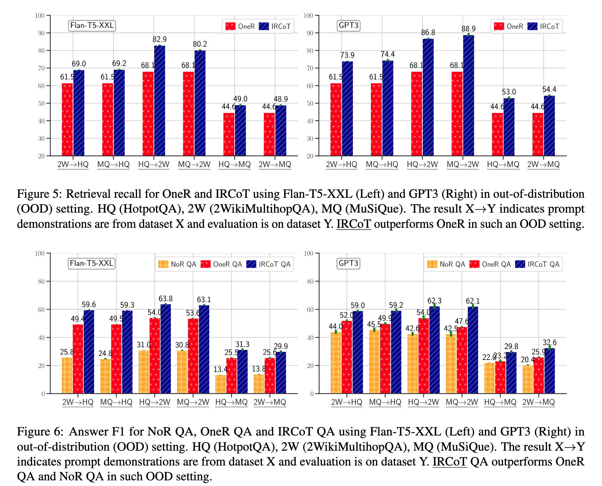

# Interleaving Retrieval with Chain-of-Thought Reasoning for Knowledge-Intensive Multi-Step Questions

## Abstract

问题：在multi_setp QA场景中，CoT可以提升LLM的能力，但是如果需要外部知识的话（LLM未知或过时），则需要进行多次检索

要检索的内容取决于已经推导出来的内容，而这又可能取决于先前检索到的内容。

提出了*IRCoT*

## 1. Introduction

- 图1中的例子：Lost Gravity 是哪个国家制造的？
  - Lost Gravity是一个过山车，位于荷兰的Walibi Holland
  - **由Mack Rides公司制造**
  - **Mack Rides是一家德国的公司**
  - **所以Lost Gravity是德国制造的**

- 检索和推理的过程必须相互支撑（inform each other），因此提出了一个检索和推理交错（interleaving approach）的方法**「IRCoT」**，交替以下两个步骤：
  - **extend CoT**：使用*问题*、目前为止收集到的*段落（paragraph）*信息和目前生成的*CoT句子*来==生成下一个CoT句子==。
  - **expand retrieval information**：使用最新的CoT句子作为查询（query），==检索额外的段落==并加入到收集的集合中。
  - > 重复以上两个步骤直至CoT提示给出答案或到达设置的最大推理步骤
    >
    > 最后将所有收集到的检索的输出作为上下文进行prompting来问答
  
- 数据集：
  
  - HotpotQA (Yang et al., 2018)
  - 2WikiMultihopQA (Ho et al., 2020)
  - MuSiQue (Trivedi et al., 2022)
  - IIRC (Ferguson et al., 2020)
  
- LLMs：
  
  - OpenAI GPT3 (code-davinci-002)
  - Flan-T5 models (11B, 3B, and 0.7B)
  
- 此外，这些改进也在分布外的情况（out-of-distribution, OOD）下保持稳定，在这种情况下，一个数据集的演示用于测试另一个数据集。

- **contribution**

  - IRCoT提升*在多步开放域QA的数据集中*的检索（retrieval）和少样本问答（few-shot QA）的性能，在IID和OOD的场景下都适用
  - 减少CoTs中的事实错误
  - 提升大模型和小规模的模型的性能

## 2. Related Work

- Prompting for Open-Domain QA：开放域问答的Prompting
  - few-shot、CoT
  - 多步问答：
    - SelfAsk (Press et al., 2022)：分解问题
    - DecomP (Khot et al., 2023)：分解任务
    - ReAct (Yao et al., 2022)：生成reasoning-action步骤的序列
- Supervised Multi-Step Open-Domain QA：监督多步开放域问答

## 3. Chain-of-Thought-Guided Retrieval and Open-Domain QA

retrieve-and-read paradigm (Zhu et al., 2021)：首先retriever从知识源检索文档，然后QA模型读取问题和检索的文档来生成最终答案

>  在多步推理问题中，前一步的检索可以引导后一步的推理————>交错策略（interleaving strategy）

### 3.1 Interleaving Retrieval with Chain-of-Thought Reasoning

==IRCoT== 从三个要素实例化：

1. 基础的检索器==retriever==，输入query，从语料库或知识源中输出给定数量的段落paragraph
2. 具备CoT生成能力的语言模型==language model==
3. 带有能够解释答案的推理步骤的问题==questions==、来自知识源的能够支持推理链和答案的段落==paragraph==

==IRCoT==：首先使用**question Q**作为query来检索K个paragraph。然后交替**reason**和**retrieve**步骤直到达到结束的判断

- ==Reason==
  - 使用question、目前为止收集到的paragraphs和目前为止生成的CoT句子
  - prompt template：
    - `Wikipedia Title: <Page Title>` 
      `<Paragraph Text> ...` 
      `Wikipedia Title: <Page Title>`
      `<Paragraph Text>`
      `Q: <Question>` 
      `A: <CoT-Sent-1> ... <CoT-Sent-n>`
  - 对于上下文演示**in-context demonstrations**
    - CoT：使用上述格式的完整COT
    - Paragraph：使用上述格式的真实段落和随机取样的段落，并将他们混合
  - 对于测试实例**test instance**
    - CoT：使用模型目前为止生成的CoT来让模型完成剩下的
    - Paragraph：前面检索的所有的paragraph
- ==Retrieve==
  - 使用最后生成的CoT句子作为查询来检索更多段落，并将它们添加到已收集的段落中。

### 3.2 Question Answering Reader

QA reader使用检索到的段落回答问题，两种：

1. CoT Prompting
   - Prompt template：
     - `Wikipedia Title: <Page Title>` 
       `<Paragraph Text> ...` 
       `Wikipedia Title: <Page Title>`
       `<Paragraph Text>`
       `Q: <Question>` 
       `A: <CoT-Sent-1> ... <CoT-Sent-n>`
   - 最后一个CoT句子是：'answer is: ...'
   - 如果没有按照格式就返回所有的生成作为结果
2. Direct Prompting
   - Prompt template：
     - `Wikipedia Title: <Page Title>` 
       `<Paragraph Text> ...` 
       `Wikipedia Title: <Page Title>`
       `<Paragraph Text>`
       `Q: <Question>` 
       `A: <Final Answer>`

## 4 Experimental Setup 实验设置

数据集：

- 4 multi-step QA datasets in the open-domain setting：

  - HotpotQA (Yang et al., 2018)
    - 对于HotpotQA，我们在开放域的设定中使用附带的维基百科语料库。

  - 2WikiMultihopQA (Ho et al., 2020)

  - answerable subset of MuSiQue (Trivedi et al., 2022)

  - answerable subset of IIRC (Ferguson et al., 2020)
    - 其他三个：最初是在阅读理解或混合环境中出现的，使用相关上下文来构建一个语料库，用于我们的开放领域设置。

对于每个数据集，我们从原始数据集中随机抽取100个问题来调整超参数，并将另外随机抽取的500个问题作为测试集。

> IIRC与其他数据集的结构略有不同，其问题基于一个主要段落，其他支持段落来自维基百科页面中提到的实体。

### 4.1 Models 模型

- **Retriever**：elasticsearch中部署的BM25作为基础检索器

  - One-step Retriever **(OneR)**：使用问题作为查询来检索K段落。
  - ==IRCoT== Retriever：BM25（底层检索器）+OpenAI GPT3 (code-davinci-002)/Flan-T5
    - 为语言模型展示上下文的示例：
      - 为每个数据集编写了20个问题的CoTs（附录§G）
      - 创造3个训练集，每个数据集取样15个问题
      - 对于每个实验，我们使用第一个训练集探索开发集的最佳超参数，并使用选定的超参数在测试集上评估每个测试集。
      - 报告每个实验的这3个结果的均值和标准差。
    - 测试test：
      - 取尽可能多的demonstrations（模型上下文窗口大小，GPT-8k，T5-6k，T5没有最大，因为它使用相对位置嵌入，但是6k符合显卡内存的最大）
    - IRCoT的超参数K ∈ {2, 4, 6, 8}：每一步检索的段落数量
    - 在训练时，选M ∈ {1, 2, 3}作为干扰段落

- **Retrieval Metric**:检索度量

  - retriever最多包涵15个段落，测量最佳段落的召回

- **QA Reader**：IRCoT中同一个LMs

  - T5-Flan直接prompt更好，GPT3使用CoT更好
  - QA Reader的超参数M ∈ {1, 2, 3}：在上下文演示中的干扰段落数量。

- **Open-Domain QA (ODQA) Models**：

  - OneR QA：使用问题作为查询来检索K段落
  - ==IRCoT QA==
  - NoR QA：不检索，看模型使用其自身参数对问题的回答能力

  为了选择ODQA模型的最佳超参数，我们搜索使开发集上答案F1最大化的超参数K和M。

## 5 Results

### ==IRCoT retrieval== IRCoT retrieval is better than one-step.

> 检索的召回

### ==IRCoT QA== IRCoT QA outperforms NoR and OneR QA.

> 问题的回答的F1

- 对于GPT3，尽管在检索方面有显著改进（如图3所示的21分），IRCoT并未提高IIRC上的问答得分
  - 这很可能是因为**IIRC的相关知识可能已经存在于GPT3中**，也可以从其NOR QA分数类似的情况下得到证明。

### IRCoT is effective in OOD setting.

> 评估 NoR、OneR 和 IRCoT 在泛化到新数据集上的表现，即 OOD 设置。
>
> ​	使用一个数据集中的prompt演示来评估另一个数据集

IRCoT 检索优于 OneR（图5），而 IRCoT 问答优于 OneR 问答和 NoR 问答（图6）。

### IRCoT generates CoT with fewer factual errors.

CoT 至少有一个事实错误的情况

- IRCoT在HotpotQA上将事实错误减少了50％
- 在2WikiMultihopQA上减少了40％

### IRCoT is also effective for smaller models.

> 使用Flan-T5{base (0.2B), large (0.7B), XL (3B), XXL (11B)}对OneR和IRCoT的召回做对比

> 检索召回

即使是最小的模型IRCoT也比OneR好，这表明即使是小型模型也可以利用CoT生成能力来改善检索。

> 回答F1

在所有数据集中，拥有 3B 模型的 IRCoT 甚至比拥有规模为175B的 GPT3 模型58倍大的 OneR 和 NoR 表现更优秀

### IRCoT is SOTA for few-shot multistep ODQA.

>  对比实验：
>
> - InternetAugmented QA (Lazaridou et al., 2022)
> - RECITE (Sun et al., 2022) 
> - ReAct (Yao et al., 2022)
> - SelfAsk (Press et al., 2022)
> - DecomP (Khot et al., 2022)

> EM and F1 scores

## 6 Conclusions

我们利用CoT的能力来改进检索，从而提高在少样本设置下复杂知识密集型开放领域任务的问答性能。单步问题检索对于这类任务是不够的，并引入了IRCoT，它使用交错的CoT推理和检索步骤相互指导彼此逐步进行。在四个数据集上，与单步检索相比，IRCoT显著提高了检索和问答性能，无论是针对大型还是相对较小规模的语言模型。此外，由IRCoT生成的CoTs包含更少的事实错误。

## Limitations

- 依赖具有少样本提示或零样本提示能力的语言模型
  - 给更小的LMs赋予推理能力，使IRCoT与更多的LM兼容。
- 依赖具有长上下文窗口的语言模型
  - 未来的工作可以探索重新排名和选择检索到的段落的策略，而不是将它们全部传递给语言模型，以减轻语言模型需要支持长输入的需求。
- IRCoT检索器和QA的性能提升（相对于OneR和ZeroR基线）伴随着额外的计算成本。这是因为IRCoT为CoT的每个句子单独调用(L)LM。
  - 未来的工作可以集中在如动态决定何时检索更多信息以及何时使用当前信息进行额外推理。

- 最后，我们的一部分实验是使用来自OpenAI的商业LLM API（代码：davinci-002）进行的。

## Ethical Considerations 伦理考量
