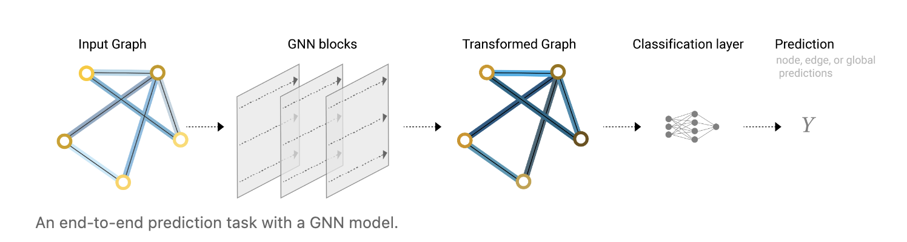

# A Gentle Introduction to Graph Neural Networks

- 节点、边、全局的表示
  - 

## Graphs

- 图片表示成图
  - 中间是邻接矩阵，表示节点之间的关系
  - 
- 文本表示成图
  - 有向图
  - 
- 社交网络
  - 

## What types of problems have graph structured data?

### Graph-level task

对图分类

### Node-level task

节点分类

### Edge-level task

预测边的属性

## The challenges of using graphs in machine learning

如何表示图使得与神经网络兼容

邻接矩阵是个稀疏的矩阵，占用空间大，并且节点的排序不同会导致矩阵不同，但是他们所表示的图是相同的

结局：邻接列表

## Graph Neural Networks

>  **A GNN is an optimizable transformation on all attributes of the graph (nodes, edges, global-context) that preserves graph symmetries (permutation invariances).** 
>
> - symmetries 对称性
> - 保持图的对称性：将图的顶点进行另外的排序之后，结果是不变的
>
> 用信息传递的神经网络框架
>
> - GNN输入和输出都是图，改变图中的顶点、边和全局的向量进行变换，但是不会改变图的连接性（形状）

### The simplest GNN

- 全局向量、顶点向量、全局向量分别构造一个MLP，MLP输入的大小和输出的大小是相同的
- 三个MLP组成了一个GNN的层

### GNN Predictions by Pooling Information 预测

- 最简单的情况：
  - 
  - 通过GNN得到对应的向量表示（最后一层的输出，是一个图），在后面加一个FC层和一个softmax，得到输出
- 复杂的情况，对顶点做预测，但是没有顶点的向量
  - 使用Pooling（汇聚）拿到与这个点相连接的边的向量和全局的向量，加起来得到表示这个点的向量（这里假设顶点、边和全局向量的维度相同，如果不同还要做一些投影）
    - 
  - 即只用边和向量得到节点的向量
    - 
- 没有边的向量
  - 
- 没有全局向量
  - 

简单的GNN网络：

- 给一个图，进入一系列的GNN层，每一个层就是三个MLP，对应三种不同的属性，最后的输出会得到一个保持的图结构的输出，但是里面的值都是学习到的表示
- 最后更具要对哪一些属性进行预测的话，就添加合适的输出层
- 确实信息的话就加入合适的汇聚层（pooling）
- 
- 简单的GNN的局限性：
  - <u>*在每个属性做变换的时候没有使用图的结构性信息，即每个属性自己进入MLP，没有看到连接信息*</u>

### Passing messages between parts of the graph 信息传递

- 把节点的向量和节点的两句的向量都加在一起得到汇聚的向量，在进入MLP就会得到MLP
  - **聚合信息**
  - 等价于对图片做卷积，但是核窗口的权重是一样的
  - 

### Learning edge representations 

顶点的信息传递给边，在把边的信息传递给顶点

- 顶点的信息汇聚给边->更新->更新过的边的信息汇聚给顶点->更新

- 顶点先给边边再给顶点与反过来的结果不同
- 顶点和边相互交换信息

### Adding global representations 全局信息

每一次只看自己的邻居，如果一个图很大，消息传递到比较远的点要很长的路径

- 加入**master node**或者说叫**context vector**
  - 是一个虚拟的点，可以和所有的点、边相连，汇聚信息的时候都考虑它
- 

- 有点像attention mechanism ，因为拿到相关的信息

## GNN playground

- 模型科学系参数的大小和最后的测试的AUC之间的关系
  - 
    - 模型参数变多的时候，AUC的上限在增加
    - 参数影响很大
- 嵌入的dimension的影响
  - 
    - 图中的中间的横线表示中值，块bar表示的是25%到75%，线是最小值和最大值
      - 中值越高越好
      - bar不要太长->不敏感
- 层数的影响
  - 
  - 层数增加，中值增加，但是方差变大
- 不同的聚合的方式
  - sum、mean、max
    - 
- 如何传递信息
  - 
    - 都传递信息比较好，但是参数没调好的话会有outlier异常值
    - 顶点和全局也算好的

## Into the Weeds

### Other types of graphs (multigraphs, hypergraphs, hypernodes, hierarchical graphs)

- multigraph，有多种边
- 图是分层的（超图）

### Sampling Graphs and Batching in GNNs 如何采样和做batching

- 假设有很多层，最后一层的一个顶点也会能看到很大的图，计算梯度的时候可能无法承受
- 需要对图进行采样，每次采样一个子图，在子图上做信息的汇聚
  - 随机采样点，找到点的最近的邻居
  - 随机游走采样
  - 随机走n步，找到n步的点的邻居
  - 做宽度遍历，找高阶邻居
- 与采样相关的问题是做batching，从计算性能上来讲，不希望对每一个点逐步更新（不利于并行）
  - 每一个顶点的邻居不一样，如何把这些顶点和邻居合并成一个规则的张量

### Inductive biases

任何一个机器学习的模型都有一些假设在里面，不做假设就学不出来

- CNN：空间变换的不变性
- RNN：时序的连续性
- GNN：保持图的对称性

### Comparing aggregation operations

没有一个聚合的操作是比另一个更好的，=>找合适的

### GCN as subgraph function approximators

GCN作为一个子图的函数近似

GCN=>带汇聚的GNN

GCN如果有k个层，每一层看一个邻居就等价于CNN里面有k层3x3的卷积，每一个最后的顶点看到的是一个子图

### Edges and the Graph Dual 点和边做对偶

### Graph convolutions as matrix multiplications, and matrix multiplications as walks on a graph

在图上做卷积或者是random walk 等价于拿出来邻接矩阵，然后做一个矩阵的乘法

### Graph Attention Networks 

在图上做汇聚的时候也可以做加权和

注意：卷积的权重是和位置相关的，但是在图上不需要有位置信息，因此需要找权重对位置是不敏感的，因此可以用注意力机制

- 权重取决于两个顶点向量之间的关系$𝑓(𝑛𝑜𝑑𝑒_𝑖,𝑛𝑜𝑑𝑒_𝑗)$
- 评分函数可以解释为衡量相邻节点与中心节点的相关性的函数。
- 权重可以进行归一化，例如使用softmax函数，将大部分权重集中在与任务相关的最相关的邻居上

### Graph explanations and attributions 可解释性