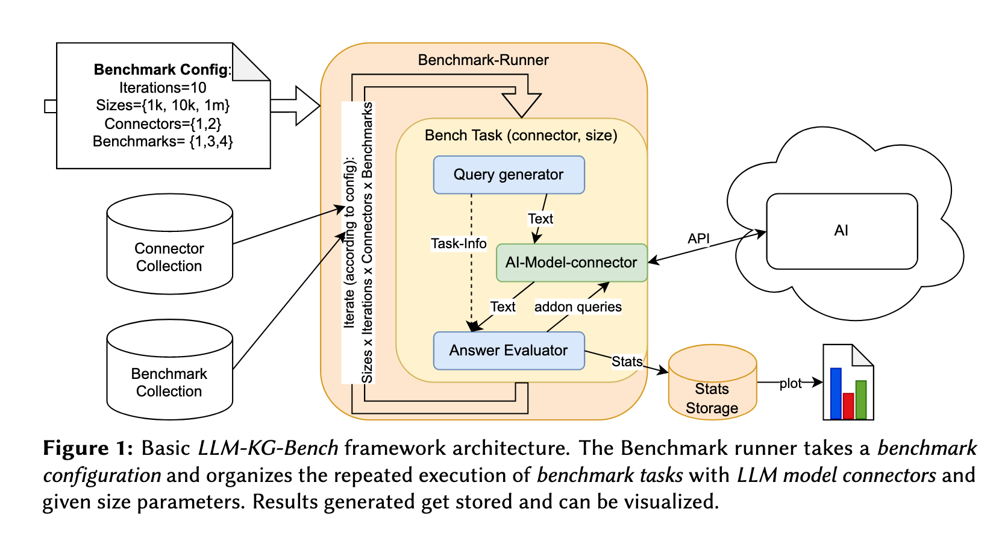
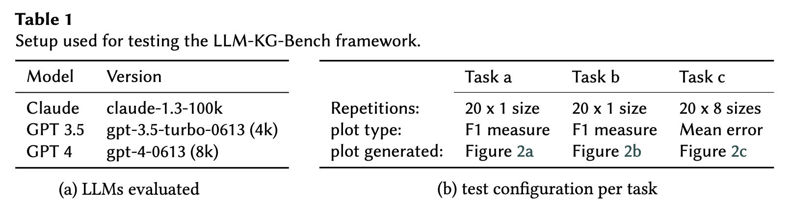
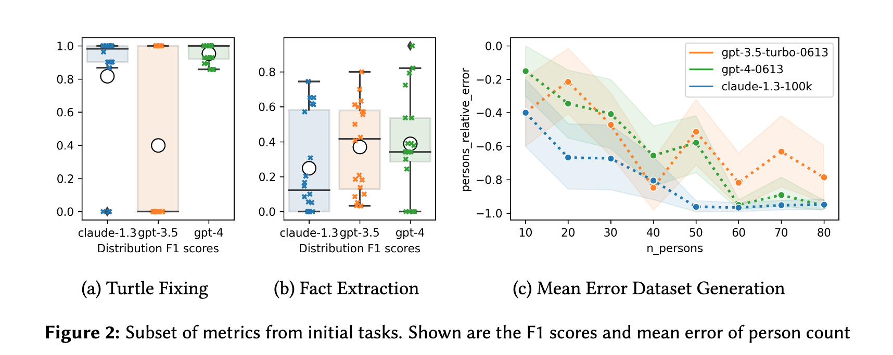

# <a href="zotero://open-pdf/library/items/IAP5RZVP?page=1">“Developing a Scalable Benchmark for Assessing Large Language Models in Knowledge Graph Engineering”</a> (<a href="zotero://select/library/items/TYK3M94N">Meyer et al., 2023, p. 1</a>)

Comment: To be published in SEMANTICS 2023 poster track proceedings. SEMANTICS 2023 EU: 19th International Conference on Semantic Systems, September 20-22, 2023, Leipzig, Germany

在知识图谱工程中开发一个可扩展的评估大型语言模型的基准

## <a href="zotero://open-pdf/library/items/IAP5RZVP?page=1">“Abstract”</a> (<a href="zotero://select/library/items/TYK3M94N">Meyer et al., 2023, p. 1</a>)

随着大型语言模型（LLM）领域的快速发展，评估和监测其性能变得至关重要。

我们介绍了一个专注于知识图谱工程（KGE）的基准框架，并提出了三个挑战，分别涉及语法和错误修正、事实提取以及数据集生成。

我们展示了，虽然LLMs是一个有用的工具，但它们还不适合在zero-shot提示下辅助知识图谱生成。

因此，我们的LLM-KG-Bench框架提供了LLM响应的自动评估和存储功能，以及统计数据和可视化工具，支持追踪提示工程和模型性能。

## <a href="zotero://open-pdf/library/items/IAP5RZVP?page=1">“1. Introduction”</a> (<a href="zotero://select/library/items/TYK3M94N">Meyer et al., 2023, p. 1</a>)

在知识图谱工程（KGE）和语义网的背景下，对LLMs的应用和（自动化）评估仍然是一个极少被探索的领域。

**LLM-KG-Bench**：本文提出了一个首个LLM KGE基准测试框架LLM-KG-Bench，该框架符合我们在KGE场景中不同任务的自动化和持续评估平台的愿景。通过对三个KGE任务的三个LLM进行比较，对该框架进行了测试。

## <a href="zotero://open-pdf/library/items/IAP5RZVP?page=2">“2. Related Work”</a> (<a href="zotero://select/library/items/TYK3M94N">Meyer et al., 2023, p. 2</a>)

现有的评估都没有包含KGE的相关工作，因为知识图谱相对于当前LLMs上下文的大小而言变得非常庞大

## <a href="zotero://open-pdf/library/items/IAP5RZVP?page=2">“3. The LLM-KG-Bench Framework”</a> (<a href="zotero://select/library/items/TYK3M94N">Meyer et al., 2023, p. 2</a>)

我们目前（并将继续）在本文中展示的工作包括设计和实现模块化的LLM-KG-Bench框架，用于在知识图谱工程背景下对LLMs进行基准测试。

主要关注的是自动化评估程序，以允许进行多次重复的测试执行。

该框架支持可配置的任务大小，因为LLM上下文大小对于KGE任务的相关性有重要影响。

由于我们的目标是尽可能实现兼容性，特别是在BIG-bench方向上，LLM-KG-Bench框架围绕基准任务和LLM模型连接器进行组织，并通过一些代码进行执行组织和结果持久化。

LLM模型连接器封装了与特定LLM的连接，并提供generate_text功能。通过这个功能，基准任务可以向LLM发送提示并获取其答案。基准任务处理单个任务的LLM评估。在evaluate_model函数中，他们通常为LLM构建一个提示或任务描述，通过LLM模型连接器将此任务交给指定的LLM，并评估给定的答案。如果需要，基准任务可以在评估过程中向LLM发送额外的提示。评估结果以任务特定定义的得分类型和附加信息的形式呈现。

由于LLM-KG-Bench的模块化，如图1所示，只需添加相应的Python类定义即可添加额外的基准任务和LLM模型连接器。该框架通过seaborn提供基本结果可视化支持。图2中显示的绘图是以这种方式生成的。

## <a href="zotero://open-pdf/library/items/IAP5RZVP?page=3">“4. Initial Evaluation of the Framework with first Tasks”</a> (<a href="zotero://select/library/items/TYK3M94N">Meyer et al., 2023, p. 3</a>)

为了测试LLM-KG-Bench框架，我们添加了几个基准任务，并评估了LLMSYS Chatbot Arena Leaderboard上当前排名最高的三个LLMs。测试设置详见表1。

**Task a: Fixing of Errors in Turtle Files:**

Turtle是知识图的常用序列化格式。通过要求LLMs修复给定的操纵过的turtle文件，我们测试了他们对turtle语法的理解以及严格遵守给定任务和事实的能力。

在评估过程中计算的得分之一是基于可解析的标准化三元组的F1度量，将LLM的答案与完美答案进行比较。图2a显示了该任务的F1度量结果曲线。GPT-3.5经常声称文件是正确的，并且不返回任何turtle。这就解释了零值F1得分频率高的原因。Claude-1.3和GPT-4给出的答案更好一些。

**Task b: KG Creation from Factsheet Plaintext: 从事实纯文本创建知识图谱**

为了评估知识提取和建模能力，我们使用一个PDF事实表的纯文本摘录。该文本以键值对的方式描述了3D打印机的各种规格，包括与PDF提取相关的常见格式不规范。我们要求模型生成一个Turtle文件，其中捕捉了部分信息。

该提示非常具体，涉及使用哪些属性或本体以及如何表示IRI标识符和文字。

随后，我们可以使用F1度量来评估单个回答的质量，计算可解析三元组集与手动策划的参考文档相比（不）匹配或缺失的数量。

图2b显示GPT模型在这个任务中表现优于Claude。虽然GPT4的平均值更好，但由于有一个非常好的回答，它经常回复无法解析的内容，而这种情况在GPT3.5中并没有发生，导致了稍微更好的中位数。

**Task c: Synthetic Dataset Generation: 合成数据集生成**

创建示例数据是一项重要的任务，非常希望LLMs的帮助。我们为这个能力创建了一个基本测试。

我们要求LLM使用众所周知的foaf:Person和foaf:knows生成一些合成数据集，其中包含最终知识图谱中所需对象和链接数量不同的情况。

在评估中，我们除了使用其他分数外，还使用了persons\_relative\_error来表示生成的实际人物对象数量与所要求数量之间的差异。

如果它们匹配，该值将被归一化为= 0；如果人数超过要求，则> 0；如果人数不足，则< 0。特殊情况下的-1表示空图。图2c中呈现的结果显示了persons\_relative\_error与问题规模之间的关系，在本例中是要生成的person对象数量。

## <a href="zotero://open-pdf/library/items/IAP5RZVP?page=4">“5. Conclusion and Future Work”</a> (<a href="zotero://select/library/items/TYK3M94N">Meyer et al., 2023, p. 4</a>)

我们展示了迅速发展的LLMs的知识图谱工程能力需要进行测量。我们提出并描述了用于此任务的新颖LLM-KG-Bench框架。对三个排名较高的LLMs进行首次基准评估显示了使用新框架进行自动化评估的好处。

LLM-KG-Bench框架旨在实现基准任务和LLMs之间的对话。评估LLMs通过一些反馈（例如改进或附加任务中的错误代码）来修正其答案的能力将是有趣的。我们期待着借助更大的社区扩展到更多LLMs和更多基准任务。

Referred in <a href="zotero://note/u/LJSU8E3B/?ignore=1&#x26;line=30" rel="noopener noreferrer nofollow" zhref="zotero://note/u/LJSU8E3B/?ignore=1&#x26;line=30" ztype="znotelink" class="internal-link">LLM</a>
