# <a href="zotero://open-pdf/library/items/M65XPXLY?page=1">“Unifying Large Language Models and Knowledge Graphs: A Roadmap”</a> (<a href="zotero://select/library/items/M23XTJ6D">Pan et al., 2023, p. 1</a>)

Comment: 29 pages, 25 figures

## <a href="zotero://open-pdf/library/items/M65XPXLY?page=1">“Abstract”</a> (<a href="zotero://select/library/items/M23XTJ6D">Pan et al., 2023, p. 1</a>)

<a href="zotero://open-pdf/library/items/M65XPXLY?page=NaN">“However, LLMs are black-box models, which often fall short of capturing and accessing factual knowledge”</a> (<a href="zotero://select/library/items/M23XTJ6D">Pan et al., 2023, p. 1</a>) 然而，LLMs是黑盒模型，通常无法捕获和访问事实知识

<a href="zotero://open-pdf/library/items/M65XPXLY?page=NaN">“Knowledge Graphs (KGs), Wikipedia and Huapu for example, are structured knowledge models that explicitly store rich factual knowledge”</a> (<a href="zotero://select/library/items/M23XTJ6D">Pan et al., 2023, p. 1</a>) 知识图谱（KG），例如维基百科和花普，是显式存储丰富事实知识的结构化知识模型

<a href="zotero://open-pdf/library/items/M65XPXLY?page=NaN">“Meanwhile, KGs are difficult to construct and evolving by nature, which challenges the existing methods in KGs to generate new facts and represent unseen knowledge.”</a> (<a href="zotero://select/library/items/M23XTJ6D">Pan et al., 2023, p. 1</a>) 同时，知识图谱本质上难以构建和进化，给现有的知识图谱方法在生成新事实和表示未见知识方面带来了挑战

<a href="zotero://open-pdf/library/items/M65XPXLY?page=NaN">“KGs can enhance LLMs by providing external knowledge for inference and interpretability.”</a> (<a href="zotero://select/library/items/M23XTJ6D">Pan et al., 2023, p. 1</a>) 知识图谱可以通过提供用于推理和可解释性的外部知识来增强LLM。

<a href="zotero://open-pdf/library/items/M65XPXLY?page=1"><strong>“three general frameworks,”</strong></a> (<a href="zotero://select/library/items/M23XTJ6D">Pan et al., 2023, p. 1</a>)

1.  <a href="zotero://open-pdf/library/items/M65XPXLY?page=NaN">“KG-enhanced LLMs, which incorporate KGs during the pre-training and inference phases of LLMs, or for the purpose of enhancing understanding of the knowledge learned by LLMs”</a>

    (<a href="zotero://select/library/items/M23XTJ6D">Pan et al., 2023, p. 1</a>)

    知识图谱增强型LLM，在LLM的预训练和推理阶段纳入知识图谱，或为了增强对LLM所学知识的理解

2.  <a href="zotero://open-pdf/library/items/M65XPXLY?page=NaN">“LLM-augmented KGs, that leverage LLMs for different KG tasks such as embedding, completion, construction, graph-to-text generation, and question answering”</a>

    (<a href="zotero://select/library/items/M23XTJ6D">Pan et al., 2023, p. 1</a>)

    LLM 增强知识图谱，利用 LLM 执行不同的知识图谱任务，例如嵌入、完成、构建、图形到文本生成和问答

3.  <a href="zotero://open-pdf/library/items/M65XPXLY?page=NaN">“Synergized LLMs + KGs, in which LLMs and KGs play equal roles and work in a mutually beneficial way to enhance both LLMs and KGs for bidirectional reasoning driven by both data and knowledge”</a>

    (<a href="zotero://select/library/items/M23XTJ6D">Pan et al., 2023, p. 1</a>)

    协同LLM + KG，其中LLM和KG发挥平等作用，以互惠互利的方式工作，以增强LLM和KG的数据和知识驱动的双向推理能力

## <a href="zotero://open-pdf/library/items/M65XPXLY?page=1">“1 INTRODUCTION”</a> (<a href="zotero://select/library/items/M23XTJ6D">Pan et al., 2023, p. 1</a>)

<a href="zotero://open-pdf/library/items/M65XPXLY?page=1">“emergent ability”</a> (<a href="zotero://select/library/items/M23XTJ6D">Pan et al., 2023, p. 1</a>)

<a href="zotero://open-pdf/library/items/M65XPXLY?page=NaN">“lack of factual knowledge.”</a> (<a href="zotero://select/library/items/M23XTJ6D">Pan et al., 2023, p. 1</a>) 缺乏事实知识。

<a href="zotero://open-pdf/library/items/M65XPXLY?page=NaN">“Specifically, LLMs memorize facts and knowledge contained in the training corpus”</a> (<a href="zotero://select/library/items/M23XTJ6D">Pan et al., 2023, p. 1</a>) 具体来说，LLMs会记忆训练语料库中包含的事实和知识。

<a href="zotero://open-pdf/library/items/M65XPXLY?page=NaN">“However, further studies reveal that LLMs are not able to recall facts and often experience hallucinations by generating statements that are factually incorrect”</a> (<a href="zotero://select/library/items/M23XTJ6D">Pan et al., 2023, p. 1</a>) 然而，进一步的研究表明，LLM无法回忆事实，并且经常通过生成实际上不正确的陈述而产生幻觉

<a href="zotero://open-pdf/library/items/M65XPXLY?page=NaN">“trustworthiness of LLMs.”</a> (<a href="zotero://select/library/items/M23XTJ6D">Pan et al., 2023, p. 1</a>) LLMs的可信度。

<a href="zotero://open-pdf/library/items/M65XPXLY?page=NaN">“As black-box models, LLMs are also criticized for their lack of interpretability.”</a> (<a href="zotero://select/library/items/M23XTJ6D">Pan et al., 2023, p. 1</a>) 作为黑盒模型，LLMs也因其缺乏可解释性而受到批评。

<a href="zotero://open-pdf/library/items/M65XPXLY?page=NaN">“It is difficult to interpret or validate the knowledge obtained by LLMs.”</a> (<a href="zotero://select/library/items/M23XTJ6D">Pan et al., 2023, p. 1</a>) 解释或验证LLM获得的知识很困难。

<a href="zotero://open-pdf/library/items/M65XPXLY?page=NaN">“Moreover, LLMs perform reasoning by a probability model, which is an indecisive process [16].”</a> (<a href="zotero://select/library/items/M23XTJ6D">Pan et al., 2023, p. 2</a>) 此外，LLMs通过概率模型进行推理，这是一个不确定的过程\[16]。

<a href="zotero://open-pdf/library/items/M65XPXLY?page=NaN">“The specific patterns and functions LLMs used to arrive at predictions or decisions are not directly accessible or explainable to humans”</a> (<a href="zotero://select/library/items/M23XTJ6D">Pan et al., 2023, p. 2</a>) LLM用于做出预测或决策的特定模式和功能人类无法直接访问或解释

<a href="zotero://open-pdf/library/items/M65XPXLY?page=2">“chain-of-thought”</a> (<a href="zotero://select/library/items/M23XTJ6D">Pan et al., 2023, p. 2</a>)

<a href="zotero://open-pdf/library/items/M65XPXLY?page=NaN">“their reasoning explanations also suffer from the hallucination issue”</a> (<a href="zotero://select/library/items/M23XTJ6D">Pan et al., 2023, p. 2</a>) 他们的推理解释也受到幻觉问题的影响

<a href="zotero://open-pdf/library/items/M65XPXLY?page=NaN">“This severely impairs the application of LLMs in high-stakes scenarios, such as medical diagnosis and legal judgment.”</a> (<a href="zotero://select/library/items/M23XTJ6D">Pan et al., 2023, p. 2</a>) 这严重影响了LLMs在医疗诊断和法律判断等高风险场景中的应用。

<a href="zotero://open-pdf/library/items/M65XPXLY?page=NaN">“This raises another issue that LLMs trained on general corpus might not be able to generalize well to specific domains or new knowledge due to the lack of domain-specific knowledge or new training data [18].”</a> (<a href="zotero://select/library/items/M23XTJ6D">Pan et al., 2023, p. 2</a>) 这引发了另一个问题，即基于通用语料库训练的LLMs可能由于缺乏领域特定知识或新的训练数据而无法很好地推广到特定领域或新知识。

<a href="zotero://open-pdf/library/items/M65XPXLY?page=NaN">“To address the above issues, a potential solution is to incorporate knowledge graphs (KGs) into LLMs.”</a> (<a href="zotero://select/library/items/M23XTJ6D">Pan et al., 2023, p. 2</a>) 为了解决上述问题，一个潜在的解决方案是将知识图谱（KG）与LLM结合

**知识图谱：**

<a href="zotero://open-pdf/library/items/M65XPXLY?page=2">“Knowledge graphs (KGs), storing enormous facts in the way of triples,”</a> (<a href="zotero://select/library/items/M23XTJ6D">Pan et al., 2023, p. 2</a>) 以三元组的方式存储大量事实

<a href="zotero://open-pdf/library/items/M65XPXLY?page=2">“are a structured and decisive manner of knowledge representation是一种结构化和决定性的知识表示方式”</a> (<a href="zotero://select/library/items/M23XTJ6D">Pan et al., 2023, p. 2</a>)

<a href="zotero://open-pdf/library/items/M65XPXLY?page=NaN">“offer accurate explicit knowledge [19].”</a> (<a href="zotero://select/library/items/M23XTJ6D">Pan et al., 2023, p. 2</a>) 提供准确明确的知识

<a href="zotero://open-pdf/library/items/M65XPXLY?page=NaN">“Besides, they are renowned for their symbolic reasoning ability [22], which generates interpretable results.”</a> (<a href="zotero://select/library/items/M23XTJ6D">Pan et al., 2023, p. 2</a>) 此外，它们以其符号推理能力而闻名\[22]，可以产生可解释的结果。

<a href="zotero://open-pdf/library/items/M65XPXLY?page=NaN">“KGs can also actively evolve with new knowledge continuously added in”</a> (<a href="zotero://select/library/items/M23XTJ6D">Pan et al., 2023, p. 2</a>) KG 还可以随着新知识的不断添加而积极发展

<a href="zotero://open-pdf/library/items/M65XPXLY?page=NaN">“Additionally, experts can construct domain-specific KGs to provide precise and dependable domain-specific knowledge”</a> (<a href="zotero://select/library/items/M23XTJ6D">Pan et al., 2023, p. 2</a>) 此外，专家可以构建特定领域的知识图谱，以提供精确可靠的特定领域知识

<a href="zotero://open-pdf/library/items/M65XPXLY?page=2">“Nevertheless, KGs are difficult to construct [33], and current approaches in KGs [25], [27], [34] are inadequate in handling the incomplete and dynamically changing nature of real-world KGs.”</a> (<a href="zotero://select/library/items/M23XTJ6D">Pan et al., 2023, p. 2</a>)

然而，构建KGs很困难\[33]，目前在KGs \[25]、\[27]、\[34]中的方法无法处理现实世界KGs的不完整和动态变化的特性。

<a href="zotero://open-pdf/library/items/M65XPXLY?page=NaN">“These approaches fail to effectively model unseen entities and represent new facts”</a> (<a href="zotero://select/library/items/M23XTJ6D">Pan et al., 2023, p. 2</a>) 这些方法无法有效地对看不见的实体进行建模并代表新的事实

<a href="zotero://open-pdf/library/items/M65XPXLY?page=NaN">“In addition, they often ignore the abundant textual information in KGs.”</a> (<a href="zotero://select/library/items/M23XTJ6D">Pan et al., 2023, p. 2</a>) 此外，他们经常忽略知识图谱中丰富的文本信息。

<a href="zotero://open-pdf/library/items/M65XPXLY?page=NaN">“Moreover, existing methods in KGs are often customized for specific KGs or tasks, which are not generalizable enough.”</a> (<a href="zotero://select/library/items/M23XTJ6D">Pan et al., 2023, p. 2</a>) 此外，现有的知识图谱方法通常是针对特定的知识图谱或任务定制的，通用性不够。

<a href="zotero://open-pdf/library/items/M65XPXLY?page=1">“Fig. 1. Summarization of the pros and cons for LLMs and KGs”</a> (<a href="zotero://select/library/items/M23XTJ6D">Pan et al., 2023, p. 1</a>) x图1. LLMs和KGs的优缺点总结。

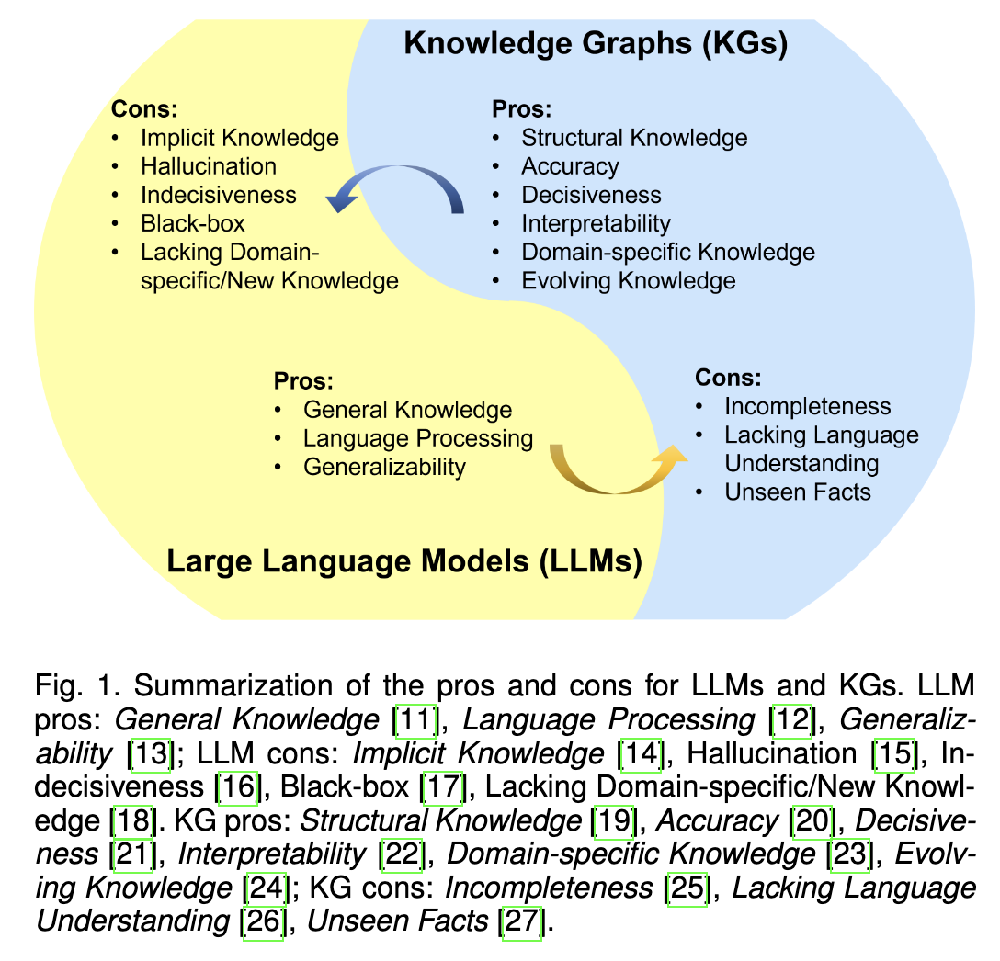

<a href="zotero://open-pdf/library/items/M65XPXLY?page=2">“LLMs and KGs are inherently interconnected and can mutually enhance each other.”</a> (<a href="zotero://select/library/items/M23XTJ6D">Pan et al., 2023, p. 2</a>) LLMs和KGs在本质上是相互关联的，可以相互增强。

<a href="zotero://open-pdf/library/items/M65XPXLY?page=2">“KG-enhanced LLMs,”</a> (<a href="zotero://select/library/items/M23XTJ6D">Pan et al., 2023, p. 2</a>)

<a href="zotero://open-pdf/library/items/M65XPXLY?page=NaN">“incorporated into the pre-training and inference stages of LLMs to provide external knowledge”</a> (<a href="zotero://select/library/items/M23XTJ6D">Pan et al., 2023, p. 2</a>) 知识图谱纳入LLM的预训练和推理阶段，提供外部知识

<a href="zotero://open-pdf/library/items/M65XPXLY?page=NaN">“used for analyzing LLMs and providing interpretability”</a> (<a href="zotero://select/library/items/M23XTJ6D">Pan et al., 2023, p. 2</a>) 用于分析LLM并提供可解释性

<a href="zotero://open-pdf/library/items/M65XPXLY?page=2">“LLM-augmented KGs”</a> (<a href="zotero://select/library/items/M23XTJ6D">Pan et al., 2023, p. 2</a>)

<a href="zotero://open-pdf/library/items/M65XPXLY?page=NaN">“LLMs have been used in various KG-related tasks, e.g., KG embedding [40], KG completion [26], KG construction [41], KG-to-text generation [42], and KGQA [43], to improve the performance and facilitate the application of KGs.”</a> (<a href="zotero://select/library/items/M23XTJ6D">Pan et al., 2023, p. 2</a>) LLM已被用于各种与知识图谱相关的任务，例如知识图谱嵌入[40]、知识图谱补全[26]、知识图谱构建[41]、知识图谱到文本生成[42]和知识图谱质量保证[43]，以提高性能并促进知识图谱的应用。

<a href="zotero://open-pdf/library/items/M65XPXLY?page=2">“Synergized LLM + KG”</a> (<a href="zotero://select/library/items/M23XTJ6D">Pan et al., 2023, p. 2</a>)

<a href="zotero://open-pdf/library/items/M65XPXLY?page=NaN">“esearchers marries the merits of LLMs and KGs to mutually enhance performance in knowledge representation [44] and reasoning [45], [46].”</a> (<a href="zotero://select/library/items/M23XTJ6D">Pan et al., 2023, p. 2</a>) 研究人员将 LLM 和 KG 的优点结合起来，相互增强知识表示 [44] 和推理 [45]、[46] 方面的表现。

#### <a href="zotero://open-pdf/library/items/M65XPXLY?page=2"><strong>“contributions”</strong></a> (<a href="zotero://select/library/items/M23XTJ6D">Pan et al., 2023, p. 2</a>)

*   <a href="zotero://open-pdf/library/items/M65XPXLY?page=2">“Roadmap”</a> (<a href="zotero://select/library/items/M23XTJ6D">Pan et al., 2023, p. 2</a>) 路线图

    <a href="zotero://open-pdf/library/items/M65XPXLY?page=2">“integrating LLMs and KGs.”</a> (<a href="zotero://select/library/items/M23XTJ6D">Pan et al., 2023, p. 2</a>)

<a href="zotero://open-pdf/library/items/M65XPXLY?page=2">“KG-enhanced LLMs, LLMaugmented KGs, and Synergized LLMs + KGs,”</a> (<a href="zotero://select/library/items/M23XTJ6D">Pan et al., 2023, p. 2</a>)

*   <a href="zotero://open-pdf/library/items/M65XPXLY?page=NaN">“Categorization and review.”</a>

    (<a href="zotero://select/library/items/M23XTJ6D">Pan et al., 2023, p. 2</a>)

    分类和审查。

<a href="zotero://open-pdf/library/items/M65XPXLY?page=NaN">“For each integration framework of our roadmap, we present a detailed categorization and novel taxonomies of research on unifying LLMs and KGs.”</a> (<a href="zotero://select/library/items/M23XTJ6D">Pan et al., 2023, p. 2</a>) 对于我们路线图的每个集成框架，我们提出了关于统一LLM和知识图谱研究的详细分类和新颖的分类法。

<a href="zotero://open-pdf/library/items/M65XPXLY?page=NaN">“In each category, we review the research from the perspectives of different integration strategies and tasks, which provides more insights into each framework.”</a> (<a href="zotero://select/library/items/M23XTJ6D">Pan et al., 2023, p. 2</a>) 在每个类别中，我们从不同集成策略和任务的角度回顾研究，这为每个框架提供了更多的见解。

*   <a href="zotero://open-pdf/library/items/M65XPXLY?page=2">“Coverage of emerging advances.”</a>

    (<a href="zotero://select/library/items/M23XTJ6D">Pan et al., 2023, p. 2</a>)

*   <a href="zotero://open-pdf/library/items/M65XPXLY?page=2">“Summary of challenges and future directions.”</a>

    (<a href="zotero://select/library/items/M23XTJ6D">Pan et al., 2023, p. 2</a>)

## <a href="zotero://open-pdf/library/items/M65XPXLY?page=2">“2 BACKGROUND”</a> (<a href="zotero://select/library/items/M23XTJ6D">Pan et al., 2023, p. 2</a>)

### <a href="zotero://open-pdf/library/items/M65XPXLY?page=2">“2.1 Large Language models (LLMs)”</a> (<a href="zotero://select/library/items/M23XTJ6D">Pan et al., 2023, p. 2</a>)

<a href="zotero://open-pdf/library/items/M65XPXLY?page=3">“Fig. 2. Representative large language models (LLMs) in recent years. Open-source models are represented by solid squares, while closed source models are represented by hollow squares.”</a> (<a href="zotero://select/library/items/M23XTJ6D">Pan et al., 2023, p. 3</a>) 图2. 近年来代表性的大型语言模型（LLMs）。开源模型用实心方块表示，闭源模型用空心方块表示。

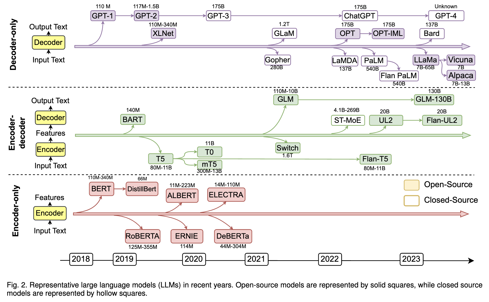

<a href="zotero://open-pdf/library/items/M65XPXLY?page=NaN">“As shown in Fig. 3, most LLMs derive from the Transformer design [50], which contains the encoder and decoder modules empowered by a self-attention mechanism.”</a> (<a href="zotero://select/library/items/M23XTJ6D">Pan et al., 2023, p. 2</a>) 如图 3 所示，大多数 LLM 源自 Transformer 设计 \[50]，其中包含由自注意力机制支持的编码器和解码器模块。

<a href="zotero://open-pdf/library/items/M65XPXLY?page=3">“Fig. 3. An illustration of the Transformer-based LLMs with self-attention mechanism.”</a> (<a href="zotero://select/library/items/M23XTJ6D">Pan et al., 2023, p. 3</a>) 图3. 一种带有自注意机制的基于Transformer的LLMs的示意图。

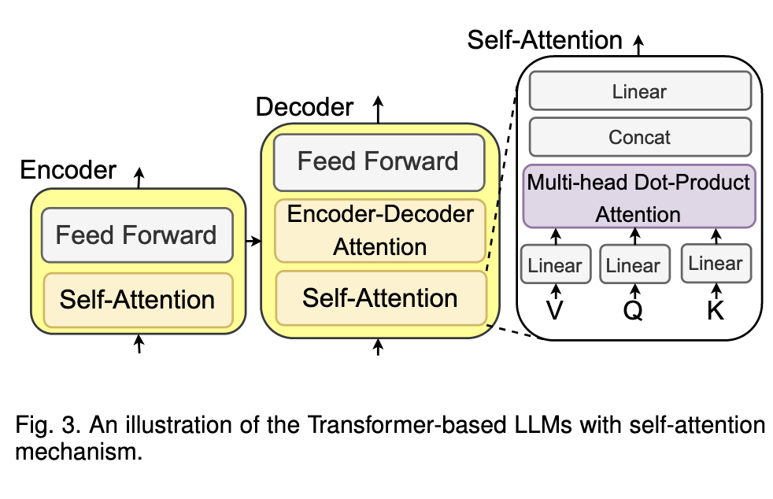

<a href="zotero://open-pdf/library/items/M65XPXLY?page=NaN">“LLMs can be categorized into three groups: 1) encoder-only LLMs, 2) encoder-decoder LLMs, and 3) decoder-only LLMs”</a> (<a href="zotero://select/library/items/M23XTJ6D">Pan et al., 2023, p. 3</a>) 基于架构结构，LLM 可分为三组：1) 仅编码器 LLM、2) 编码器-解码器 LLM 和 3) 仅解码器 LLM

#### <a href="zotero://open-pdf/library/items/M65XPXLY?page=3"><strong>“2.1.1 Encoder-only LLMs.”</strong></a> (<a href="zotero://select/library/items/M23XTJ6D">Pan et al., 2023, p. 3</a>)

<a href="zotero://open-pdf/library/items/M65XPXLY?page=NaN">“Encoder-only large language models only use the encoder to encode the sentence and understand the relationships between words.”</a> (<a href="zotero://select/library/items/M23XTJ6D">Pan et al., 2023, p. 3</a>) 仅编码器大型语言模型仅使用编码器对句子进行编码并理解单词之间的关系。

<a href="zotero://open-pdf/library/items/M65XPXLY?page=NaN">“The common training paradigm for these model is to predict the mask words in an input sentence.”</a> (<a href="zotero://select/library/items/M23XTJ6D">Pan et al., 2023, p. 3</a>) 这些模型的常见训练范例是预测输入句子中的掩码词。

<a href="zotero://open-pdf/library/items/M65XPXLY?page=NaN">“Encoder-only LLMs like BERT [1], ALBERT [51], RoBERTa [2], and ELECTRA [52] require adding an extra prediction head to resolve downstream tasks.”</a> (<a href="zotero://select/library/items/M23XTJ6D">Pan et al., 2023, p. 3</a>) 仅编码器的 LLM，如 BERT \[1]、ALBERT \[51]、RoBERTa \[2] 和 ELECTRA \[52] 需要添加额外的预测头来解决下游任务。

<a href="zotero://open-pdf/library/items/M65XPXLY?page=NaN">“These models are most effective for tasks that require understanding the entire sentence, such as text classification [53] and named entity recognition [54].”</a> (<a href="zotero://select/library/items/M23XTJ6D">Pan et al., 2023, p. 3</a>) 这些模型对于需要理解整个句子的任务最有效，例如文本分类\[53]和命名实体识别\[54]。

#### <a href="zotero://open-pdf/library/items/M65XPXLY?page=3"><strong>“2.1.2 Encoder-decoder LLMs.”</strong></a>** (<a href="zotero://select/library/items/M23XTJ6D">Pan et al., 2023, p. 3</a>)**

<a href="zotero://open-pdf/library/items/M65XPXLY?page=NaN">“The encoder module is responsible for encoding the input sentence into a hiddenspace,”</a> (<a href="zotero://select/library/items/M23XTJ6D">Pan et al., 2023, p. 3</a>) 编码器模块负责将输入句子编码到隐藏空间中，

<a href="zotero://open-pdf/library/items/M65XPXLY?page=NaN">“decoder is used to generate the target output text.”</a> (<a href="zotero://select/library/items/M23XTJ6D">Pan et al., 2023, p. 3</a>) 解码器用于生成目标输出文本。

#### <a href="zotero://open-pdf/library/items/M65XPXLY?page=3"><strong>“2.1.3 Decoder-only LLMs.”</strong></a>** (<a href="zotero://select/library/items/M23XTJ6D">Pan et al., 2023, p. 3</a>)**

<a href="zotero://open-pdf/library/items/M65XPXLY?page=NaN">“The training paradigm for these models is to predict the next word in the sentence.”</a> (<a href="zotero://select/library/items/M23XTJ6D">Pan et al., 2023, p. 3</a>) 这些模型的训练范例是预测句子中的下一个单词。

<a href="zotero://open-pdf/library/items/M65XPXLY?page=NaN">“Large-scale decoder-only LLMs can generally perform downstream tasks from a few examples or simple instructions, without adding prediction heads or finetuning”</a> (<a href="zotero://select/library/items/M23XTJ6D">Pan et al., 2023, p. 3</a>) 大规模仅解码器的 LLM 通常可以通过几个示例或简单指令执行下游任务，而无需添加预测头或微调

<a href="zotero://open-pdf/library/items/M65XPXLY?page=NaN">“Many state-of-the-art LLMs (e.g., Chat-GPT [61] and GPT-44) follow the decoder-only architecture.”</a> (<a href="zotero://select/library/items/M23XTJ6D">Pan et al., 2023, p. 3</a>) 许多最先进的LLM（例如 Chat-GPT \[61] 和 GPT-44）都遵循仅解码器架构。

### <a href="zotero://open-pdf/library/items/M65XPXLY?page=4">“2.2 Prompt Engineering”</a> (<a href="zotero://select/library/items/M23XTJ6D">Pan et al., 2023, p. 4</a>)

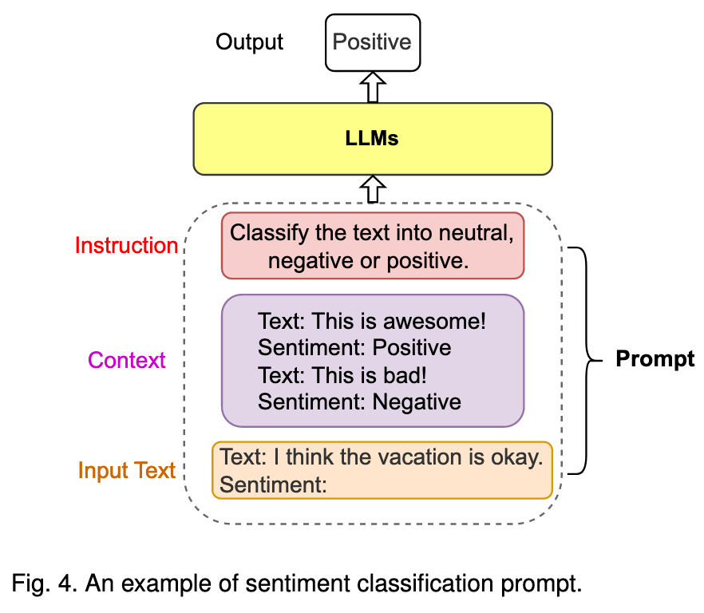

### <a href="zotero://open-pdf/library/items/M65XPXLY?page=4">“2.3 Knowledge Graphs (KGs)”</a> (<a href="zotero://select/library/items/M23XTJ6D">Pan et al., 2023, p. 4</a>)

<a href="zotero://open-pdf/library/items/M65XPXLY?page=NaN">“Existing knowledge graphs (KGs) can be classified into four groups based on the stored information:”</a> (<a href="zotero://select/library/items/M23XTJ6D">Pan et al., 2023, p. 4</a>) 现有的知识图谱（KG）可以根据存储的信息分为四类：

1.  <a href="zotero://open-pdf/library/items/M65XPXLY?page=NaN">“encyclopedic KGs”</a>

    (<a href="zotero://select/library/items/M23XTJ6D">Pan et al., 2023, p. 4</a>)

    百科全书式知识图谱

2.  <a href="zotero://open-pdf/library/items/M65XPXLY?page=NaN">“commonsense KGs”</a>

    (<a href="zotero://select/library/items/M23XTJ6D">Pan et al., 2023, p. 4</a>)

    常识知识库

3.  <a href="zotero://open-pdf/library/items/M65XPXLY?page=NaN">“domain-specific KGs”</a>

    (<a href="zotero://select/library/items/M23XTJ6D">Pan et al., 2023, p. 4</a>)

    特定领域的知识图谱

4.  <a href="zotero://open-pdf/library/items/M65XPXLY?page=NaN">“multimodal KGs”</a>

    (<a href="zotero://select/library/items/M23XTJ6D">Pan et al., 2023, p. 4</a>)

    多模态知识图谱

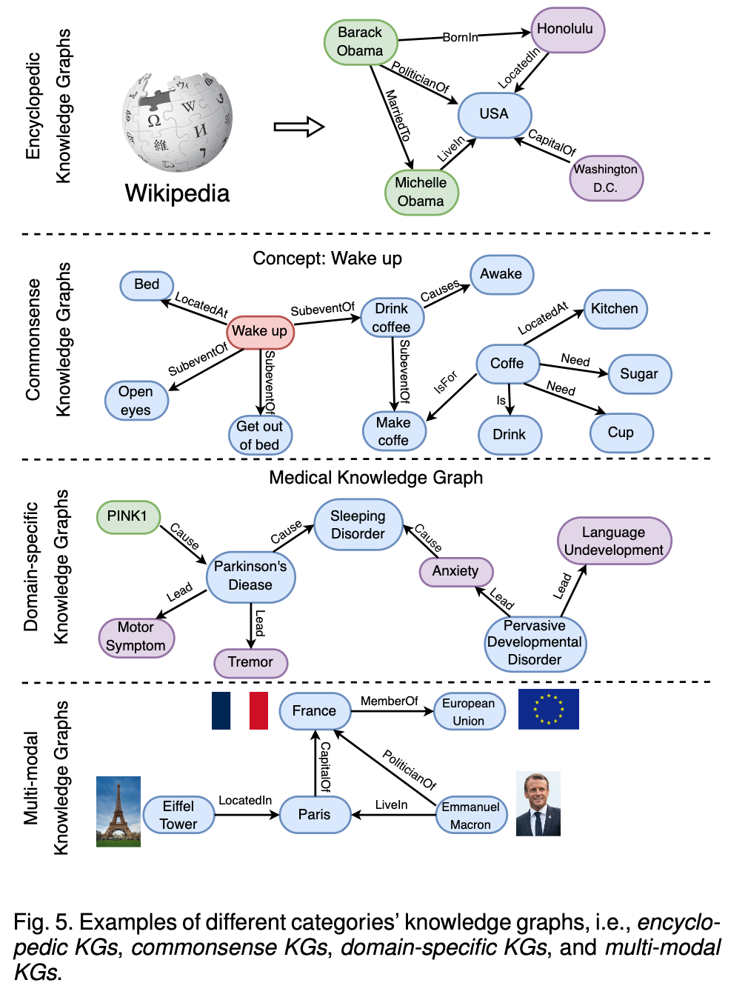

#### <a href="zotero://open-pdf/library/items/M65XPXLY?page=4"><strong>“2.3.1 Encyclopedic Knowledge Graphs.</strong>”</a> (<a href="zotero://select/library/items/M23XTJ6D">Pan et al., 2023, p. 4</a>)

#### <a href="zotero://open-pdf/library/items/M65XPXLY?page=4"><strong>“2.3.2 Commonsense Knowledge Graphs.”</strong></a>** (<a href="zotero://select/library/items/M23XTJ6D">Pan et al., 2023, p. 4</a>)**

#### <a href="zotero://open-pdf/library/items/M65XPXLY?page=5"><strong>“2.3.3 Domain-specific Knowledge Graphs”</strong></a>** (<a href="zotero://select/library/items/M23XTJ6D">Pan et al., 2023, p. 5</a>)**

<a href="zotero://open-pdf/library/items/M65XPXLY?page=5">“accurate and reliable”</a> (<a href="zotero://select/library/items/M23XTJ6D">Pan et al., 2023, p. 5</a>) 准确

<a href="zotero://open-pdf/library/items/M65XPXLY?page=5">“smaller in size”</a> (<a href="zotero://select/library/items/M23XTJ6D">Pan et al., 2023, p. 5</a>) 规模小

#### <a href="zotero://open-pdf/library/items/M65XPXLY?page=5"><strong>“2.3.4 Multi-modal Knowledge Graphs.”</strong></a>** (<a href="zotero://select/library/items/M23XTJ6D">Pan et al., 2023, p. 5</a>)**

<a href="zotero://open-pdf/library/items/M65XPXLY?page=NaN">“image-text matching”</a> (<a href="zotero://select/library/items/M23XTJ6D">Pan et al., 2023, p. 5</a>) 图文匹配

<a href="zotero://open-pdf/library/items/M65XPXLY?page=NaN">“visual question answering”</a> (<a href="zotero://select/library/items/M23XTJ6D">Pan et al., 2023, p. 5</a>) 视觉问答

<a href="zotero://open-pdf/library/items/M65XPXLY?page=NaN">“recommendation”</a> (<a href="zotero://select/library/items/M23XTJ6D">Pan et al., 2023, p. 5</a>) 推荐

### <a href="zotero://open-pdf/library/items/M65XPXLY?page=5">“2.4 Applications”</a> (<a href="zotero://select/library/items/M23XTJ6D">Pan et al., 2023, p. 5</a>)

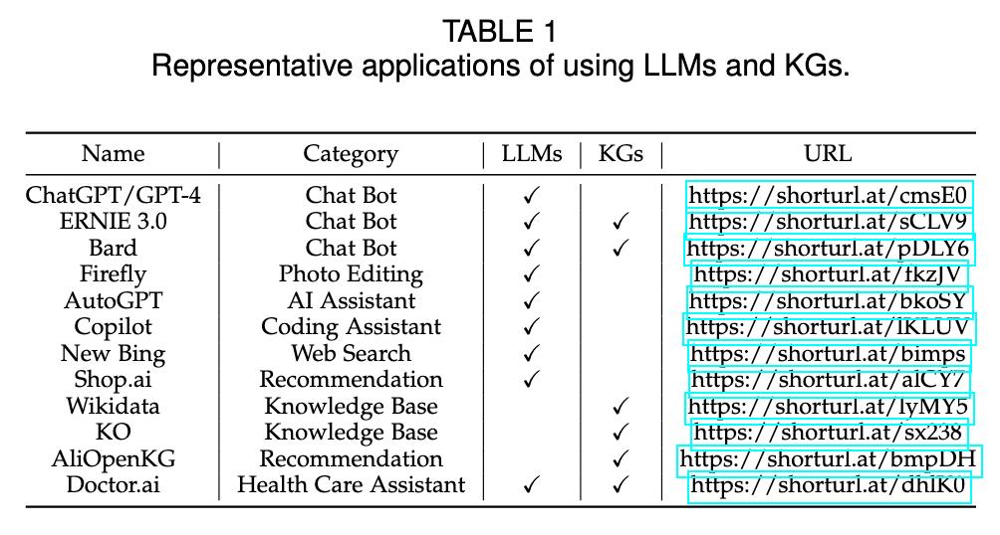

<a href="zotero://open-pdf/library/items/M65XPXLY?page=NaN">“To improve knowledge awareness of LLMs, ERNIE 3.0 and Bard incorporate KGs into their chatbot applications.”</a> (<a href="zotero://select/library/items/M23XTJ6D">Pan et al., 2023, p. 5</a>) 为了提高 LLM 的知识意识，ERNIE 3.0 和 Bard 将 KG 纳入其聊天机器人应用程序中。

## <a href="zotero://open-pdf/library/items/M65XPXLY?page=5">“3 ROADMAP &#x26; CATEGORIZATION”</a> (<a href="zotero://select/library/items/M23XTJ6D">Pan et al., 2023, p. 5</a>)路线图和分类

### <a href="zotero://open-pdf/library/items/M65XPXLY?page=5">“3.1 Roadmap”</a> (<a href="zotero://select/library/items/M23XTJ6D">Pan et al., 2023, p. 5</a>)

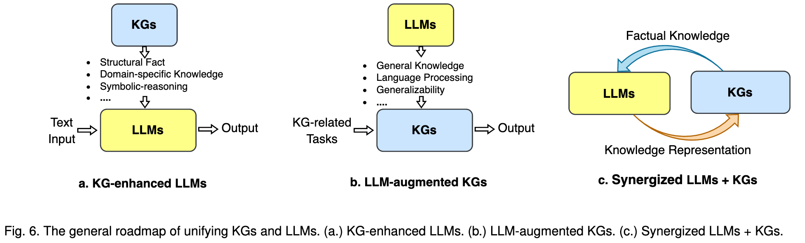

#### <a href="zotero://open-pdf/library/items/M65XPXLY?page=5">“3.1.1 KG-enhanced LLMs”</a> (<a href="zotero://select/library/items/M23XTJ6D">Pan et al., 2023, p. 5</a>)

## <a href="zotero://open-pdf/library/items/M65XPXLY?page=11">“5 LLM-AUGMENTED FOR KGS”</a> (<a href="zotero://select/library/items/M23XTJ6D">Pan et al., 2023, p. 11</a>)

<a href="zotero://open-pdf/library/items/M65XPXLY?page=11">“TABLE 3 Summary of representative LLM-augmented KG methods.”</a> (<a href="zotero://select/library/items/M23XTJ6D">Pan et al., 2023, p. 11</a>)

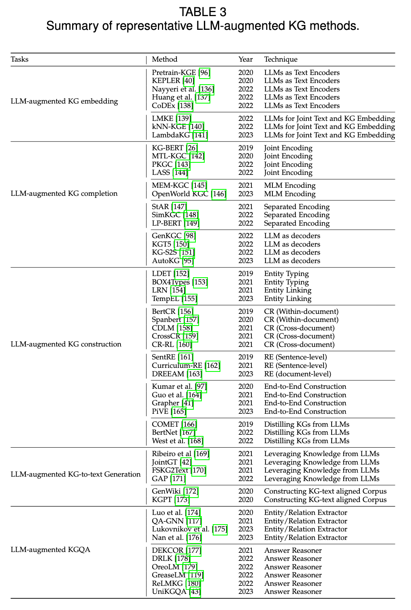

### <a href="zotero://open-pdf/library/items/M65XPXLY?page=11">“5.1 LLM-augmented KG Embedding”</a> (<a href="zotero://select/library/items/M23XTJ6D">Pan et al., 2023, p. 11</a>)

### <a href="zotero://open-pdf/library/items/M65XPXLY?page=12">“.2 LLM-augmented KG Completion”</a> (<a href="zotero://select/library/items/M23XTJ6D">Pan et al., 2023, p. 12</a>)

<a href="zotero://open-pdf/library/items/M65XPXLY?page=NaN">“conventional KGC methods mainly focused on the structure of the KG, without considering the extensive textual information.”</a> (<a href="zotero://select/library/items/M23XTJ6D">Pan et al., 2023, p. 12</a>) 传统的KGC方法主要关注KG的结构，没有考虑大量的文本信息。

<a href="zotero://open-pdf/library/items/M65XPXLY?page=NaN">“the recent integration of LLMs enables KGC methods to encode text or generate facts for better KGC performance.”</a> (<a href="zotero://select/library/items/M23XTJ6D">Pan et al., 2023, p. 12</a>) 最近 LLM 的集成使 KGC 方法能够编码文本或生成事实，以获得更好的 KGC 性能。

#### <a href="zotero://open-pdf/library/items/M65XPXLY?page=12">“5.2.1 LLM as Encoders (PaE).”</a> (<a href="zotero://select/library/items/M23XTJ6D">Pan et al., 2023, p. 12</a>)

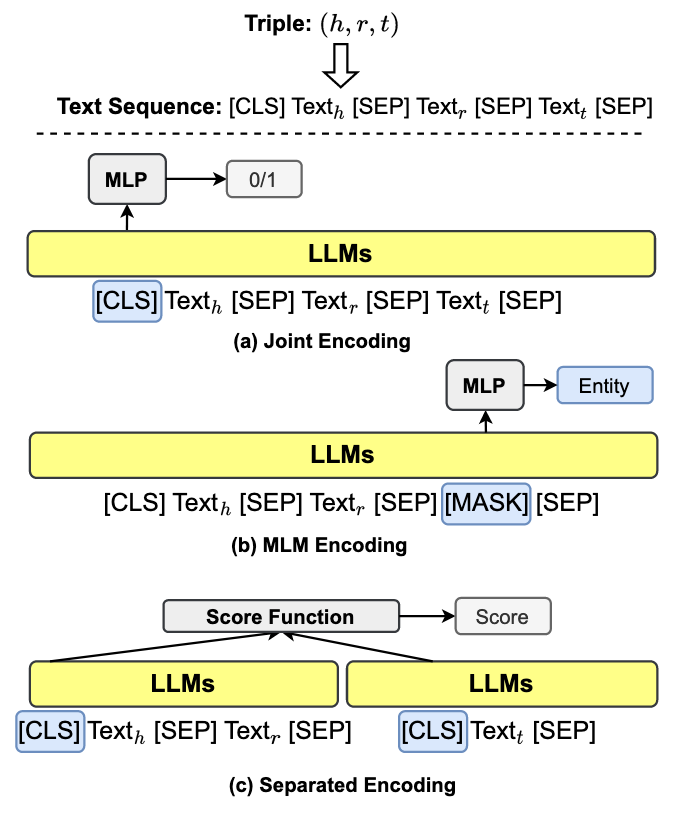

<a href="zotero://open-pdf/library/items/M65XPXLY?page=NaN">“This line of work first uses encoder-only LLMs to encode textual information as well as KG facts.”</a> (<a href="zotero://select/library/items/M23XTJ6D">Pan et al., 2023, p. 12</a>) 这一系列工作首先使用仅编码器的 LLM 来编码文本信息以及 KG 事实。

<a href="zotero://open-pdf/library/items/M65XPXLY?page=NaN">“they predict the plausibility of the triples by feeding the encoded representation into a prediction head, which could be a simple MLP or conventional KG score function”</a> (<a href="zotero://select/library/items/M23XTJ6D">Pan et al., 2023, p. 12</a>) 接下来，他们通过将编码表示输入预测头来预测三元组的合理性，预测头可以是简单的 MLP 或传统的 KG 评分函数（transe、transr）

#### <a href="zotero://open-pdf/library/items/M65XPXLY?page=13">“5.2.2 LLM as Generators (PaG).”</a> (<a href="zotero://select/library/items/M23XTJ6D">Pan et al., 2023, p. 13</a>)

<a href="zotero://open-pdf/library/items/M65XPXLY?page=NaN">“Recent works use LLMs as sequence-to-sequence generators in KGC”</a> (<a href="zotero://select/library/items/M23XTJ6D">Pan et al., 2023, p. 13</a>) 最近的工作使用 LLM 作为 KGC 中的序列到序列生成器

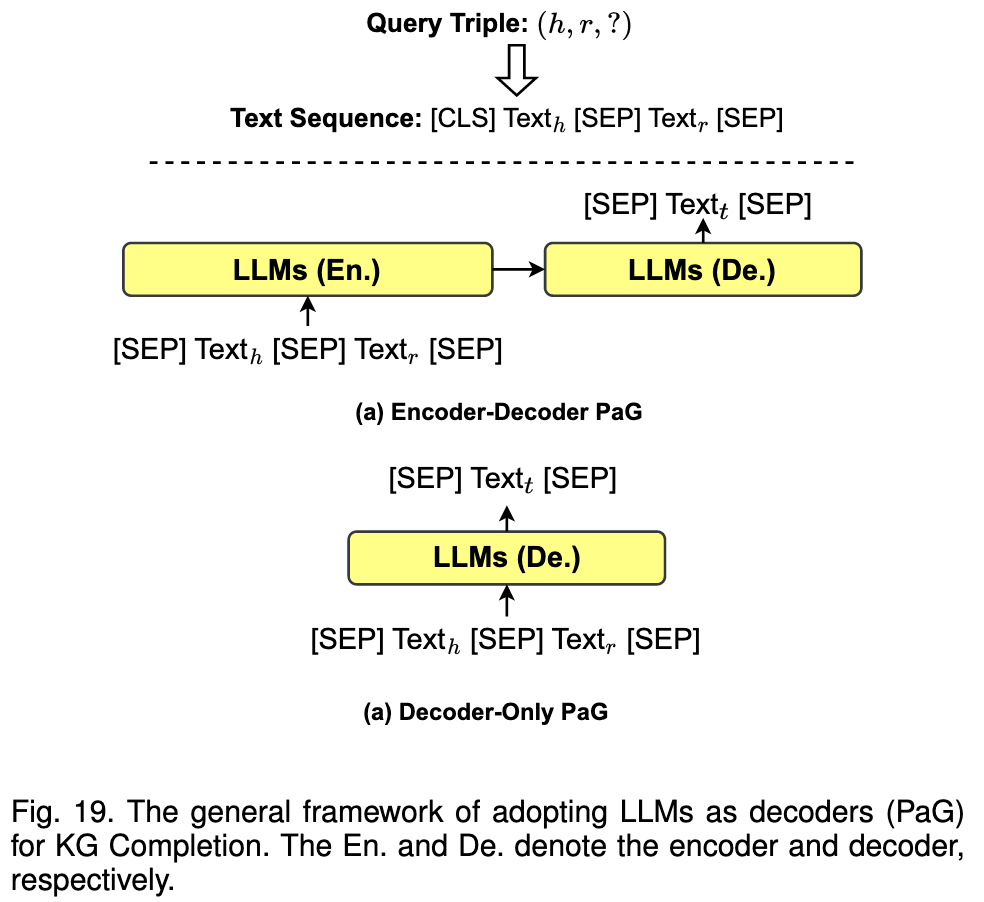

<a href="zotero://open-pdf/library/items/M65XPXLY?page=NaN">“The LLMs receive a sequence text input of the query triple (h, r, ?), and generate the text of tail entity t directly.”</a> (<a href="zotero://select/library/items/M23XTJ6D">Pan et al., 2023, p. 13</a>) LLM 接收查询三元组 (h, r, ?) 的序列文本输入，并直接生成尾实体 t 的文本。

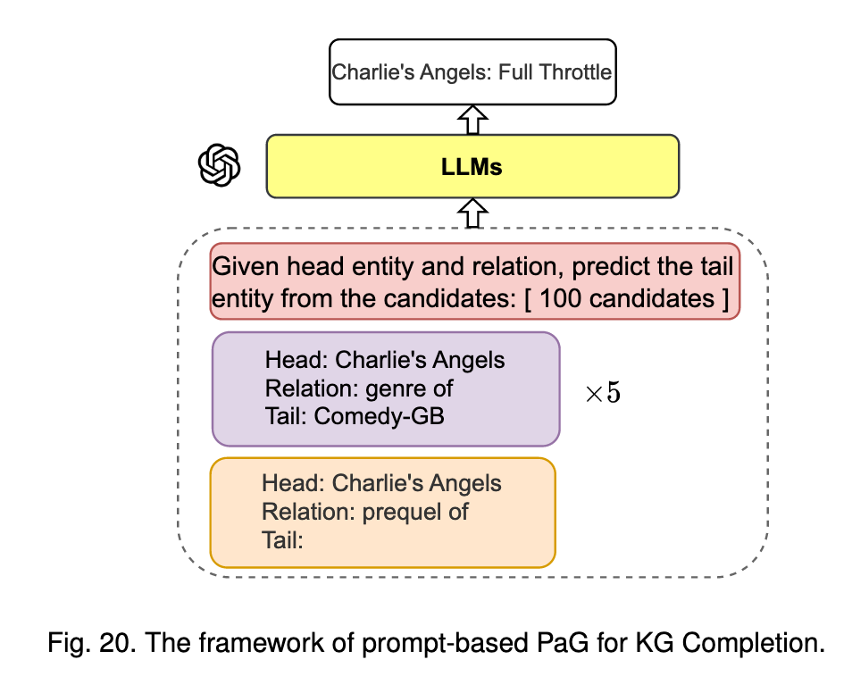

Referred in <a href="zotero://note/u/LJSU8E3B/?ignore=1&#x26;line=26" rel="noopener noreferrer nofollow" zhref="zotero://note/u/LJSU8E3B/?ignore=1&#x26;line=26" ztype="znotelink" class="internal-link">LLM</a>
