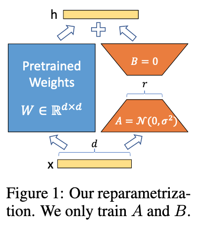
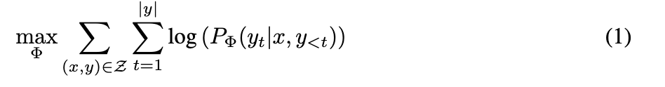
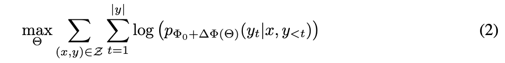
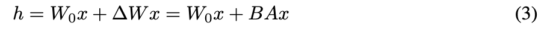

# <a href="zotero://open-pdf/library/items/7AZCJDVP?page=1">“LORA: LOW-RANK ADAPTATION OF LARGE LANGUAGE MODELS”</a> (<a href="zotero://select/library/items/7SYYADBE">Hu et al., 2021, p. 1</a>)

Comment: Draft V2 includes better baselines, experiments on GLUE, and more on adapter latency

## <a href="zotero://open-pdf/library/items/7AZCJDVP?page=1">“ABSTRACT”</a> (<a href="zotero://select/library/items/7SYYADBE">Hu et al., 2021, p. 1</a>)

随着我们对更大模型的预训练，完全微调（重新训练所有模型参数）变得不太可行

提出了低秩适应（Low-Rank Adaptation），即LoRA，在保持预训练模型权重不变的同时，在Transformer架构的每一层中注入可训练秩分解矩阵，从而大大减少下游任务所需的可训练参数数量。

与 Adapter Tuning不同，没有额外的推理延迟

## <a href="zotero://open-pdf/library/items/7AZCJDVP?page=1">“1 INTRODUCTION”</a> (<a href="zotero://select/library/items/7SYYADBE">Hu et al., 2021, p. 1</a>)

自然语言处理应用程序：将一个大规模的预训练语言模型适应到多个下游应用程序中

*   通常情况下这种适应是通过

    微调

    <a href="zotero://open-pdf/library/items/7AZCJDVP?page=1">“fine-tuning”</a>

    (<a href="zotero://select/library/items/7SYYADBE">Hu et al., 2021, p. 1</a>)

    来完成的，就是更新预训练模型的所有参数

*   fine-tuning的主要缺点：新模型包含与原始模型一样多的参数。

    *   模型的参数数量太多了

*   仅调整一些参数或为新任务学习外部模块来减轻这个问题。

    *   只需要存储和加载少量与每个任务相关的参数，以及预训练模型，从而在部署时极大地提高操作效率。

*   然而，现有的技术通常通过增加模型深度或减少模型可用序列长度引入推理延迟

    *   Prefix Tuning: 

        **<u>Prefix-Tuning: Optimizing Continuous Prompts for Generation</u>**

    *   Prompt Tuning: 

        **<u>The Power of Scale for Parameter-Efficient Prompt Tuning</u>**

    *   P-Tuning: 

        **<u>GPT Understands, Too</u>**

*   更重要的是，这些方法通常无法与微调基线相匹配，存在效率和模型质量之间的权衡。

表明学习得到的过参数化模型实际上存在于一个较低的内在维度上。

我们假设模型自适应过程中的权重变化也具有较低的“内在秩”，从而提出了我们的低秩自适应（LoRA）方法。

LoRA允许我们通过优化适应过程中全连接层的秩分解矩阵来间接训练神经网络中的一些全连接层，同时保持预训练权重冻结，如图1所示。

<a href="zotero://open-pdf/library/items/7AZCJDVP?page=1">“Figure 1: Our reparametrization. We only train A and B.”</a> (<a href="zotero://select/library/items/7SYYADBE">Hu et al., 2021, p. 1</a>)

<a href="zotero://open-pdf/library/items/7AZCJDVP?page=2">“LoRA possesses several key advantages.”</a> (<a href="zotero://select/library/items/7SYYADBE">Hu et al., 2021, p. 2</a>)

*   可以共享预训练模型。

    为不同的任务构建许多小的LoRA模块

    ，

    冻结共享模型

    ，通过替换图1中的矩阵A B来高效切换任务，显著减少存储需求和切换任务的开销

*   LoRA通过使用

    自适应优化器

    使训练更加高效

    ，将硬件门槛降低了最多3倍。因为不需要计算大部分参数的梯度或维护优化器状态，

    只对注入的、规模较小的低秩矩阵进行优化。

*   我们简单的

    线性设计

    允许

    在部署时将可训练矩阵与冻结权重合并

    ，与完全微调的模型相比，

    不会引入推理延迟

    。

*   LoRA与许多先前的方法正交，并且可以与其中许多方法结合使用，例如prefix-tuning。

<a href="zotero://open-pdf/library/items/7AZCJDVP?page=2"><strong>“Terminologies and Conventions”</strong></a>**  术语和约定**

*   $d_{model}$

    : Transformer 的输入和输出维度大小

*   $W_q, W_k, W_v, W_o$

    : 自注意力模块中的query、key、value、output

*   $W, W_0$

    : 预训练的权重矩阵

*   $\Delta W$

    : 表示在适应过程中累积的梯度更新。

*   $r$

    : 表示Lora模块的秩

*   使用Adam进行模块优化

*   使用Transformer MLP前馈维度

    $d_{ffn} = 4 \times d_{model}$

## <a href="zotero://open-pdf/library/items/7AZCJDVP?page=2">“2 PROBLEM STATEMENT”</a> (<a href="zotero://select/library/items/7SYYADBE">Hu et al., 2021, p. 2</a>) 问题陈述

假设我们有一个由$\Phi$参数化的预训练自回归语言模型$P_{\Phi}(y|x)$。

考虑将这个预训练模型应用于下游的条件文本生成任务，例如摘要、机器阅读理解（MRC）和自然语言到SQL（NL2SQL）。

每个下游任务都由一个上下文-目标 context-target 对的训练数据集表示：$Z = \{(x_i, y_i)\}_{i=1,..,N}$，其中xi和yi都是token序列。

在完全微调期间，模型被初始化为预训练权重$\Phi_0$ ，最终Fine-Tune之后更新至$\Phi_0+\Delta\Phi$（基于反向传播和梯度下降）

完全微调的主要缺点之一是对于每个下游任务，我们学习了一个不同的参数集∆Φ，其维度|∆Φ|等于|Φ0|。

因此，如果预训练模型很大（例如GPT-3，|Φ0|约为1750亿），存储和部署许多独立的微调模型实例可能是具有挑战性的，甚至可能根本不可行。

本文中：任务特定的参数增量∆Φ = ∆Φ(Θ)由一个比较小尺寸的参数集合Θ进一步编码，并且$|\Theta| \ll|\Phi_0|$|Θ| |Φ0|。因此，找到∆Φ的任务变成了对 Θ 进行优化

使用低秩low-rank表示来编码$\Delta\Phi$ 计算效率和内存都高效

## <a href="zotero://open-pdf/library/items/7AZCJDVP?page=3">“3 AREN’T EXISTING SOLUTIONS GOOD ENOUGH?”</a> (<a href="zotero://select/library/items/7SYYADBE">Hu et al., 2021, p. 3</a>)

## <a href="zotero://open-pdf/library/items/7AZCJDVP?page=4">“4 OUR METHOD”</a> (<a href="zotero://select/library/items/7SYYADBE">Hu et al., 2021, p. 4</a>)

描述了LoRA的简单设计及其实际好处。这里概述的原则适用于深度学习模型中的任何全连接层，尽管在实验中只关注Transformer语言模型中的某些权重作为动机使用案例。

### <a href="zotero://open-pdf/library/items/7AZCJDVP?page=4">“4.1 LOW-RANK-PARAMETRIZED UPDATE MATRICES”</a> (<a href="zotero://select/library/items/7SYYADBE">Hu et al., 2021, p. 4</a>) 4.1 低秩参数化更新矩阵

神经网络全连接层（执行矩阵乘法）中的权重矩阵通常是满秩

在适应特定任务时，Aghajanyan等人的研究表明，预训练的语言模型具有较低的内在维度，即使随机投影到较小的子空间，仍然可以有效地学习。

受此启发，我们假设权重的更新在自适应过程中也具有较低的“内在秩”。

*   对于一个预训练权重矩阵

    $W_0 \in \mathbb{R}^{d \times k}$

    ,通过用低阶分解

    $W_0+\Delta W=W_0+BA$

    来表示后者来限制其更新，其中

    $B \in \mathbb{R}^{d \times r}, A \in \mathbb{R}^{r \times k}$

    ，以及秩

    $r\ll min(d,k)$

*   在训练过程中，

    $W_0$

    被冻结并且不接收梯度更新，而A和B包含可训练的参数。

*   W0和∆W = BA都与相同的输入进行乘法运算，并且它们各自的输出向量按坐标逐个求和。

*   对于

    $h=W_0x$

    ，修改之后的向前传递：

*   

*   我们对A使用随机高斯初始化，对B使用零值初始化，因此在训练开始时∆W = BA为零。

*   通过

    $\frac{\alpha}{r}$

    来缩放

    $\Delta W$

    , α是r中的一个常数

*   当使用Adam进行优化时，如果我们适当地调整初始化，那么调优α与调优学习率大致相同。

*   因此，我们只需将α设置为我们尝试的第一个r，而不调优它。

*   这种缩放有助于在改变 r 值时减少重新调整超参数的需求

<a href="zotero://open-pdf/library/items/7AZCJDVP?page=4"><strong>“A Generalization of Full Fine-tuning.”</strong></a>** 全面微调的一般化**

更一般的微调形式允许训练预先训练参数的子集。

*   Lora更进一步，在自适应期间不要求对权重矩阵的累积梯度更新具有满秩性。
*   这意味着当将LoRA应用于所有权重矩阵并训练所有偏置（它们相对于权重来说只是一个可忽略的参数数量）时，通过将LoRA秩r设置为预训练权重矩阵的秩，大致恢复了完全微调的表达能力。
*   换句话说，当我们增加可训练参数的数量时，LoRA的训练大致趋向于原始模型的训练，而adapter-based的方法则趋向于MLP（多层感知机），prefix-based 方法则趋向于一个无法处理长输入序列的模型。

<a href="zotero://open-pdf/library/items/7AZCJDVP?page=4"><strong>“No Additional Inference Latency.”</strong></a>** 没有额外的推理延迟。**

当部署到生产中时，可以显式地计算和存储W=W0+BA，并像往常一样进行推理。

Note：$W_0,BA \in \mathbb{R}^{d \times k}$

当我们需要切换到另一个下游任务时，我们可以通过减去BA，然后添加不同的B‘A’来恢复W，这是一个非常少的内存开销的快速操作。

关键是，这保证了与通过构造进行微调的模型相比，我们在推理过程中不会引入任何额外的延迟。

### <a href="zotero://open-pdf/library/items/7AZCJDVP?page=5">“4.2 APPLYING LORA TO TRANSFORMER”</a> (<a href="zotero://select/library/items/7SYYADBE">Hu et al., 2021, p. 5</a>)

原则上，我们可以将LoRA应用于神经网络中的任何一组权重矩阵，以减少可训练参数的数量。

*   在Transformer架构中，自注意力模块有四个权重矩阵（Wq、Wk、Wv、Wo），而MLP模块有两个。

*   我们将Wq（或Wk，Wv）视为一个维度为

    $d_{model}\times d_{model}$

    的单一矩阵，尽管输出维度通常被切分成注意力头。

*   我们将研究范围限制在仅适应下游任务的

    注意力权重

    上，并

    冻结MLP模块

    （以便它们不会在下游任务中进行训练），这样做既简单又节省参数。

<a href="zotero://open-pdf/library/items/7AZCJDVP?page=5"><strong>“Practical Benefits and Limitations.”</strong></a>** 实际的好处和局限性。**

*   最显著的好处来自于内存和存储使用的减少

    *   于使用Adam训练的大型Transformer，如果

        $r\ll d_{model}$

        ，则可以将VRAM使用量减少多达2/3，因为我们不需要存储冻结参数的优化器状态。

    *   这使我们能够使用较少的GPU资源进行训练，并避免I/O瓶颈。

*   另一个好处是，我们可以在部署时以低得多的成本在任务之间切换，只需交换LORA权重，而不是所有参数。

局限性：

*   例如，如果选择将A和B吸收到W中以消除额外的推理延迟，那么在单个正向传递中对具有不同A和B的不同任务进行批处理输入并不直接。但是，在延迟不是很关键的情况下，可以不合并权重并动态选择LORA模块以用于批量样本。

## <a href="zotero://open-pdf/library/items/7AZCJDVP?page=9">“7 UNDERSTANDING THE LOW-RANK UPDATES”</a> (<a href="zotero://select/library/items/7SYYADBE">Hu et al., 2021, p. 9</a>) 7 理解低秩更新

 

 

*   r是超参数，平衡模型的复杂性、适配器adapter的能力以及过拟合还是欠拟合

*   r越小，就是一个更简单的low-rank metrics，就代表着是更小的参数量

    *   训练更快
    *   降低了模型训练的硬件要求
    *   low-rank metrics的能力也就相对越弱，比如要补足一些任务相关的信息，会导致适配能力的下降
    *   r是计算量和能力的权衡

 
