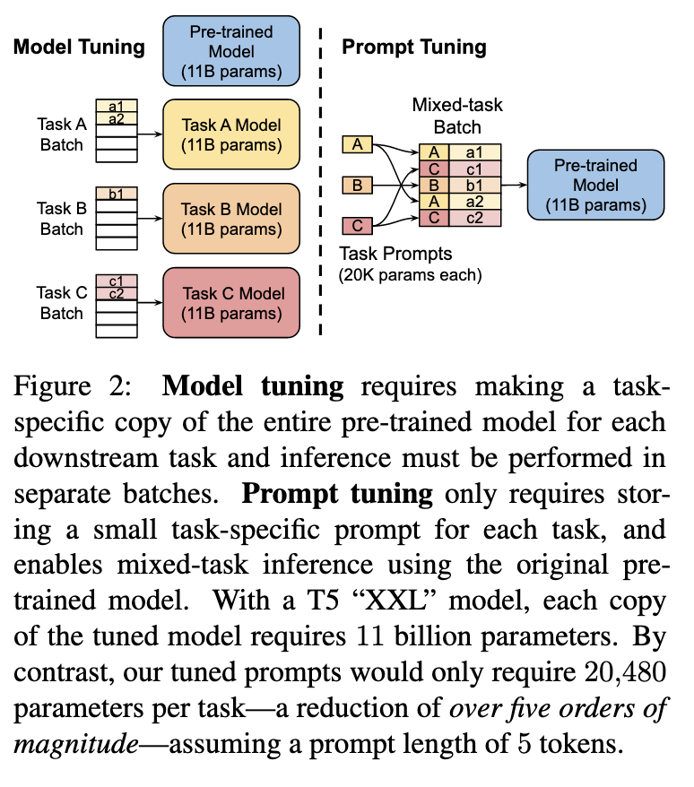
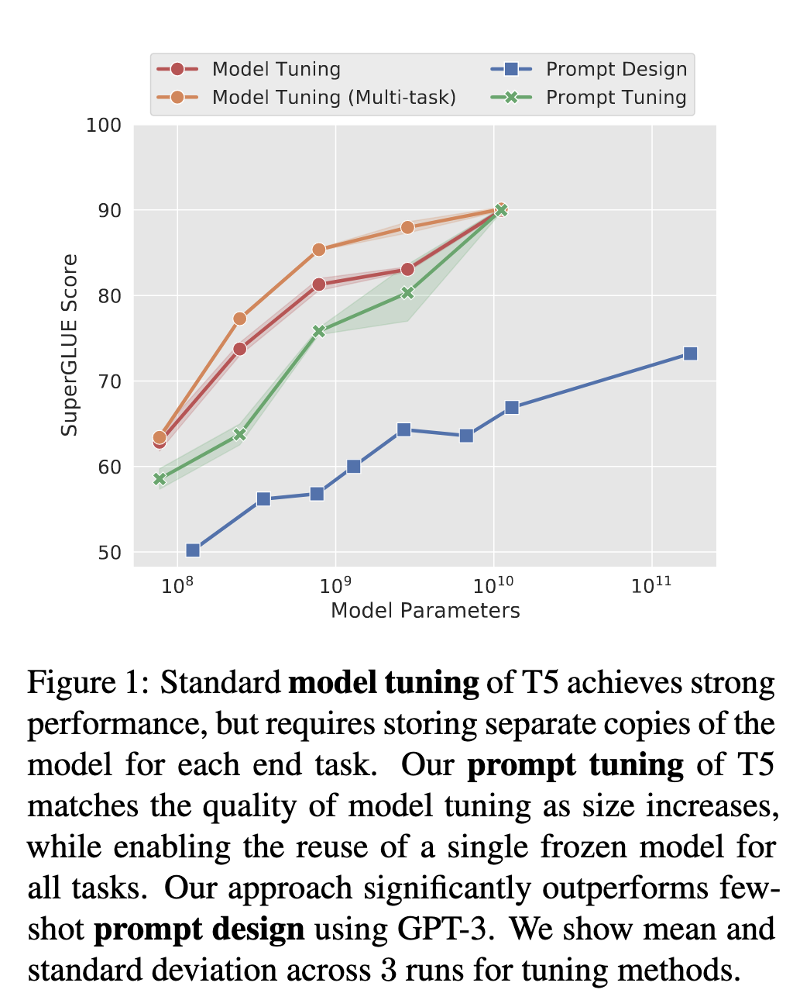
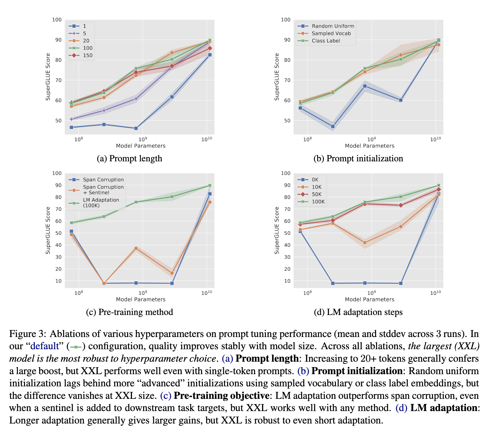
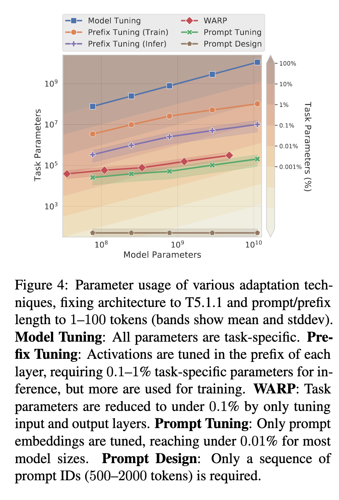
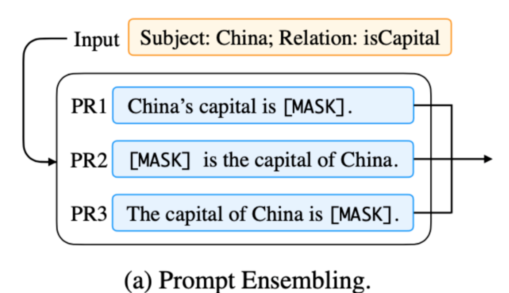

# <a href="zotero://open-pdf/library/items/9VLRWGI5?page=1">“The Power of Scale for Parameter-Efficient Prompt Tuning”</a> (<a href="zotero://select/library/items/PF26YIRX">Lester et al., 2021, pp. -</a>)

Comment: Accepted to EMNLP 2021

<a href="zotero://open-pdf/library/items/9VLRWGI5?page=1"><strong>“soft prompts”</strong></a>** ：**将语言模型冻结以执行特定的下游任务。与GPT-3使用的离散文本提示不同，软提示是通过反向传播学习的，可以进行调整，以结合来自任何数量的标签示例的信号。

## <a href="zotero://open-pdf/library/items/9VLRWGI5?page=1">“1 Introduction”</a> (<a href="zotero://select/library/items/PF26YIRX">Lester et al., 2021, p. 1</a>)

<a href="zotero://open-pdf/library/items/9VLRWGI5?page=1">“ELMo”</a> (<a href="zotero://select/library/items/PF26YIRX">Lester et al., 2021, p. 1</a>)提出**冻结预训练模型**并**学习其每层表示的特定任务权重**

自 GPT (Radford et al., 2018) 和 BERT (Devlin et al., 2019) 以来，主要的适应技术一直是模型调整（或“微调”），其中所有模型参数在适应过程中进行调整，如 霍华德和罗德 (2018) 提出。

<a href="zotero://open-pdf/library/items/9VLRWGI5?page=1">“prompt design (or “priming”)”</a> 通过文本提示调节冻结的 GPT-3 模型的行为方面非常有效。** 提示通常由任务描述和/或几个规范示例组成。** 这种“冻结”预训练模型的回归很有吸引力，**尤其是随着模型大小的不断增加，无需为每个下游任务提供单独的模型副本，单个通用模型可以同时服务于许多不同的任务。**

*   缺陷：

    不幸的是，基于提示的适应有几个关键的缺点。 任务描述容易出错并且需要人工参与，提示的有效性受限于模型输入可以容纳多少条件文本。 结果，

    **下游任务质量仍然远远落后于fine-tune后的模型**

    。 

大模型全量微调对每个任务训练一个模型，开销和部署成本都比较高。同时，离散的prompts（指人工设计prompts提示语加入到模型）方法，成本比较高，并且效果不太好。

基于此，作者提出了Prompt Tuning，通过反向传播更新参数来学习prompts，而不是人工设计prompts；同时冻结模型原始权重，只训练prompts参数，训练完以后，用同一个模型可以做多任务推理。

<a href="zotero://open-pdf/library/items/9VLRWGI5?page=2"><strong>“prompt tuning”</strong></a> (<a href="zotero://select/library/items/PF26YIRX">Lester et al., 2021, p. 2</a>)我们冻结整个预训练模型，并且只允许在输入文本之前添加额外的k个可调节token，用于下游任务。

该方法可以看作是Prefix Tuning的简化版本，它给每个任务定义了自己的Prompt，然后拼接到数据上作为输入，但**只在输入层加入prompt tokens**，并且不需要加入 MLP 进行调整来解决难训练的问题。

通过实验发现，随着预训练模型参数量的增加，Prompt Tuning的方法会逼近全参数微调的结果。（在T5 11b中，使用少于20000倍的参数达到了和全参微调相近的结果），并且比使用few shot的GPT-3效果要好的多（优化后的T5-Small与GPT-3 XL（超过16倍）相匹配，而优化后的T5-Large击败了GPT-3 175B（超过220倍））

<a href="zotero://open-pdf/library/items/9VLRWGI5?page=2"><strong>“key contributions”</strong></a> (<a href="zotero://select/library/items/PF26YIRX">Lester et al., 2021, p. 2</a>)

1.  在大型语言模型的领域中，提出了prompt tuning并展示其与模型调优的竞争力。
2.  消融许多设计选择，显示质量和稳健性随着规模的增长而提高
3.   在域转移问题上prompt tuning 优于model tuning
4.  提出prompt ensembling提示集成

## <a href="zotero://open-pdf/library/items/9VLRWGI5?page=2">“2 Prompt Tuning”</a> (<a href="zotero://select/library/items/PF26YIRX">Lester et al., 2021, p. 2</a>)

把所有任务都转化为文本生成任务，（<a href="zotero://open-pdf/library/items/9VLRWGI5?page=2">“Following the “text-to-text” approach of T5 (Raffel et al., 2020),”</a> ）

prompting是在模型生成 Y 期间添加额外信息以供其进行条件处理的方法。

通常情况下，提示是通过在输入X之前添加一系列的标记P来完成的，以使模型最大化正确Y的可能性Prθ(Y |\[P ; X])。同时保持模型的参数θ不变

在GPT-3中，Prompt Token P = {p1, p2, . . . , pn}是模型的嵌入表(Embedding Table)的一部分，因此受模型的冻结参数 θ决定。由于参数是冻结的，找最优的Prompt一般需要人为搜索或者使用不可微自动化搜索方法。

Prompt tuning消除了prompt P 由 θ 参数化的限制，相反，prompt具有它自己的参数$θ_P$，并且可以通过反向传播进行更新。Prompt **Design**可以看做从冻结嵌入的固定词汇表中选择Prompt Token，而Prompt **Tuning**可以看做token已经确定，但是embedding是可以学习的。如此一来，我们新的条件生成问题的概率就成了$P_{r_θ;θ_P} (Y|[P ; X])$，而且可以使用反向传播算法最大化 Y 的置信度，而且这是通过更新一个很小的参数 $θ_P$来实现的。

通过人为输入一串长度为 n 的token序列 {x1,x2,…,xn}，T5首先会将这些token进行嵌入，获得一个嵌入表 $X_e\in \mathbb{R}^{n\times e}$，其中e为嵌入空间的维度。在应用这个嵌入表后，我们会得到一个soft prompt的表示$P_e\in \mathbb{R}^{p\times e}$ ，其中p是prompt的长度。接下来，我们将prompt concat到输入的前面，就能得到完整的输入 $[P_e;X_e]\in \mathbb{R}^{(p+n)\times e}$。这个新的输入将会进入T5的encoder-decoder结构来训练和推理。注意，只有Pe在encoder-decoder结构中被学习了。

### <a href="zotero://open-pdf/library/items/9VLRWGI5?page=3">“2.1 Design Decisions”</a> (<a href="zotero://select/library/items/PF26YIRX">Lester et al., 2021, p. 3</a>)

有很多可能的方法来初始化prompt表示。最简单的方法是从头开始训练，使用随机初始化。一种更复杂的选项是将每个prompt token初始化为从模型词汇表中提取的嵌入向量。\ 从概念上讲，**我们的软提示以与输入之前的文本相同的方式调节冻结网络的行为，因此可以推断为类似单词的表示可以作为一个很好的初始化点**。 对于分类任务，第三种选择是使用枚举输出类的嵌入来初始化提示，类似于 Schick 和 Schütze (2021) 的“verbalizers”。 由于我们希望模型在输出中生成这些标记，因此使用有效目标标记的嵌入初始化提示应该启动模型以将其输出限制为合法的输出类。

另一个设计考虑因素是提示的长度。 我们方法的参数成本是 EP，其中 E 是token嵌入维度，P 是提示长度。 **提示越短，必须调整的新参数就越少，因此我们的目标是找到仍然表现良好的最小长度。**

### <a href="zotero://open-pdf/library/items/9VLRWGI5?page=3">“2.2 Unlearning Span Corruption”</a> (<a href="zotero://select/library/items/PF26YIRX">Lester et al., 2021, p. 3</a>)

T5模型采用编码器-解码器架构，并且针对span corruption为目标进行预训练。具体来说，T5的任务是“重构”输入文本中标有独特哨兵符号的屏蔽的部分。目标输出文本由所有被屏蔽的内容组成，用分隔符分开，并以最后一个分隔符结尾。

例如，根据文本“<a href="zotero://open-pdf/library/items/9VLRWGI5?page=3">“Thank you for inviting me to your party last week”</a> (<a href="zotero://select/library/items/PF26YIRX">Lester et al., 2021, p. 3</a>)”，我们可以构建一个预培训示例，其中输入是“Thank you\<X>me to you party\<Y>Week”，而目标输出是“\<X>for Invest\<Y>Last\<Z>”。

虽然Raffel等人（2020）发现这种架构和预训练目标比传统的语言建模更有效，但我们假设这种设置不适合生成一个可以通过prompt tuning来轻松控制的冻结模型。

考虑到这些问题，我们在三种情况下对T5模型进行了实验：

1.  <a href="zotero://open-pdf/library/items/9VLRWGI5?page=3">“Span Corruption”</a>

    ：我们使用预训练的T5作为我们的冻结模型，并测试其在下游任务中输出期望文本的能力。

2.  <a href="zotero://open-pdf/library/items/9VLRWGI5?page=3">“Span Corruption + Sentinel”</a>

    ：我们使用相同的模型，但在所有下游目标之前添加一个哨兵，以更接近预训练中所见到的目标。

3.  <a href="zotero://open-pdf/library/items/9VLRWGI5?page=3">“LM Adaptation”</a> ：我们继续对T5进行自监督训练，但使用Raffel等人（2020年）讨论的“LM”目标；给定一个自然文本前缀作为输入，模型必须产生相应的自然文本延续作为输出。至关重要的是，这种适应只发生一次，产生一个冻结模型，我们可以在任何数量的下游任务中重复使用该模型进行快速调优。

    *   LM Adaption：采用 LM 的 objective 继续训练 T5 一些 steps，也就是输入符合自然语言的 prefix，要求模型继续生成符合自然语言的 output。

通过LM adaptation，我们希望将T5转换成一个更类似于GPT-3的模型，它总是输出真实的文本，并且以“少样本学习”的方式对提示作出良好响应。

### **T5 模型和Span Corruption介绍**

T5( Transfer Text-to-Text Transformer)模型是一个在大规模数据集上训练的text to text模型，其网络是一种基于transformer的encoder-decoder架构，而训练方法则是近似bert风格的mask结构，称为Span Corruption。

所谓Span Corruption，其实是对输入文本进行部分mask，相当于说为文本添加了哨兵（sentinel token），然后模型的预测目标则是对这些哨兵占据的字段进行恢复，同时，其输出也同样会存在哨兵：

比如文本为：“Thank you for inviting me to your party last week”，

输入为：“Thank you me to your party week”，

期望的输出则是：“ for inviting last ”。\
\
作者：小舟\
链接：https\://www\.zhihu.com/question/487096135/answer/2615809093\
来源：知乎\
著作权归作者所有。商业转载请联系作者获得授权，非商业转载请注明出处。

## <a href="zotero://open-pdf/library/items/9VLRWGI5?page=4">“3 Results”</a> (<a href="zotero://select/library/items/PF26YIRX">Lester et al., 2021, p. 4</a>)

default的方法（图中 的x的绿色的线）使用了经过适应语言模型（LM-adapted）的T5版本，额外训练了100K步骤。使class  labels来进行初始化prompt，prompt的昌都市100tokens；只针对输入层进行微调

### <a href="zotero://open-pdf/library/items/9VLRWGI5?page=4">“3.1 Closing the Gap”</a> (<a href="zotero://select/library/items/PF26YIRX">Lester et al., 2021, p. 4</a>)

<a href="zotero://open-pdf/library/items/9VLRWGI5?page=4">“two baselines”</a> ：

1.  Model Tuning：在prompt tuning设置中，对每个任务分别进行调优
2.  Model Tuning (Multi-task)：
3.  使用T5的多任务调整设置来实现更具竞争力的基准线。

### <a href="zotero://open-pdf/library/items/9VLRWGI5?page=5">“3.2 Ablation Study”</a> (<a href="zotero://select/library/items/PF26YIRX">Lester et al., 2021, p. 5</a>)

1.  Prompt 长度：

    增加到20个以上t’oken长度通常会带来很大的提升，但即使只有一个token长度的提示提示，XXL也表现出色。

    1.  对于大多数模型来说增加prompt的长度会有良好的表现
    2.  模型规模越大，效果也越好
    3.  prompt长度大于20之后，收益较小

2.  Prompt 初始化方式：

    随即均匀初始化比词汇采样和类别标签嵌入的方法效果差，但是模型规模增加之后就差不多了

    1.  random uniform：随机均匀初始化
    2.  sampled vocabulary：从T5的Sentence-Piece词汇中采样5000个最常见的token
    3.  class label：对于“类标签”初始化，我们获取下游任务中每个类的字符串表示的嵌入，并使用它们来初始化提示符中的一个标记。
    4.  class label的方法效果是最好的，但是一旦规模提升到一定程度，初始化带来的差异就消失了

3.  预训练目标：

    即使在下游任务目标中增加了哨兵，LM adaptation也优于span corruption，但XXL与任何方法都能很好地工作。

    1.  Span Corruption 任务导致了 prompt tuning 表现很差，即使加了 Sentinel 也没法缓解，而 LM Adaptation 设定下随着模型尺寸增大则 prompt tuning 表现越来越好。当然，当尺寸变为 XXL 后，这种影响也会消失

4.  LM Adaptation steps的影响：

    1.  LM Adaptation steps 越多，效果越好，这也说明 T5 需要进一步预训练才行。当然，当尺寸变为 XXL 后，这种影响也会消失。
    2.  从span corruption到LM Adaption的过度需要投入相当的计算资源

## <a href="zotero://open-pdf/library/items/9VLRWGI5?page=6">“4 Comparison to Similar Approaches”</a> (<a href="zotero://select/library/items/PF26YIRX">Lester et al., 2021, p. 6</a>)

重要指标是调参的数量：

1.  Model Tuning：全微调

2.  Prefix Tuning：激活函数在每个transformer层的前缀中进行调整，推理过程中需要0.1-1%的任务特定参数，但训练时使用更多。

    *   prefix tuning前包括对encoder和decoder网络上的prefix进行调整，而prompt tuning只需要在encoder上提供提示。
    *   prefix tuning还需要对prefix的重新参数化来稳定学习，在训练过程中添加了大量的参数

3.  WARP：通过仅调整输入和输出层，任务参数减少到不到0.1%。

    *   提示参数被添加到输入层
    *   该方法适用于masked language models，依赖于一个\[MASK]标记和一个可学习的输出层将mask投影到类别的值。
    *   该公式限制了模型只能产生一个输出，从而将其限制为分类任务。

4.  Prompt Tuning：只有提示嵌入被调整，对于大多数模型大小来说，达到了不到0.01%的水平。

5.  Prompt Design：只需要一系列prompt ID（500-2000个token）。

6.  P-Tuning：其中可学习的连续prompt被交错插入嵌入式输入中，使用基于人类设计的模式。

    *   Prompt tuning通过将提示内容简单地添加到输入之前来消除这种复杂性。
    *   P-Tuning再tuning的时候使用conj连接，所以模型更新了prompt和原本的参数，但是Prompt tuning冻结了原本的参数

7.  Adapter：

    *   更一般地说，关于任务prompt的工作与“adapter”的工作密切相关。这些adapter是插入在冻结预训练网络层之间的小瓶颈层。

    *   adapter提供了另一种减少特定任务参数的方法，只需要微调2-4%的额外参数

    *   multiple adapter：在多语言环境中使用多个adapter，明确地将语言理解与任务规范分开，类似于我们的方法。

    *   适配器和提示调整之间的核心区别在于这些方法如何改变模型行为。

        *   adapter通过修改由神经网络参数化的在输入的表征上起作用的实际的函数，并且在任何给定层都可以重写激活函数
        *   prompt tuning通过保持函数不变并添加新的输入表示来修改行为，从而影响后续输入的处理方式。

## <a href="zotero://open-pdf/library/items/9VLRWGI5?page=7">“5 Resilience to Domain Shift”</a> (<a href="zotero://select/library/items/PF26YIRX">Lester et al., 2021, p. 7</a>)5 领域转移的弹性

即model tuning（全参数微调）可能过度参数化，更容易过度适应训练任务，从而损害不同领域中类似任务的效果

## <a href="zotero://open-pdf/library/items/9VLRWGI5?page=8">“6 Prompt Ensembling”</a> (<a href="zotero://select/library/items/PF26YIRX">Lester et al., 2021, p. 8</a>) prompt集成

也就是在一个批次（Batch）里同时训练同一个任务的不同 prompt（即采用多种不同方式询问同一个问题），这样相当于训练了不同模型，比模型集成的成本小多了。

在相同数据上训练的不同初始化的神经模型集合被广泛观察到可以提高任务性能，并且对于估计模型不确定性是有用的。随着模型规模的增加，集成变得不切实际。除了存储N个模型所需的空间（例如每个T5-XXL副本需要42 GiB），运行N个不同的模型无论是并行还是串行都会带来相当大的推理成本。

通过在同一任务上训练N个提示，我们为该任务创建了N个单独的“模型”，同时仍然共享整个核心语言建模参数。

## <a href="zotero://open-pdf/library/items/9VLRWGI5?page=9">“7 Interpretability”</a> (<a href="zotero://select/library/items/PF26YIRX">Lester et al., 2021, p. 9</a>)可解释性

一个理想的可解释提示应该由清晰描述当前任务的自然语言组成，明确要求模型产生某种结果或采取某种行动，并且易于理解为什么这个提示引发了模型的这种行为。

。。

## <a href="zotero://open-pdf/library/items/9VLRWGI5?page=9">“8 Conclusion”</a> (<a href="zotero://select/library/items/PF26YIRX">Lester et al., 2021, p. 9</a>)

在本文中，我们展示了Prompt tuning是一种适应冻结预训练语言模型到下游任务的竞争性技术。在流行的SuperGLUE基准测试中，它的任务性能与传统模型调整相媲美，并且随着模型规模增加，差距逐渐消失。在零样本领域转移方面，我们发现prompt tuning可以提高泛化能力。这可能表明将通用语言理解参数冻结并限制下游学习到轻量级参数足迹有助于避免对特定领域过拟合。

除了任务质量指标之外，我们还讨论了从存储和服务成本的角度转向冻结预训练模型的吸引力。这一举措既可以实现高效的多任务服务，也可以实现高效的高性能提示集成。展望未来，我们相信将任务定义参数与通用语言建模参数分离是一个令人兴奋的步骤，为新研究开辟了许多途径。
