# <a href="zotero://open-pdf/library/items/WK3T4PS8?page=1">“Tree of Thoughts: Deliberate Problem Solving with Large Language Models”</a> (<a href="zotero://select/library/items/TXCZ8XJI">Yao et al., 2023, p. 1</a>)

Comment: Code repo with all prompts: https\://github.com/ysymyth/tree-of-thought-llm

Referred in <a href="zotero://note/u/LJSU8E3B/?ignore=1&#x26;line=16" rel="noopener noreferrer nofollow" zhref="zotero://note/u/LJSU8E3B/?ignore=1&#x26;line=16" ztype="znotelink" class="internal-link">LLM</a>

## <a href="zotero://open-pdf/library/items/WK3T4PS8?page=1">“Abstract”</a> (<a href="zotero://select/library/items/TXCZ8XJI">Yao et al., 2023, p. 1</a>)

<a href="zotero://open-pdf/library/items/WK3T4PS8?page=NaN">“Language models are increasingly being deployed for general problem solving across a wide range of tasks, but are still confined to token-level, left-to-right decision-making processes during inference.”</a> (<a href="zotero://select/library/items/TXCZ8XJI">Yao et al., 2023, p. 1</a>) 语言模型越来越多地被部署用于解决各种任务中的一般问题，但在推理过程中仍然仅限于令牌级、从左到右的决策过程。

<a href="zotero://open-pdf/library/items/WK3T4PS8?page=NaN">“This means they can fall short in tasks that require exploration, strategic lookahead, or where initial decisions play a pivotal role.”</a> (<a href="zotero://select/library/items/TXCZ8XJI">Yao et al., 2023, p. 1</a>) 这意味着他们可能无法完成需要探索、战略前瞻性或初始决策发挥关键作用的任务。

<a href="zotero://open-pdf/library/items/WK3T4PS8?page=1">““Tree of Thoughts” (ToT)”</a> (<a href="zotero://select/library/items/TXCZ8XJI">Yao et al., 2023, p. 1</a>)

<a href="zotero://open-pdf/library/items/WK3T4PS8?page=NaN">“which generalizes over the popular “Chain of Thought” approach to prompting language models, and enables exploration over coherent units of text (“thoughts”) that serve as intermediate steps toward problem solving.”</a> (<a href="zotero://select/library/items/TXCZ8XJI">Yao et al., 2023, p. 1</a>) 这个方法对流行的“思维链”提示语言模型进行了泛化，并且能够探索作为问题解决中间步骤的连贯文本单元（“思维”）。

<a href="zotero://open-pdf/library/items/WK3T4PS8?page=NaN">“ToT allows LMs to perform deliberate decision making by considering multiple different reasoning paths and self-evaluating choices to decide the next course of action, as well as looking ahead or backtracking when necessary to make global choices.”</a> (<a href="zotero://select/library/items/TXCZ8XJI">Yao et al., 2023, p. 1</a>) ToT 允许 LM 通过考虑多种不同的推理路径和自我评估选择来执行深思熟虑的决策，以决定下一步的行动方案，并在必要时向前看或回溯以做出全局选择。

## <a href="zotero://open-pdf/library/items/WK3T4PS8?page=1">“1 Introduction”</a> (<a href="zotero://select/library/items/TXCZ8XJI">Yao et al., 2023, p. 1</a>)

<a href="zotero://open-pdf/library/items/WK3T4PS8?page=NaN">“It is perhaps surprising that underlying all this progress is still the original autoregressive mechanism for generating text, which makes token-level decisions one by one and in a left-to-right fashion.”</a> (<a href="zotero://select/library/items/TXCZ8XJI">Yao et al., 2023, p. 1</a>) 也许令人惊讶的是，所有这些进步的基础仍然是生成文本的原始自回归机制，该机制以从左到右的方式逐一做出token级别的决策。

<a href="zotero://open-pdf/library/items/WK3T4PS8?page=NaN">“Research on “dual process” models suggests that people have two modes in which they engage with decisions”</a> (<a href="zotero://select/library/items/TXCZ8XJI">Yao et al., 2023, p. 1</a>) ”双过程”模型的研究表明，人们在决策中有两种参与方式。

*   <a href="zotero://open-pdf/library/items/WK3T4PS8?page=1">“a fast, automatic, unconscious mode (“System 1”)”</a>

    (<a href="zotero://select/library/items/TXCZ8XJI">Yao et al., 2023, p. 1</a>)

*   <a href="zotero://open-pdf/library/items/WK3T4PS8?page=1">“a slow, deliberate, conscious mode (“System 2”)”</a>

    (<a href="zotero://select/library/items/TXCZ8XJI">Yao et al., 2023, p. 1</a>)

<a href="zotero://open-pdf/library/items/WK3T4PS8?page=1">“The simple associative token-level choices of LMs are also reminiscent of “System 1””</a> (<a href="zotero://select/library/items/TXCZ8XJI">Yao et al., 2023, p. 1</a>)

<a href="zotero://open-pdf/library/items/WK3T4PS8?page=1">“and thus might benefit from augmentation by a more deliberate “System 2” planning process”</a> (<a href="zotero://select/library/items/TXCZ8XJI">Yao et al., 2023, p. 1</a>)

*   1）保持并探索当前选择的多种替代方案而不仅仅是选一个
*   2）评估其当前状态并积极地向前或回溯以做出更全局性的决策。

<a href="zotero://open-pdf/library/items/WK3T4PS8?page=NaN">“To design such a planning process, we return to the origins of artificial intelligence (and cognitive science), drawing inspiration from the planning processes explored by Newell, Shaw, and Simon starting in the 1950s [18, 19].”</a> (<a href="zotero://select/library/items/TXCZ8XJI">Yao et al., 2023, p. 2</a>) 为了设计这样的规划过程，我们回到了人工智能（和认知科学）的起源，从 Newell、Shaw 和 Simon 从 20 世纪 50 年代开始探索的规划过程中汲取灵感 \[18, 19]。

<a href="zotero://open-pdf/library/items/WK3T4PS8?page=NaN">“We thus propose the Tree of Thoughts (ToT) framework for general problem solving with language models.”</a> (<a href="zotero://select/library/items/TXCZ8XJI">Yao et al., 2023, p. 2</a>) 因此，我们提出了思想树（ToT）框架，用于使用语言模型解决一般问题。

<a href="zotero://open-pdf/library/items/WK3T4PS8?page=2">“Figure 1”</a> (<a href="zotero://select/library/items/TXCZ8XJI">Yao et al., 2023, p. 2</a>)

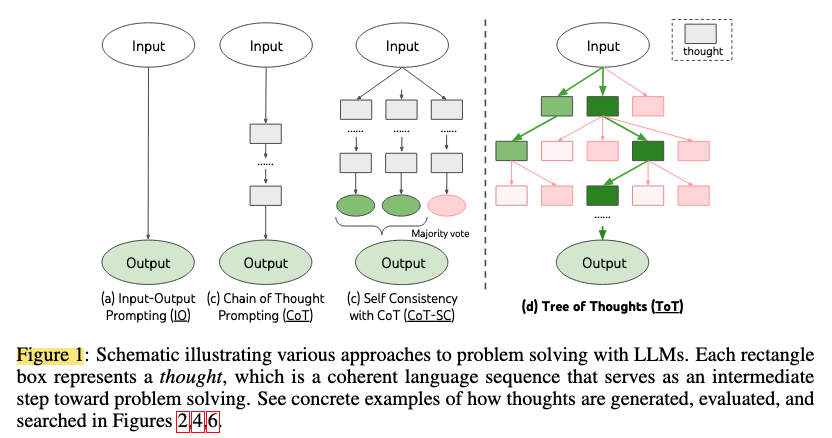

<a href="zotero://open-pdf/library/items/WK3T4PS8?page=NaN">“existing methods (detailed below) sample continuous language sequences for problem solving, ToT actively maintains a tree of thoughts, where each thought is a coherent language sequence that serves as an intermediate step toward problem solving (Table 1).”</a> (<a href="zotero://select/library/items/TXCZ8XJI">Yao et al., 2023, p. 2</a>) 现有的方法（详见下文）采样连续的语言序列来解决问题，ToT 主动维护一棵思想树，其中每个思想都是一个连贯的语言序列，作为解决问题的中间步骤（表 1）。

<a href="zotero://open-pdf/library/items/WK3T4PS8?page=NaN">“Such a high-level semantic unit allows the LM to self-evaluate the progress different intermediate thoughts make towards solving the problem through a deliberate reasoning process that is also instantiated in language”</a> (<a href="zotero://select/library/items/TXCZ8XJI">Yao et al., 2023, p. 2</a>) 这种高级语义单元允许 LM 通过深思熟虑的推理过程自我评估不同的中间思想在解决问题方面所取得的进展，该推理过程也在语言中实例化

<a href="zotero://open-pdf/library/items/WK3T4PS8?page=NaN">“Finally, we combine this language-based capability to generate and evaluate diverse thoughts with search algorithms, such as breadth-first search (BFS) or depth-first search (DFS), which allow systematic exploration of the tree of thoughts with lookahead and backtracking.”</a> (<a href="zotero://select/library/items/TXCZ8XJI">Yao et al., 2023, p. 2</a>) 最后，我们将这种基于语言的功能与搜索算法相结合，生成和评估不同的想法，例如广度优先搜索（BFS）或深度优先搜索（DFS），这允许通过前瞻和回溯系统地探索思想树。

## <a href="zotero://open-pdf/library/items/WK3T4PS8?page=2">“2 Background”</a> (<a href="zotero://select/library/items/TXCZ8XJI">Yao et al., 2023, p. 2</a>)

### <a href="zotero://open-pdf/library/items/WK3T4PS8?page=2">“Input-output (IO) prompting”</a> (<a href="zotero://select/library/items/TXCZ8XJI">Yao et al., 2023, p. 2</a>)

<a href="zotero://open-pdf/library/items/WK3T4PS8?page=NaN">“the most common way to turn a problem input x into output y with LM: y ∼ pθ(y|promptIO(x))”</a> (<a href="zotero://select/library/items/TXCZ8XJI">Yao et al., 2023, p. 2</a>) 使用 LM 将问题输入 x 转换为输出 y 的最常见方法： y ∼ pθ(y|promptIO(x))

### <a href="zotero://open-pdf/library/items/WK3T4PS8?page=3">“Chain-of-thought (CoT) prompting”</a> (<a href="zotero://select/library/items/TXCZ8XJI">Yao et al., 2023, p. 3</a>)

<a href="zotero://open-pdf/library/items/WK3T4PS8?page=NaN">“The key idea is to introduce a chain of thoughts z1, · · · , zn to bridge x and y, where each zi is a coherent language sequence that serves as a meaningful intermediate step toward problem solving (e.g. zi could be an intermediate equation for math QA)”</a> (<a href="zotero://select/library/items/TXCZ8XJI">Yao et al., 2023, p. 2</a>) 关键思想是引入一系列思想 z1,...,zn 来连接 x 和 y，其中每个 zi 是一个连贯的语言序列，作为解决问题的有意义的中间步骤（例如 zi 可以是数学质量保证）

<a href="zotero://open-pdf/library/items/WK3T4PS8?page=NaN">“In practice, [z1···n, y] ∼ pCoT θ (z1···n, y|x) is sampled as a continuous language sequence, and the decomposition of thoughts (e.g. is each zi a phrase, a sentence, or a paragraph) is left ambiguous.”</a> <zcitation>(<a href="zotero://select/library/items/TXCZ8XJI">Yao et al., 2023, p. 2</a>)</zcitation> 在实践中，[z1…n, y] ∼ pCoT θ (z1…n, y|x) 被采样为连续的语言序列，并且分解思想（例如每个 zi 是一个短语、一个句子、或一段）是不明确的。

### <a href="zotero://open-pdf/library/items/WK3T4PS8?page=3">“Self-consistency with CoT (CoT-SC)”</a> (<a href="zotero://select/library/items/TXCZ8XJI">Yao et al., 2023, p. 3</a>)

<a href="zotero://open-pdf/library/items/WK3T4PS8?page=NaN">“ensemble approach that samples k i.i.d. chains of thought: [z(i) 1···n, y(i)] ∼ pCoT θ (z1···n, y|x) (i = 1 · · · k), then returns the most frequent output: arg maxy #{i | y(i) = y}.”</a> (<a href="zotero://select/library/items/TXCZ8XJI">Yao et al., 2023, p. 2</a>) 对 k i.i.d 进行采样的集成方法思路：\[z(i) 1…n, y(i)] ∼ pCoT θ (z1…n, y|x) (i = 1 · · · k)，然后返回最频繁的输出: arg maxy #{i | y(i) = y}。

<a href="zotero://open-pdf/library/items/WK3T4PS8?page=NaN">“However, within each chain there is no local exploration of different thought steps, and the “most frequent” heuristic only applies when the output space is limited (e.g. multi-choice QA).”</a> (<a href="zotero://select/library/items/TXCZ8XJI">Yao et al., 2023, p. 2</a>) 然而，在每个链中，没有对不同思维步骤的局部探索，并且“最频繁”启发式仅在输出空间有限时适用（例如多选 QA）。

## <a href="zotero://open-pdf/library/items/WK3T4PS8?page=3">“3 Tree of Thoughts: Deliberate Problem Solving with LM”</a> (<a href="zotero://select/library/items/TXCZ8XJI">Yao et al., 2023, p. 3</a>)

<a href="zotero://open-pdf/library/items/WK3T4PS8?page=NaN">“A genuine problem-solving process involves the repeated use of available information to initiate exploration, which discloses, in turn, more information until a way to attain the solution is finally discovered”</a> (<a href="zotero://select/library/items/TXCZ8XJI">Yao et al., 2023, p. 2</a>) 一个真正的问题解决过程涉及反复利用可用信息来启动探索，进而揭示更多信息，直到最终发现达到解决方案的方法。 —— Newell et al.

<a href="zotero://open-pdf/library/items/WK3T4PS8?page=NaN">“Research on human problem-solving suggests that people search through a combinatorial problemspace – a tree where the nodes represent partial solutions, and the branches correspond to operators that modify them [18, 19].”</a> (<a href="zotero://select/library/items/TXCZ8XJI">Yao et al., 2023, p. 3</a>) 对人类解决问题的研究表明，人们通过组合问题空间进行搜索——一棵树，其中节点代表部分解决方案，分支对应于修改它们的运算符\[18, 19]。

<a href="zotero://open-pdf/library/items/WK3T4PS8?page=NaN">“Which branch to take is determined by heuristics that help to navigate the problem-space and guide the problem-solver towards a solution.”</a> (<a href="zotero://select/library/items/TXCZ8XJI">Yao et al., 2023, p. 3</a>) 采用哪个分支是由启发式决定的，这些启发式有助于导航问题空间并引导问题解决者找到解决方案。

<a href="zotero://open-pdf/library/items/WK3T4PS8?page=NaN">“two key shortcomings of existing approaches that use LMs to solve general problems”</a> (<a href="zotero://select/library/items/TXCZ8XJI">Yao et al., 2023, p. 3</a>) 使用语言模型解决一般问题的现有方法有两个主要缺点

*   <a href="zotero://open-pdf/library/items/WK3T4PS8?page=NaN">“1) Locally, they do not explore different continuations within a thought process – the branches of the tree.”</a>

    (<a href="zotero://select/library/items/TXCZ8XJI">Yao et al., 2023, p. 3</a>)

    1）在局部，他们不会在思维过程中探索不同的延伸——树的分支。

*   <a href="zotero://open-pdf/library/items/WK3T4PS8?page=NaN">“2) Globally, they do not incorporate any type of planning, lookahead, or backtracking to help evaluate these different options – the kind of heuristic-guided search that seems characteristic of human problem-solving.”</a>

    (<a href="zotero://select/library/items/TXCZ8XJI">Yao et al., 2023, p. 3</a>)

    2\) 在全局，它们不包含任何类型的规划、前瞻或回溯来帮助评估这些不同的选择 - 这种启发式引导搜索似乎是人类问题解决特征的一种。

<a href="zotero://open-pdf/library/items/WK3T4PS8?page=3">“Tree of Thoughts (ToT)”</a> (<a href="zotero://select/library/items/TXCZ8XJI">Yao et al., 2023, p. 3</a>)

<a href="zotero://open-pdf/library/items/WK3T4PS8?page=NaN">“a paradigm that allows LMs to explore multiple reasoning paths over thoughts (Figure 1(c)).”</a> (<a href="zotero://select/library/items/TXCZ8XJI">Yao et al., 2023, p. 3</a>) 允许 LM 探索多种思维推理路径的范式（图 1(c)）。

<a href="zotero://open-pdf/library/items/WK3T4PS8?page=NaN">“ToT frames any problem as a search over a tree, where each node is a state s = [x, z1···i] representing a partial solution with the input and the sequence of thoughts so far.”</a> (<a href="zotero://select/library/items/TXCZ8XJI">Yao et al., 2023, p. 3</a>) ToT 将任何问题构建为对树的搜索，其中每个节点都是一个状态 s = \[x, z1…i] ，表示具有输入和到目前为止的思想序列的部分解决方案。

<a href="zotero://open-pdf/library/items/WK3T4PS8?page=NaN">“A specific instantiation of ToT involves answering four questions:”</a> (<a href="zotero://select/library/items/TXCZ8XJI">Yao et al., 2023, p. 3</a>) ToT 的具体实例涉及回答四个问题：

*   <a href="zotero://open-pdf/library/items/WK3T4PS8?page=NaN">“1. How to decompose the intermediate process into thought steps;”</a>

    (<a href="zotero://select/library/items/TXCZ8XJI">Yao et al., 2023, p. 3</a>)

    1、如何将中间过程分解为思维步骤；

*   <a href="zotero://open-pdf/library/items/WK3T4PS8?page=NaN">“2. How to generate potential thoughts from each state;”</a>

    (<a href="zotero://select/library/items/TXCZ8XJI">Yao et al., 2023, p. 3</a>)

    2.如何从每个状态中产生潜在的想法；

*   <a href="zotero://open-pdf/library/items/WK3T4PS8?page=NaN">“3. How to heuristically evaluate states;”</a>

    (<a href="zotero://select/library/items/TXCZ8XJI">Yao et al., 2023, p. 3</a>)

    3\. 如何启发式评估状态；

*   <a href="zotero://open-pdf/library/items/WK3T4PS8?page=NaN">“4. What search algorithm to use.”</a>

    (<a href="zotero://select/library/items/TXCZ8XJI">Yao et al., 2023, p. 3</a>)

    4\. 使用什么搜索算法。

### <a href="zotero://open-pdf/library/items/WK3T4PS8?page=3">“1. Thought decomposition.”</a> (<a href="zotero://select/library/items/TXCZ8XJI">Yao et al., 2023, p. 3</a>)

<a href="zotero://open-pdf/library/items/WK3T4PS8?page=NaN">“While CoT samples thoughts coherently without explicit decomposition, ToT leverages problem properties to design and decompose intermediate thought steps.”</a> (<a href="zotero://select/library/items/TXCZ8XJI">Yao et al., 2023, p. 3</a>) CoT 连贯地对思想进行采样而无需显式分解，而 ToT 利用问题属性来设计和分解中间思想步骤。

<a href="zotero://open-pdf/library/items/WK3T4PS8?page=NaN">“depending on different problems”</a> (<a href="zotero://select/library/items/TXCZ8XJI">Yao et al., 2023, p. 3</a>) 根据不同的问题

<a href="zotero://open-pdf/library/items/WK3T4PS8?page=NaN">“In general, a thought should be “small” enough so that LMs can generate promising and diverse samples (e.g. generating a whole book is usually too “big” to be coherent), yet “big” enough so that LMs can evaluate its prospect toward problem solving (e.g. generating one token is usually too “small” to evaluate).”</a> (<a href="zotero://select/library/items/TXCZ8XJI">Yao et al., 2023, p. 3</a>) 一般来说，一个想法应该足够“小”，以便 LM 可以生成有前途且多样化的样本（例如，生成整本书通常太大而无法连贯），但又应该“足够大”，以便 LM 可以评估其前景解决问题（例如，生成一个token通常太“小”而无法评估）。

### <a href="zotero://open-pdf/library/items/WK3T4PS8?page=3">“2. Thought generator G(pθ, s, k).”</a> (<a href="zotero://select/library/items/TXCZ8XJI">Yao et al., 2023, p. 3</a>)

<a href="zotero://open-pdf/library/items/WK3T4PS8?page=NaN">“Given a tree state s = [x, z1···i], we consider two strategies to generate k candidates for the next thought step:”</a> (<a href="zotero://select/library/items/TXCZ8XJI">Yao et al., 2023, p. 3</a>) 给定一个树状态 s = \[x, z1…i]，我们考虑两种策略来生成下一步思考步骤的 k 个候选：

*   <a href="zotero://open-pdf/library/items/WK3T4PS8?page=3">“Sample”</a> (<a href="zotero://select/library/items/TXCZ8XJI">Yao et al., 2023, p. 3</a>)

    *   <a href="zotero://open-pdf/library/items/WK3T4PS8?page=NaN">“i.i.d. thoughts from a CoT prompt (Creative Writing, Figure 4):”</a>

        (<a href="zotero://select/library/items/TXCZ8XJI">Yao et al., 2023, p. 3</a>)

        i.i.d.来自 CoT 提示的想法（创意写作，图 4）：

    *   <a href="zotero://open-pdf/library/items/WK3T4PS8?page=NaN">“This works better when the thought space is rich (e.g. each thought is a paragraph), and i.i.d. samples lead to diversity;”</a>

        (<a href="zotero://select/library/items/TXCZ8XJI">Yao et al., 2023, p. 3</a>)

        当思维空间丰富（例如每个想法都是一个段落）并且独立同分布时，这种方法效果更好。样本带来多样性；

    *   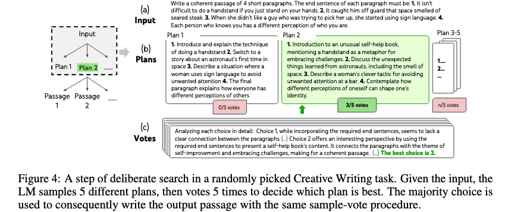

*   <a href="zotero://open-pdf/library/items/WK3T4PS8?page=3">“Propose”</a> (<a href="zotero://select/library/items/TXCZ8XJI">Yao et al., 2023, p. 3</a>)

    *   <a href="zotero://open-pdf/library/items/WK3T4PS8?page=3">“thoughts sequentially using a “propose prompt” (Game of 24, Figure 2; Crosswords, Figure 6)”</a>

        (<a href="zotero://select/library/items/TXCZ8XJI">Yao et al., 2023, p. 3</a>)

    *   <a href="zotero://open-pdf/library/items/WK3T4PS8?page=NaN">“This works better when the thought space is more constrained (e.g. each thought is just a word or a line), so proposing different thoughts in the same context avoids duplication.”</a>

        (<a href="zotero://select/library/items/TXCZ8XJI">Yao et al., 2023, p. 3</a>)

        当思维空间受到更多限制（例如每个想法只是一个单词或一行）时，这种方法效果更好，因此在同一上下文中提出不同的想法可以避免重复。

    *   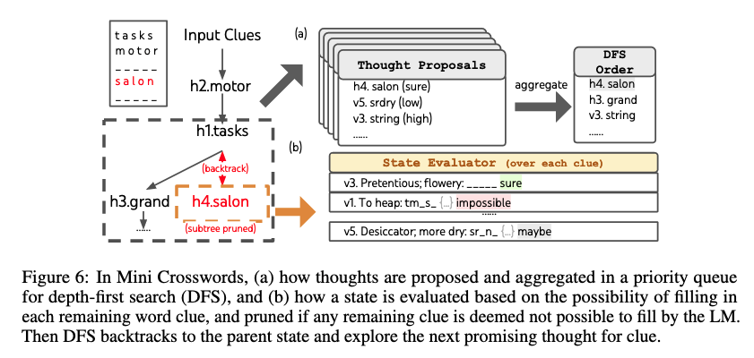

### <a href="zotero://open-pdf/library/items/WK3T4PS8?page=3">“3. State evaluator V (pθ, S)”</a> (<a href="zotero://select/library/items/TXCZ8XJI">Yao et al., 2023, p. 3</a>)

<a href="zotero://open-pdf/library/items/WK3T4PS8?page=NaN">“Given a frontier of different states, the state evaluator evaluates the progress they make towards solving the problem, serving as a heuristic for the search algorithm to determine which states to keep exploring and in which order.”</a> (<a href="zotero://select/library/items/TXCZ8XJI">Yao et al., 2023, p. 3</a>) 给定不同状态的边界，状态评估器评估它们在解决问题方面取得的进展，作为搜索算法的启发式方法来确定要继续探索哪些状态以及按什么顺序。

<a href="zotero://open-pdf/library/items/WK3T4PS8?page=NaN">“using the LM to deliberately reason about states.”</a> (<a href="zotero://select/library/items/TXCZ8XJI">Yao et al., 2023, p. 3</a>) 使用 LM 有意识地推理状态。

<a href="zotero://open-pdf/library/items/WK3T4PS8?page=NaN">“When applicable, such a deliberate heuristic can be more flexible than programmed rules, and more sample-efficient than learned models.”</a> (<a href="zotero://select/library/items/TXCZ8XJI">Yao et al., 2023, p. 3</a>) 当适用时，这种有意的启发式方法可以比编程规则更灵活，并且比学习模型更有效。

<a href="zotero://open-pdf/library/items/WK3T4PS8?page=NaN">“two strategies to evaluate states either independently or together”</a> (<a href="zotero://select/library/items/TXCZ8XJI">Yao et al., 2023, p. 3</a>) 独立或共同评估状态的两种策略

*   <a href="zotero://open-pdf/library/items/WK3T4PS8?page=4">“Value each state independently:”</a> (<a href="zotero://select/library/items/TXCZ8XJI">Yao et al., 2023, p. 4</a>)

    *   <a href="zotero://open-pdf/library/items/WK3T4PS8?page=NaN">“scalar value v (e.g. 1-10) or a classification (e.g. sure/likely/impossible)”</a>

        (<a href="zotero://select/library/items/TXCZ8XJI">Yao et al., 2023, p. 4</a>)

        标量值 v（例如 1-10）或分类（例如肯定/可能/不可能）

    *   <a href="zotero://open-pdf/library/items/WK3T4PS8?page=NaN">“Such valuations do not need to be perfect, and only need to be approximately”</a>

        (<a href="zotero://select/library/items/TXCZ8XJI">Yao et al., 2023, p. 4</a>)

        这种估值不需要是完美的，只需要近似即可

*   <a href="zotero://open-pdf/library/items/WK3T4PS8?page=4">“Vote across states”</a> (<a href="zotero://select/library/items/TXCZ8XJI">Yao et al., 2023, p. 4</a>)

    *   <a href="zotero://open-pdf/library/items/WK3T4PS8?page=4">“where a “good” state s∗ ∼ pvote θ (s∗|S) is voted out based on deliberately comparing different states in S in a vote prompt.”</a>

        (<a href="zotero://select/library/items/TXCZ8XJI">Yao et al., 2023, p. 4</a>)

        在一个投票提示中，根据有意识地比较S中的不同状态来选出一个“好”的状态s∗ ∼ pvote θ (s∗|S)。

    *   <a href="zotero://open-pdf/library/items/WK3T4PS8?page=NaN">“When problem success is harder to directly value (e.g. passage coherency), it is natural to to instead compare different partial solutions and vote for the most promising one.”</a>

        (<a href="zotero://select/library/items/TXCZ8XJI">Yao et al., 2023, p. 4</a>)

        当问题的成功很难直接评估时（例如段落一致性），很自然地会比较不同的部分解决方案并投票选出最有希望的解决方案。

<a href="zotero://open-pdf/library/items/WK3T4PS8?page=NaN">“For both strategies, we could prompt the LM multiple times to aggregate the value or vote results to trade time/resource/cost for more faithful/robust heuristics.”</a> (<a href="zotero://select/library/items/TXCZ8XJI">Yao et al., 2023, p. 4</a>) 对于这两种策略，我们可以多次提示 LM 聚合value或vote的结果，以时间/资源/成本换取更忠实/稳健的启发式方法。

### <a href="zotero://open-pdf/library/items/WK3T4PS8?page=4">“4. Search algorithm.”</a> (<a href="zotero://select/library/items/TXCZ8XJI">Yao et al., 2023, p. 4</a>)

*   <a href="zotero://open-pdf/library/items/WK3T4PS8?page=NaN">“a) Breadth-first search (BFS)”</a> (<a href="zotero://select/library/items/TXCZ8XJI">Yao et al., 2023, p. 4</a>) a) 广度优先搜索（BFS）

    *   <a href="zotero://open-pdf/library/items/WK3T4PS8?page=NaN">“maintains a set of the b most promising states per step”</a>

        (<a href="zotero://select/library/items/TXCZ8XJI">Yao et al., 2023, p. 4</a>)

        每步维护一组 b 个最有希望的状态

*   <a href="zotero://open-pdf/library/items/WK3T4PS8?page=NaN">“b) Depth-first search (DFS)”</a> (<a href="zotero://select/library/items/TXCZ8XJI">Yao et al., 2023, p. 4</a>) b) 深度优先搜索（DFS）

    *   <a href="zotero://open-pdf/library/items/WK3T4PS8?page=NaN">“explores the most promising state first, until the final output is reached (t > T ), or the state evaluator deems it impossible to solve the problem from the current s (V (pθ, {s})(s) ≤ vth for a value threshold vth)”</a>

        (<a href="zotero://select/library/items/TXCZ8XJI">Yao et al., 2023, p. 4</a>)

        首先探索最有希望的状态，直到达到最终输出 (t > T )，或者状态评估器认为无法从当前 s 解决问题 (V (pθ, {s})(s) ≤ vth for a值阈值 vth)

    *   <a href="zotero://open-pdf/library/items/WK3T4PS8?page=NaN">“In the latter case, the subtree from s is pruned to trade exploration for exploitation. In both cases, DFS backtracks to the parent state of s to continue exploration.”</a>

        (<a href="zotero://select/library/items/TXCZ8XJI">Yao et al., 2023, p. 4</a>)

        在后一种情况下，s 的子树被修剪以交换探索以获取利用。在这两种情况下，DFS 都会回溯到 s 的父状态以继续探索。

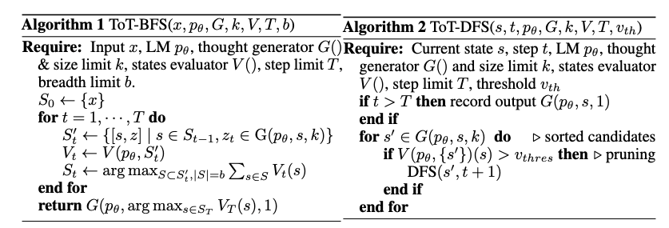

<a href="zotero://open-pdf/library/items/WK3T4PS8?page=NaN">“Conceptually, ToT has several benefits as a method for general problem-solving with LMs:”</a> (<a href="zotero://select/library/items/TXCZ8XJI">Yao et al., 2023, p. 4</a>) 从概念上讲，ToT 作为使用 LM 解决一般问题的方法有几个好处：

*   <a href="zotero://open-pdf/library/items/WK3T4PS8?page=NaN">“(1) Generality. IO, CoT, CoT-SC, and self-refinement can be seen as special cases of ToT (i.e. trees of limited depth and breadth; Figure 1)”</a>

    (<a href="zotero://select/library/items/TXCZ8XJI">Yao et al., 2023, p. 4</a>)

    (1)通用性。 IO、CoT、CoT-SC 和自我求精可以看作是 ToT 的特例（即深度和广度有限的树；图 1）

*   <a href="zotero://open-pdf/library/items/WK3T4PS8?page=NaN">“(2) Modularity. The base LM, as well as the thought decomposition, generation, evaluation, and search procedures can all be varied independently.”</a>

    (<a href="zotero://select/library/items/TXCZ8XJI">Yao et al., 2023, p. 4</a>)

    (2)模块化。基础 LM 以及思想分解、生成、评估和搜索过程都可以独立变化。

*   <a href="zotero://open-pdf/library/items/WK3T4PS8?page=NaN">“(3) Adaptability. Different problem properties, LM capabilities, and resource constraints can be accommodated.”</a>

    (<a href="zotero://select/library/items/TXCZ8XJI">Yao et al., 2023, p. 4</a>)

    (3)适应性。可以适应不同的问题属性、LM 功能和资源限制。

*   <a href="zotero://open-pdf/library/items/WK3T4PS8?page=NaN">“(4) Convenience. No extra training is needed, just a pre-trained LM is sufficient.”</a>

    (<a href="zotero://select/library/items/TXCZ8XJI">Yao et al., 2023, p. 4</a>)

    (4)方便。不需要额外的训练，只需预先训练的 LM 就足够了。

## <a href="zotero://open-pdf/library/items/WK3T4PS8?page=4">“4 Experiments”</a> (<a href="zotero://select/library/items/TXCZ8XJI">Yao et al., 2023, p. 4</a>)

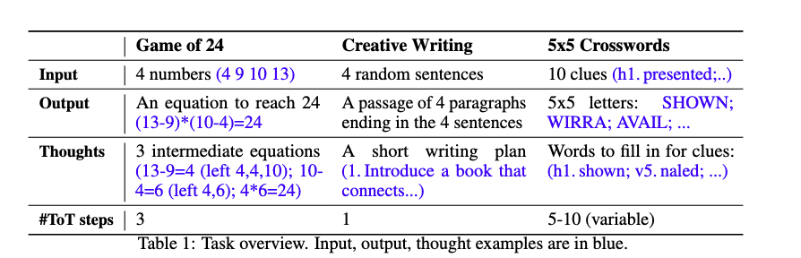

### <a href="zotero://open-pdf/library/items/WK3T4PS8?page=5">“4.1 Game of 24”</a> (<a href="zotero://select/library/items/TXCZ8XJI">Yao et al., 2023, p. 5</a>)

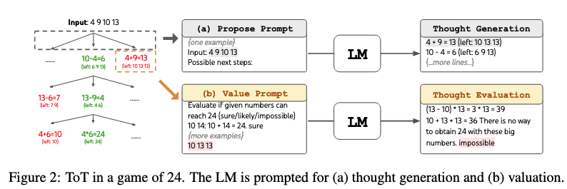

<a href="zotero://open-pdf/library/items/WK3T4PS8?page=5">“Baselines.”</a> (<a href="zotero://select/library/items/TXCZ8XJI">Yao et al., 2023, p. 5</a>)

*   <a href="zotero://open-pdf/library/items/WK3T4PS8?page=NaN">“standard input-output (IO) prompt with 5 in-context examples.”</a>

    (<a href="zotero://select/library/items/TXCZ8XJI">Yao et al., 2023, p. 5</a>)

    标准输入输出 (IO) 提示，带有 5 个上下文示例。

*   <a href="zotero://open-pdf/library/items/WK3T4PS8?page=NaN">“(CoT) prompting, we augment each input-output pair with 3 intermediate equations, each operating on two remaining numbers.”</a>

    (<a href="zotero://select/library/items/TXCZ8XJI">Yao et al., 2023, p. 5</a>)

    (CoT) 提示下，我们用 3 个中间方程来扩充每个输入输出对，每个方程都对剩余的两个数字进行运算。

*   <a href="zotero://open-pdf/library/items/WK3T4PS8?page=NaN">“CoT self-consistency baseline”</a> (<a href="zotero://select/library/items/TXCZ8XJI">Yao et al., 2023, p. 5</a>) CoT 自一致性基线

    *   <a href="zotero://open-pdf/library/items/WK3T4PS8?page=NaN">“takes the majority output from 100 CoT samples, and an iterative-refine approach on top of an IO sample for at most 10 iterations.”</a>

        (<a href="zotero://select/library/items/TXCZ8XJI">Yao et al., 2023, p. 5</a>)

        从 100 个 CoT 样本中获取大部分输出，并在 IO 样本之上采用迭代优化方法，最多进行 10 次迭代。

    *   <a href="zotero://open-pdf/library/items/WK3T4PS8?page=NaN">“At each iteration, the LM is conditioned on all previous history to “reflect on your mistakes and generate a refined answer” if the output is incorrect.”</a>

        (<a href="zotero://select/library/items/TXCZ8XJI">Yao et al., 2023, p. 5</a>)

        在每次迭代中，LM 都会以所有先前的历史记录为条件，以便在输出不正确时“反思错误并生成精确的答案”。

    *   <a href="zotero://open-pdf/library/items/WK3T4PS8?page=NaN">“Note that it uses groundtruth feedback signals about equation correctness.”</a>

        (<a href="zotero://select/library/items/TXCZ8XJI">Yao et al., 2023, p. 5</a>)

        请注意，它使用有关方程正确性的真实反馈信号。

<a href="zotero://open-pdf/library/items/WK3T4PS8?page=5">“ToT Setup.”</a> (<a href="zotero://select/library/items/TXCZ8XJI">Yao et al., 2023, p. 5</a>)

*   <a href="zotero://open-pdf/library/items/WK3T4PS8?page=5">“decompose the thoughts into 3 steps”</a>

    (<a href="zotero://select/library/items/TXCZ8XJI">Yao et al., 2023, p. 5</a>)

*   <a href="zotero://open-pdf/library/items/WK3T4PS8?page=NaN">“at each tree node, we exact the “left” numbers and prompt the LM to propose some possible next steps.”</a>

    (<a href="zotero://select/library/items/TXCZ8XJI">Yao et al., 2023, p. 5</a>)

    在每个树节点，我们提取“剩下”的数字，并提示 LM 提出一些可能的后续步骤。

*   <a href="zotero://open-pdf/library/items/WK3T4PS8?page=NaN">“We perform a breadth-first search (BFS) in ToT, where at each step we keep the best b = 5 candidates.”</a>

    (<a href="zotero://select/library/items/TXCZ8XJI">Yao et al., 2023, p. 5</a>)

    我们在 ToT 中执行广度优先搜索 (BFS)，在每一步中我们保留最好的 b = 5 个候选者。

*   <a href="zotero://open-pdf/library/items/WK3T4PS8?page=NaN">“we prompt LM to evaluate each thought candidate as “sure/maybe/impossible” with regard to reaching 24.”</a>

    (<a href="zotero://select/library/items/TXCZ8XJI">Yao et al., 2023, p. 5</a>)

    我们提示 LM 将每个候选想法评估为“确定/也许/不可能”以达到 24。

<a href="zotero://open-pdf/library/items/WK3T4PS8?page=6">“Results”</a> (<a href="zotero://select/library/items/TXCZ8XJI">Yao et al., 2023, p. 6</a>)

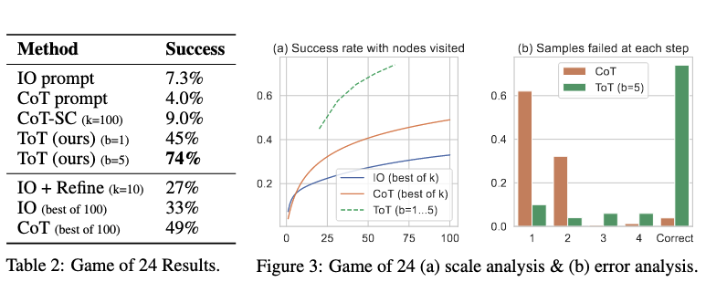

<a href="zotero://open-pdf/library/items/WK3T4PS8?page=6">“Error Analysis.”</a> (<a href="zotero://select/library/items/TXCZ8XJI">Yao et al., 2023, p. 6</a>)

*   <a href="zotero://open-pdf/library/items/WK3T4PS8?page=NaN">“Notably, around 60% of CoT samples already failed the task after generating the first step, or equivalently, the first three words (e.g. “4 + 9”). This highlights the issues with direct left-to-right decoding.”</a>

    (<a href="zotero://select/library/items/TXCZ8XJI">Yao et al., 2023, p. 5</a>)

    值得注意的是，大约 60% 的 CoT 样本在生成第一步或前三个单词（例如“4 + 9”）后就已经失败了。这凸显了直接从左到右解码的问题。

### <a href="zotero://open-pdf/library/items/WK3T4PS8?page=6">“4.2 Creative writing”</a> (<a href="zotero://select/library/items/TXCZ8XJI">Yao et al., 2023, p. 6</a>)

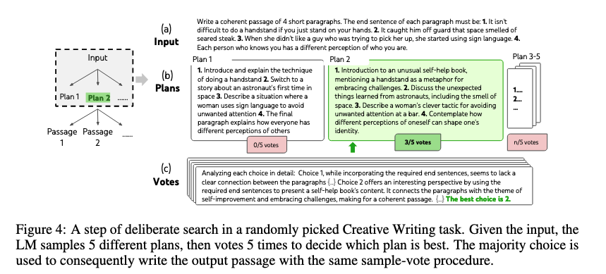

<a href="zotero://open-pdf/library/items/WK3T4PS8?page=6">“Baselines”</a> (<a href="zotero://select/library/items/TXCZ8XJI">Yao et al., 2023, p. 6</a>)

*   <a href="zotero://open-pdf/library/items/WK3T4PS8?page=NaN">“both IO and CoT prompts are zero-shot”</a> (<a href="zotero://select/library/items/TXCZ8XJI">Yao et al., 2023, p. 6</a>) IO 和 CoT 提示都是零样本

    *   IO：

        <a href="zotero://open-pdf/library/items/WK3T4PS8?page=NaN">“prompts the LM to directly generate”</a>

        (<a href="zotero://select/library/items/TXCZ8XJI">Yao et al., 2023, p. 6</a>)

        提示LM直接生成

    *   CoT：

        <a href="zotero://open-pdf/library/items/WK3T4PS8?page=NaN">“prompts the LM to first make a brief plan then write the passage”</a>

        (<a href="zotero://select/library/items/TXCZ8XJI">Yao et al., 2023, p. 6</a>)

        提示 LM 首先制定一个简短的计划，然后写下段落

*   <a href="zotero://open-pdf/library/items/WK3T4PS8?page=NaN">“iterative-refine (k ≤ 5) method on top of a random IO sample for each task”</a>

    (<a href="zotero://select/library/items/TXCZ8XJI">Yao et al., 2023, p. 6</a>)

    每个任务的随机 IO 样本之上的迭代优化 (k ≤ 5) 方法

<a href="zotero://open-pdf/library/items/WK3T4PS8?page=6">“ToT setup.”</a> (<a href="zotero://select/library/items/TXCZ8XJI">Yao et al., 2023, p. 6</a>)

*   <a href="zotero://open-pdf/library/items/WK3T4PS8?page=NaN">“depth 2 (and only 1 intermediate thought step)”</a> (<a href="zotero://select/library/items/TXCZ8XJI">Yao et al., 2023, p. 6</a>) 深度 2（并且只有 1 个中间思考步骤）

    *   <a href="zotero://open-pdf/library/items/WK3T4PS8?page=NaN">“first generates k = 5 plans and votes for the best one (Figure 4)”</a>

        (<a href="zotero://select/library/items/TXCZ8XJI">Yao et al., 2023, p. 6</a>)

        首先生成 k = 5 个计划并投票选出最佳计划（图 4）

    *   <a href="zotero://open-pdf/library/items/WK3T4PS8?page=NaN">“then similarly generate k = 5 passages based on the best plan then vote for the best one”</a>

        (<a href="zotero://select/library/items/TXCZ8XJI">Yao et al., 2023, p. 6</a>)

        然后根据最佳计划类似地生成 k = 5 个段落，然后投票选出最佳计划

<a href="zotero://open-pdf/library/items/WK3T4PS8?page=6">“Results”</a> (<a href="zotero://select/library/items/TXCZ8XJI">Yao et al., 2023, p. 6</a>)

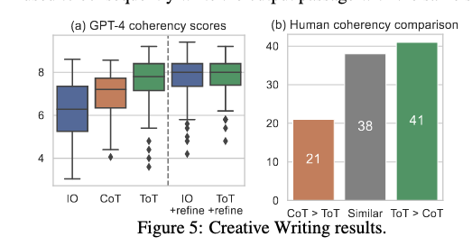

*   迭代优化

    *   <a href="zotero://open-pdf/library/items/WK3T4PS8?page=NaN">“iterative-refine is more effective on this natural language task”</a>

        (<a href="zotero://select/library/items/TXCZ8XJI">Yao et al., 2023, p. 6</a>)

        iterative-refine 对这个自然语言任务更有效

    *   <a href="zotero://open-pdf/library/items/WK3T4PS8?page=NaN">“We believe it could be thought of as a third approach to thought generation in the ToT framework, where new thoughts can arise from refining old thoughts instead of i.i.d. or sequentially generated.”</a>

        (<a href="zotero://select/library/items/TXCZ8XJI">Yao et al., 2023, p. 7</a>)

         我们相信它可以被认为是 ToT 框架中思想生成的第三种方法，其中新思想可以通过提炼旧思想而不是独立同分布而产生。或依次生成。

### <a href="zotero://open-pdf/library/items/WK3T4PS8?page=7">“4.3 Mini Crosswords”</a> (<a href="zotero://select/library/items/TXCZ8XJI">Yao et al., 2023, p. 7</a>)

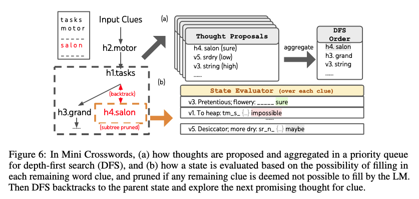

<a href="zotero://open-pdf/library/items/WK3T4PS8?page=7">“ToT Setup.”</a> (<a href="zotero://select/library/items/TXCZ8XJI">Yao et al., 2023, p. 7</a>)

*   <a href="zotero://open-pdf/library/items/WK3T4PS8?page=NaN">“keeps exploring the most promising subsequent word clue until the state is no longer promising, then backtrack to the parent state to explore alternative thoughts”</a>

    (<a href="zotero://select/library/items/TXCZ8XJI">Yao et al., 2023, p. 7</a>)

    不断探索最有希望的后续单词线索，直到状态不再有希望，然后回溯到父状态以探索替代想法

<a href="zotero://open-pdf/library/items/WK3T4PS8?page=8">“Results”</a> (<a href="zotero://select/library/items/TXCZ8XJI">Yao et al., 2023, p. 8</a>)

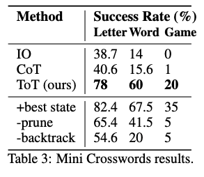

<a href="zotero://open-pdf/library/items/WK3T4PS8?page=8">“Oracle and ablation studies.”</a> (<a href="zotero://select/library/items/TXCZ8XJI">Yao et al., 2023, p. 8</a>)

*   <a href="zotero://open-pdf/library/items/WK3T4PS8?page=NaN">“When outputting from the oracle best DFS state (instead of the heuristically determined best state) per task, ToT performance is even higher and actually solves 7/20 games (Table 3, “+best state”), indicating our simple output heuristics can be readily improved.”</a>

    (<a href="zotero://select/library/items/TXCZ8XJI">Yao et al., 2023, p. 8</a>)

    当从每个任务的 oracle 最佳 DFS 状态（而不是启发式确定的最佳状态）输出时，ToT 性能甚至更高，并且实际上解决了 7/20 游戏（表 3，“+最佳状态”），这表明我们的简单输出启发式可以是很容易得到改善。

*   有时候对于正确的结果，仍然会判断为错误，因为不认识某些单词（不常见或者过时的）

    *   <a href="zotero://open-pdf/library/items/WK3T4PS8?page=NaN">“Given the state evaluation as a pruning heuristic is imperfect, we also explore ablating the pruning, and find the performance generally worse (Table 3, “-prune”).”</a>

        (<a href="zotero://select/library/items/TXCZ8XJI">Yao et al., 2023, p. 8</a>)

        鉴于作为剪枝启发式的状态评估是不完善的，我们还探索了消融剪枝，并发现性能普遍较差（表 3，“-prune”）。

*   <a href="zotero://open-pdf/library/items/WK3T4PS8?page=NaN">“Lastly, we confirm the importance of backtracking by running an ablation that keeps filling the most promising clue for at most 20 steps, allowing overwrites.”</a>

    (<a href="zotero://select/library/items/TXCZ8XJI">Yao et al., 2023, p. 8</a>)

    最后，我们通过运行消融来确认回溯的重要性，该消融在最多 20 个步骤中不断填充最有希望的线索，并允许覆盖。

## <a href="zotero://open-pdf/library/items/WK3T4PS8?page=8">“5 Related Work”</a> (<a href="zotero://select/library/items/TXCZ8XJI">Yao et al., 2023, p. 8</a>)

<a href="zotero://open-pdf/library/items/WK3T4PS8?page=8">“Planning and decision making.”</a> (<a href="zotero://select/library/items/TXCZ8XJI">Yao et al., 2023, p. 8</a>)

<a href="zotero://open-pdf/library/items/WK3T4PS8?page=9">“Self-reflection.”</a> (<a href="zotero://select/library/items/TXCZ8XJI">Yao et al., 2023, p. 9</a>)

*   <a href="zotero://open-pdf/library/items/WK3T4PS8?page=NaN">“LMs provide feedback to their generation candidates”</a>

    (<a href="zotero://select/library/items/TXCZ8XJI">Yao et al., 2023, p. 9</a>)

    LMs向其生成候选项提供反馈

<a href="zotero://open-pdf/library/items/WK3T4PS8?page=9">“Program-guided LLM generation.”</a> (<a href="zotero://select/library/items/TXCZ8XJI">Yao et al., 2023, p. 9</a>) 程序导向的LLM生成。

<a href="zotero://open-pdf/library/items/WK3T4PS8?page=9">“Classical search methods.”</a> (<a href="zotero://select/library/items/TXCZ8XJI">Yao et al., 2023, p. 9</a>)

## <a href="zotero://open-pdf/library/items/WK3T4PS8?page=9">“6 Discussion”</a> (<a href="zotero://select/library/items/TXCZ8XJI">Yao et al., 2023, p. 9</a>)

### <a href="zotero://open-pdf/library/items/WK3T4PS8?page=9">“Limitations and future directions.”</a> (<a href="zotero://select/library/items/TXCZ8XJI">Yao et al., 2023, p. 9</a>)

-- 对于一些比较简单的，已经表现很好的任务是没有必要的，但是会有更加复杂的任务来应用LLM

-- 需要消耗更多的资源来提升任务的性能，但是ToT的模块的灵活性可以让用户比较自由地权衡成本与性能

-- 使用的是现成的语言模型，并使用高层级的反事实决策几星微调，可能会提供增强语言模型的解决问题的能力的机会

### <a href="zotero://open-pdf/library/items/WK3T4PS8?page=9">“Broader impact.”</a> (<a href="zotero://select/library/items/TXCZ8XJI">Yao et al., 2023, p. 9</a>)

<a href="zotero://open-pdf/library/items/WK3T4PS8?page=NaN">“ToT is a framework that empowers LMs to more autonomously and intelligently make decisions and solve problems.”</a> (<a href="zotero://select/library/items/TXCZ8XJI">Yao et al., 2023, p. 9</a>) ToT 是一个框架，使 LM 能够更自主、更智能地做出决策和解决问题。

<a href="zotero://open-pdf/library/items/WK3T4PS8?page=NaN">“While current tasks are limited to reasoning and search problems, future applications involving interaction with external environments or humans could bring potential danger, e.g. facilitating harmful uses of LMs.”</a> (<a href="zotero://select/library/items/TXCZ8XJI">Yao et al., 2023, p. 9</a>) 虽然当前的任务仅限于推理和搜索问题，但涉及与外部环境或人类交互的未来应用可能会带来潜在的危险，例如促进LM的有害使用。

<a href="zotero://open-pdf/library/items/WK3T4PS8?page=NaN">“On the other hand, ToT also improves the interpretability of model decisions and the opportunity for human alignment, as the resulting representations are readable, high-level language reasoning instead of implicit, low-level token values.”</a> (<a href="zotero://select/library/items/TXCZ8XJI">Yao et al., 2023, p. 9</a>) 另一方面，ToT 还提高了模型决策的可解释性和人类对齐的机会，因为生成的表示是可读的高级语言推理，而不是隐式的低级标记值。

### <a href="zotero://open-pdf/library/items/WK3T4PS8?page=9">“Conclusion.”</a> (<a href="zotero://select/library/items/TXCZ8XJI">Yao et al., 2023, p. 9</a>)

<a href="zotero://open-pdf/library/items/WK3T4PS8?page=NaN">“The associative “System 1” of LMs can be beneficially augmented by a “System 2” based on searching a tree of possible paths to the solution to a problem.”</a> (<a href="zotero://select/library/items/TXCZ8XJI">Yao et al., 2023, p. 9</a>) 基于搜索问题解决方案的可能路径树，“系统 2”可以有益地增强 LM 的关联“系统 1”。

<a href="zotero://open-pdf/library/items/WK3T4PS8?page=NaN">“The Tree of Thoughts framework provides a way to translate classical insights about problem-solving into actionable methods for contemporary LMs.”</a> (<a href="zotero://select/library/items/TXCZ8XJI">Yao et al., 2023, p. 9</a>) 思想树框架提供了一种将解决问题的经典见解转化为当代语言模型的可行方法的方法。

<a href="zotero://open-pdf/library/items/WK3T4PS8?page=NaN">“At the same time, LMs address a weakness of these classical methods, providing a way to solve complex problems that are not easily formalized, such as creative writing”</a> (<a href="zotero://select/library/items/TXCZ8XJI">Yao et al., 2023, p. 9</a>) 同时，LM 解决了这些经典方法的弱点，提供了一种解决不易形式化的复杂问题的方法，例如创意写作

<a href="zotero://open-pdf/library/items/WK3T4PS8?page=NaN">“We see this intersection of LMs with classical approaches to AI as an exciting direction for future work.”</a> (<a href="zotero://select/library/items/TXCZ8XJI">Yao et al., 2023, p. 9</a>) 我们认为 LM 与经典人工智能方法的交叉是未来工作的一个令人兴奋的方向。
