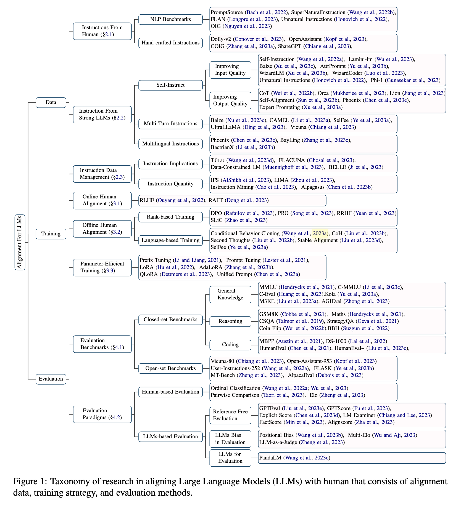
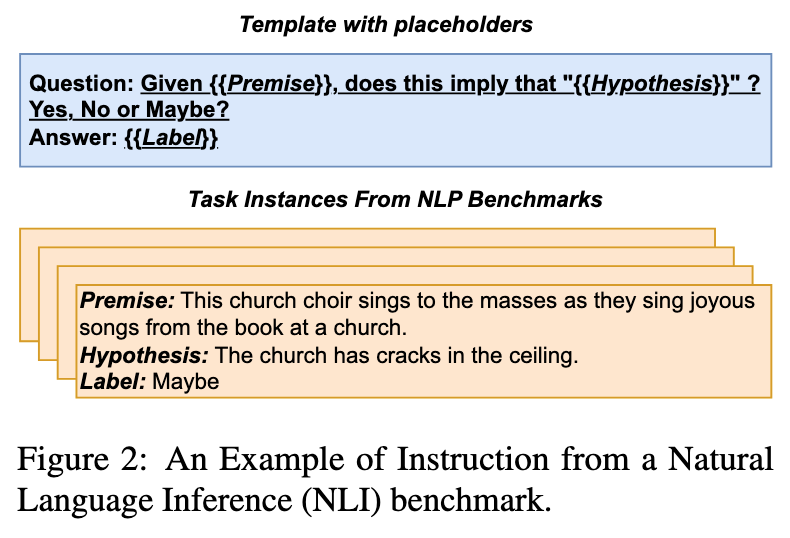
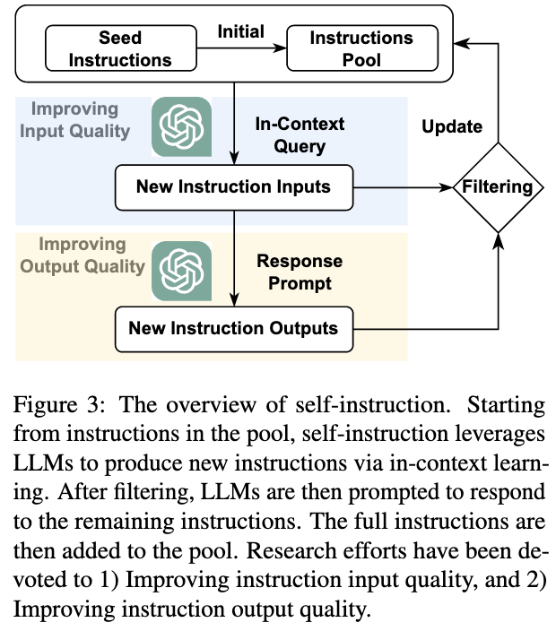
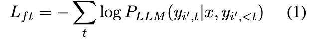
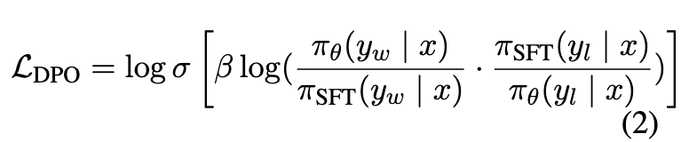
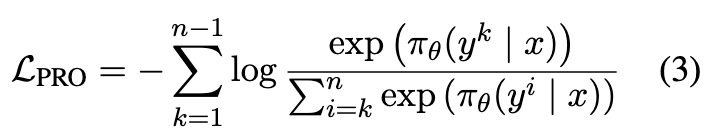
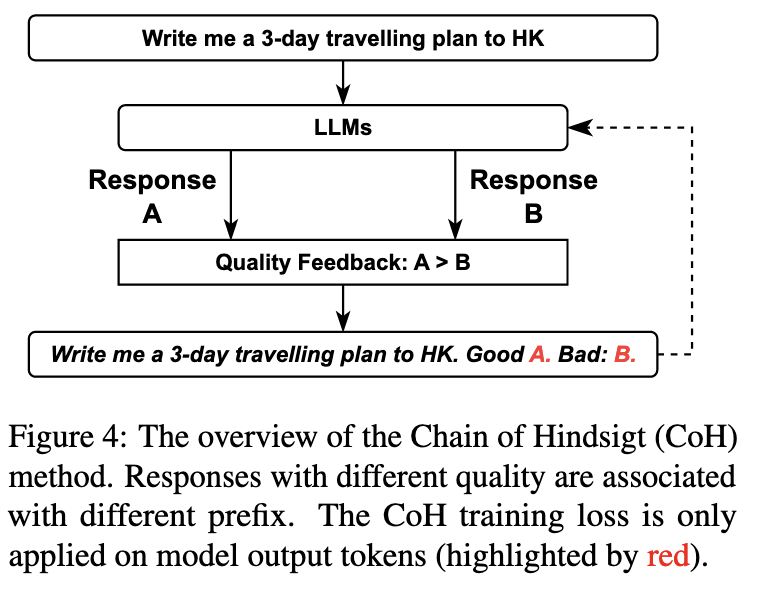
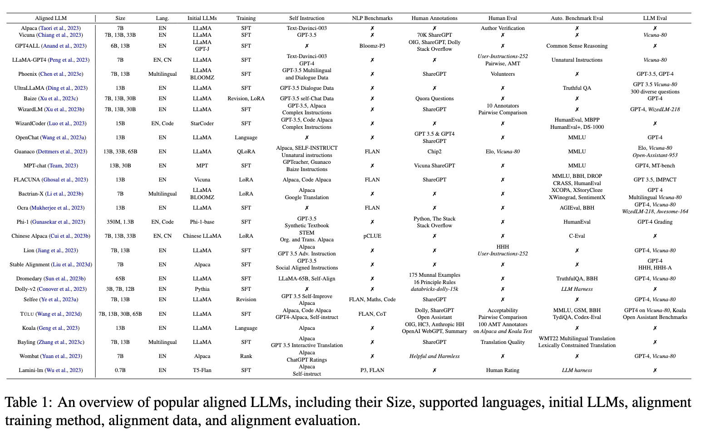

# <a href="zotero://open-pdf/library/items/XWFBI4XF?page=1">“Aligning Large Language Models with Human: A Survey”</a> (<a href="zotero://select/library/items/MPND5R5Z">Wang et al., 2023, p. 1</a>)

Comment: work in progress

Referred in <a href="zotero://note/u/LJSU8E3B/?ignore=1&#x26;line=2" rel="noopener noreferrer nofollow" zhref="zotero://note/u/LJSU8E3B/?ignore=1&#x26;line=2" ztype="znotelink" class="internal-link">LLM</a>

## <a href="zotero://open-pdf/library/items/XWFBI4XF?page=1">“Abstract”</a> (<a href="zotero://select/library/items/MPND5R5Z">Wang et al., 2023, p. 1</a>)

LLMs容易受到某些限制：

*   误解人类指令
*   生成潜在有偏见的内容
*   事实上不正确（产生幻觉）信息

因此，将LLMs与人类期望保持一致已成为研究界的一个活跃领域。

本文提供了对这些对准技术的全面概述，包括以下方面：

1.  <a href="zotero://open-pdf/library/items/XWFBI4XF?page=1">“Data collection”</a>

    (<a href="zotero://select/library/items/MPND5R5Z">Wang et al., 2023, p. 1</a>)

    数据收集：有效收集LLM对齐的高质量指令的方法，包括使用NLP基准、人工标注和利用强大的LLM。

2.  <a href="zotero://open-pdf/library/items/XWFBI4XF?page=1">“Training methodologies”</a>

    (<a href="zotero://select/library/items/MPND5R5Z">Wang et al., 2023, p. 1</a>)

    训练方法：详细回顾了用于LLM对齐的主流训练方法。包括有监督微调、在线和离线人类偏好训练，以及参数高效训练机制。

3.  <a href="zotero://open-pdf/library/items/XWFBI4XF?page=1">“Model Evaluation”</a>

    (<a href="zotero://select/library/items/MPND5R5Z">Wang et al., 2023, p. 1</a>)

    模型评估：评估这些与人类对齐的LLM模型效果的方法，提出了一种多方面的评估方法。

相关论文链接：

<https://github.com/GaryYufei/AlignLLMHumanSurvey>

## <a href="zotero://open-pdf/library/items/XWFBI4XF?page=1">“1 Introduction”</a> (<a href="zotero://select/library/items/MPND5R5Z">Wang et al., 2023, p. 1</a>)

基础的大型语言模型（LLM）如GPT-3是在一个庞大的文本语料库上进行预训练，其目标是预测后续的标记。

问题：

1.  产生与人类期望不符的输出。
2.  产生幻觉

因此，最近的自然语言处理研究工作集中在赋予LLMs理解指令并与人类期望保持一致的能力。

使LLMs遵循人类指令的最初方法是：使用指令集，通过将手工制作的任务指令模板与标准NLP任务的实例相结合编译而成的。但是往往无法捕捉到实际用户指令的复杂性，

1.  因为这些指令往往源自于设计用来测试机器能力特定方面的人工NLP任务。
2.  另一方面，现实世界的用户说明更加多样化和复杂。

因此，OpenAI通过由多样化的人类用户注释的指令来探索LLM的监督微调（<a href="zotero://open-pdf/library/items/XWFBI4XF?page=1">“Supervised Fine-Tuning”</a> (<a href="zotero://select/library/items/MPND5R5Z">Wang et al., 2023, p. 1</a>)，SFT）。通过这个过程开发的模型，比如InstructGPT（Ouyang等人，2022年）和ChatGPT 1，在理解人类指令和解决复杂任务方面表现出显著改进。

<https://blog.csdn.net/zzPaulmn/article/details/128684731>

<a href="zotero://open-pdf/library/items/XWFBI4XF?page=1">“Reinforcement Learning from Human Feedback (RLHF)”</a> (<a href="zotero://select/library/items/MPND5R5Z">Wang et al., 2023, p. 1</a>)

该方法通过使用经过人工评级的输出来训练奖励模型，从而学习人类偏好。

在对齐过程和随后的评估中存在的挑战：

1.  数据：收集SFT和RLHF阶段的高质量数据可能是昂贵且耗时的。
2.  训练策略：训练策略需要进行优化，因为SFT培训消耗资源较多，并且RLHF中的强化学习常常缺乏稳定性。
3.  评估方法：全面评估LLMs是具有挑战性的，因为有限的NLP基准可能无法完全展示LLMs的多方面能力。

<a href="zotero://open-pdf/library/items/XWFBI4XF?page=2">“Figure 1: Taxonomy of research in aligning Large Language Models (LLMs) with human that consists of alignment data, training strategy, and evaluation methods.”</a> (<a href="zotero://select/library/items/MPND5R5Z">Wang et al., 2023, p. 2</a>) 图1：将大型语言模型（LLMs）与人类对齐的研究分类，包括对齐数据、训练策略和评估方法。

对于方面（a）数据，重点是有效地收集大规模、高质量的数据，用于LLM对齐训练。

研究人员建议利用现有的自然语言处理基准、人工标注和最先进的LLM（例如ChatGPT和GPT-4）来生成训练指导。

为了解决方面(b)训练方法，解决方案涉及优化训练方法，以提高效率和稳定性，并将人类偏好纳入其中。为了减少LLM对齐的计算量和提高效率，已经提出了参数高效的训练方法。此外，一些研究人员将人类偏好视为基于排名的训练信号，或者用基于语言的反馈取代标量奖励，以提高训练的稳定性和性能。

关于(c)方面，已经提出了各种以人为中心的LLM评估基准和自动评估协议（例如，用于评估的LLMs），以获得对齐LLMs的全面评价。

## <a href="zotero://open-pdf/library/items/XWFBI4XF?page=3">“2 Alignment Data Collection”</a> (<a href="zotero://select/library/items/MPND5R5Z">Wang et al., 2023, p. 3</a>)

$$
l_k = (x_k, y_k)
$$

其中xk表示指令输入，yk表示相应的回复

数据来源：1. 人工生成；2. 强大的LLMs生成

### <a href="zotero://open-pdf/library/items/XWFBI4XF?page=3">“2.1 Instructions from Human”</a> (<a href="zotero://select/library/items/MPND5R5Z">Wang et al., 2023, p. 3</a>)  人工生成指令

两个主要来源：

1.  现有的人工标注的自然语言处理基准测试数据集
2.  精心手工制作的指令

#### <a href="zotero://open-pdf/library/items/XWFBI4XF?page=3">“2.1.1 NLP Benchmarks”</a> (<a href="zotero://select/library/items/MPND5R5Z">Wang et al., 2023, p. 3</a>)  人工标注的NLP基准数据集

直观的方法：将基准数据集调整为自然语言指令，例子：

相关的工作：

*   <a href="zotero://open-pdf/library/items/XWFBI4XF?page=3">“PromptSource (Bach et al., 2022)”</a>
*   <a href="zotero://open-pdf/library/items/XWFBI4XF?page=3">“FLAN (Wei et al., 2022a; Longpre et al., 2023)”</a>
*   <a href="zotero://open-pdf/library/items/XWFBI4XF?page=3">“SuperNaturalInstruction (Wang et al., 2022b; Mishra et al., 2022)”</a>

这些基准代表了在语言指令框架下统一的各种不同的自然语言处理任务，如对话、推理任务和编码任务。

人工指定模板将数据整合成文本，目标是增强LLMs在训练任务中的多任务学习能力，并促进对未知任务的泛化。

*   <a href="zotero://open-pdf/library/items/XWFBI4XF?page=3">“OIG (Nguyen et al., 2023)”</a>

     将FLAN类似的NLP基准测试中的指令与其他类型的开放式指令相结合，例如如何操作、数学和编码指令。

*   <a href="zotero://open-pdf/library/items/XWFBI4XF?page=3">“Unnatural Instructions”</a>

    利用LLMs生成与原始指令相似但具有显著差异的新模板或实例。

#### <a href="zotero://open-pdf/library/items/XWFBI4XF?page=3">“2.1.2 Hand-crafted Instructions”</a> (<a href="zotero://select/library/items/MPND5R5Z">Wang et al., 2023, p. 3</a>) 手工制作的指令

从NLP基准构建指令可能是有效的，但是许多数据集是专注于某个领域的，所以生成的指令范围也相对小，因此，它们可能无法满足现实世界应用的复杂需求，比如进行对话。

可以通过有意识的手动注释来构建指令。

*   “databricks-dolly-15k (Conover et al., 2023)” 众包收集

*   <a href="zotero://open-pdf/library/items/XWFBI4XF?page=4">“OpenAssistant”</a> (<a href="zotero://select/library/items/MPND5R5Z">Wang et al., 2023, p. 4</a>) 多语言注释，注释过程包括：

    *   编写对话的初始prompt

    *   作为助手或用户进行回复

    *   将对话质量排名以明确提供人类偏好

        因此，这个语料库可以用于监督微调SFT和LLMs的人工偏好对齐训练。

*   COIG：从现有的英文指令集中构建高质量的中文指令

*   <a href="zotero://open-pdf/library/items/XWFBI4XF?page=4">“ShareGPT”</a>

    (<a href="zotero://select/library/items/MPND5R5Z">Wang et al., 2023, p. 4</a>)

    众包人工撰写指令集，鼓励用户分享他们的ChatGPT和GPT-4的对话内容，这样的机制可以有效地收集大量多样化且由人类撰写的指令，很可能触发高质量的ChatGPT/GPT4回复。一些研究人员认为可以将这些资源作为种子指令，来使得GPT-3.5生成高质量的多轮对话

### <a href="zotero://open-pdf/library/items/XWFBI4XF?page=4">“2.2 Instructions From Strong LLMs”</a> (<a href="zotero://select/library/items/MPND5R5Z">Wang et al., 2023, p. 4</a>)

随着强大的闭源LLM（例如ChatGPT/GPT4）的出现，通过向这些LLM提供适当的提示，自动化收集过程以获取各种类型的合成指令（例如单轮、多轮和多语言指令）也是可行的。

主要挑战是如何有效地促使LLMs生成多样且高质量的指令。

#### <a href="zotero://open-pdf/library/items/XWFBI4XF?page=4">“2.2.1 Self-Instruction”</a> (<a href="zotero://select/library/items/MPND5R5Z">Wang et al., 2023, p. 4</a>) 自我指导

*   <a href="zotero://open-pdf/library/items/XWFBI4XF?page=4">“Self-Instruct (Wang et al., 2022a)”</a>

自动化指令收集，它利用ChatGPT的上下文学习能力，从预定义的人工注释指令集中生成大规模指令，涵盖了各种主题和任务类型，如图3所示。

但是使用self-instruction的指令微调的大模型比2.1中的1. 基于基准数据集的人工标注的指令以及手工制作的指令的效果好。

*   <a href="zotero://open-pdf/library/items/XWFBI4XF?page=4">“Aplaca (Taori et al., 2023) and its variants (Cui et al., 2023a)”</a>

    遵循这一自我指导框架

<a href="zotero://open-pdf/library/items/XWFBI4XF?page=4"><strong>“Improving Input Quality”</strong></a>** (<a href="zotero://select/library/items/MPND5R5Z">Wang et al., 2023, p. 4</a>)**

强大的LLM合成指令常常受到多样性问题的限制。比如生成笑话

*   “Self-Instruct“ <a href="zotero://open-pdf/library/items/XWFBI4XF?page=5">“Wang et al. (2022a)”</a> (<a href="zotero://select/library/items/MPND5R5Z">Wang et al., 2023, p. 5</a>) 针对不同类型的指令提出了不同的输入和输出生成策略。

    *   首先prompt ChatGPT来将任务分成分类任务和非分类任务
    *   然后，分别针对分类任务和非分类任务采用输出优先和输入优先的策略。

在输入prompts中添加各种外部信息，以增强多样性和真实性。比如

*   维基百科的类别关键词

    <a href="zotero://open-pdf/library/items/XWFBI4XF?page=18">“Lamini-lm”</a>

    “Wikipedia Category Keywords (Wu et al., 2023)”

*   网络社区中的用户问题

    <a href="zotero://open-pdf/library/items/XWFBI4XF?page=2">“Baize”</a>

     

    “(Xu et al., 2023c; Anand et al., 2023)”

*   基准测试指令

    <a href="zotero://open-pdf/library/items/XWFBI4XF?page=2">“Unnatural Instructions”</a>

    “SuperNaturalInstruction benchmark (Honovich et al., 2022)”

*   在数据生成中添加元信息，比如：长度、主题、样式等，可以有效地消除生成的数据中的偏差，并且可以提高合成数据的多样性

    <a href="zotero://open-pdf/library/items/XWFBI4XF?page=2">“AttrPrompt”</a>

    “Yu et al. (2023b)”

*   <a href="zotero://open-pdf/library/items/XWFBI4XF?page=5">“Evol-Instruct”</a>  逐步获得复杂且困难的指令。

    *   在EvolInstruct中，没有使用现有的指令来提示LLM通过情境学习产生新的指令，而是有五个不同的手动设计的提示，以明确地指示LLM使用深度方法(即，包括关于特定主题的更多信息)或广度方法(即，提高主题/信息覆盖率)将现有的简单指令重写为复杂的指令。

    *   生成的

        WizardLM

        <a href="zotero://open-pdf/library/items/XWFBI4XF?page=2">“(Xu et al., 2023b)”</a>

        模型在MTBench（Zheng等，2023）和AlpacaEval（Dubois等，2023）中排名靠前。

*   <a href="zotero://open-pdf/library/items/XWFBI4XF?page=5">“WizardCoder”</a>

    “(Luo et al., 2023)”

    从简单的代码和编程指令生成复杂的代码和编程指令

*   <a href="zotero://open-pdf/library/items/XWFBI4XF?page=2">“Phi-1”</a> “Gunasekar et al. (2023)” (<a href="zotero://select/library/items/MPND5R5Z">Wang et al., 2023, p. 5</a>) 生成类似教科书的指导，提供足够的背景知识来促进LLMs的推理和基本算法技能。

    *   他们发现，由此产生的13亿个LLMs phi-1成功地超越了各种规模更大的LLMs，显示出数据质量的重要性。

<a href="zotero://open-pdf/library/items/XWFBI4XF?page=5"><strong>“Improving Output Quality”</strong></a>** (<a href="zotero://select/library/items/MPND5R5Z">Wang et al., 2023, p. 5</a>)**

除了提供高质量的教学输入之外，一个关键要求是巧妙地促使LLMs产生高质量的回应。提高响应质量的传统方法是在LLM提示后附加额外条件，包括以下方面:

1.  <a href="zotero://open-pdf/library/items/XWFBI4XF?page=5">“Reasoning-Provoking Conditions”</a> 引发推理的条件:

    1.  <a href="zotero://open-pdf/library/items/XWFBI4XF?page=5">“Chain-of-Thought (CoT)”</a>

        提示中加入推理过程

    2.  <a href="zotero://open-pdf/library/items/XWFBI4XF?page=5">“Orca”</a>

         

        不仅学习了LLMs的表面响应文本，还捕捉到了复杂的推理过程信号，即他们引导LLMs使用一系列预定义的系统提示（例如，“逐步思考并证明你的回答”）来回应需要推理能力的FLAN指令，从而促使LLMs（例如GPT4）披露他们的推理过程信息。

2.  <a href="zotero://open-pdf/library/items/XWFBI4XF?page=5">“Hand-crafted Guiding Principles”</a>  手工制作的指导原则

    1.  <a href="zotero://open-pdf/library/items/XWFBI4XF?page=5">“self-alignment”</a>

        Sun等人（2023b）引入了自对齐框架，将16个手动设计的原则规则纳入输入提示中，从而引导LLMs生成有用、道德和可靠的回答。采用了CoT的技术

3.  <a href="zotero://open-pdf/library/items/XWFBI4XF?page=5">“Role-playing Conditions”</a> 角色扮演条件

    1.  Phoenix

        <a href="zotero://open-pdf/library/items/XWFBI4XF?page=5">“Chen et al. (2023e)”</a>

        使用ChatGPT和手动努力的结合来生成一组角色配置文件。他们为每个角色配置创建了种子指令，并将自我指导应用于角色配置和指令的组合，以获取来自LLMs的细致回应。

    2.  Expert Prompting 

        <a href="zotero://open-pdf/library/items/XWFBI4XF?page=5">“Xu et al. (2023a)”</a>

        徐等人（2023a）提出了一个两阶段的指令响应框架，首先根据待回答的指令生成专家概要文件，然后使用专家概要文件和实际指令来促使LLMs产生高质量的响应。

4.  <a href="zotero://open-pdf/library/items/XWFBI4XF?page=5">“Difficulty-monitoring Conditions”</a> 困难监测条件

    1.  Lion

        <a href="zotero://open-pdf/library/items/XWFBI4XF?page=5">“Jiang et al. (2023)”</a>

        基于外部LLM评估监测指令反馈质量。首先使用指令数据来对基础的LLM进行微调，获得“student LLM”，然后对于每个指令，从 teacher LLM和 student LLM收集相应，促使LLMs对两种响应的质量进行成对评估。只有当student LLMs的反应低于teacher LLMS的反应时，才会保留指令。

#### <a href="zotero://open-pdf/library/items/XWFBI4XF?page=6">“2.2.2 Multi-turn Instructions”</a> (<a href="zotero://select/library/items/MPND5R5Z">Wang et al., 2023, p. 6</a>) 多轮指令

与人类很好地结合的LLMS应该能够在基于对话的环境中与用户交互

*   <a href="zotero://open-pdf/library/items/XWFBI4XF?page=6">“Vicuna (Chiang et al., 2023)”</a>

    从ShareGPT获取指示，这是一个托管有趣的人类-LLM联合对话的网站。

    但是需要人类上传很多他们的对话数据

*   <a href="zotero://open-pdf/library/items/XWFBI4XF?page=6">“Self-Chatting”</a>

    Baize 使用流行的QA网站上的问题作为开始话题，然后Chat-3.5被提示以四轮对话的形式自聊这个问题。

*   <a href="zotero://open-pdf/library/items/XWFBI4XF?page=6">“CAMEL”</a> 一种角色扮演框架，首先由人工注释员提供一个主题，然后LLM被分别提示为“AI用户”和“AI助手”来讨论这个主题。

    *   Jiet al.(2023)更进一步，提示LLMS首先确定对话主题，然后让LLMS自聊以产生对话语料库。

*   <a href="zotero://open-pdf/library/items/XWFBI4XF?page=6">“SelFee”</a>

    “Ye et al. (2023a)”

     revision-based多人对话语料库，在初始回复之后，进一步prompt LLMs来生成反馈并且必要时回答进行修正。使用这个语料库训练了SelFee模型

*   <a href="zotero://open-pdf/library/items/XWFBI4XF?page=6">“UltraLLaMA”</a> 利用了广泛的现实世界的信息，制作初始问题和说明，以指导LLMS生成多样化和高质量的多轮对话。

    1.  来自LLMs和Wikipedia的现实世界的知识
    2.  各种文本生成任务
    3.  高质量的文本语料库

#### <a href="zotero://open-pdf/library/items/XWFBI4XF?page=6">“2.2.3 Multilingual Instructions”</a> (<a href="zotero://select/library/items/MPND5R5Z">Wang et al., 2023, p. 6</a>) 多语种指令

*   <a href="zotero://open-pdf/library/items/XWFBI4XF?page=6">“Chen et al. (2023e)”</a> (<a href="zotero://select/library/items/MPND5R5Z">Wang et al., 2023, p. 6</a>) Phoenix 翻译输入和输出，策略：

    *   <a href="zotero://open-pdf/library/items/XWFBI4XF?page=6">“Post-answering”</a>

        ：翻译输入指令，再将翻译结果给LLMs作为prompt，会影响质量，但是能保留文化信息

    *   <a href="zotero://open-pdf/library/items/XWFBI4XF?page=6">“Post-translating”</a>

        ：首先，强制LLMs用英语回答指示，然后翻译输入和输出。这种方法可以获得高质量的输出文本，但会丢失特定的文化信息。

*   <a href="zotero://open-pdf/library/items/XWFBI4XF?page=6">“Li et al. (2023b)”</a>

    BactrianX

     

    遵循Postanswering策略，使用Google translate构建指令数据，然后用这些数据微调LLAMA

*   另一种解决方案是在多轮对话中混合使用几种语言。<a href="zotero://open-pdf/library/items/XWFBI4XF?page=6">“BayLing (Zhang et al., 2023c)”</a>引入了一套多轮交互式翻译指令，以同时提高LLMs的多语言和遵循指令能力。

    *   首先用户让LLM进行翻译，然后逐步增加其他要求
    *   这个过程自然地将不同的语言以及人类偏好与LLMs联系在一起。

### <a href="zotero://open-pdf/library/items/XWFBI4XF?page=6">“2.3 Instruction Data Management”</a> (<a href="zotero://select/library/items/MPND5R5Z">Wang et al., 2023, p. 6</a>) 指令数据管理

<a href="zotero://open-pdf/library/items/XWFBI4XF?page=6"><strong>“Instruction Implications</strong>”</a> (<a href="zotero://select/library/items/MPND5R5Z">Wang et al., 2023, p. 6</a>) 指令含意

*   <a href="zotero://open-pdf/library/items/XWFBI4XF?page=6">“Ji et al. (2023)”</a>

     

    BELLE 

    增加训练指令数量可以提升标准NLP任务的性能，如：信息提取、分类、封闭型问答、摘要，但是对于复杂推理任务影响很小，如：数学、代码、CoT、头脑风暴

*   <a href="zotero://open-pdf/library/items/XWFBI4XF?page=6">“Muennighoff et al. (2023)”</a>

    Data-Constrained LM 

    增加约50%的编程指令不仅不会影响一般对话表现，还能提升LLMs的推理能力。

*   <a href="zotero://open-pdf/library/items/XWFBI4XF?page=7">“Ghosal et al. (2023)”</a>

    FLACUNA

    将FLAN风格的指令与ChatGPT/GPT-4中的合成指令相结合，有效地增强了LLM的推理和问题解决能力。

*   <a href="zotero://open-pdf/library/items/XWFBI4XF?page=7">“Wang et al. (2023d)”</a>  TULU 与COT和编码有关的指令对于增强LLMS的推理能力至关重要。

    *   不同的指令可以影响不同的LLM能力。
    *   因此，所有指令类型的综合使相应的LLMs能够达到更好的整体性能
    *   暗示着需要更先进的指令收集技术和技术。

<a href="zotero://open-pdf/library/items/XWFBI4XF?page=7"><strong>“Instruction Quantity”</strong></a>** (<a href="zotero://select/library/items/MPND5R5Z">Wang et al., 2023, p. 7</a>) 指令质量**

*   <a href="zotero://open-pdf/library/items/XWFBI4XF?page=7">“AlShikh et al. (2023)”</a> IFS IFS的前提是基于以下观察：

    *   在给定输入文本前缀的情况下，基础LLM foundation LLMs 通常会预测接下来的标记并生成"continuation-like"的输出，

    *   而完全指令调整的LLM fully instruction-tuned LLMs 则将输入前缀解释为问题，并生成

        <a href="zotero://open-pdf/library/items/XWFBI4XF?page=7">“answer-like”</a>

        的输出。

    *   IFS被量化为在给定指令的所有输出中，“answer-like”的输出所占比例。研究人员训练了一个外部分类器来区分“continuation-like”和“answer-like”输出，并得出结论，LLaMA需要大约8K个指令才能达到较高的IFS得分。

    *   更多的指令有可能引发基础LLMs中的语义转变。

*   <a href="zotero://open-pdf/library/items/XWFBI4XF?page=7">“Zhou et al. (2023)”</a>

    LIMA 

    仅仅6K个高质量的指示就足以与人类偏好保持一致。

*   <a href="zotero://open-pdf/library/items/XWFBI4XF?page=7">“Cao et al. (2023)”</a>

    Instruction Mining 

    旨在确定高质量指令的预测特征。

*   <a href="zotero://open-pdf/library/items/XWFBI4XF?page=7">“Chen et al. (2023b)”</a>

     

    Alpagasus

    使用ChatGPT直接评估指令的质量

## <a href="zotero://open-pdf/library/items/XWFBI4XF?page=7">“3 Alignment Training”</a> (<a href="zotero://select/library/items/MPND5R5Z">Wang et al., 2023, p. 7</a>)

使用收集到的指令数据来微调现有的基础LLM，使其与人类保持一致。

<a href="zotero://open-pdf/library/items/XWFBI4XF?page=7"><strong>“Supervised Fine-Tuning (SFT)”</strong></a>** (<a href="zotero://select/library/items/MPND5R5Z">Wang et al., 2023, p. 7</a>)**

*   给定指令x，SFT计算对于ground-truth回答的交叉熵损失

*   

*   SFT

    帮助LLMs理解提示的语义含义并做出有意义的回应。

*   SFT的主要局限性是：它只教LLM关于最佳响应的知识，而不能提供与次优响应的细粒度比较。

*   然而，值得注意的是，SFT目标或SFT模型参数也已经被整合到许多人类偏好训练目标中，以规范和稳定LLM的训练过程。

*   总结了基于SFT的研究工作：

    *   <a href="zotero://open-pdf/library/items/XWFBI4XF?page=7">“Online human preference training”</a>

        (<a href="zotero://select/library/items/MPND5R5Z">Wang et al., 2023, p. 7</a>)

    *   <a href="zotero://open-pdf/library/items/XWFBI4XF?page=7">“Offline human preference training”</a>

        (<a href="zotero://select/library/items/MPND5R5Z">Wang et al., 2023, p. 7</a>)

    *   <a href="zotero://open-pdf/library/items/XWFBI4XF?page=7">“Parameter-effective fine-tuning solutions.”</a>

        (<a href="zotero://select/library/items/MPND5R5Z">Wang et al., 2023, p. 7</a>)

### <a href="zotero://open-pdf/library/items/XWFBI4XF?page=7">“3.1 Online Human Preference Training”</a> (<a href="zotero://select/library/items/MPND5R5Z">Wang et al., 2023, p. 7</a>) 3.1 在线人类偏好训练

*   <a href="zotero://open-pdf/library/items/XWFBI4XF?page=7">“Reinforcement learning from Human Feedback (RLHF) (Ouyang et al., 2022)”</a> (<a href="zotero://select/library/items/MPND5R5Z">Wang et al., 2023, p. 7</a>)

    *   旨在在

        PPO

        框架下从外部奖励模型中学习人类偏好信号。

    *   三个主要阶段；

        1.  收集高质量的指令集，并对预训练的LLMs进行SFT。
        2.  收集人工排序的比较响应对，并训练奖励模型IR以证明所生成的响应的质量。
        3.  在PPO强化学习框架下，通过使用IR计算的奖励来优化SFT模型（策略）。

    *   在第三阶段，为了缓解过拟合问题，当前模型权重和步骤1中的SFT模型权重之前KL引入了散度正则化

    *   然而，尽管PPO训练在学习人类偏好方面非常有效，但其实施和稳定的训练却很困难。

*   <a href="zotero://open-pdf/library/items/XWFBI4XF?page=8">“Reward rAnked FineTuning (RAFT)”</a> (<a href="zotero://select/library/items/MPND5R5Z">Wang et al., 2023, p. 8</a>)

    *   去掉了上述的PPO训练过程

    *   根据模型输出，使用现有的奖励模型来选择最佳的训练样本集。

        *   首先对一大批指令进行取样
        *   然后使用当前的LLMs来进行respond
        *   然后，这些数据将根据奖励模型进行排名，并且只有前1/k个实例被应用于SFT。

    *   RAFT也可以用于

        离线人类偏好学习

        ，其中全局指令集会不断更新为每个批次中排名靠前的指令。连续地更新全局指令集以提高每个步骤的训练数据质量。

### <a href="zotero://open-pdf/library/items/XWFBI4XF?page=8">“3.2 Offline Human Preference Training”</a> (<a href="zotero://select/library/items/MPND5R5Z">Wang et al., 2023, p. 8</a>) 离线人类偏好训练

在线训练比较难，因为需要在行为策略、奖励、评估模型等过程的交互，需要调整超参数来活的更好的稳定性和性能

因此提出了离线方式学习人类偏好

#### <a href="zotero://open-pdf/library/items/XWFBI4XF?page=8">“3.2.1 Ranking-based Approach”</a> (<a href="zotero://select/library/items/MPND5R5Z">Wang et al., 2023, p. 8</a>)基于排名的方法

*   <a href="zotero://open-pdf/library/items/XWFBI4XF?page=8">“Direct Preference Optimization (DPO)”</a> 由于人类的偏好通常以一组回应的排名结果来表达，因此一些研究工作直接将排名信息纳入到LLMs微调阶段中。

    *   隐式优化与现有的RLHF算法相同的目标，即具有KL散度项的奖励函数

    *   DPO的训练目标：

        *   

*   <a href="zotero://open-pdf/library/items/XWFBI4XF?page=8">“Preference Ranking Optimization (PRO)”</a> (<a href="zotero://select/library/items/MPND5R5Z">Wang et al., 2023, p. 8</a>) 进一步微调LLM来对齐人类偏好

    *   
    *   PRO还为正则化目的添加了SFT训练目标。

*   <a href="zotero://open-pdf/library/items/XWFBI4XF?page=8">“Zhao et al. (2023)”</a> SLiC 使用损失函数排名来训练，包括 rank loss、margin loss、list rank loss、 expected rank loss等。使用SFT训练目标和KL散度作为正则化项。

    *   使用KL散度项的排名损失表现最好。

*   <a href="zotero://open-pdf/library/items/XWFBI4XF?page=8">“Yuan et al. (2023)”</a> RRHF 进一步优化LLaMA-7B，使用上述类似的框架来与人类偏好保持一致。

    *   基于list rank loss，但是根据经验去除了边界项
    *   RRHF发现，相对于KL散度，SFT训练目标在防止LLMs过拟合方面更加有效和高效。

#### <a href="zotero://open-pdf/library/items/XWFBI4XF?page=8">“3.2.2 Language-based Approach”</a> (<a href="zotero://select/library/items/MPND5R5Z">Wang et al., 2023, p. 8</a>) 基于语言的方法

由于强化学习算法难以优化且LLMs具有较强的文本理解能力，一些研究提出通过SFT直接使用自然语言来注入人类偏好。

*   <a href="zotero://open-pdf/library/items/XWFBI4XF?page=9">“conditional behavior cloning”</a> (<a href="zotero://select/library/items/MPND5R5Z">Wang et al., 2023, p. 9</a>) 训练LLMs以区分高质量和低质量的指导性回答。

    *   具体来说，他们为不同的质量回应设计了不同的基于语言的前缀。
    *   <a href="zotero://open-pdf/library/items/XWFBI4XF?page=9">“(e.g., high-quality response with “Assistant GPT4:” and low-quality response with “Assistant GPT3:”)”</a>
    *   这种方法可以有效地利用低质量和高质量的训练数据，将LLMs与人类对齐。

*   <a href="zotero://open-pdf/library/items/XWFBI4XF?page=9">“Chain of Hindsight (CoH) (Liu et al., 2023b)”</a>

    *   
    *   在将人工反馈分配给每个模型输出之后，COH将输入指令、LLMS输出和相应的人工反馈串联在一起作为LLMS的输入。

*   <a href="zotero://open-pdf/library/items/XWFBI4XF?page=9">“Liu et al. (2022b)”</a>

    Second Thoughts

    训练语言模型生成源序列（即低质量回答）和目标序列（即高质量回答）之间的编辑操作，并将其整合到动态规划框架中。

*   <a href="zotero://open-pdf/library/items/XWFBI4XF?page=9">“Liu et al. (2023d)”</a>

    Stable Alignment 

    提出一种称为realignment的新型指令，根据先前生成的低质量反馈和指示进行修订

*   SelFee (Ye et al., 2023a)

    利用使用ChatGPT模型构建的自我纠正机制积累了一个多轮对话语料库。每个对话都以标准指示开始，在ChatGPT回应初始指令后，明确要求进行进一步的修订，直到ChatGPT选择终止。

### <a href="zotero://open-pdf/library/items/XWFBI4XF?page=9">“3.3 Parameter-Effective Training”</a> (<a href="zotero://select/library/items/MPND5R5Z">Wang et al., 2023, p. 9</a>) 参数高效训练

直接微调大型语言模型（LLM）中的所有参数理论上可以使这些模型遵循提供的指令。然而，这种方法不仅需要大量的计算资源，如巨大的GPU内存，还需要广泛的指导训练数据集。

<a href="zotero://open-pdf/library/items/XWFBI4XF?page=9">“Parameter-Effective Fine-tuning”</a> (PEFT) 具体来说，这些方法冻结了大部分LLM参数，并只训练一组有限的额外参数。

<a href="zotero://open-pdf/library/items/XWFBI4XF?page=9"><strong>“Supplementary Parameters”</strong></a>** 附加参数**

*   <a href="zotero://open-pdf/library/items/XWFBI4XF?page=9">“prefix tuning (Li and Liang, 2021)”</a> 和“prompt tuning (Lester et al., 2021)” 受到预训练语言模型中文本提示的成功应用的启发

    *   这些方法要么在输入层或每个隐藏层前添加可训练的标记，使得在微调期间 LLMs 的参数保持冻结状态。

*   Unified Prompt 

    <a href="zotero://open-pdf/library/items/XWFBI4XF?page=9">“Chen et al. (2023a)”</a>

    将这些策略整合到统一的框架中，促进了参数高效微调的更有效解决方案。

<a href="zotero://open-pdf/library/items/XWFBI4XF?page=9"><strong>“Shadow Parameters”</strong></a>** (<a href="zotero://select/library/items/MPND5R5Z">Wang et al., 2023, p. 9</a>)**

侧重于在推理过程中训练代表模型参数方差的权重，而不修改总模型参数数量。

*   <a href="zotero://open-pdf/library/items/XWFBI4XF?page=9">“Low-Rank Adaptation (LoRA) (Hu et al., 2022)”</a> 建议在现有的权重上添加一对可训练的秩分解权重矩阵（即更新矩阵），而这些权重保持冻结状态。

    *   尽管LoRA很有效，但它

        在整个LLMs上平均分配参数预算，忽视了不同权重参数的重要性差异。

*   <a href="zotero://open-pdf/library/items/XWFBI4XF?page=10">“AdaLoRA”</a>

    (<a href="zotero://select/library/items/MPND5R5Z">Wang et al., 2023, p. 10</a>)

    AdaLoRA首先使用训练梯度计算参数重要性，然后确定不同参数矩阵的r值。

*   <a href="zotero://open-pdf/library/items/XWFBI4XF?page=10">“QLoRA”</a>

    (<a href="zotero://select/library/items/MPND5R5Z">Wang et al., 2023, p. 10</a>)

    通过减少内存使用量，进一步改进了LoRA，使得可以使用单个48G GPU对65B LLM进行微调。

<a href="zotero://open-pdf/library/items/XWFBI4XF?page=10"><strong>“Trade-offs For Parameter-efficient Training”</strong></a>** (<a href="zotero://select/library/items/MPND5R5Z">Wang et al., 2023, p. 10</a>) 参数高效训练的权衡**

*   <a href="zotero://open-pdf/library/items/XWFBI4XF?page=10">“Sun et al. (2023a)”</a>

    Sun等人（2023a）发现，在相同的训练指令集下，具有LoRA的LLMs表现不如完全微调的模型。

*   在使用LoRA时，使用更大的LLMS比使用更大的训练指令集更好，因为前者解决方案所需的训练成本更低，并且比后者实现了更好的性能。

## <a href="zotero://open-pdf/library/items/XWFBI4XF?page=10">“4 Alignment Evaluation”</a> (<a href="zotero://select/library/items/MPND5R5Z">Wang et al., 2023, p. 10</a>) 评估

### <a href="zotero://open-pdf/library/items/XWFBI4XF?page=10">“4.1 Evaluation Benchmarks”</a> (<a href="zotero://select/library/items/MPND5R5Z">Wang et al., 2023, p. 10</a>) 评估标准

*   <a href="zotero://open-pdf/library/items/XWFBI4XF?page=10">“Closed-set Benchmarks”</a>

    侧重于评估对齐的LLM的技能和知识

*   <a href="zotero://open-pdf/library/items/XWFBI4XF?page=10">“Open-set Benchmarks”</a>

    侧重于没有标准化答案的开放式情景

#### <a href="zotero://open-pdf/library/items/XWFBI4XF?page=10">“4.1.1 Closed-set Benchmarks”</a> (<a href="zotero://select/library/items/MPND5R5Z">Wang et al., 2023, p. 10</a>)

其可能的答案是预先定义并限制在有限集合内，比如多选

<a href="zotero://open-pdf/library/items/XWFBI4XF?page=10"><strong>“General Knowledge”</strong></a>  常识

*   <a href="zotero://open-pdf/library/items/XWFBI4XF?page=10">“MMLU (Hendrycks et al., 2021)”</a> 以英语为基础，用于评估零样本和少样本设置下的LLMs的知识

    *   它全面包含了来自57个学科的从初级水平到高级专业水平的问题，包括STEM、人文学科、社会科学等。
    *   MMLU的主题细致和广泛性使其成为识别LLM盲点的理想选择。

*   还有几个基准试图评估中文LLM的常识。

    *   <a href="zotero://open-pdf/library/items/XWFBI4XF?page=10">“C-MMLU (Li et al., 2023c)”</a>
    *   <a href="zotero://open-pdf/library/items/XWFBI4XF?page=10">“C-Eval (Huang et al., 2023)”</a>
    *   <a href="zotero://open-pdf/library/items/XWFBI4XF?page=10">“M3KE (Liu et al., 2023a)”</a>
    *   <a href="zotero://open-pdf/library/items/XWFBI4XF?page=10">“AGIEval (Zhong et al., 2023)”</a>
    *   都是MMLU的中文的对应版本，包含了来自多个学科、不同难度级别的各种问题，这些问题来自于中国各类标准化考试，包括高考、数学竞赛和法律考试。

*   <a href="zotero://open-pdf/library/items/XWFBI4XF?page=10">“KoLA benchmark (Yu et al., 2023a)”</a>

    用于评估LLMs的一般现实世界知识

<a href="zotero://open-pdf/library/items/XWFBI4XF?page=10">“<strong>Reasoning</strong>”</a> 推理

在评估LLMs的算术、常识和符号推理能力方面有几个基准。

*   <a href="zotero://open-pdf/library/items/XWFBI4XF?page=10">“GSM8K (Cobbe et al., 2021)”</a>“Maths (Hendrycks et al., 2021)”

    *   评估LLMs的算术推理能力。

*   <a href="zotero://open-pdf/library/items/XWFBI4XF?page=10">“CSQA (Talmor et al., 2019) and StrategyQA (Geva et al., 2021)”</a>

    *   常识推理能力要求LLMs在新颖的情境中运用日常生活常识进行推断。

*   <a href="zotero://open-pdf/library/items/XWFBI4XF?page=10">“Coin Flip”</a>抛硬币 “Last Letter Concatenation”尾字母连接 （Wei et al. (2022b)）

    *   符号推理

*   <a href="zotero://open-pdf/library/items/XWFBI4XF?page=10">“BBH (Suzgun et al., 2022)”</a>

    *   专注于评估广泛的推理技能，如日期理解、词语分类和因果判断。

<a href="zotero://open-pdf/library/items/XWFBI4XF?page=11"><strong>“Coding”</strong></a>** 代码**

*   <a href="zotero://open-pdf/library/items/XWFBI4XF?page=11">“HumanEval (Chen et al., 2021)”</a> “HumanEval+ (Liu et al., 2023c)” “MBPP (Austin et al., 2021)”

    *   是广泛使用的基准测试来评估LLMs的编码技能。
    *   它们涵盖了大量的Python编程问题和相应的测试用例，以自动验证Code LLMs生成的代码。

*   <a href="zotero://open-pdf/library/items/XWFBI4XF?page=11">“DS-1000  (Lai et al., 2022)”</a>

    (<a href="zotero://select/library/items/MPND5R5Z">Wang et al., 2023, p. 11</a>)

    包括1000个不同的数据科学工作流程，涵盖了七个库。它根据测试用例评估代码生成的性能，并支持两种评估模式：完成和插入。

#### <a href="zotero://open-pdf/library/items/XWFBI4XF?page=11">“4.1.2 Open-ended Benchmarks”</a> (<a href="zotero://select/library/items/MPND5R5Z">Wang et al., 2023, p. 11</a>) 开放式基准

开放式基准的回答可以更加灵活多样，通常给予对齐的语言模型聊天式问题或没有固定参考答案的主题。

*   <a href="zotero://open-pdf/library/items/XWFBI4XF?page=11">“Vicuna-80 (Chiang et al., 2023)”</a> “Open-Assistant-953 (Kopf et al., 2023)” “User-Instructions-252 (Wang et al., 2022a)”

    *   通常利用来自LLMS的少量语法指令作为测试实例。
    *   所有评估候选的LLM都会收到相同的指示来提供回答，然后这些回答将与基于人类或基于LLMs的评估者进行比较评估。
    *   然而，这些类型的基准测试只能同时比较几个LLM，很难揭示在广泛范围的LLM中进行公平比较以及新的LLM可用时的增量更新。

*   <a href="zotero://open-pdf/library/items/XWFBI4XF?page=11">“AlpacaEval (Dubois et al., 2023)”</a>

    通过将LLMs候选人的胜率Win Rate报告给参考LLM text-davinci-003来解决这个问题。具有更高胜率的LLMs通常比胜率较低的LLMs更好。

*   <a href="zotero://open-pdf/library/items/XWFBI4XF?page=11">“MT-Bench (Zheng et al., 2023)”</a>

    通过提出80个多轮评估实例，进一步增加了评估的难度，并希望LLMs能够有效地捕捉前几轮的上下文信息。

*   <a href="zotero://open-pdf/library/items/XWFBI4XF?page=11">“FLASK (Ye et al., 2023b)”</a> 对对齐的LLMs进行细粒度评估。

    *   FLASK包含来自120个数据集的1,700个实例。
    *   每个测试实例都标有一组12项基础和必要的“对齐技能”（例如，逻辑思维、用户对齐等）。
    *   因此，很容易单独评估LLMS在这些技能上的能力。

### <a href="zotero://open-pdf/library/items/XWFBI4XF?page=11">“4.2 Evaluation Paradigm”</a> (<a href="zotero://select/library/items/MPND5R5Z">Wang et al., 2023, p. 11</a>) 评估范式

由于开放式基准往往没有参考答案，因此依赖外部人类或LLMs评估者是至关重要的。在本节中，我们将介绍基于人类和LLMs的评估范式。

#### <a href="zotero://open-pdf/library/items/XWFBI4XF?page=11">“4.2.1 Human-based Evaluation”</a> (<a href="zotero://select/library/items/MPND5R5Z">Wang et al., 2023, p. 11</a>) 基于人类的评估

*   <a href="zotero://open-pdf/library/items/XWFBI4XF?page=11">“Wang et al. (2022a); Wu et al. (2023)”</a>  Ordinal Classification

    *   指示人类注释员将每个回答分别归类为四个级别中的一个(即，可接受、小错误、重大错误和不可接受)。
    *   然而，其他一些研究发现，这种分类标注策略严重依赖注释者的主观性，这可能导致评分者之间的可靠性较差

*   <a href="zotero://open-pdf/library/items/XWFBI4XF?page=11">“Taori et al. (2023)”</a> Pairwise Comparison

    *   使用成对比较框架来评估两个LLMS系统的输出质量。
    *   给定指令输入和两个模型输出，人类注释员被要求选择一个更好的。

*   <a href="zotero://open-pdf/library/items/XWFBI4XF?page=11">“Zheng et al. (2023); Dettmers et al. (2023)”</a>  Elo

    *   基于每次成对比较的结果和当前玩家分数来更新玩家分数。

#### <a href="zotero://open-pdf/library/items/XWFBI4XF?page=11">“4.2.2 LLMs-based Evaluation”</a> (<a href="zotero://select/library/items/MPND5R5Z">Wang et al., 2023, p. 11</a>) 基于LLMs的评估

*   人类评估效率低下，价格昂贵
*   将LLMS融入到各种自然语言处理任务的输出文本评估中，而不需要额外的昂贵参考和人力。

**Reference-Free Evaluation**

*   GPTEval (Liu et al., 2023e), GPTScore (Fu et al., 2023), Explicit Score (Chen et al., 2023d), LM Examiner (Chiang and Lee, 2023)

    *   建议在广泛的自然语言生成(NLG)任务中直接使用LLMS来评估生成的文本质量，而不需要单一的参考。
    *   具体地说，他们构建了复杂的输入指令，包括任务背景和评价规则，并提示LLMS遵循这些评价指令为输出文本提供分数。
    *   也有一些研究为特定的NLG任务提出了基于LLMS的评估框架，包括文本摘要、代码生成、开放式QA、和对话。
    *   由于prompt的灵活性，也有可能对生成的文本进行多维评估(Lin和Chen，2023；Fu等，2023)。

*   FactScore (Min et al., 2023), Alignscore (Zha et al., 2023)

    *   对生成的文本进行多维评估

*   两个LLMs成对进行比较

    *   为了比较两个LLM的能力，Dubois等人（2023）和Zheng等人（2023）明确要求GPT-4根据相同的指令输入选择更好的回应，而不是分别给出评分。

**LLMs Bias in Evaluation**

*   Positional Bias (Wang et al., 2023b)

    *   基于LLM的评估范式存在

        位置偏差

    *   并且那些强大的LLMs（即GPT-4）倾向于给首次出现的候选者分配更高的分数。

    *   修正位置偏差：

        *   用不同的候选排序多次重复LLM评估过程
        *   在分配实际得分之前明确要求LLMs提供评估的chain of thought

*   Multi-Elo (Wu and Aji, 2023)

    *   基于LLM的评估更倾向于选择存在

        事实错误

        的候选，而不是较短或者有语法错误的候选，尽管前者可能带来比后者更大的危险。

    *   解决：

        *   提出了多维度的Elo评级系统，从准确性、帮助性和语言角度分别评估候选
        *   这种方法可以比以前的一次性评估更全面地了解候选的质量

*   LLM-as-a-Judge (Zheng et al., 2023)

    *   除了位置偏见和长度偏差之外，他们还发现了

        自我增强偏差

        ，这意味着LLMs更喜欢自己的回答而不是来自其他来源的回答。

    *   解决：

        *   交换回答
        *   添加少样本示例
        *   利用CoT和参考信息。

**LLMs for Evaluation**

尽管取得了高质量的自动评估结果，上述方法严重依赖于最先进的闭源LLM（例如GPT-4），这可能导致数据隐私问题。

*   LLM-as-a-Judge (Zheng et al., 2023)

    *   提出训练特定于评估的LLM。

*   PandaLM (Wang et al., 2023c)

    *   通过使用从GPT-3.5生成的约300K个高质量合成评估指令对LLaMA-7B进行微调，从而得到专门评估LLMs的工具。
    *   具体来说，他们首先收集了大量的指令以及来自各种开源LLM（如LLaMA-7B和Bloom-7B）的输出。
    *   然后他们提示GPT-3.5分析和评估一对输出的质量。
    *   他们在人工注释的元评估上的结果显示，尽管规模要小得多，PandaLM 在评估性能方面与 GPT-3.5 和 GPT-4 相当。

## <a href="zotero://open-pdf/library/items/XWFBI4XF?page=12">“5 Challenges and Future Directions”</a> (<a href="zotero://select/library/items/MPND5R5Z">Wang et al., 2023, p. 12</a>)

LLM对齐的发展仍处于初级阶段，因此还有很大的改进空间。

在本节中，我们将在表1中总结与人类对齐LLMs的现有重要研究工作。

接下来，我们将讨论一些挑战以及相应的未来研究方向。

### <a href="zotero://open-pdf/library/items/XWFBI4XF?page=12">“Fine-grained Instruction Data Management”</a> (<a href="zotero://select/library/items/MPND5R5Z">Wang et al., 2023, p. 12</a>) 细粒度指令数据管理

利用来自不同来源的训练指令，在不同方法之间进行公平比较变得具有挑战性

FLAN和编程指令可以提高与LLMs（Ghosal等人，2023年）对齐的推理能力，并且ShareGPT在各种基准测试中表现良好

在其他方面的指令数据管理中仍存在许多问题尚不清楚，包括对指令数据的最佳质量控制、最佳指令训练顺序以及如何有效地混合不同的指令。

这些研究工作最终可以实现精细化的指导管理

### <a href="zotero://open-pdf/library/items/XWFBI4XF?page=13">“LLMs Alignment for non-English Languages”</a> (<a href="zotero://select/library/items/MPND5R5Z">Wang et al., 2023, p. 13</a>) 非英语语言的LLMs对齐

*   这些对齐技术在各种语言中特别是低资源语言中的表现如何
*   如何有效地将LLMs对齐效果跨不同语言进行转移。

### <a href="zotero://open-pdf/library/items/XWFBI4XF?page=13">“LLMs Alignment Training Technologies”</a> (<a href="zotero://select/library/items/MPND5R5Z">Wang et al., 2023, p. 13</a>) LLMs对齐训练技术

*   大多数现有的对齐LLMs都是基于简单的SFT技术。

*   然而，

    SFT并没有明确地将人类偏好纳入到LLMs中

    。

*   因此，仅基于SFT来对齐LLMs可能需要更多的指导数据和培训资源。

*   总的来说，对于将人类偏好融入到LLMs中的各种训练技术的影响缺乏全面的调查。

*   提出资源受限的LLM比对培训框架至关重要

*   随着越来越多的指令数据可用，这种探索可以进一步促进有效且环保友好的LLM对齐解决方案。

### <a href="zotero://open-pdf/library/items/XWFBI4XF?page=13">“Human-in-the-loop LLMs Alignment Data Generation”</a> (<a href="zotero://select/library/items/MPND5R5Z">Wang et al., 2023, p. 13</a>) 人在循环中的LLMs对齐数据生成

*   ShareGPT数据已被广泛用于LLMs对齐，ShareGPT在各种自然语言处理任务中表现一致良好

*   这些结果表明，

    人类

    仍然是提高LLMs对齐质量的关键因素。

*   ShareGPT是一种以人为中心的对齐解决方案，其中人类可以自由确定LLMs应该生成什么内容。

*   这显示了以人为中心的数据生成解决方案在LLMs对齐中具有巨大潜力。

*   未来：探索其他类型的以人为中心的解决方案进一步促进LLMs对齐

### <a href="zotero://open-pdf/library/items/XWFBI4XF?page=14">“Human-LLM Joint Evaluation Framework”</a> (<a href="zotero://select/library/items/MPND5R5Z">Wang et al., 2023, p. 14</a>) 人类-LLM联合评估框架

*   现有的LLM评估框架要么使用LLMS进行有效评估，要么利用众包进行高质量评估
*   可以将LLMs作为特殊的评估标注者，并开发LLM-人类联合评价框架，在此框架中根据它们自身的优势分配不同的评价任务给LLMs和人类，以保持对于LLM对齐过程既高效又具有质量。

## <a href="zotero://open-pdf/library/items/XWFBI4XF?page=14">“6 Conclusion”</a> (<a href="zotero://select/library/items/MPND5R5Z">Wang et al., 2023, p. 14</a>)

该调查提供了对最新的LLMs对齐技术进展的综述。我们将这些研究努力总结为对齐指令收集、对齐训练和对齐评估。最后，我们指出了几个有前景的未来方向，以改善LLMs的对齐。希望这项调查能够提供深入的观点，并激发进一步研究，改善LLMs的对齐。
