# <a href="zotero://open-pdf/library/items/5CKXFVKL?page=1">“Chain-of-Thought Prompting Elicits Reasoning in Large Language Models”</a> (<a href="zotero://select/library/items/YMW5IN97">Wei et al., 2023, p. 1</a>)

Referred in <a href="zotero://note/u/LJSU8E3B/?ignore=1&#x26;line=-1" rel="noopener noreferrer nofollow" zhref="zotero://note/u/LJSU8E3B/?ignore=1&#x26;line=-1" ztype="znotelink" class="internal-link">LLM</a>

## <a href="zotero://open-pdf/library/items/5CKXFVKL?page=2">“1 Introduction”</a> (<a href="zotero://select/library/items/YMW5IN97">Wei et al., 2023, p. 2</a>)

<a href="zotero://open-pdf/library/items/5CKXFVKL?page=NaN">“This work explores how the reasoning ability of large language models can be unlocked by a simple method motivated by <strong>two ideas</strong>.”</a> (<a href="zotero://select/library/items/YMW5IN97">Wei et al., 2023, p. 2</a>) 这项工作探讨了如何通过两个想法激发的简单方法来解锁大型语言模型的推理能力。

1.  <a href="zotero://open-pdf/library/items/5CKXFVKL?page=2">“First, techniques for arithmetic reasoning can benefit from generating natural language rationales that lead to the final answer.”</a>

    (<a href="zotero://select/library/items/YMW5IN97">Wei et al., 2023, p. 2</a>)

    首先，算术推理技巧可以通过生成自然语言的解释来得出最终答案。

2.  <a href="zotero://open-pdf/library/items/5CKXFVKL?page=2">“Second, large language models offer the exciting prospect of in-context few-shot learning via prompting.”</a>

    (<a href="zotero://select/library/items/YMW5IN97">Wei et al., 2023, p. 2</a>)

    其次，大型语言模型通过提示提供了令人兴奋的在上下文中少样本学习的前景。

<a href="zotero://open-pdf/library/items/5CKXFVKL?page=2">“key limitations.”</a> (<a href="zotero://select/library/items/YMW5IN97">Wei et al., 2023, p. 2</a>)

1.  <a href="zotero://open-pdf/library/items/5CKXFVKL?page=NaN">“For rationale-augmented training and finetuning methods, it is costly to create a large set of high quality rationales, which is much more complicated than simple input–output pairs used in normal machine learning.”</a>

    (<a href="zotero://select/library/items/YMW5IN97">Wei et al., 2023, p. 2</a>)

    对于原理增强训练和微调方法来说，创建大量高质量原理的成本很高，这比普通机器学习中使用的简单输入输出对要复杂得多。

2.  <a href="zotero://open-pdf/library/items/5CKXFVKL?page=NaN">“For the traditional fewshot prompting method used in Brown et al. (2020), it works poorly on tasks that require reasoning abilities, and often does not improve substantially with increasing language model scale”</a>

    (<a href="zotero://select/library/items/YMW5IN97">Wei et al., 2023, p. 2</a>)

    对于 Brown 等人使用的传统的少样本提示方法。 （2020），它

    在需要推理能力的任务上表现不佳

    ，并且通常不会随着语言模型规模的增加而得到实质性改善

<a href="zotero://open-pdf/library/items/5CKXFVKL?page=NaN">“In this paper, we combine the strengths of these two ideas in a way that avoids their limitations”</a> (<a href="zotero://select/library/items/YMW5IN97">Wei et al., 2023, p. 2</a>) 在本文中，我们将这两种想法的优点结合起来，避免了它们的局限性

<a href="zotero://open-pdf/library/items/5CKXFVKL?page=NaN">“Specifically, we explore the ability of language models to perform few-shot prompting for reasoning tasks, given a prompt that consists of triples: 〈input, chain of thought, output〉.”</a> (<a href="zotero://select/library/items/YMW5IN97">Wei et al., 2023, p. 2</a>) 具体来说，我们探索语言模型在推理任务中执行少样本提示的能力，给出由三元组组成的提示：<输入，思想链，输出>。

<a href="zotero://open-pdf/library/items/5CKXFVKL?page=NaN">“A chain of thought is a series of intermediate natural language reasoning steps that lead to the final output, and we refer to this approach as chain-of-thought prompting.”</a> (<a href="zotero://select/library/items/YMW5IN97">Wei et al., 2023, p. 2</a>) 思维链是一系列导致最终输出的中间自然语言推理步骤，我们将这种方法称为思维链提示。

<a href="zotero://open-pdf/library/items/5CKXFVKL?page=1">“Figure 1:”</a> (<a href="zotero://select/library/items/YMW5IN97">Wei et al., 2023, p. 1</a>)

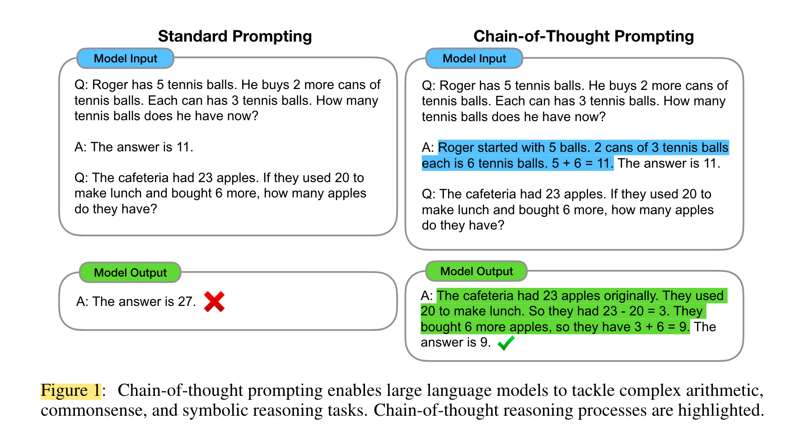

<a href="zotero://open-pdf/library/items/5CKXFVKL?page=2">“Figure 2”</a> (<a href="zotero://select/library/items/YMW5IN97">Wei et al., 2023, p. 2</a>)

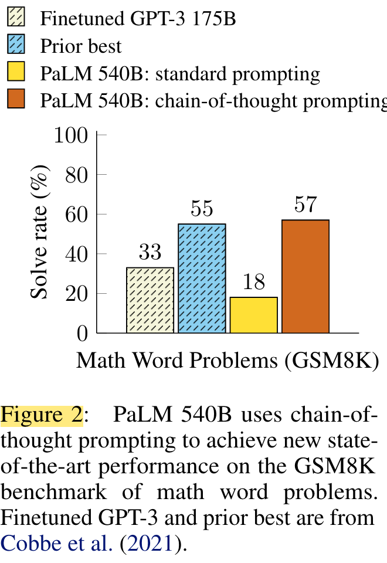

## <a href="zotero://open-pdf/library/items/5CKXFVKL?page=2">“2 Chain-of-Thought Prompting”</a> (<a href="zotero://select/library/items/YMW5IN97">Wei et al., 2023, p. 2</a>)

<a href="zotero://open-pdf/library/items/5CKXFVKL?page=NaN">“The goal of this paper is to endow language models with the ability to generate a similar chain of thought—a coherent series of intermediate reasoning steps that lead to the final answer for a problem.”</a> (<a href="zotero://select/library/items/YMW5IN97">Wei et al., 2023, p. 2</a>) 本文的目标是赋予语言模型生成类似思维链的能力——一系列连贯的中间推理步骤，从而得出问题的最终答案。

<a href="zotero://open-pdf/library/items/5CKXFVKL?page=NaN">“We will show that sufficiently large language models can generate chains of thought if demonstrations of chain-of-thought reasoning are provided in the exemplars for few-shot prompting.”</a> (<a href="zotero://select/library/items/YMW5IN97">Wei et al., 2023, p. 2</a>) 我们将证明，如果在小样本提示的范例中提供了思想链推理的演示，那么足够大的语言模型可以生成思想链。

<a href="zotero://open-pdf/library/items/5CKXFVKL?page=NaN">“Chain-of-thought prompting has several attractive properties as an approach for facilitating reasoning in language models.”</a> (<a href="zotero://select/library/items/YMW5IN97">Wei et al., 2023, p. 2</a>) 作为促进语言模型推理的方法，思维链提示具有几个有吸引力的特性。

1.  <a href="zotero://open-pdf/library/items/5CKXFVKL?page=NaN">“First, chain of thought, in principle, allows models to decompose multi-step problems into intermediate steps, which means that additional computation can be allocated to problems that require more reasoning steps.”</a>

    (<a href="zotero://select/library/items/YMW5IN97">Wei et al., 2023, p. 2</a>)

    首先，思想链原则上允许模型将多步骤问题分解为中间步骤，这意味着可以将额外的计算分配给需要更多推理步骤的问题。

2.  <a href="zotero://open-pdf/library/items/5CKXFVKL?page=NaN">“Second, a chain of thought provides an interpretable window into the behavior of the model, suggesting how it might have arrived at a particular answer and providing opportunities to debug where the reasoning path went wrong (although fully characterizing a model’s computations that support an answer remains an open question).”</a>

    (<a href="zotero://select/library/items/YMW5IN97">Wei et al., 2023, p. 2</a>)

    其次，思想链提供了模型行为的可解释窗口，表明模型如何得出特定答案，并提供调试推理路径出错位置的机会（尽管完全描述支持答案的模型的计算仍然是一个悬而未决的问题）。

3.  <a href="zotero://open-pdf/library/items/5CKXFVKL?page=NaN">“Third, chain-of-thought reasoning can be used for tasks such as math word problems, commonsense reasoning, and symbolic manipulation, and is potentially applicable (at least in principle) to any task that humans can solve via language.”</a>

    (<a href="zotero://select/library/items/YMW5IN97">Wei et al., 2023, p. 2</a>)

    第三，思想链推理可用于数学应用题、常识推理和符号操作等任务，并且可能适用于（至少原则上）人类可以通过语言解决的任何任务。

4.  <a href="zotero://open-pdf/library/items/5CKXFVKL?page=NaN">“Finally, chain-of-thought reasoning can be readily elicited in sufficiently large off-the-shelf language models simply by including examples of chain of thought sequences into the exemplars of few-shot prompting”</a>

    (<a href="zotero://select/library/items/YMW5IN97">Wei et al., 2023, p. 3</a>)

    最后，只需将思维链序列的示例包含到少样本提示的示例中，就可以在足够大的现成语言模型中轻松引发思维链推理

## <a href="zotero://open-pdf/library/items/5CKXFVKL?page=3">“3 Arithmetic Reasoning”</a> (<a href="zotero://select/library/items/YMW5IN97">Wei et al., 2023, p. 3</a>) 算术推理

### <a href="zotero://open-pdf/library/items/5CKXFVKL?page=3">“3.1 Experimental Setup”</a> (<a href="zotero://select/library/items/YMW5IN97">Wei et al., 2023, p. 3</a>)

<a href="zotero://open-pdf/library/items/5CKXFVKL?page=4">“Figure 3”</a> (<a href="zotero://select/library/items/YMW5IN97">Wei et al., 2023, p. 4</a>)

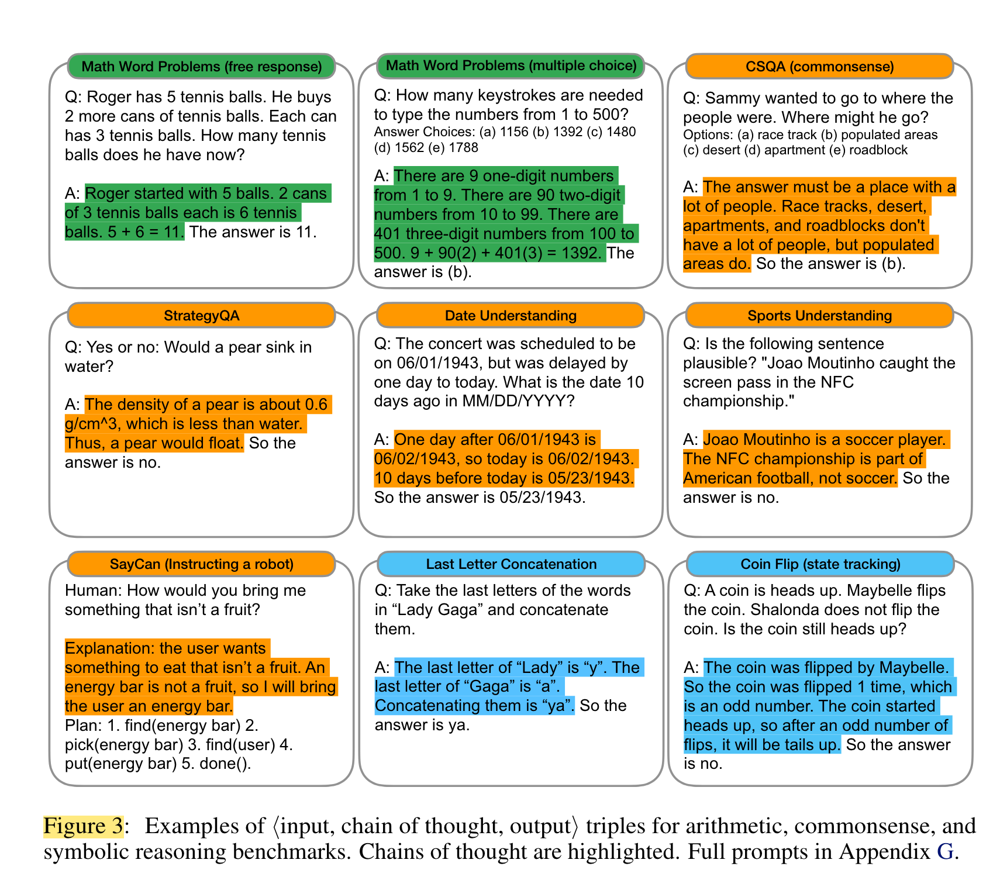

### <a href="zotero://open-pdf/library/items/5CKXFVKL?page=4">“3.2 Results”</a> (<a href="zotero://select/library/items/YMW5IN97">Wei et al., 2023, p. 4</a>)

<a href="zotero://open-pdf/library/items/5CKXFVKL?page=5">“Figure 4”</a> (<a href="zotero://select/library/items/YMW5IN97">Wei et al., 2023, p. 5</a>)

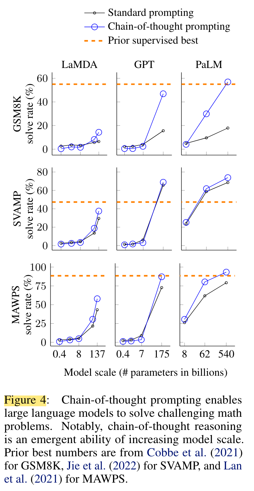

1.  <a href="zotero://open-pdf/library/items/5CKXFVKL?page=NaN">“First, Figure 4 shows that chain-of-thought prompting is an emergent ability of model scale (Wei et al., 2022b).”</a> (<a href="zotero://select/library/items/YMW5IN97">Wei et al., 2023, p. 4</a>) 首先，图4表明，思维链提示是模型规模的一种涌现能力（Wei et al., 2022b）。

    *   <a href="zotero://open-pdf/library/items/5CKXFVKL?page=NaN">“That is, chain-of-thought prompting does not positively impact performance for small models, and only yields performance gains when used with models of ∼100B parameters.”</a>

        (<a href="zotero://select/library/items/YMW5IN97">Wei et al., 2023, p. 4</a>)

        也就是说，思想链提示不会对小型模型的性能产生积极影响，并且仅在与 \~100B 参数的模型一起使用时才会产生性能增益。

    *   <a href="zotero://open-pdf/library/items/5CKXFVKL?page=NaN">“We qualitatively found that models of smaller scale produced fluent but illogical chains of thought, leading to lower performance than standard prompting.”</a>

        (<a href="zotero://select/library/items/YMW5IN97">Wei et al., 2023, p. 4</a>)

        我们定性地发现，较小规模的模型会产生流畅但不合逻辑的思维链，导致表现低于标准提示。

2.  <a href="zotero://open-pdf/library/items/5CKXFVKL?page=NaN">“Second, chain-of-thought prompting has larger performance gains for more-complicated problems.”</a> (<a href="zotero://select/library/items/YMW5IN97">Wei et al., 2023, p. 4</a>) 其次，思路链提示对于更复杂的问题有更大的性能提升。

    *   <a href="zotero://open-pdf/library/items/5CKXFVKL?page=NaN">“GSM8K (the dataset with the lowest baseline performance), performance more than doubled for the largest GPT and PaLM models.”</a>

        (<a href="zotero://select/library/items/YMW5IN97">Wei et al., 2023, p. 4</a>)

        GSM8K（基线性能最低的数据集），最大的 GPT 和 PaLM 模型的性能提高了一倍多。

    *   <a href="zotero://open-pdf/library/items/5CKXFVKL?page=NaN">“On the other hand, for SingleOp, the easiest subset of MAWPS which only requires a single step to solve, performance improvements were either negative or very small (see Appendix Table 3).”</a>

        (<a href="zotero://select/library/items/YMW5IN97">Wei et al., 2023, p. 5</a>)

        另一方面，对于 SingleOp（MAWPS 的最简单子集）来说，只需要一步即可解决，性能改进要么是负面的，要么是非常小的（参见附录表 3）

    *   <a href="zotero://open-pdf/library/items/5CKXFVKL?page=21">“Table 3”</a>

        (<a href="zotero://select/library/items/YMW5IN97">Wei et al., 2023, p. 21</a>)

        “The point of stratifying the MAWPS benchmark is to show that performance gains are minimal on easy one-step or two-step problems where large language models already achieve high performance (e.g., SingleOp, SingleEq, and AddSub).”

        (Wei et al., 2023, p. 21)

        对 MAWPS 基准进行分层的目的是表明，在大型语言模型已经实现高性能（例如 SingleOp、SingleEq 和 AddSub）的情况下，对于简单的一步或两步问题，性能增益是最小的。

    *   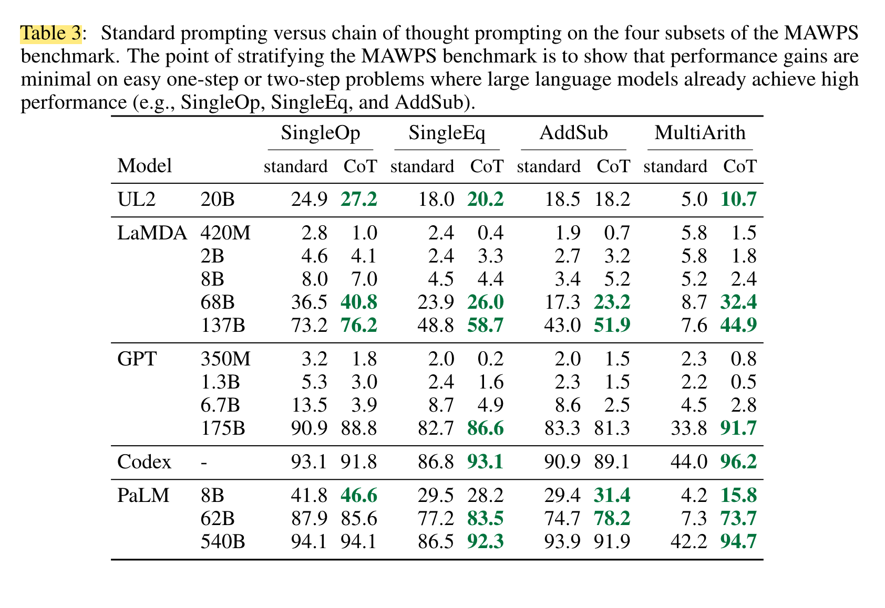

3.  <a href="zotero://open-pdf/library/items/5CKXFVKL?page=NaN">“Third, chain-of-thought prompting via GPT-3 175B and PaLM 540B compares favorably to prior state of the art, which typically finetunes a task-specific model on a labeled training dataset.”</a>

    (<a href="zotero://select/library/items/YMW5IN97">Wei et al., 2023, p. 4</a>)

    第三，通过 GPT-3 175B 和 PaLM 540B 进行的思想链提示优于现有技术，后者通常在标记的训练数据集上微调特定于任务的模型。

<a href="zotero://open-pdf/library/items/5CKXFVKL?page=NaN">“To better understand why chain-of-thought prompting works, we manually examined modelgenerated chains of thought by LaMDA 137B for GSM8K.”</a> (<a href="zotero://select/library/items/YMW5IN97">Wei et al., 2023, p. 5</a>) 为了更好地理解为什么思维链提示有效，我们手动检查了 LaMDA 137B for GSM8K 模型生成的思维链。

<a href="zotero://open-pdf/library/items/5CKXFVKL?page=NaN">“Of 50 random examples where the model returned the correct final answer, all of the generated chains of thought were also logically and mathematically correct except two that coincidentally arrived at the correct answer”</a> (<a href="zotero://select/library/items/YMW5IN97">Wei et al., 2023, p. 5</a>) 在模型返回正确最终答案的 50 个随机示例中，除了两个巧合地得出正确答案之外，所有生成的思维链在逻辑和数学上都是正确的

<a href="zotero://open-pdf/library/items/5CKXFVKL?page=NaN">“We also randomly examined 50 random samples for which the model gave the wrong answer. The summary of this analysis is that 46% of the chains of thought were almost correct, barring minor mistakes (calculator error, symbol mapping error, or one reasoning step missing), and that the other 54% of the chains of thought had major errors in semantic understanding or coherence (see Appendix D.2).”</a> (<a href="zotero://select/library/items/YMW5IN97">Wei et al., 2023, p. 5</a>) 我们还随机检查了模型给出错误答案的 50 个随机样本。这一分析的总结是，除了小错误（计算器错误、符号映射错误或缺少一个推理步骤）之外，46% 的思维链几乎是正确的，而另外 54% 的思维链存在重大错误语义理解或连贯性（见附录 D.2）。

<a href="zotero://open-pdf/library/items/5CKXFVKL?page=NaN">“To provide a small insight into why scaling improves chain-of-thought reasoning ability, we performed a similar analysis of errors made by PaLM 62B and whether those errors were fixed by scaling to PaLM 540B. The summary is that scaling PaLM to 540B fixes a large portion of one-step missing and semantic understanding errors in the 62B model (see Appendix A.1)”</a> (<a href="zotero://select/library/items/YMW5IN97">Wei et al., 2023, p. 5</a>) 为了深入了解为什么缩放可以提高思路推理能力，我们对 PaLM 62B 所犯的错误进行了类似的分析，以及这些错误是否通过缩放到 PaLM 540B 得到了修复。总结就是，将 PaLM 扩展到 540B 修复了 62B 模型中很大一部分一步缺失和语义理解错误（参见附录 A.1）

### <a href="zotero://open-pdf/library/items/5CKXFVKL?page=5">“3.3 Ablation Study”</a> (<a href="zotero://select/library/items/YMW5IN97">Wei et al., 2023, p. 5</a>) 消融研究

<a href="zotero://open-pdf/library/items/5CKXFVKL?page=NaN">“The observed benefits of using chain-of-thought prompting raises the natural question of whether the same performance improvements can be conferred via other types of prompting. Figure 5 shows an ablation study with three variations of chain of thought described below.”</a> (<a href="zotero://select/library/items/YMW5IN97">Wei et al., 2023, p. 5</a>) 使用思维链提示所观察到的好处自然引发了一个问题：是否可以通过其他类型的提示来实现相同的性能改进。图 5 显示了具有下述三种思路变化的消融研究。

<a href="zotero://open-pdf/library/items/5CKXFVKL?page=6">“Figure 5”</a> (<a href="zotero://select/library/items/YMW5IN97">Wei et al., 2023, p. 6</a>)

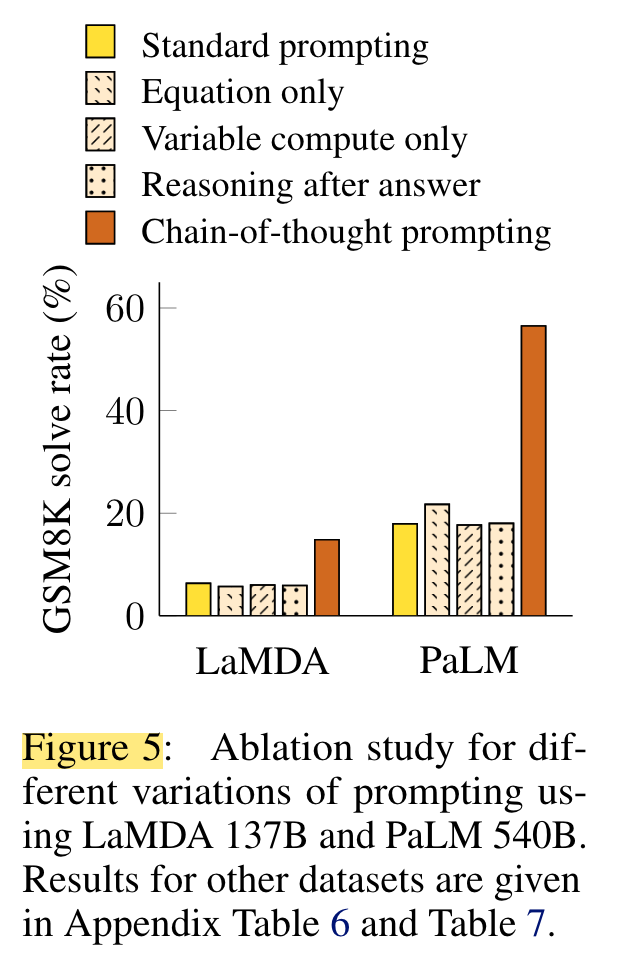

<a href="zotero://open-pdf/library/items/5CKXFVKL?page=5"><strong>“Equation only”</strong></a>** **(<a href="zotero://select/library/items/YMW5IN97">Wei et al., 2023, p. 5</a>)** 仅数学式**

<a href="zotero://open-pdf/library/items/5CKXFVKL?page=NaN">“we test a variation where the model is prompted to output only a mathematical equation before giving the answer.”</a> (<a href="zotero://select/library/items/YMW5IN97">Wei et al., 2023, p. 5</a>) 我们测试了一个变体，其中提示模型在给出答案之前仅输出一个数学方程。

<a href="zotero://open-pdf/library/items/5CKXFVKL?page=NaN">“igure 5 shows that equation only prompting does not help much for GSM8K, which implies that the semantics of the questions in GSM8K are too challenging to directly translate into an equation without the natural language reasoning steps in chain of thought.”</a> (<a href="zotero://select/library/items/YMW5IN97">Wei et al., 2023, p. 5</a>) 图5显示，仅方程提示对GSM8K没有多大帮助，这意味着GSM8K中问题的语义太具有挑战性，无法在没有思维链中的自然语言推理步骤的情况下直接翻译成方程。

<a href="zotero://open-pdf/library/items/5CKXFVKL?page=NaN">“For datasets of one-step or two-step problems, however, we find that equation only prompting does improve performance, since the equation can be easily derived from the question”</a> (<a href="zotero://select/library/items/YMW5IN97">Wei et al., 2023, p. 5</a>) 然而，对于一步或两步问题的数据集，我们发现仅提示方程确实可以提高性能，因为方程可以很容易地从问题中导出

<a href="zotero://open-pdf/library/items/5CKXFVKL?page=23">“Table 6”</a> (<a href="zotero://select/library/items/YMW5IN97">Wei et al., 2023, p. 23</a>)

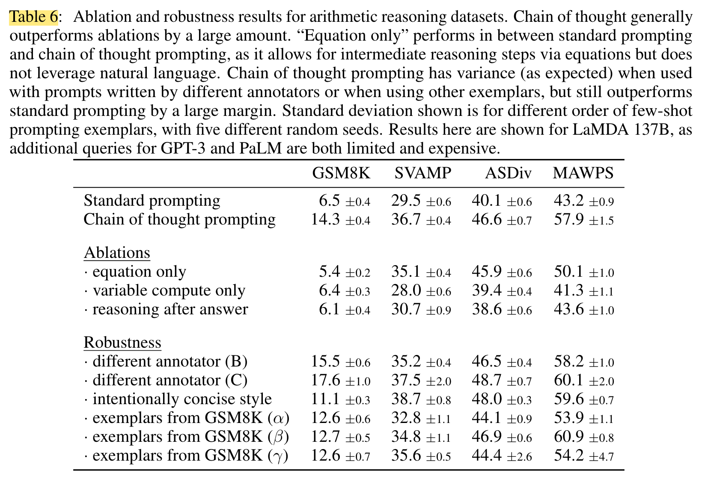

<a href="zotero://open-pdf/library/items/5CKXFVKL?page=6"><strong>“Variable compute only.”</strong></a>** **(<a href="zotero://select/library/items/YMW5IN97">Wei et al., 2023, p. 6</a>)** 仅变量计算。**

<a href="zotero://open-pdf/library/items/5CKXFVKL?page=NaN">“Another intuition is that chain of thought allows the model to spend more computation (i.e., intermediate tokens) on harder problems.”</a> (<a href="zotero://select/library/items/YMW5IN97">Wei et al., 2023, p. 5</a>) 另一个直觉是，思想链允许模型在更困难的问题上花费更多的计算（即中间标记）。

<a href="zotero://open-pdf/library/items/5CKXFVKL?page=NaN">“To isolate the effect of variable computation from chain-of-thought reasoning, we test a configuration where the model is prompted to output a only sequence of dots (. . .) equal to the number of characters in the equation needed to solve the problem.”</a> (<a href="zotero://select/library/items/YMW5IN97">Wei et al., 2023, p. 5</a>) 为了将变量计算的影响与思想链推理隔离开来，我们测试了一种配置，其中让模型仅输出的点序列 (...)，该序列等于解决问题所需的方程中的字符数。

<a href="zotero://open-pdf/library/items/5CKXFVKL?page=NaN">“This variant performs about the same as the baseline, which suggests that variable computation by itself is not the reason for the success of chainof-thought prompting, and that there appears to be utility from expressing intermediate steps via natural language.”</a> (<a href="zotero://select/library/items/YMW5IN97">Wei et al., 2023, p. 5</a>) 这个变体的表现与基线大致相同，这表明变量计算本身并不是思想链提示成功的原因，并且通过自然语言表达中间步骤似乎是有用的。

<a href="zotero://open-pdf/library/items/5CKXFVKL?page=6"><strong>“Chain of thought after answer”</strong></a>** **(<a href="zotero://select/library/items/YMW5IN97">Wei et al., 2023, p. 6</a>)

<a href="zotero://open-pdf/library/items/5CKXFVKL?page=NaN">“Another potential benefit of chain-of-thought prompting could simply be that such prompts allow the model to better access relevant knowledge acquired during pretraining.”</a> (<a href="zotero://select/library/items/YMW5IN97">Wei et al., 2023, p. 5</a>) 思想链提示的另一个潜在好处可能只是这样的提示允许模型更好地访问在预训练期间获得的相关知识。

<a href="zotero://open-pdf/library/items/5CKXFVKL?page=NaN">“Therefore, we test an alternative configuration where the chain of thought prompt is only given after the answer, isolating whether the model actually depends on the produced chain of thought to give the final answer.”</a> (<a href="zotero://select/library/items/YMW5IN97">Wei et al., 2023, p. 5</a>) 因此，我们测试了一种替代配置，其中仅在答案之后给出思维链提示，从而隔离模型是否实际上依赖于产生的思维链来给出最终答案。

<a href="zotero://open-pdf/library/items/5CKXFVKL?page=NaN">“This variant performs about the same as the baseline, which suggests that the sequential reasoning embodied in the chain of thought is useful for reasons beyond just activating knowledge.”</a> (<a href="zotero://select/library/items/YMW5IN97">Wei et al., 2023, p. 5</a>) ˛

### <a href="zotero://open-pdf/library/items/5CKXFVKL?page=6">“3.4 Robustness of Chain of Thought”</a> (<a href="zotero://select/library/items/YMW5IN97">Wei et al., 2023, p. 6</a>)

不同人写的chain-of- thought prompt

<a href="zotero://open-pdf/library/items/5CKXFVKL?page=6">“Figure 6”</a> (<a href="zotero://select/library/items/YMW5IN97">Wei et al., 2023, p. 6</a>)

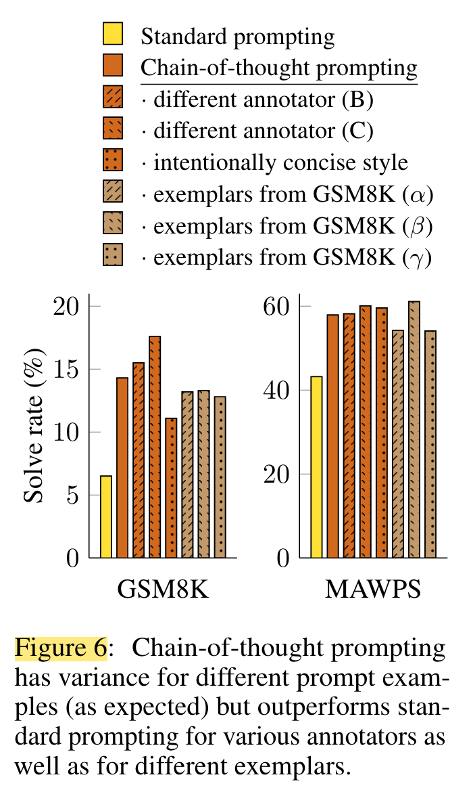

<a href="zotero://open-pdf/library/items/5CKXFVKL?page=NaN">“This result implies that successful use of chain of thought does not depend on a particular linguistic style.”</a> (<a href="zotero://select/library/items/YMW5IN97">Wei et al., 2023, p. 6</a>) 这一结果意味着思维链的成功使用并不依赖于特定的语言风格。

<a href="zotero://open-pdf/library/items/5CKXFVKL?page=NaN">“we also run experiments with three sets of eight exemplars randomly sampled from the GSM8K training set”</a> (<a href="zotero://select/library/items/YMW5IN97">Wei et al., 2023, p. 6</a>) 我们还对从 GSM8K 训练集中随机采样的三组八个样本进行了实验

<a href="zotero://open-pdf/library/items/5CKXFVKL?page=NaN">“Figure 6 shows that these prompts performed comparably with our manually written exemplars, also substantially outperforming standard prompting.”</a> (<a href="zotero://select/library/items/YMW5IN97">Wei et al., 2023, p. 6</a>) 图 6 显示这些提示的执行效果与我们手动编写的示例相当，也大大优于标准提示。

<a href="zotero://open-pdf/library/items/5CKXFVKL?page=NaN">“In addition to robustness to annotators, independently-written chains of thought, different exemplars, and various language models, we also find that chain-of-thought prompting for arithmetic reasoning is robust to different exemplar orders and varying numbers of exemplars (see Appendix A.2).”</a> (<a href="zotero://select/library/items/YMW5IN97">Wei et al., 2023, p. 6</a>) 除了对注释器、独立编写的思维链、不同范例和各种语言模型的鲁棒性之外，我们还发现算术推理的思维链提示对不同范例顺序和不同数量的范例具有鲁棒性（参见附录A） .2).

*   <a href="zotero://open-pdf/library/items/5CKXFVKL?page=17">“Different annotators.”</a> (<a href="zotero://select/library/items/YMW5IN97">Wei et al., 2023, p. 17</a>)

    *   <a href="zotero://open-pdf/library/items/5CKXFVKL?page=23">“Table 7:”</a>

        (<a href="zotero://select/library/items/YMW5IN97">Wei et al., 2023, p. 23</a>)

    *   <a href="zotero://open-pdf/library/items/5CKXFVKL?page=23">“Table 6”</a>

        (<a href="zotero://select/library/items/YMW5IN97">Wei et al., 2023, p. 23</a>)

*   <a href="zotero://open-pdf/library/items/5CKXFVKL?page=18">“Annotators without machine learning background”</a> (<a href="zotero://select/library/items/YMW5IN97">Wei et al., 2023, p. 18</a>)

    *   对从 GSM8K 训练集中随机采样的三组八个样本进行了实验

*   <a href="zotero://open-pdf/library/items/5CKXFVKL?page=18">“Different exemplars.”</a> (<a href="zotero://select/library/items/YMW5IN97">Wei et al., 2023, p. 18</a>)

    *   <a href="zotero://open-pdf/library/items/5CKXFVKL?page=23">“Table 6”</a>

        (<a href="zotero://select/library/items/YMW5IN97">Wei et al., 2023, p. 23</a>)

*   <a href="zotero://open-pdf/library/items/5CKXFVKL?page=18">“Different order of exemplars.”</a>

    (<a href="zotero://select/library/items/YMW5IN97">Wei et al., 2023, p. 18</a>)

*   <a href="zotero://open-pdf/library/items/5CKXFVKL?page=18">“Different number of exemplars.”</a> (<a href="zotero://select/library/items/YMW5IN97">Wei et al., 2023, p. 18</a>)

    *   <a href="zotero://open-pdf/library/items/5CKXFVKL?page=29">“Figure 11”</a>

        (<a href="zotero://select/library/items/YMW5IN97">Wei et al., 2023, p. 29</a>)

    *   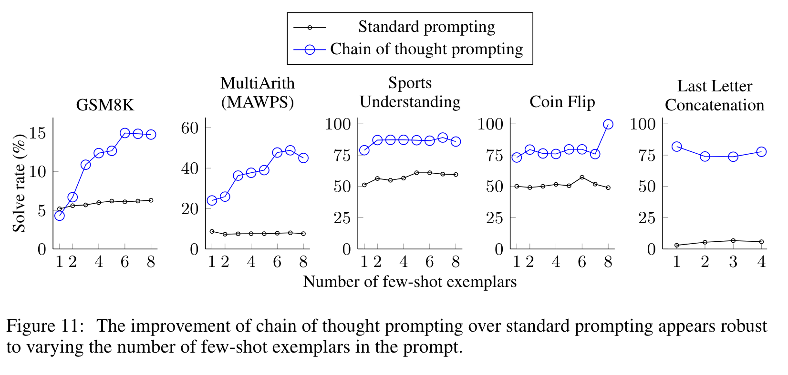

*   <a href="zotero://open-pdf/library/items/5CKXFVKL?page=18">“Different language models.”</a> (<a href="zotero://select/library/items/YMW5IN97">Wei et al., 2023, p. 18</a>)

    *   <a href="zotero://open-pdf/library/items/5CKXFVKL?page=22">“Table 5”</a>

        (<a href="zotero://select/library/items/YMW5IN97">Wei et al., 2023, p. 22</a>)

    *   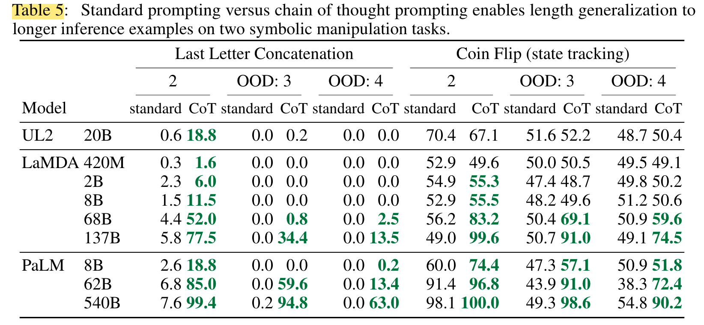

## <a href="zotero://open-pdf/library/items/5CKXFVKL?page=7">“4 Commonsense Reasoning”</a> (<a href="zotero://select/library/items/YMW5IN97">Wei et al., 2023, p. 7</a>)

<a href="zotero://open-pdf/library/items/5CKXFVKL?page=7">“Figure 7”</a> (<a href="zotero://select/library/items/YMW5IN97">Wei et al., 2023, p. 7</a>)

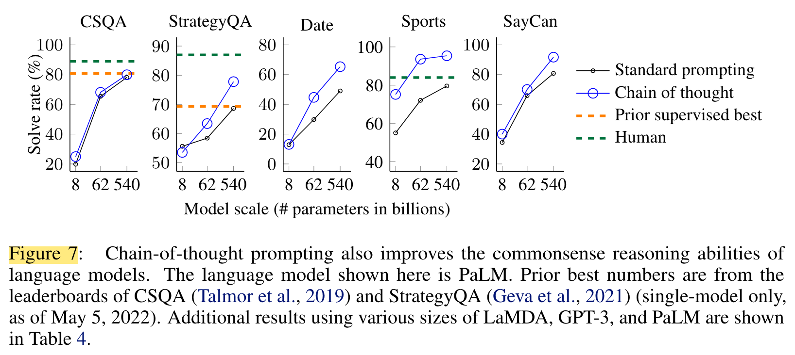

## <a href="zotero://open-pdf/library/items/5CKXFVKL?page=8">“5 Symbolic Reasoning”</a> (<a href="zotero://select/library/items/YMW5IN97">Wei et al., 2023, p. 8</a>)

<a href="zotero://open-pdf/library/items/5CKXFVKL?page=8">“<strong>Tasks</strong>.”</a> (<a href="zotero://select/library/items/YMW5IN97">Wei et al., 2023, p. 8</a>)

*   <a href="zotero://open-pdf/library/items/5CKXFVKL?page=NaN">“Last letter concatenation.”</a> (<a href="zotero://select/library/items/YMW5IN97">Wei et al., 2023, p. 8</a>) 最后一个字母连接。

    *   <a href="zotero://open-pdf/library/items/5CKXFVKL?page=NaN">“This task asks the model to concatenate the last letters of words in a name (e.g., “Amy Brown” → “yn”). It is a more challenging version of first letter concatenation, which language models can already perform without chain of thought.3 We generate full names by randomly concatenating names from the top one-thousand first and last names from name census data (https://namecensus.com/).”</a>

        (<a href="zotero://select/library/items/YMW5IN97">Wei et al., 2023, p. 8</a>)

        此任务要求模型连接名称中单词的最后一个字母（例如“Amy Brown”→“yn”）。这是首字母连接的更具挑战性的版本，语言模型已经可以在无需思考的情况下执行该操作。3我们通过随机连接姓名普查数据中前一千个名字和姓氏来生成全名（https\:// namecensus.com/）。

*   <a href="zotero://open-pdf/library/items/5CKXFVKL?page=NaN">“Coin flip.”</a> (<a href="zotero://select/library/items/YMW5IN97">Wei et al., 2023, p. 8</a>) 硬币翻转。

    *   <a href="zotero://open-pdf/library/items/5CKXFVKL?page=NaN">“This task asks the model to answer whether a coin is still heads up after people either flip or don’t flip the coin (e.g., “A coin is heads up. Phoebe flips the coin. Osvaldo does not flip the coin. Is the coin still heads up?” → “no”).”</a> (<a href="zotero://select/library/items/YMW5IN97">Wei et al., 2023, p. 8</a>) 此任务要求模型回答人们抛硬币或不抛硬币后硬币是否仍然正面朝上（例如，“硬币正面朝上。菲比抛硬币。奥斯瓦尔多没有抛硬币。硬币是正面朝上吗？”→“不”）。

<a href="zotero://open-pdf/library/items/5CKXFVKL?page=NaN">“As the construction of these symbolic reasoning tasks is well-defined, for each task we consider an in-domain test set for which examples had the same number of steps as the training/few-shot exemplars, as well as an out-of-domain (OOD) test set, for which evaluation examples had more steps than those in the exemplars. For last letter concatenation, the model only sees exemplars of names with two words, and then performs last letter concatenation on names with 3 and 4 words.4 We do the same for the number of potential flips in the coin flip task. Our experimental setup uses the same methods and models as in the prior two sections. We again manually compose chains of thought for the few-shot exemplars for each task, which are given in Figure 3.”</a> (<a href="zotero://select/library/items/YMW5IN97">Wei et al., 2023, p. 8</a>) 由于这些符号推理任务的构造是明确定义的，对于每个任务，我们考虑一个域内测试集，其中示例的步骤数与训练/少样本示例相同，以及一个域外测试集。域（OOD）测试集，其评估示例的步骤比范例中的步骤更多。对于最后一个字母串联，模型仅看到包含两个单词的姓名示例，然后对包含 3 个和 4 个单词的姓名执行最后一个字母串联。4 我们对硬币翻转任务中潜在翻转的次数执行相同的操作。我们的实验设置使用与前两节相同的方法和模型。我们再次为每个任务的少数样本手动构建思想链，如图 3 所示。

<a href="zotero://open-pdf/library/items/5CKXFVKL?page=8">“Figure 8:”</a> (<a href="zotero://select/library/items/YMW5IN97">Wei et al., 2023, p. 8</a>)

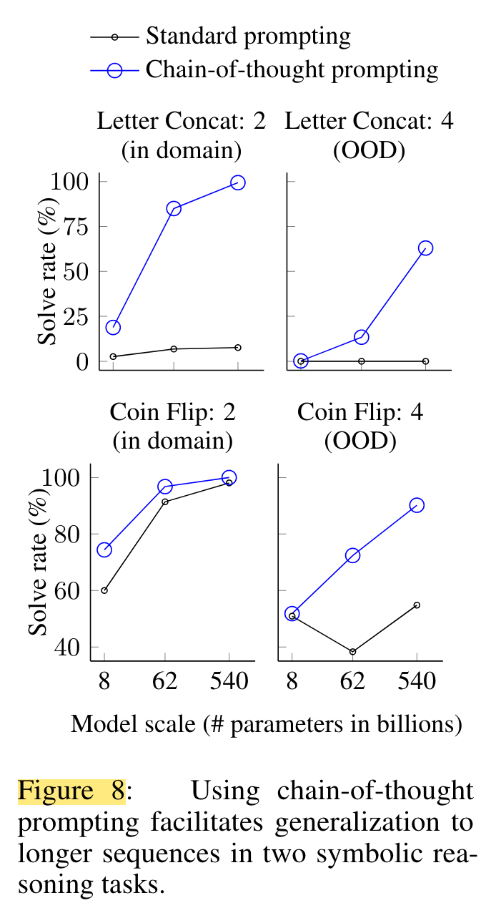

## <a href="zotero://open-pdf/library/items/5CKXFVKL?page=8">“6 Discussion”</a> (<a href="zotero://select/library/items/YMW5IN97">Wei et al., 2023, p. 8</a>)

<a href="zotero://open-pdf/library/items/5CKXFVKL?page=NaN">“We have explored chain-of-thought prompting as a simple mechanism for eliciting multi-step reasoning behavior in large language models.”</a> (<a href="zotero://select/library/items/YMW5IN97">Wei et al., 2023, p. 8</a>) 我们探索了思维链提示作为在大型语言模型中引发多步骤推理行为的简单机制。

<a href="zotero://open-pdf/library/items/5CKXFVKL?page=NaN">“We first saw that chain-of-thought prompting improves performance by a large margin on arithmetic reasoning, yielding improvements that are much stronger than ablations and robust to different annotators, exemplars, and language models (Section 3).”</a> (<a href="zotero://select/library/items/YMW5IN97">Wei et al., 2023, p. 8</a>) 我们首先看到思想链提示大大提高了算术推理的性能，产生的改进比消融更强，并且对不同的注释器、范例和语言模型具有鲁棒性（第 3 节）。

<a href="zotero://open-pdf/library/items/5CKXFVKL?page=NaN">“experiments on commonsense reasoning underscored how the linguistic nature of chain-of-thought reasoning makes it generally applicable (Section 4).”</a> (<a href="zotero://select/library/items/YMW5IN97">Wei et al., 2023, p. 8</a>) 常识推理实验强调了思想链推理的语言性质如何使其普遍适用（第 4 节）。

<a href="zotero://open-pdf/library/items/5CKXFVKL?page=NaN">“Finally, we showed that for symbolic reasoning, chain-of-thought prompting facilitates OOD generalization to longer sequence lengths (Section 5).”</a> (<a href="zotero://select/library/items/YMW5IN97">Wei et al., 2023, p. 8</a>) 最后，我们表明，对于符号推理，思维链提示有助于 OOD 泛化到更长的序列长度（第 5 节）。

<a href="zotero://open-pdf/library/items/5CKXFVKL?page=NaN">“In all experiments, chain-of-thought reasoning is elicited simply by prompting an off-the-shelf language model. No language models were finetuned in the process of writing this paper.”</a> (<a href="zotero://select/library/items/YMW5IN97">Wei et al., 2023, p. 8</a>) 在所有实验中，思想链推理都是通过提示现成的语言模型来引发的。在撰写本文的过程中没有对语言模型进行微调。

<a href="zotero://open-pdf/library/items/5CKXFVKL?page=NaN">“The emergence of chain-of-thought reasoning as a result of model scale has been a prevailing theme (Wei et al., 2022b).”</a> (<a href="zotero://select/library/items/YMW5IN97">Wei et al., 2023, p. 8</a>) 模型规模导致的思想链推理的出现一直是一个流行的主题（Wei 等人，2022b）。-- 涌现

<a href="zotero://open-pdf/library/items/5CKXFVKL?page=NaN">“For many reasoning tasks where standard prompting has a flat scaling curve, chainof-thought prompting leads to dramatically increasing scaling curves.”</a> (<a href="zotero://select/library/items/YMW5IN97">Wei et al., 2023, p. 8</a>) 对于许多推理任务来说，标准提示具有平坦的缩放曲线，思维链提示会导致缩放曲线急剧增加。

<a href="zotero://open-pdf/library/items/5CKXFVKL?page=NaN">“Chain-of-thought prompting appears to expand the set of tasks that large language models can perform successfully—in other words, our work underscores that standard prompting only provides a lower bound on the capabilities of large language models.”</a> (<a href="zotero://select/library/items/YMW5IN97">Wei et al., 2023, p. 8</a>) 思维链提示似乎扩展了大型语言模型可以成功执行的任务集，换句话说，我们的工作强调标准提示仅提供大型语言模型功能的下限。

<a href="zotero://open-pdf/library/items/5CKXFVKL?page=NaN">“This observation likely raises more questions than it answers—for instance, how much more can we expect reasoning ability to improve with a further increase in model scale?”</a> (<a href="zotero://select/library/items/YMW5IN97">Wei et al., 2023, p. 8</a>) 这一观察结果可能提出的问题多于它给出的答案，例如，随着模型规模的进一步增加，我们可以期望推理能力提高多少？

<a href="zotero://open-pdf/library/items/5CKXFVKL?page=NaN">“What other prompting methods might expand the range of tasks that language models can solve?”</a> (<a href="zotero://select/library/items/YMW5IN97">Wei et al., 2023, p. 8</a>) 还有哪些其他提示方法可以扩大语言模型可以解决的任务范围？

<a href="zotero://open-pdf/library/items/5CKXFVKL?page=9">“<strong>limitations</strong>”</a> (<a href="zotero://select/library/items/YMW5IN97">Wei et al., 2023, p. 9</a>)

*   <a href="zotero://open-pdf/library/items/5CKXFVKL?page=NaN">“we first qualify that although chain of thought emulates the thought processes of human reasoners, this does not answer whether the neural network is actually “reasoning,” which we leave as an open question.”</a>

    (<a href="zotero://select/library/items/YMW5IN97">Wei et al., 2023, p. 8</a>)

    我们首先要限定的是，尽管思维链模拟了人类推理者的思维过程，但这并不能回答神经网络是否真的在“推理”，我们将其作为一个悬而未决的问题。

*   <a href="zotero://open-pdf/library/items/5CKXFVKL?page=NaN">“Second, although the cost of manually augmenting exemplars with chains of thought is minimal in the few-shot setting, such annotation costs could be prohibitive for finetuning (though this could potentially be surmounted with synthetic data generation, or zero-shot generalization).”</a>

    (<a href="zotero://select/library/items/YMW5IN97">Wei et al., 2023, p. 8</a>)

    其次，尽管在少样本设置中用思想链手动增强样本的成本是最小的，但这种注释成本可能会阻碍微调（尽管这可能可以通过合成数据生成或零样本泛化来克服）。

*   <a href="zotero://open-pdf/library/items/5CKXFVKL?page=NaN">“Third, there is no guarantee of correct reasoning paths, which can lead to both correct and incorrect answers; improving factual generations of language models is an open direction for future work (Rashkin et al., 2021; Ye and Durrett, 2022; Wiegreffe et al., 2022, inter alia).”</a>

    (<a href="zotero://select/library/items/YMW5IN97">Wei et al., 2023, p. 8</a>)

    第三，无法保证正确的推理路径，这可能会导致正确答案和错误答案；改进语言模型的事实生成是未来工作的一个开放方向（Rashkin 等人，2021 年；Ye 和 Durrett，2022 年；Wiegreffe 等人，2022 年等）。

*   <a href="zotero://open-pdf/library/items/5CKXFVKL?page=NaN">“Finally, the emergence of chain-of-thought reasoning only at large model scales makes it costly to serve in real-world applications; further research could explore how to induce reasoning in smaller models.”</a>

    (<a href="zotero://select/library/items/YMW5IN97">Wei et al., 2023, p. 8</a>)

    最后，思想链推理仅在大型模型规模上出现，这使得在现实世界的应用中提供服务的成本高昂；进一步的研究可以探索如何在较小的模型中引发推理。

*

## <a href="zotero://open-pdf/library/items/5CKXFVKL?page=9">“7 Related Work”</a> (<a href="zotero://select/library/items/YMW5IN97">Wei et al., 2023, p. 9</a>)

<a href="zotero://open-pdf/library/items/5CKXFVKL?page=NaN">“This work is inspired by many research areas, which we detail in an extended related work section (Appendix C). Here we describe two directions and associated papers that are perhaps most relevant.”</a> (<a href="zotero://select/library/items/YMW5IN97">Wei et al., 2023, p. 9</a>) 这项工作受到许多研究领域的启发，我们在扩展的相关工作部分（附录 C）中详细介绍了这些领域。在这里，我们描述了两个可能最相关的方向和相关论文。

*   <a href="zotero://open-pdf/library/items/5CKXFVKL?page=NaN">“The first relevant direction is using intermediate steps to solve reasoning problems.”</a> (<a href="zotero://select/library/items/YMW5IN97">Wei et al., 2023, p. 9</a>) 第一个相关方向是使用中间步骤来解决推理问题。

    *   <a href="zotero://open-pdf/library/items/5CKXFVKL?page=NaN">“solve math word problems through a series of intermediate steps”</a>

        (<a href="zotero://select/library/items/YMW5IN97">Wei et al., 2023, p. 9</a>)

        通过一系列中间步骤解决数学应用题

    *   <a href="zotero://open-pdf/library/items/5CKXFVKL?page=NaN">“program synthesis”</a> (<a href="zotero://select/library/items/YMW5IN97">Wei et al., 2023, p. 9</a>) 程序综合

        *   <a href="zotero://open-pdf/library/items/5CKXFVKL?page=NaN">“to predict the final outputs of Python programs via first line-to-line predicting the intermediate computational results”</a>

            (<a href="zotero://select/library/items/YMW5IN97">Wei et al., 2023, p. 9</a>)

            通过首先逐行预测中间计算结果来预测Python程序的最终输出

*   <a href="zotero://open-pdf/library/items/5CKXFVKL?page=NaN">“Naturally, this paper also relates closely to the large body of recent work on prompting”</a> (<a href="zotero://select/library/items/YMW5IN97">Wei et al., 2023, p. 9</a>) 当然，本文也与近期大量关于提示的工作密切相关。

    *   <a href="zotero://open-pdf/library/items/5CKXFVKL?page=NaN">“Whereas these approaches improve or augment the input part of the prompt (e.g., instructions that are prepended to inputs), our work takes the orthogonal direction of augmenting the outputs of language models with a chain of thought.”</a>

        (<a href="zotero://select/library/items/YMW5IN97">Wei et al., 2023, p. 9</a>)

        尽管这些方法改进或增强了提示的输入部分（例如，添加到输入之前的指令），但我们的工作采取正交方向，用一系列思想来增强语言模型的输出。

## <a href="zotero://open-pdf/library/items/5CKXFVKL?page=9">“8 Conclusions”</a> (<a href="zotero://select/library/items/YMW5IN97">Wei et al., 2023, p. 9</a>)

<a href="zotero://open-pdf/library/items/5CKXFVKL?page=NaN">“We have explored chain-of-thought prompting as a simple and broadly applicable method for enhancing reasoning in language models. Through experiments on arithmetic, symbolic, and commonsense reasoning, we find that chain-of-thought reasoning is an emergent property of model scale that allows sufficiently large language models to perform reasoning tasks that otherwise have flat scaling curves. Broadening the range of reasoning tasks that language models can perform will hopefully inspire further work on language-based approaches to reasoning.”</a> (<a href="zotero://select/library/items/YMW5IN97">Wei et al., 2023, p. 9</a>) 我们探索了思维链提示作为一种简单且广泛适用的增强语言模型推理的方法。通过算术、符号和常识推理的实验，我们发现思想链推理是模型规模的一个新兴属性，它允许足够大的语言模型执行原本具有平坦缩放曲线的推理任务。扩大语言模型可以执行的推理任务的范围有望激发基于语言的推理方法的进一步研究。
