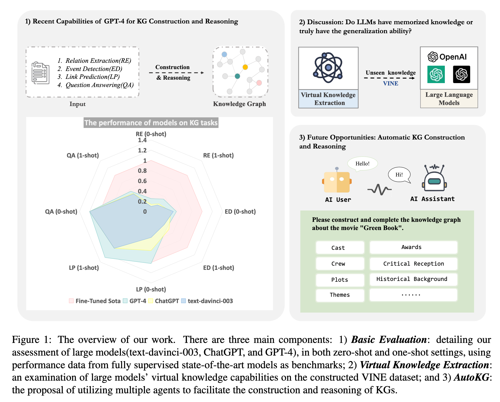
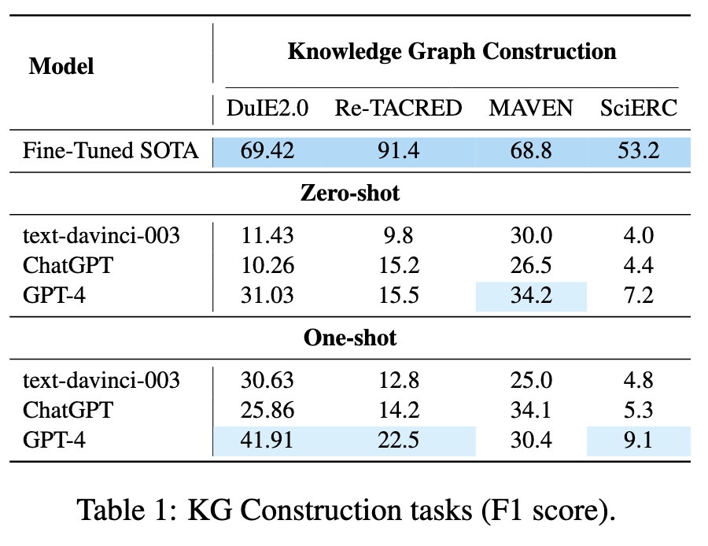
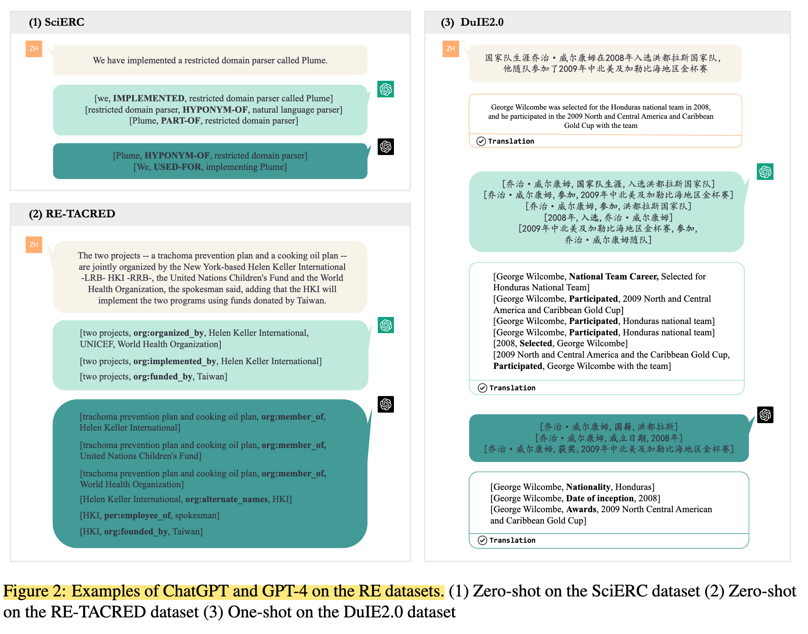
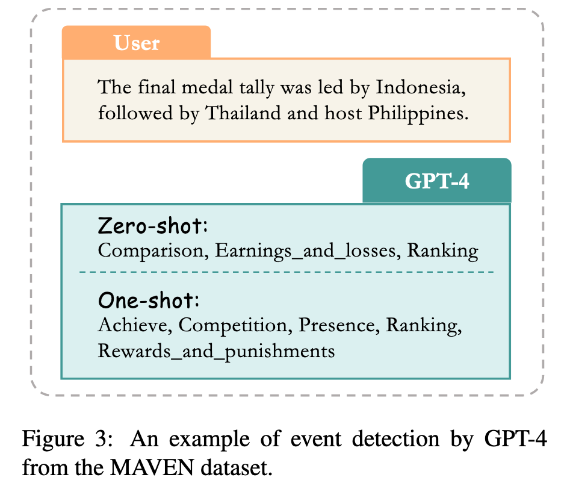
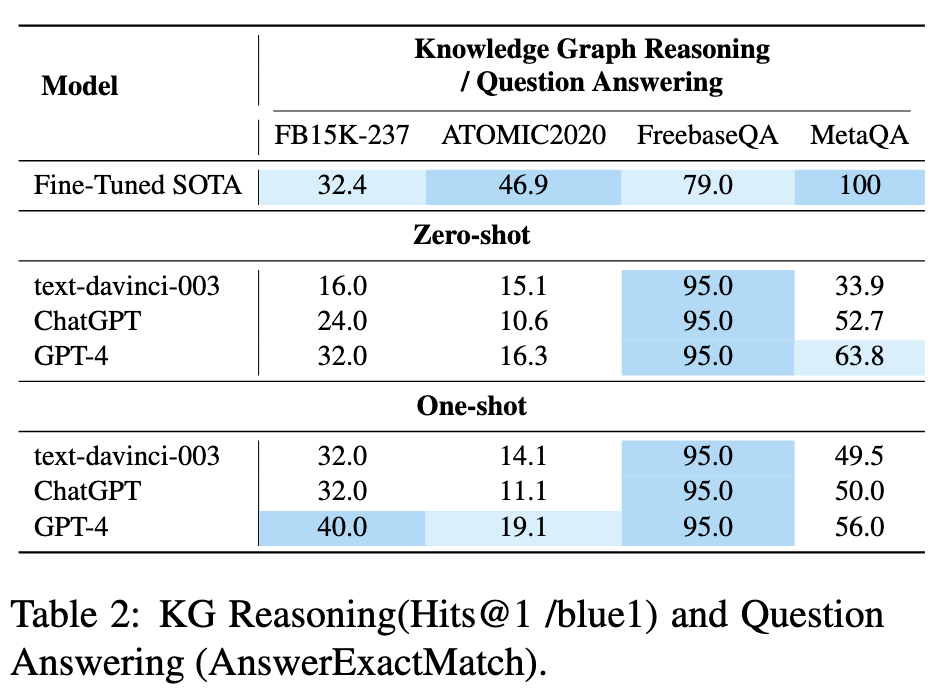
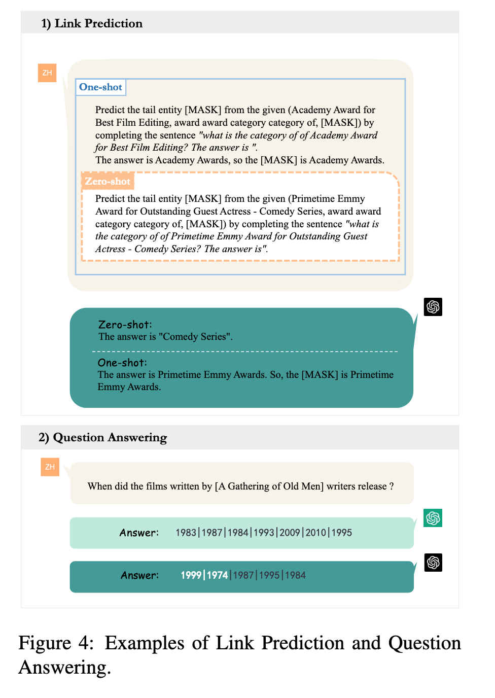
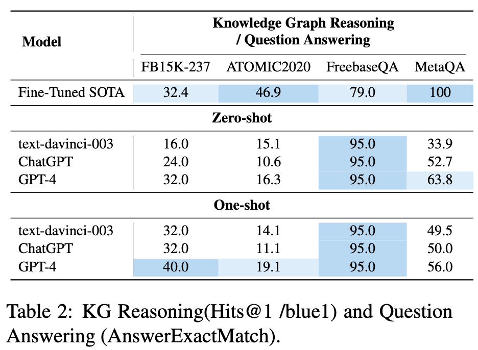
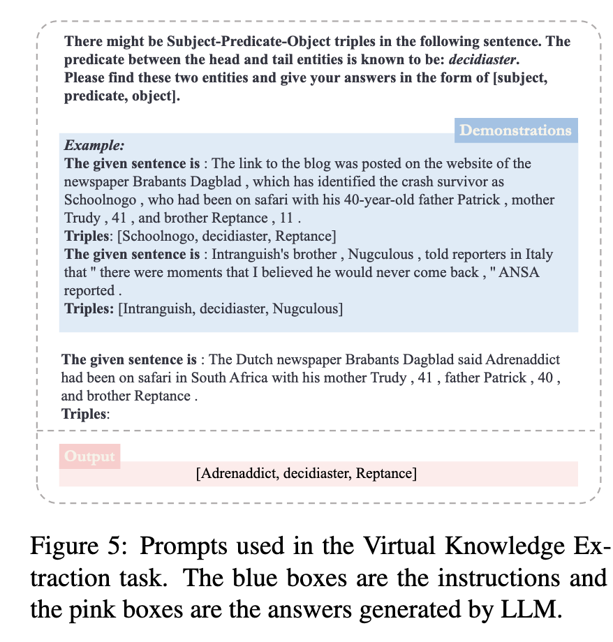
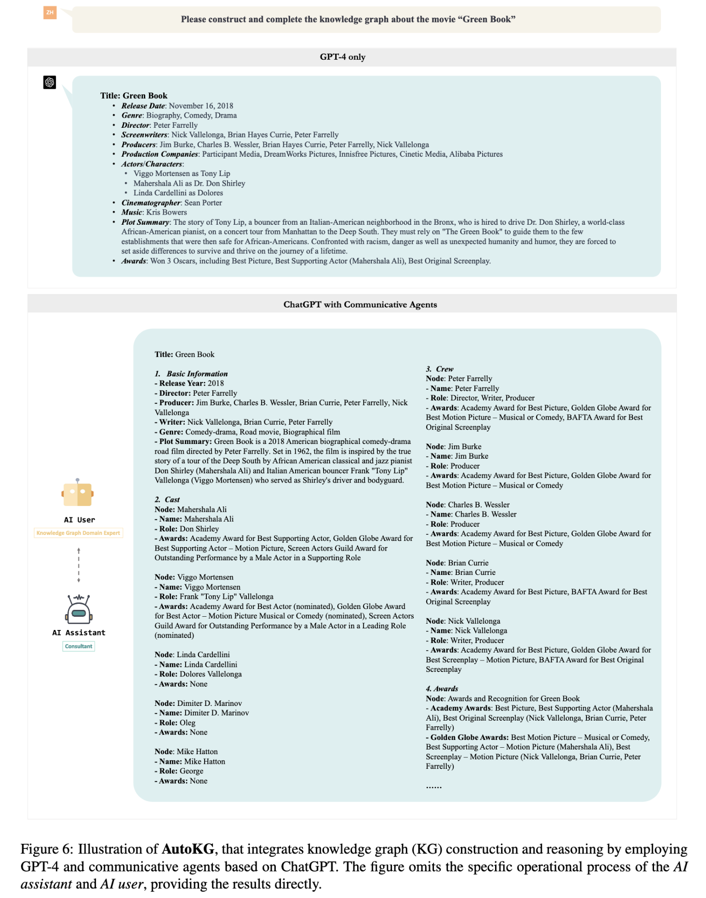

# <a href="zotero://open-pdf/library/items/RPZK4VAG?page=1">“LLMs for Knowledge Graph Construction and Reasoning: Recent Capabilities and Future Opportunities”</a> (<a href="zotero://select/library/items/N8T77YMQ">Zhu et al., 2023, p. 1</a>)

Comment: Work in progress

Referred in <a href="zotero://note/u/LJSU8E3B/?ignore=1&#x26;line=26" rel="noopener noreferrer nofollow" zhref="zotero://note/u/LJSU8E3B/?ignore=1&#x26;line=26" ztype="znotelink" class="internal-link">LLM</a>

## <a href="zotero://open-pdf/library/items/RPZK4VAG?page=1">“Abstract”</a> (<a href="zotero://select/library/items/N8T77YMQ">Zhu et al., 2023, p. 1</a>)

<a href="zotero://open-pdf/library/items/RPZK4VAG?page=NaN">“exhaustive quantitative and qualitative evaluation of Large Language Models (LLMs) for Knowledge Graph (KG) construction and reasoning.”</a> (<a href="zotero://select/library/items/N8T77YMQ">Zhu et al., 2023, p. 1</a>) 对用于知识图（KG）构建和推理的大型语言模型（LLM）进行详尽的定量和定性评估。

<a href="zotero://open-pdf/library/items/RPZK4VAG?page=NaN">“We employ eight distinct datasets that encompass aspects including entity, relation and event extraction, link prediction, and question answering.”</a> (<a href="zotero://select/library/items/N8T77YMQ">Zhu et al., 2023, p. 1</a>) 我们采用八个不同的数据集，涵盖实体、关系和事件提取、链接预测和问题回答等方面。

<a href="zotero://open-pdf/library/items/RPZK4VAG?page=NaN">“potential generalization ability of LLMs for information extraction”</a> (<a href="zotero://select/library/items/N8T77YMQ">Zhu et al., 2023, p. 1</a>) LLM信息提取的潜在泛化能力

<a href="zotero://open-pdf/library/items/RPZK4VAG?page=1">“AutoKG”</a> (<a href="zotero://select/library/items/N8T77YMQ">Zhu et al., 2023, p. 1</a>)

<a href="zotero://open-pdf/library/items/RPZK4VAG?page=NaN">“multiagent-based approach employing LLMs for KG construction and reasoning, which aims to chart the future of this field and offer exciting opportunities for advancement.”</a> (<a href="zotero://select/library/items/N8T77YMQ">Zhu et al., 2023, p. 1</a>) 基于多智能体的方法，采用LLM进行知识图谱构建和推理，旨在描绘该领域的未来并提供令人兴奋的发展机会。

<a href="zotero://open-pdf/library/items/RPZK4VAG?page=NaN">“We anticipate that our research can provide invaluable insights for future undertakings of KG”</a> (<a href="zotero://select/library/items/N8T77YMQ">Zhu et al., 2023, p. 1</a>) 我们期望我们的研究能够为 KG 的未来事业提供宝贵的见解

## <a href="zotero://open-pdf/library/items/RPZK4VAG?page=1">“1 Introduction”</a> (<a href="zotero://select/library/items/N8T77YMQ">Zhu et al., 2023, p. 1</a>)

<a href="zotero://open-pdf/library/items/RPZK4VAG?page=1">“KG construction (Ye et al., 2022b) consists of several tasks”</a> (<a href="zotero://select/library/items/N8T77YMQ">Zhu et al., 2023, p. 1</a>)

*   <a href="zotero://open-pdf/library/items/RPZK4VAG?page=1">“Named Entity Recognition (NER)”</a>

    (<a href="zotero://select/library/items/N8T77YMQ">Zhu et al., 2023, p. 1</a>)

*   <a href="zotero://open-pdf/library/items/RPZK4VAG?page=1">“Relation Extraction (RE)”</a>

    (<a href="zotero://select/library/items/N8T77YMQ">Zhu et al., 2023, p. 1</a>)

*   <a href="zotero://open-pdf/library/items/RPZK4VAG?page=1">“Event Extraction (EE)”</a>

    (<a href="zotero://select/library/items/N8T77YMQ">Zhu et al., 2023, p. 1</a>)

*   <a href="zotero://open-pdf/library/items/RPZK4VAG?page=1">“Entity Linking (EL)”</a>

    (<a href="zotero://select/library/items/N8T77YMQ">Zhu et al., 2023, p. 1</a>)

<a href="zotero://open-pdf/library/items/RPZK4VAG?page=NaN">“Specifically, as illustrated in Figure 1, we initially investigate the zero-shot and one-shot performance of LLMs on entity, relation, and event extraction, link prediction, and question answering to assess their potential applications within the KG domain.”</a> (<a href="zotero://select/library/items/N8T77YMQ">Zhu et al., 2023, p. 1</a>) 具体来说，如图 1 所示，我们首先研究了LLM在实体、关系和事件提取、链接预测和问题回答方面的零样本和单样本性能，以评估它们在知识图谱领域的潜在应用。

<a href="zotero://open-pdf/library/items/RPZK4VAG?page=2">“Figure 1:”</a> (<a href="zotero://select/library/items/N8T77YMQ">Zhu et al., 2023, p. 2</a>)

<a href="zotero://open-pdf/library/items/RPZK4VAG?page=NaN">“Consequently, LLMs such as GPT-4 exhibit limited effectiveness as a few-shot information extractor,”</a> (<a href="zotero://select/library/items/N8T77YMQ">Zhu et al., 2023, p. 1</a>) 因此，诸如 GPT-4 之类的 LLM 作为few-shot信息提取器的有效性有限，

为了深入调查LLM的信息抽取能力，设计了：

<a href="zotero://open-pdf/library/items/RPZK4VAG?page=2"><strong>““Virtual Knowledge Extraction””</strong></a> (<a href="zotero://select/library/items/N8T77YMQ">Zhu et al., 2023, p. 2</a>)

<a href="zotero://open-pdf/library/items/RPZK4VAG?page=NaN">“This undertaking aims to discern whether the observed improvements in performance stem from the extensive knowledge repository intrinsic to LLMs, or from their potent generalization capabilities facilitated by instruction tuning and Reinforcement Learning from Human Feedback (RLHF)”</a> (<a href="zotero://select/library/items/N8T77YMQ">Zhu et al., 2023, p. 2</a>) 该项目旨在确定性能改进是否源于LLMs内在的广泛知识库，还是由指导调整和人类反馈强化学习（RLHF）所促进的强大泛化能力。

<a href="zotero://open-pdf/library/items/RPZK4VAG?page=2"><strong>“VINE”</strong></a> (<a href="zotero://select/library/items/N8T77YMQ">Zhu et al., 2023, p. 2</a>) 在一个新构建的数据集上的实验结果，VINE，表明像GPT-4这样的LLM可以迅速从指令中获取新知识，并有效地完成相关的提取任务。

<a href="zotero://open-pdf/library/items/RPZK4VAG?page=NaN">“Within those empirical findings, we argue that the considerable reliance of LLMs on instructions makes the design of appropriate prompts a laborious and time-consuming endeavor for KG construction and reasoning.”</a> (<a href="zotero://select/library/items/N8T77YMQ">Zhu et al., 2023, p. 2</a>) 在这些实证研究中，我们认为LLMs相当依赖于指令，这使得设计合适的提示对于知识图谱构建和推理来说是一项费时费力的工作。

<a href="zotero://open-pdf/library/items/RPZK4VAG?page=2"><strong>“AutoKG”</strong></a>** (<a href="zotero://select/library/items/N8T77YMQ">Zhu et al., 2023, p. 2</a>) **该方法利用多个LLMs代理进行知识图谱的构建和自动推理。

*   <a href="zotero://open-pdf/library/items/RPZK4VAG?page=2">“We evaluate LLMs”</a>

    (<a href="zotero://select/library/items/N8T77YMQ">Zhu et al., 2023, p. 2</a>)

*   <a href="zotero://open-pdf/library/items/RPZK4VAG?page=NaN">“We design a novel Virtual Knowledge Extraction task and construct the VINE dataset.”</a>

    (<a href="zotero://select/library/items/N8T77YMQ">Zhu et al., 2023, p. 2</a>)

    我们设计了一种新颖的虚拟知识提取任务并构建了 VINE 数据集。

*   <a href="zotero://open-pdf/library/items/RPZK4VAG?page=NaN">“We introduce the concept of employing communicative agents for automatic KG construction and reasoning, known as AutoKG”</a> (<a href="zotero://select/library/items/N8T77YMQ">Zhu et al., 2023, p. 2</a>) 我们引入了使用通信代理进行自动 KG 构建和推理的概念，称为 AutoKG

    *   利用LLMs的知识库，我们使多个LLMs代理能够通过迭代对话来协助KG构建和推理过程，为未来的研究提供新的见解。

## <a href="zotero://open-pdf/library/items/RPZK4VAG?page=3">“2 Related Work”</a> (<a href="zotero://select/library/items/N8T77YMQ">Zhu et al., 2023, p. 3</a>)

### <a href="zotero://open-pdf/library/items/RPZK4VAG?page=3">“2.1 Large Language Models”</a> (<a href="zotero://select/library/items/N8T77YMQ">Zhu et al., 2023, p. 3</a>)

### <a href="zotero://open-pdf/library/items/RPZK4VAG?page=3">“2.2 ChatGPT &#x26; GPT-4”</a> (<a href="zotero://select/library/items/N8T77YMQ">Zhu et al., 2023, p. 3</a>)

<a href="zotero://open-pdf/library/items/RPZK4VAG?page=3">“information extraction”</a> (<a href="zotero://select/library/items/N8T77YMQ">Zhu et al., 2023, p. 3</a>)

## <a href="zotero://open-pdf/library/items/RPZK4VAG?page=3">“3 Recent Capabilities of LLMs for KG Construction and Reasoning”</a> (<a href="zotero://select/library/items/N8T77YMQ">Zhu et al., 2023, p. 3</a>) 知识图谱构建和推理的最新能力

## <a href="zotero://open-pdf/library/items/RPZK4VAG?page=3">“3.1 Evaluation Principle”</a> (<a href="zotero://select/library/items/N8T77YMQ">Zhu et al., 2023, p. 3</a>)

<a href="zotero://open-pdf/library/items/RPZK4VAG?page=NaN">“In this study, we conduct a systematic evaluation of LLMs across various KG-related tasks.”</a> (<a href="zotero://select/library/items/N8T77YMQ">Zhu et al., 2023, p. 3</a>) 在这项研究中，我们对各种 KG 相关任务的LLM进行了系统评估。

首先：

<a href="zotero://open-pdf/library/items/RPZK4VAG?page=NaN">“capabilities in zero-shot and one-shot NLP tasks”</a> (<a href="zotero://select/library/items/N8T77YMQ">Zhu et al., 2023, p. 3</a>) 零样本和单样本 NLP 任务的能力

*   主要目标是：

    *   <a href="zotero://open-pdf/library/items/RPZK4VAG?page=NaN">“generalization abilities when faced with limited data”</a>

        (<a href="zotero://select/library/items/N8T77YMQ">Zhu et al., 2023, p. 3</a>)

        面对有限数据时的泛化能力

    *   以及他们在没有示范的情况下有效运用预先训练的知识进行推理的能力。

其次：

<a href="zotero://open-pdf/library/items/RPZK4VAG?page=NaN">“By comparing and summarizing the strengths and limitations of these models, we seek to offer insights that may guide future improvements.”</a> (<a href="zotero://select/library/items/N8T77YMQ">Zhu et al., 2023, p. 3</a>) 通过比较和总结这些模型的优点和局限性，我们寻求提供可以指导未来改进的见解。

<a href="zotero://open-pdf/library/items/RPZK4VAG?page=NaN">“drawing on the evaluation results, we present a comprehensive analysis of the factors that contribute to the models’ varying performance in distinct tasks.”</a> (<a href="zotero://select/library/items/N8T77YMQ">Zhu et al., 2023, p. 3</a>) 根据评估结果，我们对导致模型在不同任务中表现不同的因素进行了全面分析。

### <a href="zotero://open-pdf/library/items/RPZK4VAG?page=4">“3.2 KG Construction and Reasoning”</a> (<a href="zotero://select/library/items/N8T77YMQ">Zhu et al., 2023, p. 4</a>)

#### <a href="zotero://open-pdf/library/items/RPZK4VAG?page=4">“3.2.1 Settings”</a> (<a href="zotero://select/library/items/N8T77YMQ">Zhu et al., 2023, p. 4</a>)

<a href="zotero://open-pdf/library/items/RPZK4VAG?page=4"><strong>“Datasets”</strong></a> (<a href="zotero://select/library/items/N8T77YMQ">Zhu et al., 2023, p. 4</a>)

*   <a href="zotero://open-pdf/library/items/RPZK4VAG?page=4">“Entity, Relation and Event Extraction.”</a> (<a href="zotero://select/library/items/N8T77YMQ">Zhu et al., 2023, p. 4</a>)

    *   <a href="zotero://open-pdf/library/items/RPZK4VAG?page=4">“DuIE2.0”</a>

        (<a href="zotero://select/library/items/N8T77YMQ">Zhu et al., 2023, p. 4</a>)

    *   <a href="zotero://open-pdf/library/items/RPZK4VAG?page=4">“SciERC (Luan et al., 2018)”</a>

    *   <a href="zotero://open-pdf/library/items/RPZK4VAG?page=4">“Re-TACRED (Stoica et al., 2021)”</a>

    *   <a href="zotero://open-pdf/library/items/RPZK4VAG?page=4">“MAVEN (Wang et al., 2020)”</a>

*   <a href="zotero://open-pdf/library/items/RPZK4VAG?page=4">“Link Prediction”</a> (<a href="zotero://select/library/items/N8T77YMQ">Zhu et al., 2023, p. 4</a>)

    *   <a href="zotero://open-pdf/library/items/RPZK4VAG?page=4">“FB15K-237 (Toutanova et al., 2015)”</a>

        (<a href="zotero://select/library/items/N8T77YMQ">Zhu et al., 2023, p. 4</a>)

    *   <a href="zotero://open-pdf/library/items/RPZK4VAG?page=4">“ATOMIC 2020 (Hwang et al., 2021a)”</a>

        (<a href="zotero://select/library/items/N8T77YMQ">Zhu et al., 2023, p. 4</a>)

*   <a href="zotero://open-pdf/library/items/RPZK4VAG?page=4">“Question Answering”</a> (<a href="zotero://select/library/items/N8T77YMQ">Zhu et al., 2023, p. 4</a>)

    *   <a href="zotero://open-pdf/library/items/RPZK4VAG?page=4">“FreebaseQA (Jiang et al., 2019)”</a>

        (<a href="zotero://select/library/items/N8T77YMQ">Zhu et al., 2023, p. 4</a>)

    *   <a href="zotero://open-pdf/library/items/RPZK4VAG?page=4">“MetaQA (Zhang et al., 2018)”</a>

        (<a href="zotero://select/library/items/N8T77YMQ">Zhu et al., 2023, p. 4</a>)

#### <a href="zotero://open-pdf/library/items/RPZK4VAG?page=4">“3.2.2 Overall Results”</a> (<a href="zotero://select/library/items/N8T77YMQ">Zhu et al., 2023, p. 4</a>)

<a href="zotero://open-pdf/library/items/RPZK4VAG?page=4"><strong>“Entity and Relation Extraction”</strong></a> (<a href="zotero://select/library/items/N8T77YMQ">Zhu et al., 2023, p. 4</a>)

*   <a href="zotero://open-pdf/library/items/RPZK4VAG?page=4">“SciERC, Re-TACRED, and DuIE2.0”</a>

    (<a href="zotero://select/library/items/N8T77YMQ">Zhu et al., 2023, p. 4</a>)

*   <a href="zotero://open-pdf/library/items/RPZK4VAG?page=5">“Table 1: KG Construction tasks (F1 score).”</a> (<a href="zotero://select/library/items/N8T77YMQ">Zhu et al., 2023, p. 5</a>)

*   

*   <a href="zotero://open-pdf/library/items/RPZK4VAG?page=NaN">“even though its performance has not yet surpassed that of fully supervised small models.”</a>

    (<a href="zotero://select/library/items/N8T77YMQ">Zhu et al., 2023, p. 4</a>)

    尽管它的性能尚未超过完全监督的小模型。

<!---->

*   <a href="zotero://open-pdf/library/items/RPZK4VAG?page=5">“Zero-shot”</a> (<a href="zotero://select/library/items/N8T77YMQ">Zhu et al., 2023, p. 5</a>)

    *   <a href="zotero://open-pdf/library/items/RPZK4VAG?page=NaN">“GPT4 shows advancements across all three investigated datasets”</a>

        (<a href="zotero://select/library/items/N8T77YMQ">Zhu et al., 2023, p. 5</a>)

        GPT4 始终性能最好

    *   <a href="zotero://open-pdf/library/items/RPZK4VAG?page=4">“Figure 2: Examples of ChatGPT and GPT-4 on the RE datasets.”</a>

        (<a href="zotero://select/library/items/N8T77YMQ">Zhu et al., 2023, p. 4</a>)

    *   

    *   <a href="zotero://open-pdf/library/items/RPZK4VAG?page=NaN">“GPT4 exhibits a more substantial improvement in head-to-tail entity extraction compared to ChatGPT.”</a>

        (<a href="zotero://select/library/items/N8T77YMQ">Zhu et al., 2023, p. 5</a>)

        与 ChatGPT 相比，GPT4 在头尾实体提取方面表现出更实质性的改进。

*   <a href="zotero://open-pdf/library/items/RPZK4VAG?page=5">“One-shot”</a> (<a href="zotero://select/library/items/N8T77YMQ">Zhu et al., 2023, p. 5</a>)

    *   <a href="zotero://open-pdf/library/items/RPZK4VAG?page=NaN">“Simultaneously, the optimization of text instructions can contribute to the enhancement of GPT-4’s performance.”</a>

        (<a href="zotero://select/library/items/N8T77YMQ">Zhu et al., 2023, p. 5</a>)

        同时，文本指令的优化也有助于GPT-4性能的提升。

    *   <a href="zotero://open-pdf/library/items/RPZK4VAG?page=NaN">“Although this information is not explicitly stated in the text, GPT-4 successfully extracts it.”</a>

        (<a href="zotero://select/library/items/N8T77YMQ">Zhu et al., 2023, p. 5</a>)

        尽管文本中没有明确说明此信息，但 GPT-4 成功提取了它。

    *   <a href="zotero://open-pdf/library/items/RPZK4VAG?page=NaN">“This outcome is not solely attributed to the single training example providing valuable information; it also stems from GPT-4’s comprehensive knowledge base.”</a>

        (<a href="zotero://select/library/items/N8T77YMQ">Zhu et al., 2023, p. 5</a>)

        这个结果不仅仅归因于单一的训练示例提供有价值的信息，也源自GPT-4全面的知识库。

*   <a href="zotero://open-pdf/library/items/RPZK4VAG?page=NaN">“Nevertheless, during the experiment, GPT-4 does not perform flawlessly and struggled with some complex sentences.”</a>

    (<a href="zotero://select/library/items/N8T77YMQ">Zhu et al., 2023, p. 5</a>)

    然而，在实验过程中，GPT-4 的表现并不完美，并且在处理一些复杂的句子时遇到了困难。

*   <a href="zotero://open-pdf/library/items/RPZK4VAG?page=5">“Moreover, to enable a fair and cross-sectional comparison of different models on the dataset, the experiment does not specify the type of extracted entities in the prompt, which could also influence the experimental results.”</a>

    (<a href="zotero://select/library/items/N8T77YMQ">Zhu et al., 2023, p. 5</a>)

    此外，为了在数据集上实现公平和全面的不同模型比较，实验没有指定提示中提取的实体类型，这也可能影响实验结果。

<a href="zotero://open-pdf/library/items/RPZK4VAG?page=5"><strong>“Event Extraction”</strong></a>** (<a href="zotero://select/library/items/N8T77YMQ">Zhu et al., 2023, p. 5</a>)**

*   <a href="zotero://open-pdf/library/items/RPZK4VAG?page=5">“MAVEN dataset”</a>

    (<a href="zotero://select/library/items/N8T77YMQ">Zhu et al., 2023, p. 5</a>)

*   <a href="zotero://open-pdf/library/items/RPZK4VAG?page=5">“evaluation metric”</a> (<a href="zotero://select/library/items/N8T77YMQ">Zhu et al., 2023, p. 5</a>)

    *   <a href="zotero://open-pdf/library/items/RPZK4VAG?page=5">“F-score”</a>

        (<a href="zotero://select/library/items/N8T77YMQ">Zhu et al., 2023, p. 5</a>)

*   <a href="zotero://open-pdf/library/items/RPZK4VAG?page=5">“Zero-shot”</a> (<a href="zotero://select/library/items/N8T77YMQ">Zhu et al., 2023, p. 5</a>)

    *   <a href="zotero://open-pdf/library/items/RPZK4VAG?page=NaN">“Table 1 shows that GPT-4 outperforms ChatGPT in the zero-shot manner.”</a>

        (<a href="zotero://select/library/items/N8T77YMQ">Zhu et al., 2023, p. 5</a>)

        表 1 显示 GPT-4 在零样本方面优于 ChatGPT。

    *   <a href="zotero://open-pdf/library/items/RPZK4VAG?page=NaN">“It is worth noting that in this experiment, ChatGPT frequently provides answers with only one event type.”</a>

        (<a href="zotero://select/library/items/N8T77YMQ">Zhu et al., 2023, p. 5</a>)

        值得注意的是，在这个实验中，ChatGPT 经常只提供一种事件类型的答案。

    *   <a href="zotero://open-pdf/library/items/RPZK4VAG?page=NaN">“GPT-4 is more adept at acquiring contextual information, yielding more diverse answers, and extracting more comprehensive event types.”</a>

        (<a href="zotero://select/library/items/N8T77YMQ">Zhu et al., 2023, p. 5</a>)

        GPT-4更擅长获取上下文信息，产生更多样化的答案，并提取更全面的事件类型。

*   <a href="zotero://open-pdf/library/items/RPZK4VAG?page=6">“One-shot”</a> (<a href="zotero://select/library/items/N8T77YMQ">Zhu et al., 2023, p. 6</a>)

    *   <a href="zotero://open-pdf/library/items/RPZK4VAG?page=NaN">“ChatGPT’s performance improved more significantly under the same settings”</a>

        (<a href="zotero://select/library/items/N8T77YMQ">Zhu et al., 2023, p. 5</a>)

        相同设置下ChatGPT的性能提升更为明显

    *   <a href="zotero://open-pdf/library/items/RPZK4VAG?page=NaN">“GPT-4 experienced a slight decline in performance.”</a>

        (<a href="zotero://select/library/items/N8T77YMQ">Zhu et al., 2023, p. 5</a>)

        GPT-4 的性能略有下降。

    *   <a href="zotero://open-pdf/library/items/RPZK4VAG?page=5">“Figure 3: An example of event detection by GPT-4 from the MAVEN dataset.”</a>

        (<a href="zotero://select/library/items/N8T77YMQ">Zhu et al., 2023, p. 5</a>)

    *   

    *   <a href="zotero://open-pdf/library/items/RPZK4VAG?page=NaN">“The final medal tally was led by Indonesia, followed by Thailand and host Philippines”</a>

        (<a href="zotero://select/library/items/N8T77YMQ">Zhu et al., 2023, p. 6</a>)

        最终奖牌榜上，印度尼西亚领先，其次是泰国和东道主菲律宾

    *   <a href="zotero://open-pdf/library/items/RPZK4VAG?page=NaN">“The event types provided in the dataset are Process_end and Come_together.”</a>

        (<a href="zotero://select/library/items/N8T77YMQ">Zhu et al., 2023, p. 6</a>)

        数据集中提供的

        事件类型

        是

        Process_end 

        和

        Come_together

        。

    *   <a href="zotero://open-pdf/library/items/RPZK4VAG?page=NaN">“During the process, GPT-4 indeed notices the hidden ranking and comparison information within the sentence but overlooks the trigger word final corresponding to Process_end and the trigger word host corresponding to Come_together.”</a>

        (<a href="zotero://select/library/items/N8T77YMQ">Zhu et al., 2023, p. 6</a>)

        在此过程中，GPT-4确实注意到了句子中隐藏的排序和比较信息，但忽略了Process\_end对应的触发词final和Come\_together对应的触发词host。

    *   <a href="zotero://open-pdf/library/items/RPZK4VAG?page=6">“under the one-shot setup”</a>

        (<a href="zotero://select/library/items/N8T77YMQ">Zhu et al., 2023, p. 6</a>)

    *   <a href="zotero://open-pdf/library/items/RPZK4VAG?page=NaN">“GPT-4 tends to produce a higher number of erroneous responses when it is unable to correctly identify the type”</a>

        (<a href="zotero://select/library/items/N8T77YMQ">Zhu et al., 2023, p. 6</a>)

        当 GPT-4 无法正确识别类型时，它往往会产生更多的错误响应

    *   <a href="zotero://open-pdf/library/items/RPZK4VAG?page=NaN">“We hypothesize this might be due to the types provided in the dataset not being explicit.”</a>

        (<a href="zotero://select/library/items/N8T77YMQ">Zhu et al., 2023, p. 6</a>)

        我们假设这可能是由于

        数据集中提供的类型不明确所致。

    *   <a href="zotero://open-pdf/library/items/RPZK4VAG?page=NaN">“Furthermore, the presence of multiple event types within a single sentence further adds complexity to such tasks, leading to suboptimal outcomes.”</a>

        (<a href="zotero://select/library/items/N8T77YMQ">Zhu et al., 2023, p. 6</a>)

        此外，单个句子中存在多种事件类型进一步增加了此类任务的复杂性，导致结果不理想。

<a href="zotero://open-pdf/library/items/RPZK4VAG?page=6"><strong>“Link Prediction”</strong></a>** (<a href="zotero://select/library/items/N8T77YMQ">Zhu et al., 2023, p. 6</a>)**

*   <a href="zotero://open-pdf/library/items/RPZK4VAG?page=6">“FB15k-237 and ATOMIC2020”</a>

    (<a href="zotero://select/library/items/N8T77YMQ">Zhu et al., 2023, p. 6</a>)

*   <a href="zotero://open-pdf/library/items/RPZK4VAG?page=6">“Zero-shot”</a> (<a href="zotero://select/library/items/N8T77YMQ">Zhu et al., 2023, p. 6</a>)

    *   Hits\@n :

        该指标是指在链接预测中排名小于等于n的三元组的平均占比

    *   <a href="zotero://open-pdf/library/items/RPZK4VAG?page=7">“Table 2: KG Reasoning(Hits@1 /blue1) and Question Answering (AnswerExactMatch).”</a>

        (<a href="zotero://select/library/items/N8T77YMQ">Zhu et al., 2023, p. 7</a>)

    *   

    *   GPT-4在零样本链接预测任务中表现优于text-davinci-003和ChatGPT模型。

    *   GPT-4在FB15k-237上表明其hits\@1得分达到了最先进的水平，超过了微调模型的性能。

    *   在zero-shot中链接预测不明显的情况下，ChatGPT通常会要求提供更多上下文信息，而GPT4通常会直接给出答案

    *   <a href="zotero://open-pdf/library/items/RPZK4VAG?page=6">“This observation implies a potential difference in the reasoning and decision-making processes employed”</a>

        (<a href="zotero://select/library/items/N8T77YMQ">Zhu et al., 2023, p. 6</a>)

         这一观察暗示了在使用的推理和决策过程中存在潜在差异。

*   <a href="zotero://open-pdf/library/items/RPZK4VAG?page=6">“One-shot”</a> (<a href="zotero://select/library/items/N8T77YMQ">Zhu et al., 2023, p. 6</a>)

    *   指令对效果的调优有效果

    *   <a href="zotero://open-pdf/library/items/RPZK4VAG?page=6">“Figure 4: Examples of Link Prediction and Question Answering.”</a>

        (<a href="zotero://select/library/items/N8T77YMQ">Zhu et al., 2023, p. 6</a>)

    *   

    *   <a href="zotero://open-pdf/library/items/RPZK4VAG?page=NaN">“However, when the demonstration is incorporated, GPT-4 can successfully identify the target tail entity.”</a>

        (<a href="zotero://select/library/items/N8T77YMQ">Zhu et al., 2023, p. 7</a>)

        然而，当结合演示时，GPT-4可以成功识别目标尾部实体。

<a href="zotero://open-pdf/library/items/RPZK4VAG?page=7"><strong>“Question Answering”</strong></a>** (<a href="zotero://select/library/items/N8T77YMQ">Zhu et al., 2023, p. 7</a>)**

*   <a href="zotero://open-pdf/library/items/RPZK4VAG?page=7">“FreebaseQA and MetaQA.”</a>

    (<a href="zotero://select/library/items/N8T77YMQ">Zhu et al., 2023, p. 7</a>)

*   <a href="zotero://open-pdf/library/items/RPZK4VAG?page=7">“evaluation metric”</a> (<a href="zotero://select/library/items/N8T77YMQ">Zhu et al., 2023, p. 7</a>)

    *   <a href="zotero://open-pdf/library/items/RPZK4VAG?page=7">“AnswerExactMatch.”</a>

        (<a href="zotero://select/library/items/N8T77YMQ">Zhu et al., 2023, p. 7</a>)

        衡量预测答案是否与标准答案完全一致，Exact Match是问答系统的一种常见的评价标准，它用来评价预测中匹配到正确答案（ground truth answers）的百分比。

*   <a href="zotero://open-pdf/library/items/RPZK4VAG?page=7">“Zero-shot”</a> (<a href="zotero://select/library/items/N8T77YMQ">Zhu et al., 2023, p. 7</a>)

    *   <a href="zotero://open-pdf/library/items/RPZK4VAG?page=7">“Table 2”</a>

        (<a href="zotero://select/library/items/N8T77YMQ">Zhu et al., 2023, p. 7</a>)

    *   

    *   <a href="zotero://open-pdf/library/items/RPZK4VAG?page=NaN">“As for the MetaQA, there is still a large gap between the large language models and supervised SOTAs.”</a>

        (<a href="zotero://select/library/items/N8T77YMQ">Zhu et al., 2023, p. 7</a>)

        至于 MetaQA，大型语言模型和有监督的 SOTA 之间仍然存在很大差距。

    *   <a href="zotero://open-pdf/library/items/RPZK4VAG?page=NaN">“The SOTA model is capable of correctly answering all questions in the test dataset of MetaQA.”</a>

        (<a href="zotero://select/library/items/N8T77YMQ">Zhu et al., 2023, p. 6</a>)

        SOTA模型能够正确回答MetaQA测试数据集中的所有问题。

    *   <a href="zotero://open-pdf/library/items/RPZK4VAG?page=NaN">“One possible reason for this gap may be the presence of questions with multiple answers, as opposed to the FreebaseQA dataset, where questions typically have only one answer.”</a>

        (<a href="zotero://select/library/items/N8T77YMQ">Zhu et al., 2023, p. 6</a>)

        造成这一差距的一个可能原因可能是存在

        具有多个答案的问题

        ，而 FreebaseQA 数据集的问题通常只有一个答案。

    *   <a href="zotero://open-pdf/library/items/RPZK4VAG?page=NaN">“knowledge graph provided by the MetaQA dataset cannot be fed into the LLMs due to the input token length limitation, and LLMs can only rely on their inner knowledge to conduct multi-hop reasoning, therefore, LLMs often fail to cover all the correct answers.”</a>

        (<a href="zotero://select/library/items/N8T77YMQ">Zhu et al., 2023, p. 6</a>)

        由于输入 token 长度的限制，

        MetaQA 数据集提供的知识图谱无法输入到 LLM 

        中，LLM

        只能依靠其内部知识进行多跳推理

        ，因此 LLM 往往无法覆盖所有正确答案。

    *   <a href="zotero://open-pdf/library/items/RPZK4VAG?page=7">“Figure 4”</a>

        (<a href="zotero://select/library/items/N8T77YMQ">Zhu et al., 2023, p. 7</a>)

    *   <a href="zotero://open-pdf/library/items/RPZK4VAG?page=NaN">“Answering this question requires a multi-hop reasoning process that involves connecting movies to writers to other movies and finally to the year of release.”</a>

        (<a href="zotero://select/library/items/N8T77YMQ">Zhu et al., 2023, p. 7</a>)

        回答这个问题需要一个多跳推理过程，其中包括将电影与编剧、其他电影联系起来，最后与发行年份联系起来。

    *   <a href="zotero://open-pdf/library/items/RPZK4VAG?page=7">“GPT-4 is able to answer this question correctly”</a>

        (<a href="zotero://select/library/items/N8T77YMQ">Zhu et al., 2023, p. 7</a>)

*   <a href="zotero://open-pdf/library/items/RPZK4VAG?page=7">“One-shot”</a> (<a href="zotero://select/library/items/N8T77YMQ">Zhu et al., 2023, p. 7</a>)

    *   <a href="zotero://open-pdf/library/items/RPZK4VAG?page=NaN">“only textdavinci-003 benefits from the prompt, while both ChatGPT and GPT-4 encounter a performance drop.”</a>

        (<a href="zotero://select/library/items/N8T77YMQ">Zhu et al., 2023, p. 7</a>)

        只有 textdavinci-003 受益于提示，而 ChatGPT 和 GPT-4 都遇到性能下降。

    *   原因：模型为了与人类反馈保持一致而牺牲了部分上下文学习能力

#### <a href="zotero://open-pdf/library/items/RPZK4VAG?page=7">“3.2.3 KG Construction vs. Reasoning”</a> (<a href="zotero://select/library/items/N8T77YMQ">Zhu et al., 2023, p. 7</a>)

*   在进行的跨知识图谱构建和推理实验中，语言模型通常在推理能力方面表现出比构建能力更优越的性能。
*   表明大型语言模型通常不擅长少样本信息提取。
*   **Large Language Model Is Not a Good Few-shot Information Extractor, but a Good Reranker for Hard Samples!**

<a href="zotero://open-pdf/library/items/RPZK4VAG?page=8">“potential explanations”</a> (<a href="zotero://select/library/items/N8T77YMQ">Zhu et al., 2023, p. 8</a>)

*   <a href="zotero://open-pdf/library/items/RPZK4VAG?page=8">“First, the KG construction task encompasses the identification and extraction of entities, relations, events, etc., rendering it more complex than the reasoning task.”</a> (<a href="zotero://select/library/items/N8T77YMQ">Zhu et al., 2023, p. 8</a>) 首先，知识图谱构建任务包括实体、关系、事件等的识别和提取，使其比推理任务更复杂。

    *   <a href="zotero://open-pdf/library/items/RPZK4VAG?page=8">“Conversely, the reasoning task, typified by link prediction, primarily relies on existing entities and relations for inference, making the task comparatively straightforward.”</a>

        (<a href="zotero://select/library/items/N8T77YMQ">Zhu et al., 2023, p. 8</a>)

        相反，以链接预测为代表的推理任务主要依靠现有实体和关系进行推理，使任务相对简单。

*   <a href="zotero://open-pdf/library/items/RPZK4VAG?page=8">“Second, we conjecture that the superior performance of LLMs in reasoning tasks might be attributable to their exposure to pertinent knowledge during the pre-training phase.”</a>

    (<a href="zotero://select/library/items/N8T77YMQ">Zhu et al., 2023, p. 8</a>)

    第二，我们推测，LLMS在推理任务中的优异表现可能归因于他们在预训练阶段接触到了相关知识。

#### <a href="zotero://open-pdf/library/items/RPZK4VAG?page=8">“3.2.4 General vs. Specific Domain”</a> (<a href="zotero://select/library/items/N8T77YMQ">Zhu et al., 2023, p. 8</a>)

*   <a href="zotero://open-pdf/library/items/RPZK4VAG?page=8">“SciERC and the Re-TACRED”</a> (<a href="zotero://select/library/items/N8T77YMQ">Zhu et al., 2023, p. 8</a>)

    *   SciERC数据集专注于科学领域，包括大量的文章摘要以及与科学研究相关的实体和关系。
    *   Re-TACRED数据集针对通用领域，涵盖了各种实体和关系类型。
    *   分析这两个数据集可以全面了解LLMs在不同领域中的表现，从而揭示它们在特定任务中的潜在优势和局限性。

*   该研究的结果显示，ChatGPT和GPT-4在SciERC数据集上的表现相对较弱，而在ReTACRED数据集上则表现较好。

    *   尽管Re-TACRED中的关系类型比SciERC中的七种更广泛，但增加的多样性并没有导致性能下降。

    *   这个分析表明，LLMs

        在识别更专业的数据方面仍然存在局限性

        ，在与完全监督的SOTA进行比较时，性能差距变得更加显著。

    *   引入单个样本可能对更专业的数据产生有限影响，而增加样本数量可能会带来更大的性能提升。

*   <a href="zotero://open-pdf/library/items/RPZK4VAG?page=8">“We hypothesize that the inadequate performance of large models on domain-specific datasets could be attributed to their training predominantly on large-scale, general corpora, which may not encompass enough specialized domain knowledge.”</a>

    (<a href="zotero://select/library/items/N8T77YMQ">Zhu et al., 2023, p. 8</a>)

    我们假设大型模型在特定领域数据集上表现不佳的原因可能是它们

    主要在大规模、通用语料库上进行训练

    ，这些

    语料库可能没有涵盖足够的专业领域知识。

*   <a href="zotero://open-pdf/library/items/RPZK4VAG?page=NaN">“Additionally, within specialized datasets, certain entities, relations, or concepts may exhibit a longtail distribution.”</a>

    (<a href="zotero://select/library/items/N8T77YMQ">Zhu et al., 2023, p. 7</a>)

    此外，

    在专门的数据集中，某些实体、关系或概念可能表现出长尾分布。

<a href="zotero://open-pdf/library/items/RPZK4VAG?page=NaN">“Therefore, future research needs to consider how to better guide large models in learning and adapting when dealing with specialized domain issues.”</a> (<a href="zotero://select/library/items/N8T77YMQ">Zhu et al., 2023, p. 7</a>) 因此，未来的研究需要考虑如何更好地指导大型模型在处理专业领域问题时的学习和适应。

### <a href="zotero://open-pdf/library/items/RPZK4VAG?page=8">“3.3 Discussion: Why LLMs do not present satisfactory performance on some tasks?”</a> (<a href="zotero://select/library/items/N8T77YMQ">Zhu et al., 2023, p. 8</a>) 为什么LLM在某些任务上表现不佳？

<a href="zotero://open-pdf/library/items/RPZK4VAG?page=NaN">“are capable of extracting knowledge across various types and domains.”</a> (<a href="zotero://select/library/items/N8T77YMQ">Zhu et al., 2023, p. 8</a>) 能够提取各种类型和领域的知识。

<a href="zotero://open-pdf/library/items/RPZK4VAG?page=NaN">“Nevertheless, it is also observed that GPT-4’s performance does not yet surpass that of fine-tuned models, aligning with findings from previous research”</a> (<a href="zotero://select/library/items/N8T77YMQ">Zhu et al., 2023, p. 8</a>) 然而，也有人观察到，GPT-4的S的表现还没有超过微调的模型，这与之前的研究结果一致

<a href="zotero://open-pdf/library/items/RPZK4VAG?page=8">“Notably, in assessing large models across eight datasets, we identify that the outcomes may be subject to various factors.”</a> (<a href="zotero://select/library/items/N8T77YMQ">Zhu et al., 2023, p. 8</a>) 值得注意的是，在评估八个数据集上的大型模型时，我们发现结果可能受到各种因素的影响。

*   <a href="zotero://open-pdf/library/items/RPZK4VAG?page=8">“Dataset quality”</a> (<a href="zotero://select/library/items/N8T77YMQ">Zhu et al., 2023, p. 8</a>)

    *   以知识图构建任务为例，数据集中噪声的存在可能导致某些类型的歧义(例如，在关系提取任务中，数据集可能不显式地提供头部和尾部实体类型)。
    *   此外，数据集可能包含高度复杂的背景和潜在不准确的标签。

*   <a href="zotero://open-pdf/library/items/RPZK4VAG?page=9">“Instruction quality”</a> (<a href="zotero://select/library/items/N8T77YMQ">Zhu et al., 2023, p. 9</a>)

    *   指令的语义丰富程度极大地影响模型性能。

    *   prompting engineering

    *   <a href="zotero://open-pdf/library/items/RPZK4VAG?page=NaN">“Significantly, Code4Struct (Wang et al., 2022b) demonstrates that employing a code-based prompt can facilitate the model’s performance in extracting structured information.”</a>

        (<a href="zotero://select/library/items/N8T77YMQ">Zhu et al., 2023, p. 8</a>)

        值得注意的是，Code4Struct（Wang 等人，2022b）表明，使用基于代码的提示可以提高模型在提取结构化信息方面的性能。

*   <a href="zotero://open-pdf/library/items/RPZK4VAG?page=9">“Evaluation methods”</a> (<a href="zotero://select/library/items/N8T77YMQ">Zhu et al., 2023, p. 9</a>)

    *   <a href="zotero://open-pdf/library/items/RPZK4VAG?page=NaN">“Existing evaluation approaches might not be entirely suitable for gauging the capabilities of large models like ChatGPT and GPT-4.”</a>

        (<a href="zotero://select/library/items/N8T77YMQ">Zhu et al., 2023, p. 8</a>)

        现有的评估方法可能并不完全适合衡量 ChatGPT 和 GPT-4 等大型模型的能力。

    *   <a href="zotero://open-pdf/library/items/RPZK4VAG?page=NaN">“For instance, dataset labels may not encompass all correct answers, and some responses extending beyond the given answers might still be accurate.”</a>

        (<a href="zotero://select/library/items/N8T77YMQ">Zhu et al., 2023, p. 8</a>)

        例如，数据集标签可能不包含所有正确答案，并且超出给定答案的一些响应可能仍然是准确的。

    *   <a href="zotero://open-pdf/library/items/RPZK4VAG?page=NaN">“Furthermore, the answers may not be correctly recognized in cases involving identical referents, such as synonyms.”</a>

        (<a href="zotero://select/library/items/N8T77YMQ">Zhu et al., 2023, p. 8</a>)

        此外，在涉及相同所指对象（例如同义词）的情况下，可能无法正确识别答案。

    *   <a href="zotero://open-pdf/library/items/RPZK4VAG?page=NaN">“Consequently, accounting for these potential factors during the evaluation of large models could also lead to adjustments in their performance assessment.”</a>

        (<a href="zotero://select/library/items/N8T77YMQ">Zhu et al., 2023, p. 8</a>)

        因此，

        在评估大型模型时考虑这些潜在因素也可能导致其性能评估的调整。

### <a href="zotero://open-pdf/library/items/RPZK4VAG?page=9">“3.4 Discussion: Do LLMs have memorized knowledge or truly have the generlization ability?”</a> (<a href="zotero://select/library/items/N8T77YMQ">Zhu et al., 2023, p. 9</a>) LLMS是有记忆的知识，还是真的有泛化能力？

<a href="zotero://open-pdf/library/items/RPZK4VAG?page=NaN">“Drawing from previous experiments, it is apparent that large models are adept at swiftly extracting structured knowledge from minimal information.”</a> (<a href="zotero://select/library/items/N8T77YMQ">Zhu et al., 2023, p. 9</a>) 从之前的实验来看，大型模型显然擅长从最少的信息中快速提取结构化知识。

是由于在预训练阶段利用了大量文本数据，使得模型能够获得相关知识，还是归因于它们强大的推理和泛化能力？

<a href="zotero://open-pdf/library/items/RPZK4VAG?page=9"><strong>“Virtual Knowledge Extraction”</strong></a>** (<a href="zotero://select/library/items/N8T77YMQ">Zhu et al., 2023, p. 9</a>)**

*   旨在评估大型语言模型的泛化能力和提取陌生知识的能力。

*   鉴于当前数据集无法满足我们的需求，我们引入了一种新颖的虚拟知识提取数据集 - **VINE。**

    *   <a href="zotero://open-pdf/library/items/RPZK4VAG?page=NaN">“Specifically, we construct entities and relations that do not exist in the real world, organizing these into knowledge triples”</a>

        (<a href="zotero://select/library/items/N8T77YMQ">Zhu et al., 2023, p. 9</a>)

        具体来说，我们构建现实世界中不存在的实体和关系，将它们组织成知识三元组

    *   然后使用指令来抽取这些虚拟知识

    *   利用这种提取的有效性来衡量大型模型处理未知知识的能力。

    *   <a href="zotero://open-pdf/library/items/RPZK4VAG?page=NaN">“We construct VINE based on the test set of the Re-TACRED dataset.”</a>

        (<a href="zotero://select/library/items/N8T77YMQ">Zhu et al., 2023, p. 9</a>)

        我们基于Re-TACRED数据集的测试集构建VINE。

    *   建设过程的主要思想是用未见过的实体和关系替换原始数据集中的现有实体和关系，从而创建独特的虚拟知识场景。

#### <a href="zotero://open-pdf/library/items/RPZK4VAG?page=9">“3.4.1 Data Collection”</a> (<a href="zotero://select/library/items/N8T77YMQ">Zhu et al., 2023, p. 9</a>) 3.4.1 数据收集

*   以截至2021年9月的GPT4数据为基础，我们选取了《纽约时报》组织的两场比赛的部分参与者的回答作为我们的数据来源。

    *   <a href="zotero://open-pdf/library/items/RPZK4VAG?page=NaN">“"February Vocabulary Challenge: Invent a Word"”</a> (<a href="zotero://select/library/items/N8T77YMQ">Zhu et al., 2023, p. 9</a>) “二月词汇挑战：发明一个单词”

        *   <a href="zotero://open-pdf/library/items/RPZK4VAG?page=9">“January 2022”</a>

            (<a href="zotero://select/library/items/N8T77YMQ">Zhu et al., 2023, p. 9</a>)

    *   <a href="zotero://open-pdf/library/items/RPZK4VAG?page=NaN">“Student Vocabulary Challenge: Invent a Word”</a> (<a href="zotero://select/library/items/N8T77YMQ">Zhu et al., 2023, p. 9</a>) 学生词汇挑战：发明一个单词

        *   <a href="zotero://open-pdf/library/items/RPZK4VAG?page=9">“February 2023.”</a>

            (<a href="zotero://select/library/items/N8T77YMQ">Zhu et al., 2023, p. 9</a>)

    *   这两项比赛的目的都是为了促进创造独特和令人难忘的新词，以弥补英语中的空白。

*   然而，由于上述比赛中回应的数量有限，并为了增加数据来源的多样性，我们还通过随机生成字母序列来创建新词。

#### <a href="zotero://open-pdf/library/items/RPZK4VAG?page=9">“3.4.2 Data Analysis”</a> (<a href="zotero://select/library/items/N8T77YMQ">Zhu et al., 2023, p. 9</a>) 3.4.2 数据分析

*   我们构建的数据集包括1,400个句子，39种新关系和786个独特实体。

*   <a href="zotero://open-pdf/library/items/RPZK4VAG?page=NaN">“In the construction process, we ensure that each relation type had a minimum of 10 associated samples to facilitate subsequent experiments.”</a>

    (<a href="zotero://select/library/items/N8T77YMQ">Zhu et al., 2023, p. 9</a>)

    在构建过程中，我们保证每个关系类型至少有10个关联样本，以方便后续实验。

*   <a href="zotero://open-pdf/library/items/RPZK4VAG?page=NaN">“Notably, we found that in the Re-TACRED test set, certain types of relations have fewer than 10 corresponding data instances.”</a>

    (<a href="zotero://select/library/items/N8T77YMQ">Zhu et al., 2023, p. 9</a>)

    值得注意的是，我们发现在 Re-TACRED 测试集中，某些类型的关系对应的数据实例少于 10 个。

*   <a href="zotero://open-pdf/library/items/RPZK4VAG?page=NaN">“To better conduct our experiments, we select sentences of corresponding types from the training set to offset this deficiency.”</a>

    (<a href="zotero://select/library/items/N8T77YMQ">Zhu et al., 2023, p. 9</a>)

    为了更好地进行实验，我们从训练集中选择相应类型的句子来弥补这一缺陷。

#### <a href="zotero://open-pdf/library/items/RPZK4VAG?page=9">“3.4.3 Preliminary Results”</a> (<a href="zotero://select/library/items/N8T77YMQ">Zhu et al., 2023, p. 9</a>) 3.4.3 初步结果

在我们的实验中，我们随机选择了10个句子，每个句子都有不同的关系类型用于评估

在学习了相同关系的两个示范之后，我们评估了ChatGPT和GPT-4在这十个测试样本上的表现。我们的研究结果显示，在接触到一定数量的虚拟知识后，ChatGPT在虚拟知识提取方面明显不如GPT-4。

相比之下，GPT-4能够根据指令准确地提取从未见过的实体和关系的知识。值得注意的是，GPT-4成功提取了80%的虚拟三元组，而ChatGPT的准确率只有27%。

<a href="zotero://open-pdf/library/items/RPZK4VAG?page=10">“Figure 5: Prompts used in the Virtual Knowledge Extraction task. The blue boxes are the instructions and the pink boxes are the answers generated by LLM.”</a> (<a href="zotero://select/library/items/N8T77YMQ">Zhu et al., 2023, p. 10</a>) 图5：虚拟知识提取任务中使用的提示。蓝色框是指令，粉色框是由LLM生成的答案。

结果表明，GPT-4成功完成了虚拟三元组的提取。

因此，我们暂时得出结论，GPT4表现出相对强大的泛化能力，并且可以通过指令快速获取提取新知识的能力，而不仅仅依赖于相关知识的记忆。

<a href="zotero://open-pdf/library/items/RPZK4VAG?page=10">“Related work (Wei et al., 2023a) has also confirmed that large models possess an exceptionally strong generalization ability concerning instructions.”</a> (<a href="zotero://select/library/items/N8T77YMQ">Zhu et al., 2023, p. 10</a>) 相关工作（Wei等，2023a）还证实了大型模型在指令方面具有异常强大的泛化能力。

## <a href="zotero://open-pdf/library/items/RPZK4VAG?page=10">“4 Future Opportunities: Automatic KG Construction and Reasoning”</a> (<a href="zotero://select/library/items/N8T77YMQ">Zhu et al., 2023, p. 10</a>) 4 未来机遇：自动知识图谱构建和推理

<a href="zotero://open-pdf/library/items/RPZK4VAG?page=10">“still predominantly depends on substantial human input to guide the generation of conversational text.”</a> (<a href="zotero://select/library/items/N8T77YMQ">Zhu et al., 2023, p. 10</a>) 这些大模型仍然主要依赖大量人工输入来引导生成对话文本。

随着用户逐渐完善任务描述和要求，并与ChatGPT建立对话上下文，该模型可以提供越来越精确和高质量的回答。然而，从模型开发的角度来看，这个过程仍然是费时费力的。因此，研究人员已经开始调查使大型模型能够自主生成有导向的文本的潜力。

<a href="zotero://open-pdf/library/items/RPZK4VAG?page=NaN">“n this experiment, we utilized the role-playing method in CAMEL (Li et al., 2023).”</a> (<a href="zotero://select/library/items/N8T77YMQ">Zhu et al., 2023, p. 10</a>) 在这个实验中，我们利用了 CAMEL 中的角色扮演方法（Li et al., 2023）。

<a href="zotero://open-pdf/library/items/RPZK4VAG?page=11">“Figure 6: Illustration of AutoKG, that integrates knowledge graph (KG) construction and reasoning by employing GPT-4 and communicative agents based on ChatGPT. The figure omits the specific operational process of the AI assistant and AI user, providing the results directly.”</a> (<a href="zotero://select/library/items/N8T77YMQ">Zhu et al., 2023, p. 11</a>) 图6：AutoKG的示意图，它通过使用GPT-4和基于ChatGPT的交流代理人，将知识图谱（KG）构建和推理相结合。该图省略了AI助手和AI用户的具体操作过程，直接提供结果。

<a href="zotero://open-pdf/library/items/RPZK4VAG?page=10">“the AI assistant is designated as an Consultant and the AI user as an KG domain expert.”</a> (<a href="zotero://select/library/items/N8T77YMQ">Zhu et al., 2023, p. 10</a>) AI助手被指定为顾问，而AI用户被指定为知识图谱领域专家。

收到提示和指定的角色分配后，任务规范代理向具体化概念提供了详细描述。

<a href="zotero://open-pdf/library/items/RPZK4VAG?page=NaN">“Following this, the AI assistant and AI user collaborate in a multi-party setting to complete the specified task until the AI user confirms its completion.”</a> (<a href="zotero://select/library/items/N8T77YMQ">Zhu et al., 2023, p. 10</a>) 随后，AI助手与AI用户多方协作完成指定任务，直至AI用户确认完成。

<a href="zotero://open-pdf/library/items/RPZK4VAG?page=NaN">“The experimental example indicates that the knowledge graph related to the film Green Book is more effectively and comprehensively constructed using the multi-agent approach.”</a> (<a href="zotero://select/library/items/N8T77YMQ">Zhu et al., 2023, p. 10</a>) 实验例子表明，采用multi-agent方法可以更有效、更全面地构建电影《绿皮书》相关的知识图谱。

<a href="zotero://open-pdf/library/items/RPZK4VAG?page=NaN">“This result also underscores the superiority of LLM-based agents in constructing and completing knowledge graphs”</a> (<a href="zotero://select/library/items/N8T77YMQ">Zhu et al., 2023, p. 10</a>) 这一结果也强调了基于LLM的代理在构建和补全知识图方面的优越性

<a href="zotero://open-pdf/library/items/RPZK4VAG?page=10"><strong>“Remark”</strong></a>** (<a href="zotero://select/library/items/N8T77YMQ">Zhu et al., 2023, p. 10</a>)**

*   <a href="zotero://open-pdf/library/items/RPZK4VAG?page=10">“By combining the efforts of artificial intelligence and human expertise, AutoKG could enable swift customization of domain-specific knowledge graphs.”</a>

    (<a href="zotero://select/library/items/N8T77YMQ">Zhu et al., 2023, p. 10</a>)

    通过结合人工智能和人类专业知识，AutoKG可以实现领域特定知识图的快速定制化。

*   <a href="zotero://open-pdf/library/items/RPZK4VAG?page=NaN">“This system allows domain experts to interact with machine learning models, thereby fostering a collaborative environment for the construction of domain-specific knowledge graphs, via the exchange of expert knowledge and experience.”</a>

    (<a href="zotero://select/library/items/N8T77YMQ">Zhu et al., 2023, p. 10</a>)

    该系统允许领域专家与机器学习模型进行交互，从而通过专家知识和经验的交流，为构建特定领域的知识图谱构建协作环境。

*   autoKG可以有效的使用人垒砖家的领域知识来完成高质量的图谱

*   <a href="zotero://open-pdf/library/items/RPZK4VAG?page=NaN">“Simultaneously, it could improve the factual accuracy of large language models when dealing with domain-specific tasks, courtesy of this human-machine collaboration. This objective, in turn, is expected to increase the models’ practical utility.”</a>

    (<a href="zotero://select/library/items/N8T77YMQ">Zhu et al., 2023, p. 11</a>)

    同时，得益于这种人机协作，它可以提高大型语言模型在处理特定领域任务时的事实准确性。

*   反过来，这一目标有望提高模型的实用性。

*   <a href="zotero://open-pdf/library/items/RPZK4VAG?page=NaN">“AutoKG can not only expedite the customization of domain-specific knowledge graphs but also augments the transparency of large-scale models an the interaction of embodied agents.”</a>

    (<a href="zotero://select/library/items/N8T77YMQ">Zhu et al., 2023, p. 11</a>)

    AutoKG 不仅可以加快特定领域知识图的定制，还可以增强大规模模型和实体主体交互的透明度。

*   更准确地说，AutoKG有助于更深入理解LLMs的内部知识结构和运行机制，从而提高模型的透明度。

*   <a href="zotero://open-pdf/library/items/RPZK4VAG?page=NaN">“Moreover, AutoKG can be deployed as a cooperative human-machine interaction platform, enabling effective communication and interaction between humans and the model.”</a>

    (<a href="zotero://select/library/items/N8T77YMQ">Zhu et al., 2023, p. 11</a>)

    此外，AutoKG可以部署为协作式人机交互平台，实现人与模型之间的有效沟通和交互。

*   <a href="zotero://open-pdf/library/items/RPZK4VAG?page=NaN">“This interaction promotes a superior understanding and guidance of the model’s learning and decision-making processes, thereby enhancing the model’s efficiency and accuracy when dealing with intricate tasks”</a>

    (<a href="zotero://select/library/items/N8T77YMQ">Zhu et al., 2023, p. 11</a>)

    这种交互促进了对模型学习和决策过程的更好理解和指导，从而提高了模型处理复杂任务时的效率和准确性

<a href="zotero://open-pdf/library/items/RPZK4VAG?page=12">“limitations”</a> (<a href="zotero://select/library/items/N8T77YMQ">Zhu et al., 2023, p. 12</a>)

*   <a href="zotero://open-pdf/library/items/RPZK4VAG?page=NaN">“The utilization of the API is constrained by a maximum token limit.”</a>

    (<a href="zotero://select/library/items/N8T77YMQ">Zhu et al., 2023, p. 11</a>)

    API 的使用受到最大token数量限制的限制。

*   <a href="zotero://open-pdf/library/items/RPZK4VAG?page=NaN">“AutoKG now exhibits shortcomings in facilitating efficient human-machine interaction.”</a> (<a href="zotero://select/library/items/N8T77YMQ">Zhu et al., 2023, p. 11</a>) AutoKG 现在在促进高效人机交互方面表现出了缺陷。

    *   在完全由机器自主执行任务的情况下，人类无法及时纠正沟通中的错误事件。
    *   相反地，将人类参与到机器通信的每一个步骤中，可能会显著增加时间和劳动成本。
    *   因此，确定人类干预的最佳时机对于高效和有效地构建知识图谱至关重要。

*   <a href="zotero://open-pdf/library/items/RPZK4VAG?page=NaN">“Training data for LLMs are time-sensitive.”</a> (<a href="zotero://select/library/items/N8T77YMQ">Zhu et al., 2023, p. 12</a>) LLM的训练数据具有时效性

    *   未来的工作可能需要从互联网中获取检索功能，以弥补当前大型模型在获取最新或领域特定知识方面的不足。

## <a href="zotero://open-pdf/library/items/RPZK4VAG?page=12">“5 Conclusion and Future Work”</a> (<a href="zotero://select/library/items/N8T77YMQ">Zhu et al., 2023, p. 12</a>)

*   在本文中，我们试图以GPT系列为例，初步研究LLMS在KG构建、推理等任务中的性能。

*   虽然这些模型在这些任务上表现出色，但我们提出了一个问题：

    *   LLMS在提取任务中的优势是来自于其庞大的知识库还是来自于其强大的上下文学习能力？

*   为了探索这一点，我们设计了一个虚拟的知识提取任务，并创建了相应的数据集进行实验。

*   实验结果标明模型确实有强大的上下文学习能力。

*   此外，我们还提出了一种通过使用多个代理来完成KG构建和推理任务的创新方法。

*   这种策略不仅减轻了人工劳动，还弥补了各个领域人类专业知识的匮乏，从而提高了LLM的性能。

*   尽管这种方法仍然存在一些限制，但它为未来LLMs应用的进展提供了新的视角。

*

### <a href="zotero://open-pdf/library/items/RPZK4VAG?page=12">“Limitations”</a> (<a href="zotero://select/library/items/N8T77YMQ">Zhu et al., 2023, p. 12</a>)

尽管我们的研究取得了一些结果，但也存在一定的局限性。正如先前所述，无法访问GPT-4 API迫使我们依赖交互式界面进行实验，不可否认地增加了工作量和时间成本。

此外，由于GPT-4的**多模态**能力目前尚未对公众开放，我们暂时无法深入探讨其在多模态处理方面的表现和贡献。
