# <a href="zotero://open-pdf/library/items/UE23Y74Y?page=1">“SELF-CONSISTENCY IMPROVES CHAIN OF THOUGHT REASONING IN LANGUAGE MODELS”</a> (<a href="zotero://select/library/items/NBTUSBW3">Wang et al., 2023, p. 1</a>)

Comment: Published at ICLR 2023. V2: added PaLM results; V3: added UL2 results; V4: camera ready version at ICLR 2023

Referred in <a href="zotero://note/u/LJSU8E3B/?ignore=1&#x26;line=12" rel="noopener noreferrer nofollow" zhref="zotero://note/u/LJSU8E3B/?ignore=1&#x26;line=12" ztype="znotelink" class="internal-link">LLM</a>

## <a href="zotero://open-pdf/library/items/UE23Y74Y?page=1">“ABSTRACT”</a> (<a href="zotero://select/library/items/NBTUSBW3">Wang et al., 2023, p. 1</a>)

<a href="zotero://open-pdf/library/items/UE23Y74Y?page=NaN">“Chain-of-thought prompting combined with pre-trained large language models has achieved encouraging results on complex reasoning tasks.”</a> (<a href="zotero://select/library/items/NBTUSBW3">Wang et al., 2023, p. 1</a>) 思维链提示与预训练的大型语言模型相结合，在复杂的推理任务上取得了令人鼓舞的结果。

<a href="zotero://open-pdf/library/items/UE23Y74Y?page=NaN">“In this paper, we propose a new decoding strategy, self-consistency, to replace the naive greedy decoding used in chain-of-thought prompting. I”</a> (<a href="zotero://select/library/items/NBTUSBW3">Wang et al., 2023, p. 1</a>) 在本文中，我们提出了一种新的解码策略——自一致性，以取代思想链提示中使用的朴素贪婪解码。

<a href="zotero://open-pdf/library/items/UE23Y74Y?page=NaN">“It first samples a diverse set of reasoning paths instead of only taking the greedy one, and then selects the most consistent answer by marginalizing out the sampled reasoning paths.”</a> (<a href="zotero://select/library/items/NBTUSBW3">Wang et al., 2023, p. 1</a>) 它首先对一组不同的推理路径进行采样，而不是只采用贪婪的推理路径，然后通过边缘化采样的推理路径来选择最一致的答案。

<a href="zotero://open-pdf/library/items/UE23Y74Y?page=NaN">“Self-consistency leverages the intuition that a complex reasoning problem typically admits multiple different ways of thinking leading to its unique correct answer.”</a> (<a href="zotero://select/library/items/NBTUSBW3">Wang et al., 2023, p. 1</a>) 自我一致性利用了一种直觉，即复杂的推理问题通常会采用多种不同的思维方式来得出其唯一的正确答案。

## <a href="zotero://open-pdf/library/items/UE23Y74Y?page=1">“1 INTRODUCTION”</a> (<a href="zotero://select/library/items/NBTUSBW3">Wang et al., 2023, p. 1</a>)

<a href="zotero://open-pdf/library/items/UE23Y74Y?page=NaN">“ability to demonstrate reasoning is often seen as a limitation”</a> (<a href="zotero://select/library/items/NBTUSBW3">Wang et al., 2023, p. 1</a>) 展示推理的能力通常被视为一种限制

<a href="zotero://open-pdf/library/items/UE23Y74Y?page=1">“chain-of-thought prompting”</a> (<a href="zotero://select/library/items/NBTUSBW3">Wang et al., 2023, p. 1</a>)

<a href="zotero://open-pdf/library/items/UE23Y74Y?page=NaN">“where a language model is prompted to generate a series of short sentences that mimic the reasoning process a person might employ in solving a task”</a> (<a href="zotero://select/library/items/NBTUSBW3">Wang et al., 2023, p. 1</a>) 提示语言模型生成一系列短句子，模仿人们在解决任务时可能采用的推理过程

<a href="zotero://open-pdf/library/items/UE23Y74Y?page=NaN">“In this paper, we introduce a novel decoding strategy called self-consistency to replace the greedy decoding strategy used in chain-of-thought prompting (Wei et al., 2022), that further improves language models’ reasoning performance by a significant margin.”</a> (<a href="zotero://select/library/items/NBTUSBW3">Wang et al., 2023, p. 1</a>) 在本文中，我们引入了一种称为自一致性的新颖解码策略，以取代思想链提示中使用的贪婪解码策略（Wei et al., 2022），进一步显着提高了语言模型的推理性能。

<a href="zotero://open-pdf/library/items/UE23Y74Y?page=NaN">“The more that deliberate thinking and analysis is required for a problem (Evans, 2010), the greater the diversity of reasoning paths that can recover the answer.”</a> (<a href="zotero://select/library/items/NBTUSBW3">Wang et al., 2023, p. 1</a>) 问题越需要深思熟虑的思考和分析（Evans，2010），可以恢复答案的推理路径的多样性就越大。

<a href="zotero://open-pdf/library/items/UE23Y74Y?page=2">“Figure 1”</a> (<a href="zotero://select/library/items/NBTUSBW3">Wang et al., 2023, p. 2</a>)

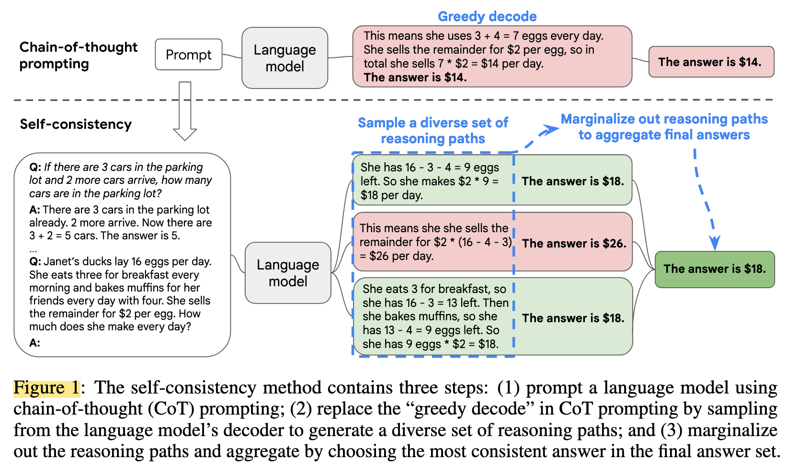

<a href="zotero://open-pdf/library/items/UE23Y74Y?page=2">“The self-consistency method contains three steps:”</a> (<a href="zotero://select/library/items/NBTUSBW3">Wang et al., 2023, p. 2</a>)、

*   <a href="zotero://open-pdf/library/items/UE23Y74Y?page=NaN">“(1) prompt a language model using chain-of-thought (CoT) prompting”</a>

    (<a href="zotero://select/library/items/NBTUSBW3">Wang et al., 2023, p. 2</a>)

    (1) 使用思想链（CoT）prompt来提问语言模型

*   <a href="zotero://open-pdf/library/items/UE23Y74Y?page=NaN">“(2) replace the “greedy decode” in CoT prompting by sampling from the language model’s decoder to generate a diverse set of reasoning paths”</a>

    (<a href="zotero://select/library/items/NBTUSBW3">Wang et al., 2023, p. 2</a>)

    （2）通过从语言模型的解码器中采样来生成多样化的推理路径集来替换CoT提示中的“贪婪解码”

*   <a href="zotero://open-pdf/library/items/UE23Y74Y?page=NaN">“(3) marginalize out the reasoning paths and aggregate by choosing the most consistent answer in the final answer set.”</a>

    (<a href="zotero://select/library/items/NBTUSBW3">Wang et al., 2023, p. 2</a>)

    （3）边缘化推理路径并通过在最终答案集中选择最一致的答案进行聚合。

<a href="zotero://open-pdf/library/items/UE23Y74Y?page=NaN">“instead of greedily decoding the optimal reasoning path, we propose a “sample-and-marginalize” decoding procedure”</a> (<a href="zotero://select/library/items/NBTUSBW3">Wang et al., 2023, p. 1</a>) 我们提出了一种“样本和边缘化”解码过程，而不是贪婪地解码最佳推理路径

<a href="zotero://open-pdf/library/items/UE23Y74Y?page=NaN">“we first sample from the language model’s decoder to generate a diverse set of reasoning paths”</a> (<a href="zotero://select/library/items/NBTUSBW3">Wang et al., 2023, p. 1</a>) 我们首先从语言模型的解码器中采样以生成一组不同的推理路径

<a href="zotero://open-pdf/library/items/UE23Y74Y?page=NaN">“each reasoning path might lead to a different final answer, so we determine the optimal answer by marginalizing out the sampled reasoning paths to find the most consistent answer in the final answer set.”</a> (<a href="zotero://select/library/items/NBTUSBW3">Wang et al., 2023, p. 1</a>) 每个推理路径可能会导致不同的最终答案，因此我们通过边缘化采样的推理路径来确定最佳答案，以在最终答案集中找到最一致的答案。

<a href="zotero://open-pdf/library/items/UE23Y74Y?page=NaN">“Compared to other decoding methods, self-consistency avoids the repetitiveness and local-optimality that plague greedy decoding, while mitigating the stochasticity of a single sampled generation.”</a> (<a href="zotero://select/library/items/NBTUSBW3">Wang et al., 2023, p. 1</a>) 与其他解码方法相比，自一致性避免了困扰贪婪解码的重复性和局部最优性，同时减轻了单个采样生成的随机性。

<a href="zotero://open-pdf/library/items/UE23Y74Y?page=NaN">“Self-consistency is far simpler than prior approaches that either train an additional verifier (Cobbe et al., 2021) or train a re-ranker given additional human annotations to improve generation quality (Thoppilan et al., 2022)”</a> (<a href="zotero://select/library/items/NBTUSBW3">Wang et al., 2023, p. 2</a>) 自我一致性比之前的方法要简单得多，之前的方法要么训练额外的verifier（Cobbe 等人，2021），要么训练给定额外人工注释的重新排序器以提高生成质量（Thoppilan 等人，2022）

<a href="zotero://open-pdf/library/items/UE23Y74Y?page=NaN">“Instead, self-consistency is entirely unsupervised, works off-the-shelf with pre-trained language models, requires no additional human annotation, and avoids any additional training, auxiliary models or fine-tuning”</a> (<a href="zotero://select/library/items/NBTUSBW3">Wang et al., 2023, p. 2</a>) 相反，自我一致性完全是无监督的，可以与预训练的语言模型一起使用现成的，不需要额外的人工注释，并且避免任何额外的训练、辅助模型或微调

<a href="zotero://open-pdf/library/items/UE23Y74Y?page=NaN">“Self-consistency also differs from a typical ensemble approach where multiple models are trained and the outputs from each model are aggregated, it acts more like a “self-ensemble” that works on top of a single language model.”</a> (<a href="zotero://select/library/items/NBTUSBW3">Wang et al., 2023, p. 2</a>) 自我一致性也不同于典型的集成方法，在典型的集成方法中，多个模型被训练并且每个模型的输出被聚合，它的行为更像是在单个语言模型之上工作的“自集成”。

实验：

<a href="zotero://open-pdf/library/items/UE23Y74Y?page=NaN">“We evaluate self-consistency on a wide range of arithmetic and commonsense reasoning tasks over four language models with varying scales”</a> (<a href="zotero://select/library/items/NBTUSBW3">Wang et al., 2023, p. 2</a>) 我们评估了四种不同规模的语言模型在各种算术和常识推理任务上的自我一致性

*   <a href="zotero://open-pdf/library/items/UE23Y74Y?page=2">“UL2-20B (Tay et al., 2022)”</a>

    (<a href="zotero://select/library/items/NBTUSBW3">Wang et al., 2023, p. 2</a>)

*   <a href="zotero://open-pdf/library/items/UE23Y74Y?page=2">“GPT-3-175B (Brown et al., 2020)”</a> (<a href="zotero://select/library/items/NBTUSBW3">Wang et al., 2023, p. 2</a>)

    <a href="zotero://open-pdf/library/items/UE23Y74Y?page=NaN">“two densely-activated decoder-only language models”</a> (<a href="zotero://select/library/items/NBTUSBW3">Wang et al., 2023, p. 2</a>) 两个密集激活的仅解码器语言模型:

*   <a href="zotero://open-pdf/library/items/UE23Y74Y?page=2">“LaMDA-137B (Thoppilan et al., 2022)”</a>

    (<a href="zotero://select/library/items/NBTUSBW3">Wang et al., 2023, p. 2</a>)

*   <a href="zotero://open-pdf/library/items/UE23Y74Y?page=2">“PaLM-540B (Chowdhery et al., 2022)”</a>

    (<a href="zotero://select/library/items/NBTUSBW3">Wang et al., 2023, p. 2</a>)

<a href="zotero://open-pdf/library/items/UE23Y74Y?page=NaN">“On all four language models, self-consistency improves over chain-of-thought prompting by a striking margin across all tasks.”</a> (<a href="zotero://select/library/items/NBTUSBW3">Wang et al., 2023, p. 2</a>) 在所有四种语言模型上，所有任务的自我一致性都比思维链提示有了显着的提高。

<a href="zotero://open-pdf/library/items/UE23Y74Y?page=NaN">“In particular, when used with PaLM-540B or GPT-3, self-consistency achieves new state-of-the-art levels of performance across arithmetic reasoning tasks”</a> (<a href="zotero://select/library/items/NBTUSBW3">Wang et al., 2023, p. 2</a>) 特别是，当使用 PaLM-540B 或 GPT-3 时，自一致性在算术推理任务中实现了新的最先进的性能水平

<a href="zotero://open-pdf/library/items/UE23Y74Y?page=NaN">“In additional experiments, we show self-consistency can robustly boost performance on NLP tasks where adding a chain-of-thought might hurt performance compared to standard prompting”</a> (<a href="zotero://select/library/items/NBTUSBW3">Wang et al., 2023, p. 2</a>) 在额外的实验中，我们展示了self-consistency可以稳定地提升在自然语言处理任务上的表现，在这些任务中，添加chain-of-thought可能会对标准提示方式下的表现产生负面影响。

<a href="zotero://open-pdf/library/items/UE23Y74Y?page=NaN">“We also show self-consistency significantly outperforms sample-and-rank, beam search, ensemble-based approaches, and is robust to sampling strategies and imperfect prompts.”</a> (<a href="zotero://select/library/items/NBTUSBW3">Wang et al., 2023, p. 2</a>) 我们还展示了self-consistency明显优于样本排序、束搜索、基于集成的方法，并且对采样策略和不完美提示具有鲁棒性。

## <a href="zotero://open-pdf/library/items/UE23Y74Y?page=2">“2 SELF-CONSISTENCY OVER DIVERSE REASONING PATHS”</a> (<a href="zotero://select/library/items/NBTUSBW3">Wang et al., 2023, p. 2</a>)

<a href="zotero://open-pdf/library/items/UE23Y74Y?page=NaN">“We propose that such a process can be simulated in language models via sampling from the language model’s decoder.”</a> (<a href="zotero://select/library/items/NBTUSBW3">Wang et al., 2023, p. 2</a>) 我们建议可以通过从语言模型的解码器采样来在语言模型中模拟这样的过程。（多种方式解决问题的过程）

<a href="zotero://open-pdf/library/items/UE23Y74Y?page=NaN">“such solutions are less likely to arrive at the same answer.”</a> (<a href="zotero://select/library/items/NBTUSBW3">Wang et al., 2023, p. 2</a>) 这样的解决方案不太可能得出相同的答案。--正确的答案可能会被多次生成，但是错误的时候不太可能得出相同的答案

<a href="zotero://open-pdf/library/items/UE23Y74Y?page=NaN">“That is, we hypothesize that correct reasoning processes, even if they are diverse, tend to have greater agreement in their final answer than incorrect processes.”</a> (<a href="zotero://select/library/items/NBTUSBW3">Wang et al., 2023, p. 2</a>) 也就是说，我们假设正确的推理过程，即使它们是多种多样的，也往往比不正确的过程在最终答案中具有更大的一致性。

<a href="zotero://open-pdf/library/items/UE23Y74Y?page=2">“self-consistency method.”</a> (<a href="zotero://select/library/items/NBTUSBW3">Wang et al., 2023, p. 2</a>)

*   <a href="zotero://open-pdf/library/items/UE23Y74Y?page=NaN">“First, a language model is prompted with a set of manually written chain-of-thought exemplars”</a>

    (<a href="zotero://select/library/items/NBTUSBW3">Wang et al., 2023, p. 2</a>)

    首先，用一组手动编写的思维链示例来提示语言模型

*   <a href="zotero://open-pdf/library/items/UE23Y74Y?page=NaN">“we sample a set of candidate outputs from the language model’s decoder, generating a diverse set of candidate reasoning paths.”</a> (<a href="zotero://select/library/items/NBTUSBW3">Wang et al., 2023, p. 2</a>) 接下来，我们从语言模型的解码器中采样一组候选输出，生成一组不同的候选推理路径。

    *   <a href="zotero://open-pdf/library/items/UE23Y74Y?page=NaN">“Self-consistency is compatible with most existing sampling algorithms,”</a>

        (<a href="zotero://select/library/items/NBTUSBW3">Wang et al., 2023, p. 2</a>)

        自一致性与大多数现有采样算法兼容，

    *   <a href="zotero://open-pdf/library/items/UE23Y74Y?page=NaN">“temperature sampling (Ackley et al., 1985; Ficler &#x26; Goldberg, 2017)”</a>

        (<a href="zotero://select/library/items/NBTUSBW3">Wang et al., 2023, p. 2</a>)

        温度采样（Ackley 等人，1985；Ficler 和 Goldberg，2017）

    *   <a href="zotero://open-pdf/library/items/UE23Y74Y?page=NaN">“top-k sampling (Fan et al., 2018; Holtzman et al., 2018; Radford et al., 2019)”</a>

        (<a href="zotero://select/library/items/NBTUSBW3">Wang et al., 2023, p. 2</a>)

        top-k 采样

    *   <a href="zotero://open-pdf/library/items/UE23Y74Y?page=NaN">“nucleus sampling (Holtzman et al., 2020)”</a>

        (<a href="zotero://select/library/items/NBTUSBW3">Wang et al., 2023, p. 2</a>)

        Top-p采样

        （top-k sampling的改进方案，

        **nucleus sampling的主要思想就是**

        ：给定一个阈值p，从解码词中挑选出一个cumprob大于p的最小集合。挑选出该最小集合后，再根据你的设置的sampler进行采样。）

*   <a href="zotero://open-pdf/library/items/UE23Y74Y?page=NaN">“Finally, we aggregate the answers by marginalizing out the sampled reasoning paths and choosing the answer that is the most consistent among the generated answers.”</a>

    (<a href="zotero://select/library/items/NBTUSBW3">Wang et al., 2023, p. 2</a>)

    最后，我们通过边缘化采样的推理路径并选择生成的答案中最一致的答案来聚合答案。

<a href="zotero://open-pdf/library/items/UE23Y74Y?page=NaN">“In more detail, assume the generated answers ai are from a fixed answer set, ai ∈ A, where i = 1, . . . , m indexes the m candidate outputs sampled from the decoder.”</a> (<a href="zotero://select/library/items/NBTUSBW3">Wang et al., 2023, p. 3</a>) 更详细地说，假设生成的答案 ai 来自固定答案集 ai ∈ A，其中 i = 1,…。 。 。 , m 索引从解码器采样的 m 个候选输出。

<a href="zotero://open-pdf/library/items/UE23Y74Y?page=NaN">“Given a prompt and a question, self-consistency introduces an additional latent variable ri, which is a sequence of tokens representing the reasoning path in the i-th output, then couples the generation of (ri, ai) where ri → ai, i.e., generating a reasoning path ri is optional and only used to reach the final answer ai.”</a> (<a href="zotero://select/library/items/NBTUSBW3">Wang et al., 2023, p. 3</a>) 给定一个提示和一个问题，“self-consistency”引入了一个额外的潜在变量 ri，它是代表第 i 个输出中的推理路径的标记序列，然后耦合 (ri, ai) 的生成，其中 ri → ai，即，生成推理路径ri是可选的，仅用于得出最终答案ai。

<a href="zotero://open-pdf/library/items/UE23Y74Y?page=NaN">“After sampling multiple (ri, ai) from the model’s decoder, self-consistency applies a marginalization over ri by taking a majority vote over ai, i.e., arg maxa ∑m i=1 1(ai = a), or as we defined as the most “consistent” answer among the final answer set.”</a> (<a href="zotero://select/library/items/NBTUSBW3">Wang et al., 2023, p. 3</a>) 从模型的解码器中采样多个 (ri, ai) 后，自一致性通过对 ai 进行多数投票来对 ri 进行边缘化，即 arg maxa Σm i=1 1(ai = a)，或者我们定义为最终答案集中最“一致”的答案。

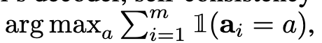

<a href="zotero://open-pdf/library/items/UE23Y74Y?page=NaN">“Table 1: Accuracy comparison of different answer aggregation strategies on PaLM-540B.”</a> (<a href="zotero://select/library/items/NBTUSBW3">Wang et al., 2023, p. 3</a>) 表 1：PaLM-540B 上不同答案聚合策略的准确性比较。

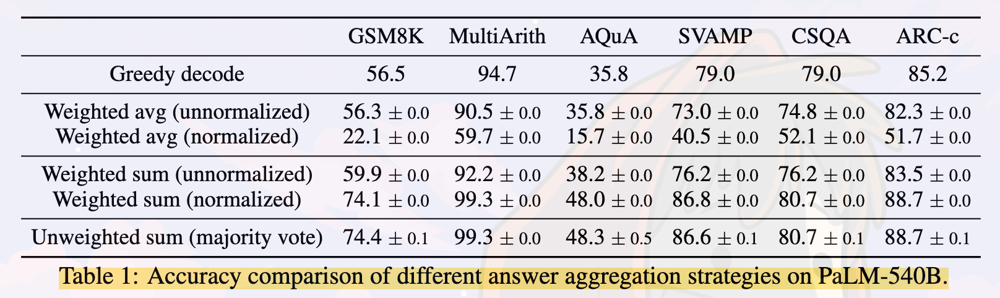

*   majority vote：之前说的最终答案集中最“一致”的答案

<a href="zotero://open-pdf/library/items/UE23Y74Y?page=NaN">“In addition to majority vote, one can also weight each (ri, ai) by P (ri, ai | prompt, question) when aggregating the answers”</a> (<a href="zotero://select/library/items/NBTUSBW3">Wang et al., 2023, p. 3</a>) 除了多数投票之外，在汇总答案时还可以通过 P (ri, ai | prompt, question)对每个 (ri, ai) 进行加权

<a href="zotero://open-pdf/library/items/UE23Y74Y?page=NaN">“unnormalized probability of the model generating (ri, ai) given (prompt, question)”</a> (<a href="zotero://select/library/items/NBTUSBW3">Wang et al., 2023, p. 3</a>) 给定(prompt, question)模型生成 (ri, ai) 的非标准化概率

<a href="zotero://open-pdf/library/items/UE23Y74Y?page=NaN">“normalize the conditional probability by the output length”</a> (<a href="zotero://select/library/items/NBTUSBW3">Wang et al., 2023, p. 3</a>) 通过输出长度标准化条件概率

-- 即归一化加权和：

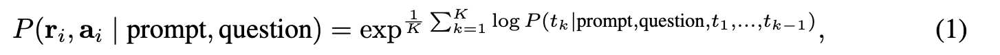

<a href="zotero://open-pdf/library/items/UE23Y74Y?page=NaN">“where log P (tk | prompt, question, t1, . . . , tk−1) is the log probability of generating the k-th token tk in (ri, ai) conditioned on the previous tokens, and K is the total number of tokens in (ri, ai).”</a> (<a href="zotero://select/library/items/NBTUSBW3">Wang et al., 2023, p. 3</a>) 其中 log P (tk | Prompt, Question, t1, ..., tk−1) 是在前面的标记条件下生成 (ri, ai) 中第 k 个标记 tk 的对数概率，K 是总数(ri, ai) 中的标记数。

总结：

*   <a href="zotero://open-pdf/library/items/UE23Y74Y?page=NaN">“we show that taking the “unweighted sum”, i.e., taking a majority vote directly over ai yields a very similar accuracy as aggregating using the “normalized weighted sum””</a>

    (<a href="zotero://select/library/items/NBTUSBW3">Wang et al., 2023, p. 3</a>)

    我们表明，采用“未加权总和”，即直接对ai进行多数投票，会产生与使用“归一化加权总和”进行聚合非常相似的准确度

<a href="zotero://open-pdf/library/items/UE23Y74Y?page=NaN">“We took a closer look at the model’s output probabilities and found this is because for each (ri, ai), the normalized conditional probabilities P (ri, ai | prompt, question) are quite close to each other, i.e., the language model regards those generations as “similarly likely””</a> (<a href="zotero://select/library/items/NBTUSBW3">Wang et al., 2023, p. 3</a>) 我们仔细观察了模型的输出概率，发现这是因为对于每个 (ri, ai)，归一化条件概率 P (ri, ai | Prompt, Question) 彼此非常接近，即语言模型认为这些生成“同样有可能”

*   <a href="zotero://open-pdf/library/items/UE23Y74Y?page=NaN">“Additionally, when aggregating the answers, the results in Table 1 show that the “normalized” weighted sum (i.e., Equation 1) yields a much higher accuracy compared to its unnormalized counterpart.”</a>

    (<a href="zotero://select/library/items/NBTUSBW3">Wang et al., 2023, p. 3</a>)

    此外，在汇总答案时，表 1 中的结果表明，

    “归一化”加权和

    （即公式 1）比非归一化加权和具有更高的准确度。

<a href="zotero://open-pdf/library/items/UE23Y74Y?page=NaN">“For completeness, in Table 1 we also report the results by taking a “weighted average”, i.e., each a gets a score of its weighted sum divided by ∑m i=1 1(ai = a), which results in a much worse performance.”</a> (<a href="zotero://select/library/items/NBTUSBW3">Wang et al., 2023, p. 3</a>) 为了完整起见，在表 1 中，我们还通过“加权平均”来报告结果，即每个 a 得到其加权总和除以 Σm i=1 1(ai = a) 的分数，这会导致性能更差。

<a href="zotero://open-pdf/library/items/UE23Y74Y?page=NaN">“Self-consistency explores an interesting space between open-ended text generation and optimal text generation with a fixed answer”</a> (<a href="zotero://select/library/items/NBTUSBW3">Wang et al., 2023, p. 3</a>) 自我一致性探索了开放式文本生成和具有固定答案的最佳文本生成之间的有趣空间

<a href="zotero://open-pdf/library/items/UE23Y74Y?page=NaN">“Reasoning tasks typically have fixed answers, which is why researchers have generally considered greedy decoding approaches”</a> (<a href="zotero://select/library/items/NBTUSBW3">Wang et al., 2023, p. 3</a>) 推理任务通常有固定的答案，这就是为什么研究人员普遍考虑贪婪解码方法

<a href="zotero://open-pdf/library/items/UE23Y74Y?page=NaN">“However, we have found that even when the desired answer is fixed, introducing diversity in the reasoning processes can be highly beneficial;”</a> (<a href="zotero://select/library/items/NBTUSBW3">Wang et al., 2023, p. 3</a>) 然而，我们发现，即使所需的答案是固定的，在推理过程中引入多样性也是非常有益的。

<a href="zotero://open-pdf/library/items/UE23Y74Y?page=NaN">“One should note that self-consistency can be applied only to problems where the final answer is from a fixed answer set, but in principle this approach can be extended to open-text generation problems if a good metric of consistency can be defined between multiple generations, e.g., whether two answers agree or contradict each other.”</a> (<a href="zotero://select/library/items/NBTUSBW3">Wang et al., 2023, p. 3</a>) 应该注意的是，自一致性只能应用于最终答案来自固定答案集的问题，但原则上，如果可以在多个生成之间定义良好的一致性度量，则这种方法可以扩展到开放文本生成问题，例如，两个答案是否一致或矛盾。

## <a href="zotero://open-pdf/library/items/UE23Y74Y?page=4">“3 EXPERIMENTS”</a> (<a href="zotero://select/library/items/NBTUSBW3">Wang et al., 2023, p. 4</a>)

<a href="zotero://open-pdf/library/items/UE23Y74Y?page=NaN">“We find that self-consistency robustly improves reasoning accuracy for every language model considered, spanning a wide range of model scales.”</a> (<a href="zotero://select/library/items/NBTUSBW3">Wang et al., 2023, p. 4</a>) 我们发现，自一致性可以显着提高所考虑的每种语言模型的推理准确性，涵盖广泛的模型规模。

### <a href="zotero://open-pdf/library/items/UE23Y74Y?page=4">“3.1 EXPERIMENT SETUP”</a> (<a href="zotero://select/library/items/NBTUSBW3">Wang et al., 2023, p. 4</a>)

<a href="zotero://open-pdf/library/items/UE23Y74Y?page=4"><strong>“Tasks and datasets”</strong></a>** (<a href="zotero://select/library/items/NBTUSBW3">Wang et al., 2023, p. 4</a>)**

*   <a href="zotero://open-pdf/library/items/UE23Y74Y?page=NaN">“Arithmetic reasoning.”</a>

    (<a href="zotero://select/library/items/NBTUSBW3">Wang et al., 2023, p. 4</a>)

    算术推理。

*   <a href="zotero://open-pdf/library/items/UE23Y74Y?page=NaN">“Commonsense reasoning”</a>

    (<a href="zotero://select/library/items/NBTUSBW3">Wang et al., 2023, p. 4</a>)

    常识推理

*   <a href="zotero://open-pdf/library/items/UE23Y74Y?page=NaN">“Symbolic Reasoning.”</a>

    (<a href="zotero://select/library/items/NBTUSBW3">Wang et al., 2023, p. 4</a>)

    符号推理。

<a href="zotero://open-pdf/library/items/UE23Y74Y?page=4"><strong>“Language models and prompts”</strong></a> (<a href="zotero://select/library/items/NBTUSBW3">Wang et al., 2023, p. 4</a>)

*   <a href="zotero://open-pdf/library/items/UE23Y74Y?page=4">“UL2 (Tay et al., 2022)”</a>

    (<a href="zotero://select/library/items/NBTUSBW3">Wang et al., 2023, p. 4</a>)

*   <a href="zotero://open-pdf/library/items/UE23Y74Y?page=4">“GPT-3 (Brown et al., 2020) with 175-billion parameters”</a>

    (<a href="zotero://select/library/items/NBTUSBW3">Wang et al., 2023, p. 4</a>)

*   <a href="zotero://open-pdf/library/items/UE23Y74Y?page=4">“LaMDA-137B”</a>

    (<a href="zotero://select/library/items/NBTUSBW3">Wang et al., 2023, p. 4</a>)

*   <a href="zotero://open-pdf/library/items/UE23Y74Y?page=4">“PaLM-540B”</a>

    (<a href="zotero://select/library/items/NBTUSBW3">Wang et al., 2023, p. 4</a>)

<a href="zotero://open-pdf/library/items/UE23Y74Y?page=NaN"><strong>“Sampling scheme.”</strong></a>** (<a href="zotero://select/library/items/NBTUSBW3">Wang et al., 2023, p. 4</a>) 抽样方案。**

### <a href="zotero://open-pdf/library/items/UE23Y74Y?page=5">“3.2 MAIN RESULTS”</a> (<a href="zotero://select/library/items/NBTUSBW3">Wang et al., 2023, p. 5</a>)

<a href="zotero://open-pdf/library/items/UE23Y74Y?page=5"><strong>“Arithmetic Reasoning”</strong></a>** (<a href="zotero://select/library/items/NBTUSBW3">Wang et al., 2023, p. 5</a>)**

<a href="zotero://open-pdf/library/items/UE23Y74Y?page=5">“Table 2: Arithmetic reasoning accuracy by self-consistency compared to chain-of-thought prompting (Wei et al., 2022)”</a> (<a href="zotero://select/library/items/NBTUSBW3">Wang et al., 2023, p. 5</a>)

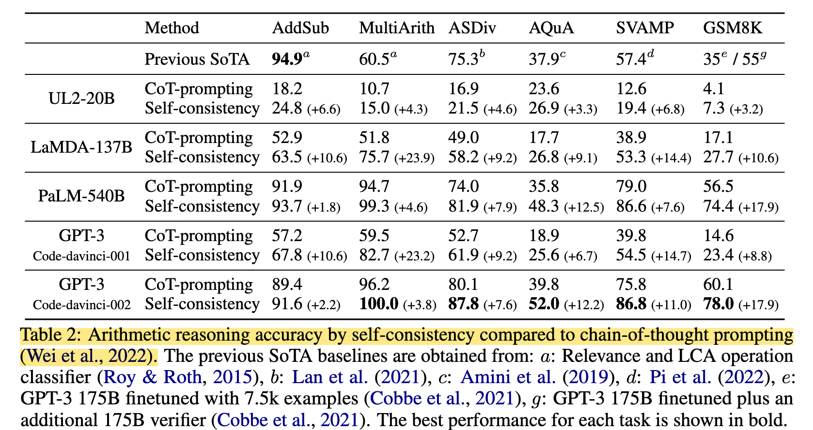

<a href="zotero://open-pdf/library/items/UE23Y74Y?page=6"><strong>“Commonsense and Symbolic Reasoning”</strong></a>** (<a href="zotero://select/library/items/NBTUSBW3">Wang et al., 2023, p. 6</a>)**

<a href="zotero://open-pdf/library/items/UE23Y74Y?page=5">“Table 3: Commonsense and symbolic reasoning accuracy by self-consistency compared to chainof-thought prompting (Wei et al., 2022).”</a> (<a href="zotero://select/library/items/NBTUSBW3">Wang et al., 2023, p. 5</a>)

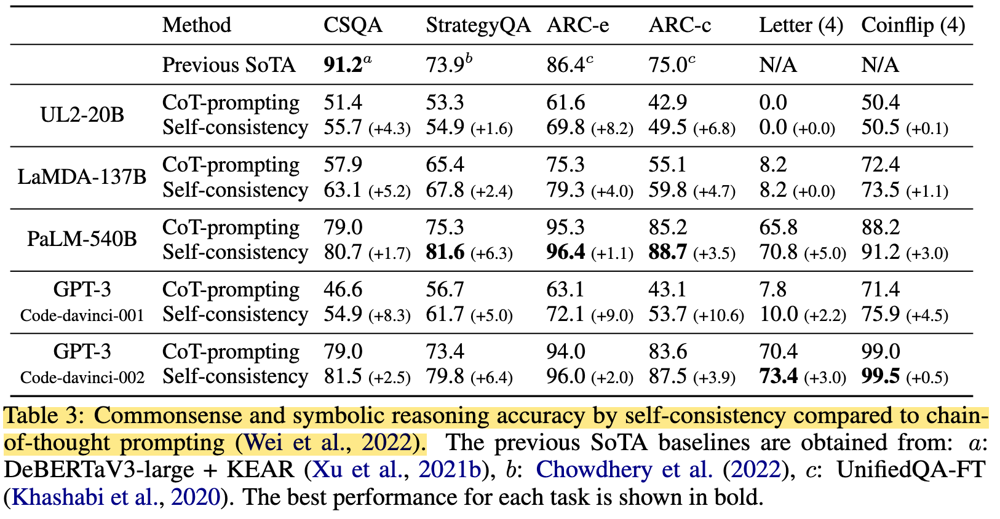

<a href="zotero://open-pdf/library/items/UE23Y74Y?page=NaN">“To show the effect of the number of sampled reasoning paths, we plot the accuracy (mean and standard deviation over 10 runs) with respect to varying numbers of sampled paths (1, 5, 10, 20, 40) in Figure 2.”</a> (<a href="zotero://select/library/items/NBTUSBW3">Wang et al., 2023, p. 6</a>) 为了显示采样推理路径数量的影响，我们在图 2 中绘制了不同数量的采样路径（1、5、10、20、40）的准确度（10 次运行的平均值和标准差）。

<a href="zotero://open-pdf/library/items/UE23Y74Y?page=NaN">“Figure 2: Self-consistency (blue) significantly improves accuracy over CoT-prompting with greedy decoding (orange) across arithmetic and commonsense reasoning tasks, over LaMDA-137B. Sampling a higher number of diverse reasoning paths consistently improves reasoning accuracy”</a> (<a href="zotero://select/library/items/NBTUSBW3">Wang et al., 2023, p. 6</a>) 图 2：与 LaMDA-137B 相比，自一致性（蓝色）显着提高了算术和常识推理任务中的贪婪解码（橙色）CoT 提示的准确性。对更多不同推理路径进行采样可以持续提高推理准确性

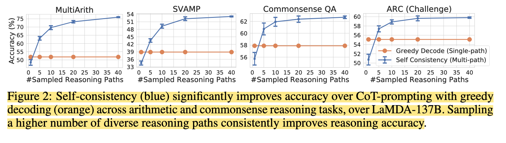

<a href="zotero://open-pdf/library/items/UE23Y74Y?page=NaN">“a higher number (e.g., 40) of reasoning paths leads to a consistently better performance,”</a> (<a href="zotero://select/library/items/NBTUSBW3">Wang et al., 2023, p. 6</a>) 推理路径数量越多（例如 40 条），性能就越稳定，

<a href="zotero://open-pdf/library/items/UE23Y74Y?page=NaN">“In Table 4, we show self-consistency yields a richer set of reasoning paths compared to greedy decoding with a few example questions from two tasks.”</a> (<a href="zotero://select/library/items/NBTUSBW3">Wang et al., 2023, p. 6</a>) 在表 4 中，我们通过两个任务中的一些示例问题表明，与贪婪解码相比，Self-consistency产生了更丰富的推理路径集。

<a href="zotero://open-pdf/library/items/UE23Y74Y?page=6">“Table 4”</a> (<a href="zotero://select/library/items/NBTUSBW3">Wang et al., 2023, p. 6</a>)

###

### <a href="zotero://open-pdf/library/items/UE23Y74Y?page=6">“3.3 SELF-CONSISTENCY HELPS WHEN CHAIN-OF-THOUGHT HURTS PERFORMANCE”</a> (<a href="zotero://select/library/items/NBTUSBW3">Wang et al., 2023, p. 6</a>) 在“CHAIN-OF-THOUGHT影响性能的时候，“SELF-CONSISTENCY” 会有所帮助

<a href="zotero://open-pdf/library/items/UE23Y74Y?page=NaN">“For some tasks (e.g., ANLI-R1, e-SNLI, RTE), adding chain-of-thought does hurt performance compared to standard prompting (Brown et al., 2020), but self-consistency is able to robustly boost the performance and outperform standard prompting, making it a reliable way to add rationales in few-shot in-context learning for common NLP tasks.”</a> (<a href="zotero://select/library/items/NBTUSBW3">Wang et al., 2023, p. 6</a>) 对于某些任务（例如 ANLI-R1、e-SNLI、RTE），与标准提示相比，添加思维链确实会损害性能（Brown 等人，2020），但自我一致性能够有力地提高性能并且优于标准提示，使其成为在常见 NLP 任务的少量上下文学习中添加基本原理的可靠方法。

<a href="zotero://open-pdf/library/items/UE23Y74Y?page=6">“Table 5: Compare Standard/CoT prompting with self-consistency on common NLP tasks.”</a> (<a href="zotero://select/library/items/NBTUSBW3">Wang et al., 2023, p. 6</a>)

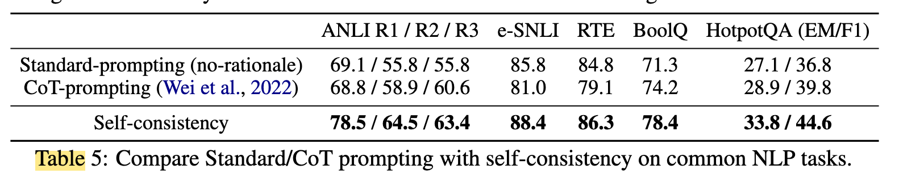

### <a href="zotero://open-pdf/library/items/UE23Y74Y?page=7">“3.4 COMPARE TO OTHER EXISTING APPROACHES”</a> (<a href="zotero://select/library/items/NBTUSBW3">Wang et al., 2023, p. 7</a>)

### <a href="zotero://open-pdf/library/items/UE23Y74Y?page=8">“3.5 ADDITIONAL STUDIES”</a> (<a href="zotero://select/library/items/NBTUSBW3">Wang et al., 2023, p. 8</a>)

<a href="zotero://open-pdf/library/items/UE23Y74Y?page=8"><strong>“Self-Consistency is Robust to Sampling Strategies and Scaling”</strong></a>** (<a href="zotero://select/library/items/NBTUSBW3">Wang et al., 2023, p. 8</a>) 对抽样策略和衡量标准具有鲁棒性**

<a href="zotero://open-pdf/library/items/UE23Y74Y?page=NaN">“Figure 4: GSM8K accuracy. (Left) Self-consistency is robust to various sampling strategies and parameters. (Right) Self-consistency improves performance across language model scales.”</a> (<a href="zotero://select/library/items/NBTUSBW3">Wang et al., 2023, p. 7</a>) 图 4：GSM8K 精度。 （左）自一致性对于各种采样策略和参数都是稳健的。 （右）自我一致性提高了跨语言模型规模的性能。

<a href="zotero://open-pdf/library/items/UE23Y74Y?page=8">“Figure 4:”</a> (<a href="zotero://select/library/items/NBTUSBW3">Wang et al., 2023, p. 8</a>)

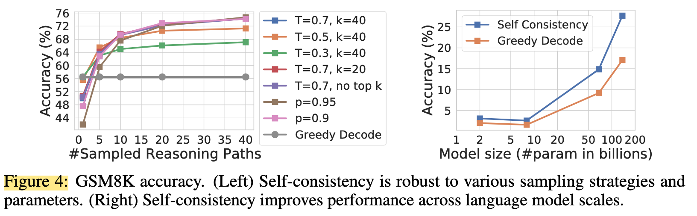

<a href="zotero://open-pdf/library/items/UE23Y74Y?page=8">“<strong>Self-Consistency Improves Robustness to Imperfect Prompts”</strong></a>** (<a href="zotero://select/library/items/NBTUSBW3">Wang et al., 2023, p. 8</a>) 对不完美提示的鲁棒性**

<a href="zotero://open-pdf/library/items/UE23Y74Y?page=NaN">“while imperfect prompts decrease accuracy with greedy decoding (17.1 → 14.9), self-consistency can fill in the gaps and robustly improve the results.”</a> (<a href="zotero://select/library/items/NBTUSBW3">Wang et al., 2023, p. 8</a>) 虽然不完美的提示会降低贪婪解码的准确性（17.1 → 14.9），但自我一致性可以填补空白并稳健地改善结果。

<a href="zotero://open-pdf/library/items/UE23Y74Y?page=NaN">“Table 8: Self-consistency works under imperfect prompts, equation prompts and zero-shot chain-of-thought for GSM8K.”</a> (<a href="zotero://select/library/items/NBTUSBW3">Wang et al., 2023, p. 8</a>) 表 8：GSM8K 在不完美提示、方程提示和零样本思想链下的自洽工作。

<a href="zotero://open-pdf/library/items/UE23Y74Y?page=8">“Table 8:”</a> (<a href="zotero://select/library/items/NBTUSBW3">Wang et al., 2023, p. 8</a>)

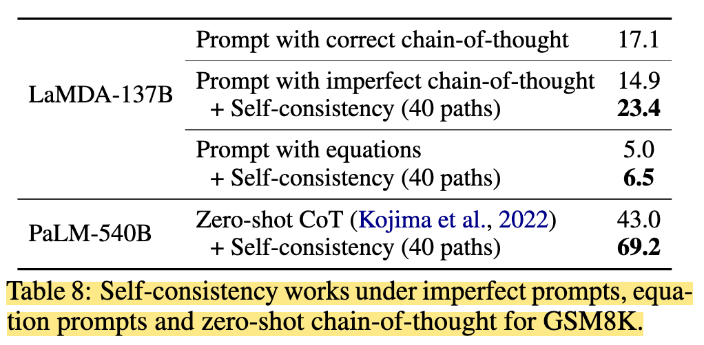

<a href="zotero://open-pdf/library/items/UE23Y74Y?page=NaN">“Additionally, we found that the consistency (in terms of % of decodes agreeing with the final aggregated answer) is highly correlated with accuracy (Figure 5, over GSM8K).”</a> (<a href="zotero://select/library/items/NBTUSBW3">Wang et al., 2023, p. 8</a>) 此外，我们发现一致性（以与最终聚合答案一致的解码百分​​比表示）与准确性高度相关（图 5，在 GSM8K 上）。

<a href="zotero://open-pdf/library/items/UE23Y74Y?page=NaN">“This suggests that one can use self-consistency to provide an uncertainty estimate of the model in its generated solutions.”</a> (<a href="zotero://select/library/items/NBTUSBW3">Wang et al., 2023, p. 8</a>) 这表明我们可以利用自洽性在模型生成的解决方案中提供模型的不确定性估计。

<a href="zotero://open-pdf/library/items/UE23Y74Y?page=NaN">“In other words, one can use low consistency as an indicator that the model has low confidence; i.e., self-consistency confers some ability for the model to “know when it doesn’t know””</a> (<a href="zotero://select/library/items/NBTUSBW3">Wang et al., 2023, p. 8</a>) 换句话说，可以用低一致性作为模型置信度低的指标；即，自洽性赋予模型“知道何时不知道”的能力

<a href="zotero://open-pdf/library/items/UE23Y74Y?page=8">“Figure 5”</a> (<a href="zotero://select/library/items/NBTUSBW3">Wang et al., 2023, p. 8</a>)

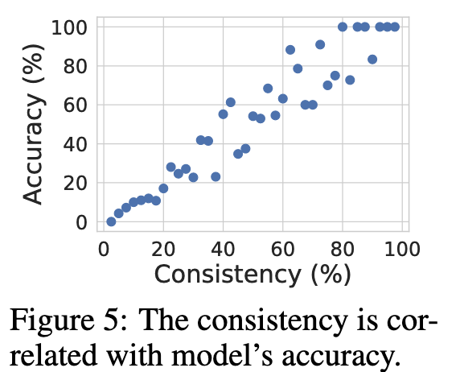

<a href="zotero://open-pdf/library/items/UE23Y74Y?page=8"><strong>“Self-Consistency Works for Non-Natural-Language Reasoning Paths and Zero-shot CoT”</strong></a>** (<a href="zotero://select/library/items/NBTUSBW3">Wang et al., 2023, p. 8</a>)**

<a href="zotero://open-pdf/library/items/UE23Y74Y?page=NaN">“The results are shown in Table 8 (“Prompt with equations”): self-consistency still improves accuracy by generating intermediate equations; however, compared to generating natural language reasoning paths, the gain is smaller since the equations are much shorter and less opportunity remains for generating diversity in the decoding process.”</a> (<a href="zotero://select/library/items/NBTUSBW3">Wang et al., 2023, p. 8</a>) 结果如表8（“用方程提示”）：自洽仍然通过生成中间方程提高了精度；然而，与生成自然语言推理路径相比，增益较小，因为方程更短，并且在解码过程中生成多样性的机会更少。

## <a href="zotero://open-pdf/library/items/UE23Y74Y?page=9">“4 RELATED WORK”</a> (<a href="zotero://select/library/items/NBTUSBW3">Wang et al., 2023, p. 9</a>)

*   <a href="zotero://open-pdf/library/items/UE23Y74Y?page=9"><strong>“Reasoning in language models.”</strong></a>

    ** (<a href="zotero://select/library/items/NBTUSBW3">Wang et al., 2023, p. 9</a>)**

*   <a href="zotero://open-pdf/library/items/UE23Y74Y?page=9"><strong>“Sampling and re-ranking in language models.”</strong></a>** (<a href="zotero://select/library/items/NBTUSBW3">Wang et al., 2023, p. 9</a>)**

    *   <a href="zotero://open-pdf/library/items/UE23Y74Y?page=NaN">“Re-ranking is another common approach to improve generation quality in language models (Adiwardana et al., 2020; Shen et al., 2021)”</a> (<a href="zotero://select/library/items/NBTUSBW3">Wang et al., 2023, p. 9</a>) 重新排序是提高语言模型生成质量的另一种常见方法（Adiwardana 等人，2020；Shen 等人，2021）

        *   <a href="zotero://open-pdf/library/items/UE23Y74Y?page=9">“additional human annotations”</a>

            (<a href="zotero://select/library/items/NBTUSBW3">Wang et al., 2023, p. 9</a>)

        *   <a href="zotero://open-pdf/library/items/UE23Y74Y?page=9">“train a “verifier””</a>

            (<a href="zotero://select/library/items/NBTUSBW3">Wang et al., 2023, p. 9</a>)

    *   <a href="zotero://open-pdf/library/items/UE23Y74Y?page=NaN">“All these methods require either training an additional re-ranker or collecting additional human annotation, while self-consistency requires no additional training, fine-tuning, nor extra data collection.”</a>

        (<a href="zotero://select/library/items/NBTUSBW3">Wang et al., 2023, p. 9</a>)

        所有这些方法都需要训练额外的重新排序器或收集额外的人工注释，而自我一致性不需要额外的训练、微调或额外的数据收集。

*   <a href="zotero://open-pdf/library/items/UE23Y74Y?page=9"><strong>“Extract reasoning paths.”</strong></a>** (<a href="zotero://select/library/items/NBTUSBW3">Wang et al., 2023, p. 9</a>)**

    *   <a href="zotero://open-pdf/library/items/UE23Y74Y?page=NaN">“constructing semantic graphs”</a>

        (<a href="zotero://select/library/items/NBTUSBW3">Wang et al., 2023, p. 9</a>)

        构建语义图

    *   <a href="zotero://open-pdf/library/items/UE23Y74Y?page=NaN">“learning an RNN to retrieve reasoning paths over the Wikipedia graph”</a>

        (<a href="zotero://select/library/items/NBTUSBW3">Wang et al., 2023, p. 9</a>)

        学习 RNN 来检索维基百科图上的推理路径

    *   <a href="zotero://open-pdf/library/items/UE23Y74Y?page=NaN">“fine-tuning with human annotated reasoning paths on math problems”</a>

        (<a href="zotero://select/library/items/NBTUSBW3">Wang et al., 2023, p. 9</a>)

        使用人类注释的数学问题推理路径进行微调

    *   <a href="zotero://open-pdf/library/items/UE23Y74Y?page=NaN">“training an extractor with heuristic-based pseudo reasoning paths”</a>

        (<a href="zotero://select/library/items/NBTUSBW3">Wang et al., 2023, p. 9</a>)

        使用基于启发式的伪推理路径训练提取器

    *   <a href="zotero://open-pdf/library/items/UE23Y74Y?page=NaN">“through an additional QA model over extracted reasoning paths”</a>

        (<a href="zotero://select/library/items/NBTUSBW3">Wang et al., 2023, p. 9</a>)

        通过提取推理路径上的附加 QA 模型

    *   <a href="zotero://open-pdf/library/items/UE23Y74Y?page=NaN">“by the introduction of latent variables in a commonsense knowledge graph”</a>

        (<a href="zotero://select/library/items/NBTUSBW3">Wang et al., 2023, p. 9</a>)

        通过在常识知识图中引入潜在变量

*   <a href="zotero://open-pdf/library/items/UE23Y74Y?page=9"><strong>“Consistency in language models.”</strong></a>** (<a href="zotero://select/library/items/NBTUSBW3">Wang et al., 2023, p. 9</a>)**

    *   <a href="zotero://open-pdf/library/items/UE23Y74Y?page=NaN">“ome prior work has shown that language models can suffer from inconsistency in conversation (Adiwardana et al., 2020), explanation generation (Camburu et al., 2020), and factual knowledge extraction (Elazar et al., 2021)”</a>

        (<a href="zotero://select/library/items/NBTUSBW3">Wang et al., 2023, p. 9</a>)

        之前的一些工作表明，语言模型可能会受到对话（Adiwardana 等人，2020）、解释生成（Camburu 等人，2020）和事实知识提取（Elazar 等人，2021）方面不一致的影响。

## <a href="zotero://open-pdf/library/items/UE23Y74Y?page=9">“5 CONCLUSION AND DISCUSSION”</a> (<a href="zotero://select/library/items/NBTUSBW3">Wang et al., 2023, p. 9</a>)

<a href="zotero://open-pdf/library/items/UE23Y74Y?page=NaN">“We introduced a simple yet effective method called self-consistency, and observed that it significantly improves accuracy in a range of arithmetic and commonsense reasoning tasks, across four large language models with varying scales.”</a> (<a href="zotero://select/library/items/NBTUSBW3">Wang et al., 2023, p. 9</a>) 我们引入了一种简单而有效的方法，称为自我一致性，并观察到它在不同规模的四种大型语言模型中显着提高了一系列算术和常识推理任务的准确性。

<a href="zotero://open-pdf/library/items/UE23Y74Y?page=9">“also useful for”</a> (<a href="zotero://select/library/items/NBTUSBW3">Wang et al., 2023, p. 9</a>)

*   <a href="zotero://open-pdf/library/items/UE23Y74Y?page=NaN">“collecting rationales when performing reasoning tasks with language models”</a>

    (<a href="zotero://select/library/items/NBTUSBW3">Wang et al., 2023, p. 9</a>)

    使用语言模型执行推理任务时收集基本原理

*   <a href="zotero://open-pdf/library/items/UE23Y74Y?page=NaN">“providing uncertainty estimates”</a>

    (<a href="zotero://select/library/items/NBTUSBW3">Wang et al., 2023, p. 9</a>)

    提供不确定性估计

*   <a href="zotero://open-pdf/library/items/UE23Y74Y?page=NaN">“improved calibration of language model outputs.”</a>

    (<a href="zotero://select/library/items/NBTUSBW3">Wang et al., 2023, p. 9</a>)

    改进了语言模型输出的校准。

<a href="zotero://open-pdf/library/items/UE23Y74Y?page=NaN">“One limitation of self-consistency is that it incurs more computation cost.”</a> (<a href="zotero://select/library/items/NBTUSBW3">Wang et al., 2023, p. 9</a>) 自一致性的局限性之一是它会产生更多的计算成本。

<a href="zotero://open-pdf/library/items/UE23Y74Y?page=NaN">“In practice people can try a small number of paths (e.g., 5 or 10) as a starting point to realize most of the gains while not incurring too much cost, as in most cases the performance saturates quickly (Figure 2).”</a> (<a href="zotero://select/library/items/NBTUSBW3">Wang et al., 2023, p. 9</a>) 在实践中，人们可以尝试少量路径（例如 5 或 10 条）作为起点，以实现大部分收益，同时不会产生太多成本，因为在大多数情况下性能很快就会饱和（图 2）。

**future：**

<a href="zotero://open-pdf/library/items/UE23Y74Y?page=NaN">“As part of future work, one could use self-consistency to generate better supervised data to fine-tune the model, such that the model can give more accurate predictions in a single inference run after fine-tuning.”</a> (<a href="zotero://select/library/items/NBTUSBW3">Wang et al., 2023, p. 9</a>) 作为未来工作的一部分，人们可以利用自我一致性来生成更好的监督数据来微调模型，以便模型在微调后可以在单次推理运行中给出更准确的预测。

<a href="zotero://open-pdf/library/items/UE23Y74Y?page=NaN">“In addition, we observed that language models can sometimes generate incorrect or nonsensical reasoning paths (e.g., the StrategyQA example in Table 4, the two population numbers are not exactly correct), and further work is needed to better ground models’ rationale generations.”</a> (<a href="zotero://select/library/items/NBTUSBW3">Wang et al., 2023, p. 9</a>) 此外，我们观察到语言模型有时会生成不正确或无意义的推理路径（例如，表 4 中的 StrategyQA 示例，两个总体数字并不完全正确），需要进一步的工作来更好地基础模型的推理生成。
